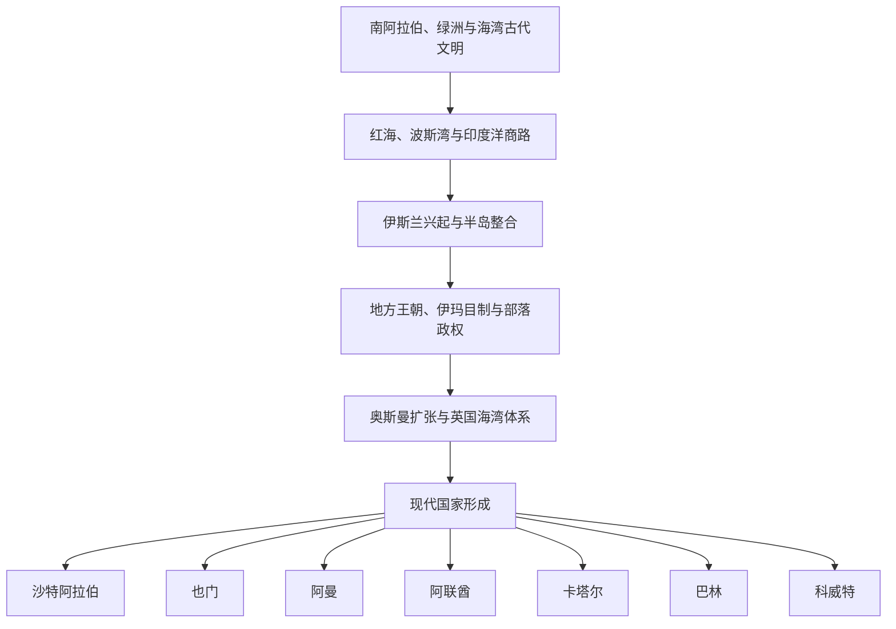

# 阿拉伯半岛历史

## 概括

阿拉伯半岛位于红海、波斯湾、阿拉伯海和印度洋之间，是西亚、东非、南亚与地中海世界的交通枢纽。半岛历史不能只从石油时代或现代国界理解：南部曾形成萨巴、希木叶尔等农业和商贸王国，东部海岸连接迪尔蒙、马干与印度洋航路，西部汉志的麦加和麦地那则成为伊斯兰兴起的核心。

本目录以区域专题和现代国家两条线并行整理。跨区域的哈里发帝国完整历史放在[阿拉伯帝国](/%E4%BA%BA%E6%96%87%E7%A7%91%E5%AD%A6/%E5%8E%86%E5%8F%B2/%E8%A5%BF%E4%BA%9A%E4%B8%8E%E5%8C%97%E9%9D%9E/_%E9%80%9A%E5%8F%B2/%E9%98%BF%E6%8B%89%E4%BC%AF%E5%B8%9D%E5%9B%BD/README.md)；奥斯曼王朝及其帝国制度放在[奥斯曼帝国](/%E4%BA%BA%E6%96%87%E7%A7%91%E5%AD%A6/%E5%8E%86%E5%8F%B2/%E8%A5%BF%E4%BA%9A%E4%B8%8E%E5%8C%97%E9%9D%9E/%E5%9C%9F%E8%80%B3%E5%85%B6/%E5%A5%A5%E6%96%AF%E6%9B%BC%E5%B8%9D%E5%9B%BD/README.md)。本目录重点说明这些帝国与半岛地方社会、部落联盟、港口贸易、伊玛目制、苏丹国、酋长国和现代国家形成之间的关系。

## 历史主线

## 区域专题导航

| 顺序 | 专题 | 时间范围 | 入口 | 重点 |
|---:|---|---|---|---|
| 1 | 古代南阿拉伯、绿洲与商路 | 约前3千纪-7世纪 | [古代南阿拉伯、绿洲与商路](/%E4%BA%BA%E6%96%87%E7%A7%91%E5%AD%A6/%E5%8E%86%E5%8F%B2/%E8%A5%BF%E4%BA%9A%E4%B8%8E%E5%8C%97%E9%9D%9E/%E9%98%BF%E6%8B%89%E4%BC%AF%E5%8D%8A%E5%B2%9B/%E5%8F%A4%E4%BB%A3%E5%8D%97%E9%98%BF%E6%8B%89%E4%BC%AF%E3%80%81%E7%BB%BF%E6%B4%B2%E4%B8%8E%E5%95%86%E8%B7%AF.md) | 乳香之路、季风贸易、南阿拉伯王国、迪尔蒙与马干。 |
| 2 | 伊斯兰兴起、哈里发与地方王朝 | 6世纪-15世纪 | [伊斯兰兴起、哈里发与地方王朝](/%E4%BA%BA%E6%96%87%E7%A7%91%E5%AD%A6/%E5%8E%86%E5%8F%B2/%E8%A5%BF%E4%BA%9A%E4%B8%8E%E5%8C%97%E9%9D%9E/%E9%98%BF%E6%8B%89%E4%BC%AF%E5%8D%8A%E5%B2%9B/%E4%BC%8A%E6%96%AF%E5%85%B0%E5%85%B4%E8%B5%B7%E3%80%81%E5%93%88%E9%87%8C%E5%8F%91%E4%B8%8E%E5%9C%B0%E6%96%B9%E7%8E%8B%E6%9C%9D.md) | 麦加、麦地那、早期穆斯林共同体，以及政治中心外移后的半岛地方秩序。 |
| 3 | 奥斯曼、英国与现代国家形成 | 16世纪-20世纪 | [奥斯曼、英国与现代国家形成](/%E4%BA%BA%E6%96%87%E7%A7%91%E5%AD%A6/%E5%8E%86%E5%8F%B2/%E8%A5%BF%E4%BA%9A%E4%B8%8E%E5%8C%97%E9%9D%9E/%E9%98%BF%E6%8B%89%E4%BC%AF%E5%8D%8A%E5%B2%9B/%E5%A5%A5%E6%96%AF%E6%9B%BC%E3%80%81%E8%8B%B1%E5%9B%BD%E4%B8%8E%E7%8E%B0%E4%BB%A3%E5%9B%BD%E5%AE%B6%E5%BD%A2%E6%88%90.md) | 奥斯曼行省、英国条约体系、石油经济和现代边界。 |

## 国家导航

| 国家 | 入口 | 历史主线 |
|---|---|---|
| 沙特阿拉伯 | [沙特阿拉伯历史](/%E4%BA%BA%E6%96%87%E7%A7%91%E5%AD%A6/%E5%8E%86%E5%8F%B2/%E8%A5%BF%E4%BA%9A%E4%B8%8E%E5%8C%97%E9%9D%9E/%E9%98%BF%E6%8B%89%E4%BC%AF%E5%8D%8A%E5%B2%9B/%E6%B2%99%E7%89%B9%E9%98%BF%E6%8B%89%E4%BC%AF/README.md) | 汉志圣地、内志沙特国家、统一王国与石油时代。 |
| 也门 | [也门历史](/%E4%BA%BA%E6%96%87%E7%A7%91%E5%AD%A6/%E5%8E%86%E5%8F%B2/%E8%A5%BF%E4%BA%9A%E4%B8%8E%E5%8C%97%E9%9D%9E/%E9%98%BF%E6%8B%89%E4%BC%AF%E5%8D%8A%E5%B2%9B/%E4%B9%9F%E9%97%A8/README.md) | 南阿拉伯王国、宰德派伊玛目制、南北分治、统一与冲突。 |
| 阿曼 | [阿曼历史](/%E4%BA%BA%E6%96%87%E7%A7%91%E5%AD%A6/%E5%8E%86%E5%8F%B2/%E8%A5%BF%E4%BA%9A%E4%B8%8E%E5%8C%97%E9%9D%9E/%E9%98%BF%E6%8B%89%E4%BC%AF%E5%8D%8A%E5%B2%9B/%E9%98%BF%E6%9B%BC/README.md) | 马干、伊巴德派、海上帝国、内陆伊玛目制与现代苏丹国。 |
| 阿联酋 | [阿联酋历史](/%E4%BA%BA%E6%96%87%E7%A7%91%E5%AD%A6/%E5%8E%86%E5%8F%B2/%E8%A5%BF%E4%BA%9A%E4%B8%8E%E5%8C%97%E9%9D%9E/%E9%98%BF%E6%8B%89%E4%BC%AF%E5%8D%8A%E5%B2%9B/%E9%98%BF%E8%81%94%E9%85%8B/README.md) | 海湾港口、珍珠贸易、停战诸国和七酋长国联邦。 |
| 卡塔尔 | [卡塔尔历史](/%E4%BA%BA%E6%96%87%E7%A7%91%E5%AD%A6/%E5%8E%86%E5%8F%B2/%E8%A5%BF%E4%BA%9A%E4%B8%8E%E5%8C%97%E9%9D%9E/%E9%98%BF%E6%8B%89%E4%BC%AF%E5%8D%8A%E5%B2%9B/%E5%8D%A1%E5%A1%94%E5%B0%94/README.md) | 半岛部落、珍珠贸易、阿勒萨尼家族、英国保护与天然气国家。 |
| 巴林 | [巴林历史](/%E4%BA%BA%E6%96%87%E7%A7%91%E5%AD%A6/%E5%8E%86%E5%8F%B2/%E8%A5%BF%E4%BA%9A%E4%B8%8E%E5%8C%97%E9%9D%9E/%E9%98%BF%E6%8B%89%E4%BC%AF%E5%8D%8A%E5%B2%9B/%E5%B7%B4%E6%9E%97/README.md) | 迪尔蒙、海湾贸易、阿勒哈利法王朝和现代王国。 |
| 科威特 | [科威特历史](/%E4%BA%BA%E6%96%87%E7%A7%91%E5%AD%A6/%E5%8E%86%E5%8F%B2/%E8%A5%BF%E4%BA%9A%E4%B8%8E%E5%8C%97%E9%9D%9E/%E9%98%BF%E6%8B%89%E4%BC%AF%E5%8D%8A%E5%B2%9B/%E7%A7%91%E5%A8%81%E7%89%B9/README.md) | 港湾聚落、萨巴赫家族、英国保护、石油与议会政治。 |

## 重要转折与时间节点

| 时间 | 转折 | 意义 |
|---|---|---|
| 约前1千纪 | 南阿拉伯诸王国兴盛 | 灌溉农业与乳香贸易支撑区域国家。 |
| 610年起 | 穆罕默德在麦加传教 | 伊斯兰共同体开始形成。 |
| 622年 | 希吉拉 | 穆罕默德迁往麦地那，成为伊斯兰纪元起点。 |
| 632年 | 阿拉伯半岛大体完成政治整合 | 早期哈里发由半岛向外扩张，政治中心后来转向大马士革和巴格达。 |
| 16世纪起 | 奥斯曼进入汉志、也门和海湾部分地区 | 帝国统治与地方伊玛目、谢赫和部落权力并存。 |
| 18世纪中叶 | 沙特家族与宗教改革运动结盟 | 内志出现新的扩张型国家。 |
| 19世纪 | 英国在海湾建立条约体系 | 海湾酋长国逐步进入英国保护与海上秩序。 |
| 1932年 | 沙特阿拉伯王国成立 | 半岛最大的统一王国形成。 |
| 1961-1971年 | 海湾保护关系终结 | 科威特、巴林、卡塔尔独立，阿联酋成立。 |
| 1990年 | 南北也门统一 | 现代也门共和国形成，但区域和政治矛盾延续。 |
| 1990-1991年 | 海湾战争 | 科威特遭入侵后获解放，海湾安全体系重组。 |
| 2011年以后 | 阿拉伯起义及地区危机 | 巴林、也门等地出现不同形式的政治冲突与国家重组。 |

## 关键辨析

- “阿拉伯半岛”是地理和历史区域，不等于“阿拉伯帝国”；后者是从半岛兴起、随后把政治中心移向叙利亚和两河流域的跨区域帝国。
- “波斯湾”是通行国际地理名称；阿拉伯国家也常使用“阿拉伯湾”。笔记涉及历史地理时应说明语境。
- 海湾国家并非都经历相同道路：科威特、巴林、卡塔尔和停战诸国受英国条约体系影响较深，阿曼维持苏丹国和伊玛目制的双重传统，也门则长期存在南北差异。
- 石油与天然气改变国家财政和社会结构，但各国政治制度仍深受王朝、部落、商人集团、宗教机构和殖民边界影响。

## 上级

- [西亚与北非](/%E4%BA%BA%E6%96%87%E7%A7%91%E5%AD%A6/%E5%8E%86%E5%8F%B2/%E8%A5%BF%E4%BA%9A%E4%B8%8E%E5%8C%97%E9%9D%9E/README.md)
