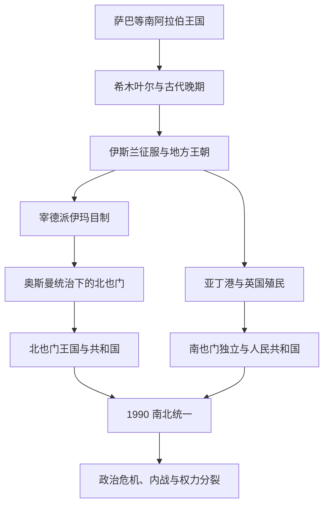

# 也门历史

## 概括

也门位于阿拉伯半岛西南端，拥有高地农业、红海港口、哈德拉毛通道和亚丁湾航路。古代南阿拉伯王国、伊斯兰化后的地方王朝与宰德派伊玛目制、奥斯曼在北部的统治、英国在亚丁的殖民，以及20世纪南北两个国家共同构成也门历史主线。1990年统一并未消除地区、制度和社会分歧。

## 历史主线

## 历史主线概括

也门高地自古依靠水利和农业支撑国家，沿海和哈德拉毛则参与红海—印度洋贸易。伊斯兰化后，也门经常由地方王朝和宗教政治传统治理，北部宰德派伊玛目制尤其持久。19世纪形成奥斯曼北部与英国亚丁的分治格局，随后发展为北也门和南也门两个国家，直至1990年统一。

## 阶段导航

| 顺序 | 阶段 | 时间 | 入口 | 简要概括 |
|---:|---|---|---|---|
| 1 | 古代南阿拉伯诸王国 | 约前1千纪-7世纪 | [古代南阿拉伯诸王国](/%E4%BA%BA%E6%96%87%E7%A7%91%E5%AD%A6/%E5%8E%86%E5%8F%B2/%E8%A5%BF%E4%BA%9A%E4%B8%8E%E5%8C%97%E9%9D%9E/%E9%98%BF%E6%8B%89%E4%BC%AF%E5%8D%8A%E5%B2%9B/%E4%B9%9F%E9%97%A8/%E5%8F%A4%E4%BB%A3%E5%8D%97%E9%98%BF%E6%8B%89%E4%BC%AF%E8%AF%B8%E7%8E%8B%E5%9B%BD.md) | 萨巴、卡塔班、哈德拉毛和希木叶尔的农业、商贸与区域竞争。 |
| 2 | 伊斯兰王朝、伊玛目制与南北分治 | 7世纪-1990年 | [伊斯兰王朝、伊玛目制与南北分治](/%E4%BA%BA%E6%96%87%E7%A7%91%E5%AD%A6/%E5%8E%86%E5%8F%B2/%E8%A5%BF%E4%BA%9A%E4%B8%8E%E5%8C%97%E9%9D%9E/%E9%98%BF%E6%8B%89%E4%BC%AF%E5%8D%8A%E5%B2%9B/%E4%B9%9F%E9%97%A8/%E4%BC%8A%E6%96%AF%E5%85%B0%E7%8E%8B%E6%9C%9D%E3%80%81%E4%BC%8A%E7%8E%9B%E7%9B%AE%E5%88%B6%E4%B8%8E%E5%8D%97%E5%8C%97%E5%88%86%E6%B2%BB.md) | 地方王朝、宰德派、奥斯曼北部、英国亚丁以及两个也门国家。 |
| 3 | 统一、政治危机与当代也门 | 1990年至今 | [统一、政治危机与当代也门](/%E4%BA%BA%E6%96%87%E7%A7%91%E5%AD%A6/%E5%8E%86%E5%8F%B2/%E8%A5%BF%E4%BA%9A%E4%B8%8E%E5%8C%97%E9%9D%9E/%E9%98%BF%E6%8B%89%E4%BC%AF%E5%8D%8A%E5%B2%9B/%E4%B9%9F%E9%97%A8/%E7%BB%9F%E4%B8%80%E3%80%81%E6%94%BF%E6%B2%BB%E5%8D%B1%E6%9C%BA%E4%B8%8E%E5%BD%93%E4%BB%A3%E4%B9%9F%E9%97%A8.md) | 统一、1994年内战、2011年危机和2014年后权力分裂。 |

## 重要转折与时间节点

| 时间 | 事件 | 意义 |
|---|---|---|
| 约前1千纪 | 萨巴等王国兴起 | 南阿拉伯农业国家和乳香贸易体系成熟。 |
| 4世纪末前后 | 希木叶尔统一也门大部 | 古代南阿拉伯政治趋向集中。 |
| 7世纪 | 也门进入伊斯兰世界 | 地方社会逐步伊斯兰化。 |
| 897年 | 宰德派伊玛目制建立 | 北也门形成长期宗教政治传统。 |
| 1839年 | 英国占领亚丁 | 南部进入殖民港口和保护地体系。 |
| 1918年 | 北也门摆脱奥斯曼统治 | 穆塔瓦基利亚王国形成。 |
| 1962年 | 北也门革命 | 阿拉伯也门共和国建立并爆发内战。 |
| 1967年 | 南也门独立 | 南也门脱离英国，后走向马克思主义国家。 |
| 1990年 | 南北统一 | 也门共和国成立。 |
| 2011年 | 政治起义与权力移交 | 长期总统统治结束，过渡进程启动。 |
| 2014-2015年 | 胡塞力量控制萨那、外部军事介入 | 国家权力分裂和大规模战争加剧。 |

## 相关主线

- 区域背景：[阿拉伯半岛历史](/%E4%BA%BA%E6%96%87%E7%A7%91%E5%AD%A6/%E5%8E%86%E5%8F%B2/%E8%A5%BF%E4%BA%9A%E4%B8%8E%E5%8C%97%E9%9D%9E/%E9%98%BF%E6%8B%89%E4%BC%AF%E5%8D%8A%E5%B2%9B/README.md)。
- 红海对岸可对读[非洲之角](/%E4%BA%BA%E6%96%87%E7%A7%91%E5%AD%A6/%E5%8E%86%E5%8F%B2/%E9%9D%9E%E6%B4%B2/%E4%B8%9C%E9%9D%9E/%E9%98%BF%E5%85%8B%E8%8B%8F%E5%A7%86%E3%80%81%E5%9F%83%E5%A1%9E%E4%BF%84%E6%AF%94%E4%BA%9A%E4%B8%8E%E9%9D%9E%E6%B4%B2%E4%B9%8B%E8%A7%92.md)。
