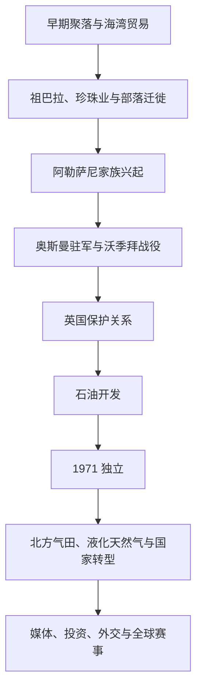

# 卡塔尔历史

## 概括

卡塔尔半岛位于波斯湾中部，历史上依靠渔业、珍珠采集、海运和与巴林、哈萨、阿曼及伊朗沿岸的贸易生存。18-19世纪部落迁徙与祖巴拉港兴起推动地方政治形成，阿勒萨尼家族在英国和奥斯曼竞争中取得领导地位。1971年独立后，石油和北方气田使卡塔尔从珍珠港口社会转变为天然气出口国与国际投资、媒体和外交节点。

## 历史主线

## 历史主线概括

卡塔尔长期属于更广泛的海湾海洋社会，政治控制在巴林阿勒哈利法、内志力量、奥斯曼和地方部落之间变化。1868年英国与穆罕默德·本·萨尼订立安排，标志阿勒萨尼家族作为卡塔尔政治代表得到承认。奥斯曼1871年进驻后又于第一次世界大战期间撤离，1916年英国保护关系确立。独立后的天然气开发尤其改变了国家规模与国际角色。

## 阶段导航

| 顺序 | 阶段 | 时间 | 入口 | 简要概括 |
|---:|---|---|---|---|
| 1 | 早期聚落、部落与珍珠贸易 | 古代-1868年 | [早期聚落、部落与珍珠贸易](/%E4%BA%BA%E6%96%87%E7%A7%91%E5%AD%A6/%E5%8E%86%E5%8F%B2/%E8%A5%BF%E4%BA%9A%E4%B8%8E%E5%8C%97%E9%9D%9E/%E9%98%BF%E6%8B%89%E4%BC%AF%E5%8D%8A%E5%B2%9B/%E5%8D%A1%E5%A1%94%E5%B0%94/%E6%97%A9%E6%9C%9F%E8%81%9A%E8%90%BD%E3%80%81%E9%83%A8%E8%90%BD%E4%B8%8E%E7%8F%8D%E7%8F%A0%E8%B4%B8%E6%98%93.md) | 海湾贸易、祖巴拉港、部落迁徙和阿勒萨尼兴起。 |
| 2 | 阿勒萨尼、奥斯曼与英国保护 | 1868-1971年 | [阿勒萨尼、奥斯曼与英国保护](/%E4%BA%BA%E6%96%87%E7%A7%91%E5%AD%A6/%E5%8E%86%E5%8F%B2/%E8%A5%BF%E4%BA%9A%E4%B8%8E%E5%8C%97%E9%9D%9E/%E9%98%BF%E6%8B%89%E4%BC%AF%E5%8D%8A%E5%B2%9B/%E5%8D%A1%E5%A1%94%E5%B0%94/%E9%98%BF%E5%8B%92%E8%90%A8%E5%B0%BC%E3%80%81%E5%A5%A5%E6%96%AF%E6%9B%BC%E4%B8%8E%E8%8B%B1%E5%9B%BD%E4%BF%9D%E6%8A%A4.md) | 地方酋长权力、奥斯曼驻军、英国条约和石油开发。 |
| 3 | 独立、天然气与现代卡塔尔 | 1971年至今 | [独立、天然气与现代卡塔尔](/%E4%BA%BA%E6%96%87%E7%A7%91%E5%AD%A6/%E5%8E%86%E5%8F%B2/%E8%A5%BF%E4%BA%9A%E4%B8%8E%E5%8C%97%E9%9D%9E/%E9%98%BF%E6%8B%89%E4%BC%AF%E5%8D%8A%E5%B2%9B/%E5%8D%A1%E5%A1%94%E5%B0%94/%E7%8B%AC%E7%AB%8B%E3%80%81%E5%A4%A9%E7%84%B6%E6%B0%94%E4%B8%8E%E7%8E%B0%E4%BB%A3%E5%8D%A1%E5%A1%94%E5%B0%94.md) | 独立国家、液化天然气、国际媒体、投资与调停外交。 |

## 重要转折与时间节点

| 时间 | 事件 | 意义 |
|---|---|---|
| 18世纪 | 祖巴拉港兴盛 | 珍珠与转口贸易吸引部落和商人。 |
| 1867-1868年 | 卡塔尔—巴林冲突及英国调停 | 阿勒萨尼作为地方政治代表的地位增强。 |
| 1871年 | 奥斯曼进驻 | 卡塔尔进入奥斯曼名义统治与地方自治并存时期。 |
| 1893年 | 沃季拜战役 | 贾西姆·本·穆罕默德抵抗奥斯曼，地方自主性加强。 |
| 1916年 | 英国保护条约 | 卡塔尔对外关系纳入英国海湾体系。 |
| 1939年 | 杜汉发现石油 | 传统珍珠经济之后出现新财政基础。 |
| 1971年9月3日 | 卡塔尔独立 | 未加入阿联酋，建立独立国家。 |
| 1971年 | 北方气田被发现 | 后来的液化天然气经济奠基。 |
| 1996年 | 半岛电视台开播 | 卡塔尔获得超出国土和人口规模的媒体影响。 |
| 2017-2021年 | 海湾国家对卡塔尔实施并结束封锁 | 国家供应链、联盟和地区外交受到考验。 |
| 2022年 | 举办世界杯 | 基础设施、全球形象与劳工制度成为国际焦点。 |

## 相关主线

- 区域背景：[阿拉伯半岛历史](/%E4%BA%BA%E6%96%87%E7%A7%91%E5%AD%A6/%E5%8E%86%E5%8F%B2/%E8%A5%BF%E4%BA%9A%E4%B8%8E%E5%8C%97%E9%9D%9E/%E9%98%BF%E6%8B%89%E4%BC%AF%E5%8D%8A%E5%B2%9B/README.md)。
- 海湾条约体系：[奥斯曼、英国与现代国家形成](/%E4%BA%BA%E6%96%87%E7%A7%91%E5%AD%A6/%E5%8E%86%E5%8F%B2/%E8%A5%BF%E4%BA%9A%E4%B8%8E%E5%8C%97%E9%9D%9E/%E9%98%BF%E6%8B%89%E4%BC%AF%E5%8D%8A%E5%B2%9B/%E5%A5%A5%E6%96%AF%E6%9B%BC%E3%80%81%E8%8B%B1%E5%9B%BD%E4%B8%8E%E7%8E%B0%E4%BB%A3%E5%9B%BD%E5%AE%B6%E5%BD%A2%E6%88%90.md)。
