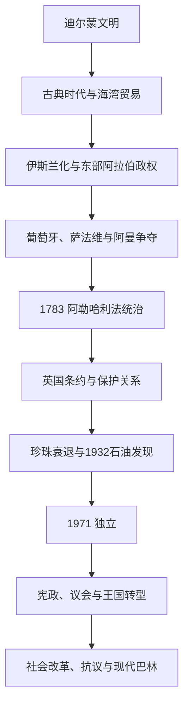

# 巴林历史

## 概括

巴林群岛位于波斯湾中部，自古是两河、阿曼、伊朗和印度洋之间的贸易节点。青铜时代迪尔蒙、古代晚期海湾网络、卡尔马特政权、葡萄牙与萨法维争夺、阿勒哈利法家族统治和英国保护关系层层叠加。珍珠业曾是社会经济核心，1932年发现石油后，巴林成为最早进入石油时代的阿拉伯海湾国家之一。

## 历史主线

## 历史主线概括

迪尔蒙使巴林成为古代海湾最著名的转运中心之一。伊斯兰化后，群岛与哈萨和卡提夫常处于同一东部阿拉伯政治网络。16世纪葡萄牙占领后，萨法维伊朗和阿曼先后影响巴林，1783年阿勒哈利法家族取得统治。19世纪英国条约体系限制其对外关系，独立后君主制、商人传统、宗派社会和议会政治共同塑造国家。

## 阶段导航

| 顺序 | 阶段 | 时间 | 入口 | 简要概括 |
|---:|---|---|---|---|
| 1 | 迪尔蒙、贸易网络与伊斯兰化 | 约前3千纪-16世纪 | [迪尔蒙、贸易网络与伊斯兰化](/%E4%BA%BA%E6%96%87%E7%A7%91%E5%AD%A6/%E5%8E%86%E5%8F%B2/%E8%A5%BF%E4%BA%9A%E4%B8%8E%E5%8C%97%E9%9D%9E/%E9%98%BF%E6%8B%89%E4%BC%AF%E5%8D%8A%E5%B2%9B/%E5%B7%B4%E6%9E%97/%E8%BF%AA%E5%B0%94%E8%92%99%E3%80%81%E8%B4%B8%E6%98%93%E7%BD%91%E7%BB%9C%E4%B8%8E%E4%BC%8A%E6%96%AF%E5%85%B0%E5%8C%96.md) | 古代转运中心、希腊化海湾、伊斯兰化和卡尔马特时期。 |
| 2 | 海湾王朝、珍珠贸易与英国保护 | 16世纪-1971年 | [海湾王朝、珍珠贸易与英国保护](/%E4%BA%BA%E6%96%87%E7%A7%91%E5%AD%A6/%E5%8E%86%E5%8F%B2/%E8%A5%BF%E4%BA%9A%E4%B8%8E%E5%8C%97%E9%9D%9E/%E9%98%BF%E6%8B%89%E4%BC%AF%E5%8D%8A%E5%B2%9B/%E5%B7%B4%E6%9E%97/%E6%B5%B7%E6%B9%BE%E7%8E%8B%E6%9C%9D%E3%80%81%E7%8F%8D%E7%8F%A0%E8%B4%B8%E6%98%93%E4%B8%8E%E8%8B%B1%E5%9B%BD%E4%BF%9D%E6%8A%A4.md) | 葡萄牙、萨法维与阿曼争夺，阿勒哈利法统治和英国保护。 |
| 3 | 独立、社会改革与现代巴林 | 1971年至今 | [独立、社会改革与现代巴林](/%E4%BA%BA%E6%96%87%E7%A7%91%E5%AD%A6/%E5%8E%86%E5%8F%B2/%E8%A5%BF%E4%BA%9A%E4%B8%8E%E5%8C%97%E9%9D%9E/%E9%98%BF%E6%8B%89%E4%BC%AF%E5%8D%8A%E5%B2%9B/%E5%B7%B4%E6%9E%97/%E7%8B%AC%E7%AB%8B%E3%80%81%E7%A4%BE%E4%BC%9A%E6%94%B9%E9%9D%A9%E4%B8%8E%E7%8E%B0%E4%BB%A3%E5%B7%B4%E6%9E%97.md) | 独立、宪政尝试、王国建立、社会改革和政治冲突。 |

## 重要转折与时间节点

| 时间 | 事件 | 意义 |
|---|---|---|
| 约前3-前2千纪 | 迪尔蒙兴盛 | 巴林成为两河与印度洋之间的贸易节点。 |
| 7世纪 | 巴林地区接受伊斯兰 | 群岛进入伊斯兰政治与商业网络。 |
| 10世纪 | 卡尔马特力量控制东部阿拉伯 | 巴林成为挑战阿拔斯秩序的区域中心。 |
| 1521年 | 葡萄牙控制巴林 | 群岛进入霍尔木兹—葡萄牙海上体系。 |
| 1602年 | 萨法维驱逐葡萄牙势力 | 巴林与伊朗王朝关系加深。 |
| 1783年 | 阿勒哈利法取得巴林 | 延续至今的王朝统治开始。 |
| 1861年及其后 | 英国保护关系强化 | 巴林对外事务受到英国控制。 |
| 1932年 | 发现石油 | 海湾阿拉伯地区最早的商业石油开发之一。 |
| 1971年 | 巴林独立 | 结束英国保护关系。 |
| 2002年 | 巴林王国成立 | 埃米尔改称国王，恢复两院制议会。 |
| 2011年 | 大规模抗议 | 宗派、代表性和安全治理矛盾集中显现。 |

## 相关主线

- 区域背景：[阿拉伯半岛历史](/%E4%BA%BA%E6%96%87%E7%A7%91%E5%AD%A6/%E5%8E%86%E5%8F%B2/%E8%A5%BF%E4%BA%9A%E4%B8%8E%E5%8C%97%E9%9D%9E/%E9%98%BF%E6%8B%89%E4%BC%AF%E5%8D%8A%E5%B2%9B/README.md)。
- 海湾条约体系：[奥斯曼、英国与现代国家形成](/%E4%BA%BA%E6%96%87%E7%A7%91%E5%AD%A6/%E5%8E%86%E5%8F%B2/%E8%A5%BF%E4%BA%9A%E4%B8%8E%E5%8C%97%E9%9D%9E/%E9%98%BF%E6%8B%89%E4%BC%AF%E5%8D%8A%E5%B2%9B/%E5%A5%A5%E6%96%AF%E6%9B%BC%E3%80%81%E8%8B%B1%E5%9B%BD%E4%B8%8E%E7%8E%B0%E4%BB%A3%E5%9B%BD%E5%AE%B6%E5%BD%A2%E6%88%90.md)。
