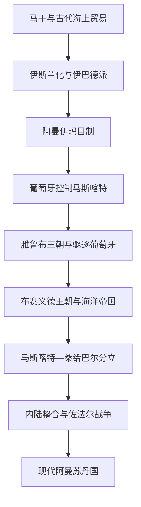

# 阿曼历史

## 概括

阿曼位于阿拉伯半岛东南端，山地、内陆绿洲、马斯喀特港和印度洋海岸共同塑造其历史。古代马干与铜贸易、伊巴德派伊玛目制、雅鲁布王朝驱逐葡萄牙、布赛义德王朝建立海洋帝国，以及20世纪苏丹国整合内陆与佐法尔，是阿曼区别于其他海湾国家的核心主线。

## 历史主线

## 历史主线概括

阿曼很早就通过铜和海运连接两河流域与印度洋。伊斯兰化后，伊巴德派社群发展出由学者、部落和伊玛目共同维持的政治传统。17世纪雅鲁布王朝驱逐葡萄牙，并向东非扩展；18世纪建立的布赛义德王朝把马斯喀特和桑给巴尔联系为海洋帝国。19世纪后海洋领地分裂，英国影响增强，20世纪苏丹最终整合内陆伊玛目制和佐法尔。

## 阶段导航

| 顺序 | 阶段 | 时间 | 入口 | 简要概括 |
|---:|---|---|---|---|
| 1 | 古代阿曼、伊巴德派与海上贸易 | 古代-17世纪初 | [古代阿曼、伊巴德派与海上贸易](/%E4%BA%BA%E6%96%87%E7%A7%91%E5%AD%A6/%E5%8E%86%E5%8F%B2/%E8%A5%BF%E4%BA%9A%E4%B8%8E%E5%8C%97%E9%9D%9E/%E9%98%BF%E6%8B%89%E4%BC%AF%E5%8D%8A%E5%B2%9B/%E9%98%BF%E6%9B%BC/%E5%8F%A4%E4%BB%A3%E9%98%BF%E6%9B%BC%E3%80%81%E4%BC%8A%E5%B7%B4%E5%BE%B7%E6%B4%BE%E4%B8%8E%E6%B5%B7%E4%B8%8A%E8%B4%B8%E6%98%93.md) | 马干、季风航海、伊斯兰化、伊巴德派和葡萄牙据点。 |
| 2 | 雅鲁布、布赛义德王朝与海洋帝国 | 17世纪-20世纪初 | [雅鲁布、布赛义德王朝与海洋帝国](/%E4%BA%BA%E6%96%87%E7%A7%91%E5%AD%A6/%E5%8E%86%E5%8F%B2/%E8%A5%BF%E4%BA%9A%E4%B8%8E%E5%8C%97%E9%9D%9E/%E9%98%BF%E6%8B%89%E4%BC%AF%E5%8D%8A%E5%B2%9B/%E9%98%BF%E6%9B%BC/%E9%9B%85%E9%B2%81%E5%B8%83%E3%80%81%E5%B8%83%E8%B5%9B%E4%B9%89%E5%BE%B7%E7%8E%8B%E6%9C%9D%E4%B8%8E%E6%B5%B7%E6%B4%8B%E5%B8%9D%E5%9B%BD.md) | 驱逐葡萄牙、东非扩张、布赛义德王朝和马斯喀特—桑给巴尔分立。 |
| 3 | 英国影响、国家整合与现代阿曼 | 20世纪至今 | [英国影响、国家整合与现代阿曼](/%E4%BA%BA%E6%96%87%E7%A7%91%E5%AD%A6/%E5%8E%86%E5%8F%B2/%E8%A5%BF%E4%BA%9A%E4%B8%8E%E5%8C%97%E9%9D%9E/%E9%98%BF%E6%8B%89%E4%BC%AF%E5%8D%8A%E5%B2%9B/%E9%98%BF%E6%9B%BC/%E8%8B%B1%E5%9B%BD%E5%BD%B1%E5%93%8D%E3%80%81%E5%9B%BD%E5%AE%B6%E6%95%B4%E5%90%88%E4%B8%8E%E7%8E%B0%E4%BB%A3%E9%98%BF%E6%9B%BC.md) | 苏丹与内陆伊玛目制冲突、佐法尔战争、1970年后现代化。 |

## 重要转折与时间节点

| 时间 | 事件 | 意义 |
|---|---|---|
| 约前3-前2千纪 | 马干进入两河贸易记录 | 阿曼铜矿和海运网络得到早期见证。 |
| 8世纪 | 伊巴德派伊玛目制形成 | 宗教学者、部落协商与选举伊玛目成为政治传统。 |
| 1507年 | 葡萄牙占领马斯喀特 | 阿曼港口进入葡萄牙印度洋据点体系。 |
| 1650年 | 葡萄牙被逐出马斯喀特 | 雅鲁布王朝开始海上扩张。 |
| 1744年前后 | 艾哈迈德·本·赛义德建立新王朝 | 布赛义德王朝开启并延续至今。 |
| 1856年后 | 马斯喀特与桑给巴尔分立 | 阿曼海洋帝国政治重心分裂。 |
| 1950年代 | 苏丹国击败内陆伊玛目力量 | 现代领土整合加强。 |
| 1970年 | 卡布斯掌权 | 行政、教育、交通和国家制度快速现代化。 |
| 1975-1976年 | 佐法尔叛乱基本结束 | 中央政府完成对南部的军事与行政整合。 |
| 2020年 | 海赛姆继位 | 王朝延续并进入财政和制度调整阶段。 |

## 相关主线

- 区域背景：[阿拉伯半岛历史](/%E4%BA%BA%E6%96%87%E7%A7%91%E5%AD%A6/%E5%8E%86%E5%8F%B2/%E8%A5%BF%E4%BA%9A%E4%B8%8E%E5%8C%97%E9%9D%9E/%E9%98%BF%E6%8B%89%E4%BC%AF%E5%8D%8A%E5%B2%9B/README.md)。
- 东非侧面：[斯瓦希里海岸与印度洋世界](/%E4%BA%BA%E6%96%87%E7%A7%91%E5%AD%A6/%E5%8E%86%E5%8F%B2/%E9%9D%9E%E6%B4%B2/%E4%B8%9C%E9%9D%9E/%E6%96%AF%E7%93%A6%E5%B8%8C%E9%87%8C%E6%B5%B7%E5%B2%B8%E4%B8%8E%E5%8D%B0%E5%BA%A6%E6%B4%8B%E4%B8%96%E7%95%8C.md)。
