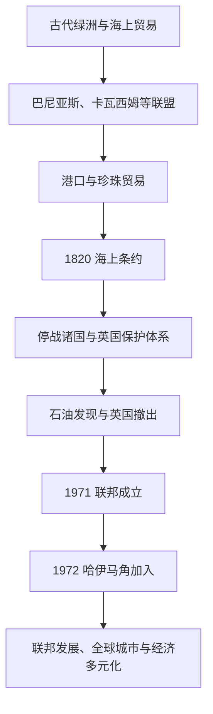

# 阿联酋历史

## 概括

阿拉伯联合酋长国由阿布扎比、迪拜、沙迦、阿治曼、乌姆盖万、富查伊拉和哈伊马角七个酋长国组成。联邦建立以前，沿海港口、绿洲、部落联盟、海上贸易和珍珠采集构成社会基础。19世纪英国与各酋长签订海上停战和排他协议，形成“停战诸国”；英国撤出后，六个酋长国于1971年组成联邦，哈伊马角次年加入。

## 历史主线

## 历史主线概括

阿联酋地区古代属于阿曼半岛和波斯湾贸易圈，内陆绿洲与海岸港口互相依赖。18-19世纪巴尼亚斯联盟在阿布扎比、迪拜发展，卡瓦西姆则控制北部港口和海上网络。英国以打击海上冲突为名签订条约，逐步限制酋长国外交。珍珠经济在20世纪上半叶衰退，石油开发和联邦建设随后改变社会结构。

## 阶段导航

| 顺序 | 阶段 | 时间 | 入口 | 简要概括 |
|---:|---|---|---|---|
| 1 | 海湾部落、港口与珍珠贸易 | 古代-19世纪初 | [海湾部落、港口与珍珠贸易](/%E4%BA%BA%E6%96%87%E7%A7%91%E5%AD%A6/%E5%8E%86%E5%8F%B2/%E8%A5%BF%E4%BA%9A%E4%B8%8E%E5%8C%97%E9%9D%9E/%E9%98%BF%E6%8B%89%E4%BC%AF%E5%8D%8A%E5%B2%9B/%E9%98%BF%E8%81%94%E9%85%8B/%E6%B5%B7%E6%B9%BE%E9%83%A8%E8%90%BD%E3%80%81%E6%B8%AF%E5%8F%A3%E4%B8%8E%E7%8F%8D%E7%8F%A0%E8%B4%B8%E6%98%93.md) | 绿洲农业、部落联盟、卡瓦西姆航海与珍珠经济。 |
| 2 | 停战诸国与英国保护体系 | 1820-1971年 | [停战诸国与英国保护体系](/%E4%BA%BA%E6%96%87%E7%A7%91%E5%AD%A6/%E5%8E%86%E5%8F%B2/%E8%A5%BF%E4%BA%9A%E4%B8%8E%E5%8C%97%E9%9D%9E/%E9%98%BF%E6%8B%89%E4%BC%AF%E5%8D%8A%E5%B2%9B/%E9%98%BF%E8%81%94%E9%85%8B/%E5%81%9C%E6%88%98%E8%AF%B8%E5%9B%BD%E4%B8%8E%E8%8B%B1%E5%9B%BD%E4%BF%9D%E6%8A%A4%E4%BD%93%E7%B3%BB.md) | 海上条约、外交限制、珍珠危机和石油勘探。 |
| 3 | 联邦建立与现代阿联酋 | 1971年至今 | [联邦建立与现代阿联酋](/%E4%BA%BA%E6%96%87%E7%A7%91%E5%AD%A6/%E5%8E%86%E5%8F%B2/%E8%A5%BF%E4%BA%9A%E4%B8%8E%E5%8C%97%E9%9D%9E/%E9%98%BF%E6%8B%89%E4%BC%AF%E5%8D%8A%E5%B2%9B/%E9%98%BF%E8%81%94%E9%85%8B/%E8%81%94%E9%82%A6%E5%BB%BA%E7%AB%8B%E4%B8%8E%E7%8E%B0%E4%BB%A3%E9%98%BF%E8%81%94%E9%85%8B.md) | 七酋长联邦、石油财政、迪拜全球城市与经济多元化。 |

## 重要转折与时间节点

| 时间 | 事件 | 意义 |
|---|---|---|
| 18世纪 | 巴尼亚斯与卡瓦西姆联盟壮大 | 阿布扎比、迪拜、沙迦和哈伊马角等政治中心形成。 |
| 1820年 | 英国与沿岸酋长签订海上总条约 | 英国海上秩序开始制度化。 |
| 1853年 | 永久海上停战 | “停战海岸／停战诸国”名称由此发展。 |
| 1892年 | 排他协议 | 酋长国对外关系受到英国严格限制。 |
| 1930年代 | 珍珠经济崩溃 | 世界经济危机和养殖珍珠重创传统财政。 |
| 1958年 | 阿布扎比发现石油 | 联邦前的经济结构开始根本转型。 |
| 1968年 | 英国宣布撤出苏伊士以东 | 各酋长国开始联邦谈判。 |
| 1971年12月2日 | 六个酋长国成立阿联酋 | 联邦国家诞生。 |
| 1972年 | 哈伊马角加入 | 七酋长国格局完成。 |

## 相关主线

- 区域背景：[阿拉伯半岛历史](/%E4%BA%BA%E6%96%87%E7%A7%91%E5%AD%A6/%E5%8E%86%E5%8F%B2/%E8%A5%BF%E4%BA%9A%E4%B8%8E%E5%8C%97%E9%9D%9E/%E9%98%BF%E6%8B%89%E4%BC%AF%E5%8D%8A%E5%B2%9B/README.md)。
- 英国条约体系：[奥斯曼、英国与现代国家形成](/%E4%BA%BA%E6%96%87%E7%A7%91%E5%AD%A6/%E5%8E%86%E5%8F%B2/%E8%A5%BF%E4%BA%9A%E4%B8%8E%E5%8C%97%E9%9D%9E/%E9%98%BF%E6%8B%89%E4%BC%AF%E5%8D%8A%E5%B2%9B/%E5%A5%A5%E6%96%AF%E6%9B%BC%E3%80%81%E8%8B%B1%E5%9B%BD%E4%B8%8E%E7%8E%B0%E4%BB%A3%E5%9B%BD%E5%AE%B6%E5%BD%A2%E6%88%90.md)。
