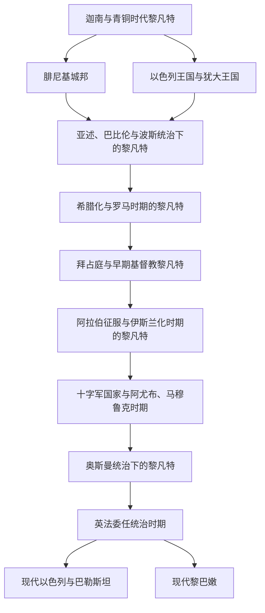

# 黎凡特

## 概括

黎凡特是东地中海东岸及其内陆相邻区域的历史地理概念，通常涵盖今天的以色列、巴勒斯坦、黎巴嫩、叙利亚西部和约旦等地区。本目录主要用于整理现在以色列、巴勒斯坦、黎巴嫩一带的历史，并预留与叙利亚、约旦和东地中海世界的交叉关系。

这一地区在古代不宜直接按现代国家切开：青铜时代可称迦南或叙利亚—巴勒斯坦地区，铁器时代出现腓尼基城邦、以色列王国和犹大王国，随后长期处在亚述、巴比伦、波斯、希腊化王国、罗马、拜占庭、阿拉伯哈里发、十字军、马穆鲁克、奥斯曼和近现代委任统治体系之中。

## 名称辨析

- “黎凡特”适合作为区域总目录，避免用现代国界切碎古代东地中海历史。
- “迦南”多用于青铜时代和早期铁器时代的南黎凡特文化区域，不等同于现代国家。
- “腓尼基”主要指黎巴嫩沿海及其城邦网络，尤其是推罗、西顿、比布鲁斯等。
- “以色列 / 犹大”主要用于铁器时代希伯来王国和后续犹太政治、宗教传统。
- “巴勒斯坦”在不同时期含义不同，可指罗马行省、地理区域、英属委任统治地或现代巴勒斯坦政治实体，使用时应写清语境。

## 演变图

## 按时间排序的时期导航

| 顺序 | 阶段 | 时间 | 建议笔记 | 简要概括 |
|---:|---|---|---|---|
| 1 | 迦南与青铜时代黎凡特 | 约前3千纪-前12世纪 | [迦南与青铜时代黎凡特](/%E4%BA%BA%E6%96%87%E7%A7%91%E5%AD%A6/%E5%8E%86%E5%8F%B2/%E8%A5%BF%E4%BA%9A%E4%B8%8E%E5%8C%97%E9%9D%9E/%E9%BB%8E%E5%87%A1%E7%89%B9/%E8%BF%A6%E5%8D%97%E4%B8%8E%E9%9D%92%E9%93%9C%E6%97%B6%E4%BB%A3%E9%BB%8E%E5%87%A1%E7%89%B9.md) | 城邦、贸易网络和埃及、两河、安纳托利亚势力交织，是后续腓尼基、以色列和犹大传统的重要背景。 |
| 2 | 腓尼基城邦 | 约前12世纪-前6世纪起 | [腓尼基城邦](/%E4%BA%BA%E6%96%87%E7%A7%91%E5%AD%A6/%E5%8E%86%E5%8F%B2/%E8%A5%BF%E4%BA%9A%E4%B8%8E%E5%8C%97%E9%9D%9E/%E9%BB%8E%E5%87%A1%E7%89%B9/%E8%85%93%E5%B0%BC%E5%9F%BA%E5%9F%8E%E9%82%A6.md) | 推罗、西顿、比布鲁斯等沿海城邦发展航海贸易、字母文字和地中海殖民网络。 |
| 3 | 以色列王国与犹大王国 | 约前11世纪-前586年 | [以色列王国与犹大王国](/%E4%BA%BA%E6%96%87%E7%A7%91%E5%AD%A6/%E5%8E%86%E5%8F%B2/%E8%A5%BF%E4%BA%9A%E4%B8%8E%E5%8C%97%E9%9D%9E/%E9%BB%8E%E5%87%A1%E7%89%B9/%E4%BB%A5%E8%89%B2%E5%88%97%E7%8E%8B%E5%9B%BD%E4%B8%8E%E7%8A%B9%E5%A4%A7%E7%8E%8B%E5%9B%BD.md) | 南黎凡特内陆和山地形成希伯来王国传统，后被亚述与新巴比伦重组。 |
| 4 | 亚述、巴比伦与波斯统治下的黎凡特 | 前8世纪-前4世纪 | [亚述、巴比伦与波斯统治下的黎凡特](/%E4%BA%BA%E6%96%87%E7%A7%91%E5%AD%A6/%E5%8E%86%E5%8F%B2/%E8%A5%BF%E4%BA%9A%E4%B8%8E%E5%8C%97%E9%9D%9E/%E9%BB%8E%E5%87%A1%E7%89%B9/%E4%BA%9A%E8%BF%B0%E3%80%81%E5%B7%B4%E6%AF%94%E4%BC%A6%E4%B8%8E%E6%B3%A2%E6%96%AF%E7%BB%9F%E6%B2%BB%E4%B8%8B%E7%9A%84%E9%BB%8E%E5%87%A1%E7%89%B9.md) | 黎凡特被纳入西亚大帝国行省体系，经历征服、迁徙、流亡和地方社群重组。 |
| 5 | 希腊化与罗马时期的黎凡特 | 前4世纪-4世纪 | [希腊化与罗马时期的黎凡特](/%E4%BA%BA%E6%96%87%E7%A7%91%E5%AD%A6/%E5%8E%86%E5%8F%B2/%E8%A5%BF%E4%BA%9A%E4%B8%8E%E5%8C%97%E9%9D%9E/%E9%BB%8E%E5%87%A1%E7%89%B9/%E5%B8%8C%E8%85%8A%E5%8C%96%E4%B8%8E%E7%BD%97%E9%A9%AC%E6%97%B6%E6%9C%9F%E7%9A%84%E9%BB%8E%E5%87%A1%E7%89%B9.md) | 亚历山大东征后进入希腊化世界，罗马时期形成犹太行省、叙利亚行省和城市网络。 |
| 6 | 拜占庭与早期基督教黎凡特 | 4世纪-7世纪 | [拜占庭与早期基督教黎凡特](/%E4%BA%BA%E6%96%87%E7%A7%91%E5%AD%A6/%E5%8E%86%E5%8F%B2/%E8%A5%BF%E4%BA%9A%E4%B8%8E%E5%8C%97%E9%9D%9E/%E9%BB%8E%E5%87%A1%E7%89%B9/%E6%8B%9C%E5%8D%A0%E5%BA%AD%E4%B8%8E%E6%97%A9%E6%9C%9F%E5%9F%BA%E7%9D%A3%E6%95%99%E9%BB%8E%E5%87%A1%E7%89%B9.md) | 基督教圣地、主教区、修道传统和拜占庭边疆治理成为主线。 |
| 7 | 阿拉伯征服与伊斯兰化时期的黎凡特 | 7世纪-11世纪 | [阿拉伯征服与伊斯兰化时期的黎凡特](/%E4%BA%BA%E6%96%87%E7%A7%91%E5%AD%A6/%E5%8E%86%E5%8F%B2/%E8%A5%BF%E4%BA%9A%E4%B8%8E%E5%8C%97%E9%9D%9E/%E9%BB%8E%E5%87%A1%E7%89%B9/%E9%98%BF%E6%8B%89%E4%BC%AF%E5%BE%81%E6%9C%8D%E4%B8%8E%E4%BC%8A%E6%96%AF%E5%85%B0%E5%8C%96%E6%97%B6%E6%9C%9F%E7%9A%84%E9%BB%8E%E5%87%A1%E7%89%B9.md) | 早期哈里发将黎凡特纳入伊斯兰世界，大马士革一度成为倭马亚王朝中心。 |
| 8 | 十字军国家与阿尤布、马穆鲁克时期 | 11世纪末-1516年 | [十字军国家与阿尤布、马穆鲁克时期](/%E4%BA%BA%E6%96%87%E7%A7%91%E5%AD%A6/%E5%8E%86%E5%8F%B2/%E8%A5%BF%E4%BA%9A%E4%B8%8E%E5%8C%97%E9%9D%9E/%E9%BB%8E%E5%87%A1%E7%89%B9/%E5%8D%81%E5%AD%97%E5%86%9B%E5%9B%BD%E5%AE%B6%E4%B8%8E%E9%98%BF%E5%B0%A4%E5%B8%83%E3%80%81%E9%A9%AC%E7%A9%86%E9%B2%81%E5%85%8B%E6%97%B6%E6%9C%9F.md) | 十字军国家、阿尤布王朝和马穆鲁克苏丹国围绕圣地、港口和内陆要道反复争夺。 |
| 9 | 奥斯曼统治下的黎凡特 | 1516年-1918年 | [奥斯曼统治下的黎凡特](/%E4%BA%BA%E6%96%87%E7%A7%91%E5%AD%A6/%E5%8E%86%E5%8F%B2/%E8%A5%BF%E4%BA%9A%E4%B8%8E%E5%8C%97%E9%9D%9E/%E9%BB%8E%E5%87%A1%E7%89%B9/%E5%A5%A5%E6%96%AF%E6%9B%BC%E7%BB%9F%E6%B2%BB%E4%B8%8B%E7%9A%84%E9%BB%8E%E5%87%A1%E7%89%B9.md) | 黎凡特成为奥斯曼阿拉伯行省体系的一部分，沿海、山地和城市精英结构逐渐变化。 |
| 10 | 英法委任统治时期 | 1918年-20世纪中期 | [英法委任统治时期](/%E4%BA%BA%E6%96%87%E7%A7%91%E5%AD%A6/%E5%8E%86%E5%8F%B2/%E8%A5%BF%E4%BA%9A%E4%B8%8E%E5%8C%97%E9%9D%9E/%E9%BB%8E%E5%87%A1%E7%89%B9/%E8%8B%B1%E6%B3%95%E5%A7%94%E4%BB%BB%E7%BB%9F%E6%B2%BB%E6%97%B6%E6%9C%9F.md) | 一战后奥斯曼阿拉伯地区被英法重组，现代黎巴嫩、叙利亚、巴勒斯坦和以色列问题由此成形。 |
| 11 | 现代以色列与巴勒斯坦 | 1948年至今 | [现代以色列与巴勒斯坦](/%E4%BA%BA%E6%96%87%E7%A7%91%E5%AD%A6/%E5%8E%86%E5%8F%B2/%E8%A5%BF%E4%BA%9A%E4%B8%8E%E5%8C%97%E9%9D%9E/%E9%BB%8E%E5%87%A1%E7%89%B9/%E7%8E%B0%E4%BB%A3%E4%BB%A5%E8%89%B2%E5%88%97%E4%B8%8E%E5%B7%B4%E5%8B%92%E6%96%AF%E5%9D%A6.md) | 以色列建国、巴勒斯坦民族运动、战争、占领、和平进程和地区冲突构成现代主线。 |
| 12 | 现代黎巴嫩 | 1943年至今 | [现代黎巴嫩](/%E4%BA%BA%E6%96%87%E7%A7%91%E5%AD%A6/%E5%8E%86%E5%8F%B2/%E8%A5%BF%E4%BA%9A%E4%B8%8E%E5%8C%97%E9%9D%9E/%E9%BB%8E%E5%87%A1%E7%89%B9/%E7%8E%B0%E4%BB%A3%E9%BB%8E%E5%B7%B4%E5%AB%A9.md) | 黎巴嫩在宗派政治、内战、叙利亚影响、以色列冲突和区域力量竞争中形成现代国家史。 |

## 结构建议

- 本目录已建立主要阶段笔记；后续可按需要继续拆分具体城市、王朝、战争、宗教社群或现代政治专题。
- 古代节点优先按区域与文明阶段整理，不直接按现代以色列、巴勒斯坦、黎巴嫩拆分。
- 近现代节点可以按现代政治实体拆分，例如“现代以色列与巴勒斯坦”“现代黎巴嫩”。
- 跨区域帝国的完整历史不在本目录重复维护，只在对应阶段说明其对黎凡特的统治和影响。

## 相关区域

- 上级区域：[西亚与北非](/%E4%BA%BA%E6%96%87%E7%A7%91%E5%AD%A6/%E5%8E%86%E5%8F%B2/%E8%A5%BF%E4%BA%9A%E4%B8%8E%E5%8C%97%E9%9D%9E/README.md)。
- 两河帝国背景：[两河流域文明](/%E4%BA%BA%E6%96%87%E7%A7%91%E5%AD%A6/%E5%8E%86%E5%8F%B2/%E8%A5%BF%E4%BA%9A%E4%B8%8E%E5%8C%97%E9%9D%9E/%E4%B8%A4%E6%B2%B3%E6%B5%81%E5%9F%9F/README.md)、[亚述帝国](/%E4%BA%BA%E6%96%87%E7%A7%91%E5%AD%A6/%E5%8E%86%E5%8F%B2/%E8%A5%BF%E4%BA%9A%E4%B8%8E%E5%8C%97%E9%9D%9E/%E4%B8%A4%E6%B2%B3%E6%B5%81%E5%9F%9F/%E4%BA%9A%E8%BF%B0%E5%B8%9D%E5%9B%BD.md)、[新巴比伦王国](/%E4%BA%BA%E6%96%87%E7%A7%91%E5%AD%A6/%E5%8E%86%E5%8F%B2/%E8%A5%BF%E4%BA%9A%E4%B8%8E%E5%8C%97%E9%9D%9E/%E4%B8%A4%E6%B2%B3%E6%B5%81%E5%9F%9F/%E6%96%B0%E5%B7%B4%E6%AF%94%E4%BC%A6%E7%8E%8B%E5%9B%BD.md)。
- 波斯帝国背景：[阿契美尼德王朝](/%E4%BA%BA%E6%96%87%E7%A7%91%E5%AD%A6/%E5%8E%86%E5%8F%B2/%E8%A5%BF%E4%BA%9A%E4%B8%8E%E5%8C%97%E9%9D%9E/%E4%BC%8A%E6%9C%97/%E9%98%BF%E5%A5%91%E7%BE%8E%E5%B0%BC%E5%BE%B7%E7%8E%8B%E6%9C%9D.md)。
- 奥斯曼背景：[奥斯曼帝国](/%E4%BA%BA%E6%96%87%E7%A7%91%E5%AD%A6/%E5%8E%86%E5%8F%B2/%E8%A5%BF%E4%BA%9A%E4%B8%8E%E5%8C%97%E9%9D%9E/%E5%9C%9F%E8%80%B3%E5%85%B6/%E5%A5%A5%E6%96%AF%E6%9B%BC%E5%B8%9D%E5%9B%BD/README.md)。
- 欧洲交叉节点：[十字军东征](/%E4%BA%BA%E6%96%87%E7%A7%91%E5%AD%A6/%E5%8E%86%E5%8F%B2/%E6%AC%A7%E6%B4%B2/_%E9%80%9A%E5%8F%B2/%E5%8D%81%E5%AD%97%E5%86%9B%E4%B8%9C%E5%BE%81/README.md)、[东罗马帝国与拜占庭帝国](/%E4%BA%BA%E6%96%87%E7%A7%91%E5%AD%A6/%E5%8E%86%E5%8F%B2/%E6%AC%A7%E6%B4%B2/_%E9%80%9A%E5%8F%B2/%E5%8F%A4%E7%BD%97%E9%A9%AC/%E4%B8%9C%E7%BD%97%E9%A9%AC%E5%B8%9D%E5%9B%BD%E4%B8%8E%E6%8B%9C%E5%8D%A0%E5%BA%AD%E5%B8%9D%E5%9B%BD.md)。
