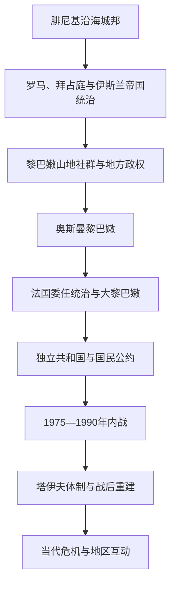

# 黎巴嫩

## 概括

黎巴嫩位于地中海东岸，疆域狭长而地形多山。古代沿海的比布鲁斯、西顿和推罗是腓尼基城邦网络的重要中心；内陆贝卡谷地和黎巴嫩山则连接叙利亚腹地。中世纪以后，马龙派基督徒、德鲁兹派、逊尼派、什叶派和其他社群共同塑造山地与港口社会。

现代黎巴嫩的边界源于法国在1920年建立的“大黎巴嫩”。1943年独立后，以宗派代表分配高级职位和议会席位的协商制度维持多元社会，也容易在国内外冲突下陷入瘫痪。1975—1990年内战、叙利亚和以色列介入、巴勒斯坦武装存在及战后重建深刻改变国家；当代黎巴嫩仍面对宗派政治、经济危机、公共服务不足和地区冲突外溢。

## 演变图

## 历史主线

黎巴嫩国家史不能只从1943年独立开始，也不能把古代腓尼基直接等同于现代民族国家。理解其连续性需要同时观察沿海贸易城市、黎巴嫩山的地方自治与宗教社群、奥斯曼行政改革、法国划界、宗派协商制度以及叙利亚—以色列—巴勒斯坦问题的跨境影响。

## 时期导航

| 顺序 | 阶段 | 时间 | 简要概括 |
|---:|---|---|---|
| 1 | [腓尼基、山地社群与奥斯曼黎巴嫩](/%E4%BA%BA%E6%96%87%E7%A7%91%E5%AD%A6/%E5%8E%86%E5%8F%B2/%E8%A5%BF%E4%BA%9A%E4%B8%8E%E5%8C%97%E9%9D%9E/%E9%BB%8E%E5%B7%B4%E5%AB%A9/%E8%85%93%E5%B0%BC%E5%9F%BA%E3%80%81%E5%B1%B1%E5%9C%B0%E7%A4%BE%E7%BE%A4%E4%B8%8E%E5%A5%A5%E6%96%AF%E6%9B%BC%E9%BB%8E%E5%B7%B4%E5%AB%A9.md) | 约前3千纪—1918年 | 腓尼基城邦、帝国统治、山地社群与奥斯曼地方制度形成长期前史。 |
| 2 | [法国委任统治与黎巴嫩共和国](/%E4%BA%BA%E6%96%87%E7%A7%91%E5%AD%A6/%E5%8E%86%E5%8F%B2/%E8%A5%BF%E4%BA%9A%E4%B8%8E%E5%8C%97%E9%9D%9E/%E9%BB%8E%E5%B7%B4%E5%AB%A9/%E6%B3%95%E5%9B%BD%E5%A7%94%E4%BB%BB%E7%BB%9F%E6%B2%BB%E4%B8%8E%E9%BB%8E%E5%B7%B4%E5%AB%A9%E5%85%B1%E5%92%8C%E5%9B%BD.md) | 1918—1975年 | 大黎巴嫩划界、共和国宪制、独立和宗派协商政治逐步形成。 |
| 3 | [内战、塔伊夫体制与当代黎巴嫩](/%E4%BA%BA%E6%96%87%E7%A7%91%E5%AD%A6/%E5%8E%86%E5%8F%B2/%E8%A5%BF%E4%BA%9A%E4%B8%8E%E5%8C%97%E9%9D%9E/%E9%BB%8E%E5%B7%B4%E5%AB%A9/%E5%86%85%E6%88%98%E3%80%81%E5%A1%94%E4%BC%8A%E5%A4%AB%E4%BD%93%E5%88%B6%E4%B8%8E%E5%BD%93%E4%BB%A3%E9%BB%8E%E5%B7%B4%E5%AB%A9.md) | 1975年至今 | 内战、外国介入、塔伊夫协议、重建与持续的国家治理危机。 |

## 重要转折与时间节点

| 时间 | 事件 | 意义 |
|---|---|---|
| 前1千纪 | 腓尼基城邦海上网络兴盛 | 推罗、西顿、比布鲁斯成为地中海贸易与殖民网络中心。 |
| 1516年 | 奥斯曼征服黎凡特 | 黎巴嫩地区进入奥斯曼统治。 |
| 1861年 | 黎巴嫩山穆塔萨里夫领建立 | 在宗派冲突和欧洲干预后形成特殊自治行政。 |
| 1920年 | 法国宣布建立大黎巴嫩 | 现代国家疆域的核心形成。 |
| 1943年 | 独立与国民公约 | 宗派权力分享成为共和国政治惯例。 |
| 1975年 | 黎巴嫩内战爆发 | 国家机构分裂，国内外武装力量长期混战。 |
| 1989年 | 塔伊夫协议 | 调整宗派权力结构并为结束内战奠定基础。 |
| 2005年 | 前总理哈里里遇刺及叙利亚撤军 | 战后政治联盟和地区关系重新组合。 |
| 2019年 | 跨宗派抗议爆发 | 经济、腐败和治理危机引发广泛社会动员。 |
| 2020年 | 贝鲁特港爆炸 | 国家失能和公共安全危机集中暴露。 |

## 区域关系

- 上级区域：[西亚与北非](/%E4%BA%BA%E6%96%87%E7%A7%91%E5%AD%A6/%E5%8E%86%E5%8F%B2/%E8%A5%BF%E4%BA%9A%E4%B8%8E%E5%8C%97%E9%9D%9E/README.md)。
- 跨国黎凡特主线见[黎凡特](/%E4%BA%BA%E6%96%87%E7%A7%91%E5%AD%A6/%E5%8E%86%E5%8F%B2/%E8%A5%BF%E4%BA%9A%E4%B8%8E%E5%8C%97%E9%9D%9E/%E9%BB%8E%E5%87%A1%E7%89%B9/README.md)。
- 既有共享综述：[现代黎巴嫩](/%E4%BA%BA%E6%96%87%E7%A7%91%E5%AD%A6/%E5%8E%86%E5%8F%B2/%E8%A5%BF%E4%BA%9A%E4%B8%8E%E5%8C%97%E9%9D%9E/%E9%BB%8E%E5%87%A1%E7%89%B9/%E7%8E%B0%E4%BB%A3%E9%BB%8E%E5%B7%B4%E5%AB%A9.md)。
- 委任统治背景见[英法委任统治时期](/%E4%BA%BA%E6%96%87%E7%A7%91%E5%AD%A6/%E5%8E%86%E5%8F%B2/%E8%A5%BF%E4%BA%9A%E4%B8%8E%E5%8C%97%E9%9D%9E/%E9%BB%8E%E5%87%A1%E7%89%B9/%E8%8B%B1%E6%B3%95%E5%A7%94%E4%BB%BB%E7%BB%9F%E6%B2%BB%E6%97%B6%E6%9C%9F.md)。
- 叙利亚、以色列与巴勒斯坦的历史分别见[叙利亚](/%E4%BA%BA%E6%96%87%E7%A7%91%E5%AD%A6/%E5%8E%86%E5%8F%B2/%E8%A5%BF%E4%BA%9A%E4%B8%8E%E5%8C%97%E9%9D%9E/%E5%8F%99%E5%88%A9%E4%BA%9A/README.md)、[以色列](/%E4%BA%BA%E6%96%87%E7%A7%91%E5%AD%A6/%E5%8E%86%E5%8F%B2/%E8%A5%BF%E4%BA%9A%E4%B8%8E%E5%8C%97%E9%9D%9E/%E4%BB%A5%E8%89%B2%E5%88%97/README.md)与[巴勒斯坦](/%E4%BA%BA%E6%96%87%E7%A7%91%E5%AD%A6/%E5%8E%86%E5%8F%B2/%E8%A5%BF%E4%BA%9A%E4%B8%8E%E5%8C%97%E9%9D%9E/%E5%B7%B4%E5%8B%92%E6%96%AF%E5%9D%A6/README.md)。
