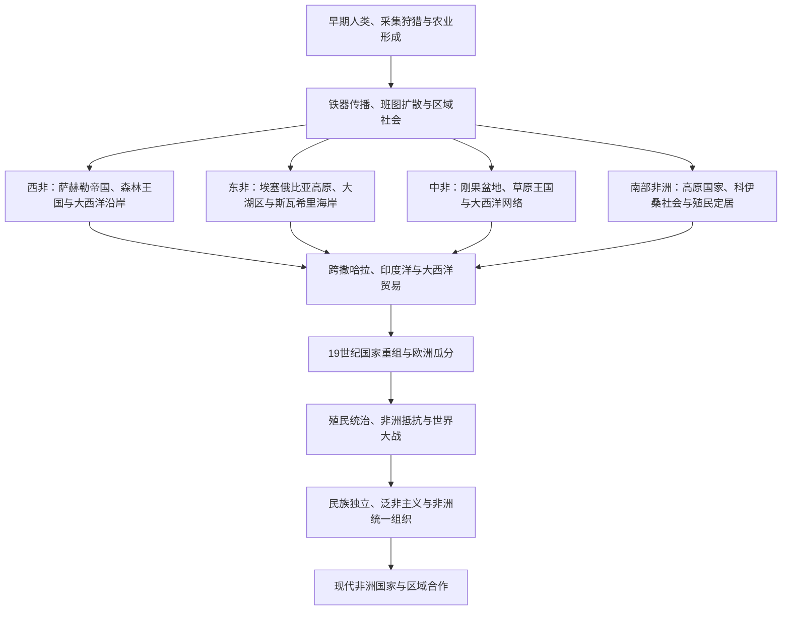

# 撒哈拉以南非洲历史

非洲历史不能只从欧洲殖民或现代国界开始理解。撒哈拉以南地区既是早期人类演化的重要空间，也是农业、牧业、冶铁、城市和国家独立发展的大陆；撒哈拉、红海、印度洋和大西洋从来不是绝对隔离带，而是贸易、宗教、人口迁徙与战争的通道。

本目录依照仓库既有边界，重点整理撒哈拉以南非洲。埃及、马格里布和苏丹北部的主线放在[西亚](/%E4%BA%BA%E6%96%87%E7%A7%91%E5%AD%A6/%E5%8E%86%E5%8F%B2/%E8%A5%BF%E4%BA%9A/README.md)与[北非](/%E4%BA%BA%E6%96%87%E7%A7%91%E5%AD%A6/%E5%8E%86%E5%8F%B2/%E5%8C%97%E9%9D%9E/README.md)，但涉及萨赫勒、尼罗河上游、红海和跨撒哈拉联系时互相链接。

## 阅读框架

| 层次 | 核心问题 |
|---|---|
| 环境与人口 | 沙漠、草原、雨林、高原、河流和海岸如何影响迁徙与生产方式？ |
| 国家与社会 | 城邦、宗族、酋邦、王国和帝国如何组织税贡、军队、土地与宗教？ |
| 贸易与宗教 | 黄金、盐、象牙、铜、奴隶和农产品如何连接撒哈拉、红海、印度洋与大西洋？ |
| 殖民与抵抗 | 欧洲边界、劳役、土地制度和商品经济如何改变既有政治社会？ |
| 独立与建国 | 殖民疆界如何转化为民族国家，军队、政党与地区组织如何塑造政治？ |

## 分区入口

| 分区 | 入口 | 历史主线 |
|---|---|---|
| 西非 | [西非历史](/%E4%BA%BA%E6%96%87%E7%A7%91%E5%AD%A6/%E5%8E%86%E5%8F%B2/%E9%9D%9E%E6%B4%B2/%E8%A5%BF%E9%9D%9E/README.md) | 萨赫勒帝国、尼日尔河城市、森林王国、伊斯兰改革与大西洋贸易 |
| 东非 | [东非历史](/%E4%BA%BA%E6%96%87%E7%A7%91%E5%AD%A6/%E5%8E%86%E5%8F%B2/%E9%9D%9E%E6%B4%B2/%E4%B8%9C%E9%9D%9E/README.md) | 阿克苏姆与埃塞俄比亚、非洲之角、大湖王国、斯瓦希里与印度洋 |
| 中非 | [中非历史](/%E4%BA%BA%E6%96%87%E7%A7%91%E5%AD%A6/%E5%8E%86%E5%8F%B2/%E9%9D%9E%E6%B4%B2/%E4%B8%AD%E9%9D%9E/README.md) | 刚果王国、卢巴—隆达体系、雨林与草原网络、殖民资源经济 |
| 南部非洲 | [南部非洲历史](/%E4%BA%BA%E6%96%87%E7%A7%91%E5%AD%A6/%E5%8E%86%E5%8F%B2/%E9%9D%9E%E6%B4%B2/%E5%8D%97%E9%83%A8%E9%9D%9E%E6%B4%B2/README.md) | 大津巴布韦、祖鲁与索托国家、葡英殖民、布尔移民和反种族隔离 |

## 通史入口

[非洲通史](/%E4%BA%BA%E6%96%87%E7%A7%91%E5%AD%A6/%E5%8E%86%E5%8F%B2/%E9%9D%9E%E6%B4%B2/_%E9%80%9A%E5%8F%B2/README.md)集中整理跨越分区和现代国家边界的人口迁徙、贸易、殖民、独立与泛非主义专题。

## 跨区域专题

- [人类起源、农业与班图扩散](/%E4%BA%BA%E6%96%87%E7%A7%91%E5%AD%A6/%E5%8E%86%E5%8F%B2/%E9%9D%9E%E6%B4%B2/_%E9%80%9A%E5%8F%B2/%E4%BA%BA%E7%B1%BB%E8%B5%B7%E6%BA%90%E3%80%81%E5%86%9C%E4%B8%9A%E4%B8%8E%E7%8F%AD%E5%9B%BE%E6%89%A9%E6%95%A3.md)
- [非洲贸易网络与奴隶贸易](/%E4%BA%BA%E6%96%87%E7%A7%91%E5%AD%A6/%E5%8E%86%E5%8F%B2/%E9%9D%9E%E6%B4%B2/_%E9%80%9A%E5%8F%B2/%E9%9D%9E%E6%B4%B2%E8%B4%B8%E6%98%93%E7%BD%91%E7%BB%9C%E4%B8%8E%E5%A5%B4%E9%9A%B6%E8%B4%B8%E6%98%93.md)
- [瓜分非洲、殖民统治与民族独立](/%E4%BA%BA%E6%96%87%E7%A7%91%E5%AD%A6/%E5%8E%86%E5%8F%B2/%E9%9D%9E%E6%B4%B2/_%E9%80%9A%E5%8F%B2/%E7%93%9C%E5%88%86%E9%9D%9E%E6%B4%B2%E3%80%81%E6%AE%96%E6%B0%91%E7%BB%9F%E6%B2%BB%E4%B8%8E%E6%B0%91%E6%97%8F%E7%8B%AC%E7%AB%8B.md)
- [泛非主义、非洲统一组织与现代国家](/%E4%BA%BA%E6%96%87%E7%A7%91%E5%AD%A6/%E5%8E%86%E5%8F%B2/%E9%9D%9E%E6%B4%B2/_%E9%80%9A%E5%8F%B2/%E6%B3%9B%E9%9D%9E%E4%B8%BB%E4%B9%89%E3%80%81%E9%9D%9E%E6%B4%B2%E7%BB%9F%E4%B8%80%E7%BB%84%E7%BB%87%E4%B8%8E%E7%8E%B0%E4%BB%A3%E5%9B%BD%E5%AE%B6.md)

## 关键时间节点

| 时间 | 事件或过程 | 意义 |
|---|---|---|
| 约30万年前起 | 早期智人在非洲出现并扩散 | 非洲是人类演化史的核心空间 |
| 前1千纪—公元1千纪 | 农业、牧业与冶铁多中心发展 | 生产方式和人口分布发生长期变化 |
| 公元初期—约1500年 | 班图语族扩散延续 | 中、东、南部非洲语言与农业社会重组 |
| 7世纪以后 | 伊斯兰与跨撒哈拉、红海贸易扩大 | 西非萨赫勒、东非海岸形成新政治文化网络 |
| 15—19世纪 | 大西洋奴隶贸易 | 造成强迫迁徙、战争和人口社会破坏，也形成非洲侨民世界 |
| 1880年代—1914年 | 欧洲瓜分非洲 | 除埃塞俄比亚、利比里亚外，大陆几乎被殖民政权分割 |
| 1957—1970年代 | 独立浪潮 | 殖民帝国瓦解，多数现代非洲国家成立 |
| 1963年 | 非洲统一组织成立 | 泛非国家合作制度化 |
| 1994年 | 南非首次不分种族全国选举 | 制度化种族隔离终结的重要标志 |
| 2002年 | 非洲联盟成立 | 大陆组织从主权防卫转向更广泛合作与治理议题 |

## 辨析

- “部落”不能概括所有非洲政治。历史上存在城市、王国、帝国、宗族联盟、无中央社会和跨境商业共同体。
- 班图扩散是跨越数千年的语言、人口和技术传播，不是一次统一民族的征服。
- 欧洲列强并非“创造”非洲历史；殖民统治建立在既有国家、市场和冲突之上，又以强制边界和资源体系加以重组。
- 现代国界常切割旧有语言与政治网络，因此国家史必须与区域史并读。
