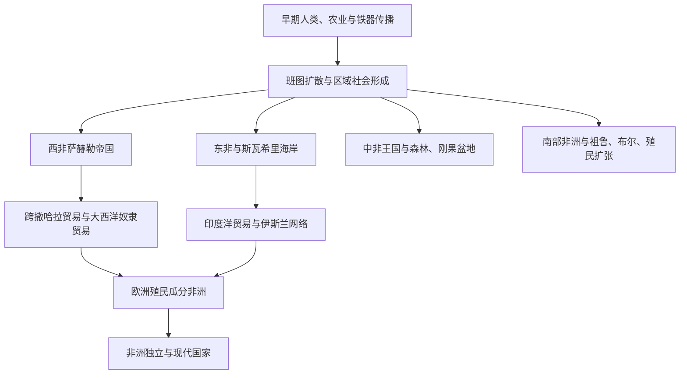

# 非洲历史

## 概括

本目录主要整理撒哈拉以南非洲历史；北非古代与伊斯兰世界主线仍放在[西亚与北非](/%E4%BA%BA%E6%96%87%E7%A7%91%E5%AD%A6/%E5%8E%86%E5%8F%B2/%E8%A5%BF%E4%BA%9A%E4%B8%8E%E5%8C%97%E9%9D%9E/README.md)。撒哈拉以南非洲可按西非、东非、中非、南部非洲四个方向组织，核心主题包括萨赫勒帝国、班图扩散、斯瓦希里海岸、埃塞俄比亚传统、刚果王国、奴隶贸易、殖民瓜分、民族独立和现代国家。

## 演变图

## 区域入口

| 区域 | 入口 | 主线提示 |
|---|---|---|
| 西非 | [西非](/%E4%BA%BA%E6%96%87%E7%A7%91%E5%AD%A6/%E5%8E%86%E5%8F%B2/%E9%9D%9E%E6%B4%B2/%E8%A5%BF%E9%9D%9E/README.md) | 加纳帝国、马里帝国、桑海帝国、豪萨城邦、奴隶贸易与殖民。 |
| 东非 | [东非](/%E4%BA%BA%E6%96%87%E7%A7%91%E5%AD%A6/%E5%8E%86%E5%8F%B2/%E9%9D%9E%E6%B4%B2/%E4%B8%9C%E9%9D%9E/README.md) | 阿克苏姆、埃塞俄比亚、斯瓦希里城邦、印度洋贸易。 |
| 中非 | [中非](/%E4%BA%BA%E6%96%87%E7%A7%91%E5%AD%A6/%E5%8E%86%E5%8F%B2/%E9%9D%9E%E6%B4%B2/%E4%B8%AD%E9%9D%9E/README.md) | 刚果盆地、刚果王国、卢巴、隆达和殖民重组。 |
| 南部非洲 | [南部非洲](/%E4%BA%BA%E6%96%87%E7%A7%91%E5%AD%A6/%E5%8E%86%E5%8F%B2/%E9%9D%9E%E6%B4%B2/%E5%8D%97%E9%83%A8%E9%9D%9E%E6%B4%B2/README.md) | 大津巴布韦、祖鲁、布尔人、南非殖民与种族隔离。 |

## 相关区域

- 北非与埃及、迦太基、阿拉伯帝国主线参见[西亚与北非](/%E4%BA%BA%E6%96%87%E7%A7%91%E5%AD%A6/%E5%8E%86%E5%8F%B2/%E8%A5%BF%E4%BA%9A%E4%B8%8E%E5%8C%97%E9%9D%9E/README.md)。
- 欧洲殖民扩张参见[欧洲历史](/%E4%BA%BA%E6%96%87%E7%A7%91%E5%AD%A6/%E5%8E%86%E5%8F%B2/%E6%AC%A7%E6%B4%B2/README.md)。
- 大西洋奴隶贸易与美洲殖民参见[美洲历史](/%E4%BA%BA%E6%96%87%E7%A7%91%E5%AD%A6/%E5%8E%86%E5%8F%B2/%E7%BE%8E%E6%B4%B2/README.md)。
