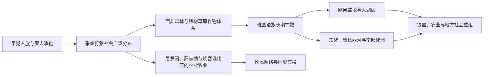

# 人类起源、农业与班图扩散

## 时间

史前时期—约公元1500年

## 概括

非洲保存了从早期人族到智人的重要化石与考古记录。现代人类约30万年前已在非洲出现，随后多次迁徙并在大陆内外扩散。全新世气候变化、撒哈拉湿润期与干旱化，推动采集狩猎者、牧民和农民不断调整分布。

## 主要过程

| 过程 | 大致时间 | 说明 |
|---|---|---|
| 智人形成 | 约30万年前起 | 化石与遗传研究显示过程发生于非洲多个相互联系的人群 |
| 撒哈拉湿润期 | 约前1万纪—前3千纪 | 湖泊、草原和岩画反映人口进入今日沙漠地区 |
| 萨赫勒作物驯化 | 前3千纪以后 | 珍珠粟、高粱、非洲稻等在不同地区发展 |
| 埃塞俄比亚高原农业 | 古代以来 | 苔麸、咖啡等作物与高原耕作形成独特体系 |
| 班图语族扩散 | 约前2千纪—公元1千纪后 | 从西中非方向逐步进入中、东和南部非洲，过程包含迁徙、通婚、语言转移和技术交换 |
| 马达加斯加定居 | 公元1千纪 | 南岛语族航海者与东非人群共同塑造岛上社会 |

## 分阶段过程

### 人类演化与大陆内流动

早期人族和智人的形成不是从一个固定“摇篮点”向外直线扩散。北非、东非与南部非洲等地的化石、石器和遗传证据显示，不同人群长期分离又反复交流。约30万年前已经出现具现代智人特征的人群；此后气候周期让草原、湖泊、森林和沙漠边界移动，人口也随水源、猎物与植物资源重新组合。

约前1万纪开始的非洲湿润期使今日撒哈拉出现湖泊、牧草和渔猎聚落。前4—3千纪以后逐步干旱，部分牧民、农民与渔民向尼罗河、萨赫勒和西非湖盆迁移。环境变化提供压力与机会，却不自动决定国家或语言替换。

### 多中心农业与牧业

- 尼罗河谷的谷物、牛羊体系与西亚作物交流密切，却发展出本地洪泛耕作和国家组织。
- 萨赫勒分别驯化或发展珍珠粟、高粱、非洲稻等，农业沿降雨带而非现代国界传播。
- 西非森林区的山药、油棕等与草原作物互补，支持森林边缘的聚落和市场。
- 埃塞俄比亚高原形成苔麸、画眉草类作物、咖啡和高地畜牧组合。
- 东非与南部非洲的牛羊牧业既有东北非联系，也经本地社会选择、交换和适应扩散。

采用农业不是一次“进步革命”。许多社群在农耕、牧业、捕鱼和采集之间季节切换；疾病环境、土壤和降雨使某些地方长期更适合混合生计。

### 班图语族长期扩散

语言比较把班图语族较早核心置于今喀麦隆—尼日利亚边界附近，但具体路线和年代仍会随考古、语言和遗传研究调整。约前2千纪起，使用相关语言的群体逐步进入刚果盆地；一部分沿森林河网和边缘草原移动，一部分经大湖区向东、向南扩散。到公元第一千纪后期，班图语言已广布中部、东部和南部非洲。

扩散并非单一“民族大迁徙”。小规模移民、婚姻、收养、贸易、技术学习与语言转移可在不同地区产生同样的语言结果。铁器、香蕉类作物、牛牧和聚落形式也不必由同一批人同时携带；班图语使用者会吸收本地采集狩猎者与牧民，本地群体也可能保留遗传、词汇和生态知识。

## 跨区域比较矩阵

| 区域 | 主要生产与环境线索 | 人口／语言过程 | 后续历史连接 |
|---|---|---|---|
| 尼罗河与东北非 | 洪泛农业、高地耕作、牛羊牧业 | 非洲语言与西亚联系长期交错 | 埃及、努比亚、阿克苏姆及红海网络 |
| 萨赫勒与西非草原 | 粟、高粱、非洲稻与季节牧业 | 干湿周期推动南北移动和城镇化 | 跨撒哈拉商路与萨赫勒国家 |
| 西非森林 | 山药、油棕、森林—草原交换 | 尼日尔—刚果语群多支并行 | 森林王国、铁器与大西洋贸易 |
| 刚果盆地 | 河网、森林农业、捕鱼与冶铁 | 班图语言扩散中伴随广泛融合 | 刚果、卢巴、库巴等多中心国家 |
| 大湖与东非 | 湖区农业、牧牛、香蕉与铁器 | 班图、尼罗特和库希特语群互动 | 大湖王国、斯瓦希里内陆联系 |
| 南部非洲 | 混合农牧、金铜资源与干旱带采集 | 班图语群与科伊桑诸群体接触 | 马蓬古布韦、大津巴布韦及后续国家 |
| 马达加斯加 | 稻作、畜牧和岛屿生态 | 南岛语与东非人口、语言融合 | 印度洋航海与岛内国家形成 |

## 因果与证据边界

- **长期驱动：** 气候、水源、疾病带、作物组合和交通地形改变人口移动成本。
- **社会机制：** 通婚、贸易、收养和政治吸纳与战争同样能推动语言和技术传播。
- **直接转折：** 撒哈拉干旱化、铁器普及或新作物引入会加快既有变化，但不构成全大陆统一时间表。
- **证据限制：** 陶器样式不必等于单一族群，现代语言分布也不能直接倒推数千年前固定民族边界；年代应由考古、语言学和遗传材料交叉判断。

## 关键辨析

- 农业并非从单一中心一次传入；萨赫勒、西非森林、埃塞俄比亚高原和尼罗河流域各有不同作物与驯化传统。
- 冶铁时间和传播路线仍有争议，不能把所有铁器技术都归于同一外来源。
- 班图语族是语言学分类，不等于单一“种族”。扩散路径中存在融合、替换和地方连续性。
- 科伊桑语系并非严格单一语系；“科伊桑”更多是对南部非洲若干非班图语言与人群的集合称呼。

## 影响

班图语族扩散使农业、冶铁与新的聚落形式广泛进入中南部非洲，但采集狩猎、牧业和混合生计持续存在。后来的刚果、卢巴、大湖王国、大津巴布韦和南部非洲国家，都建立在这些长期人口与生态变化之上。
