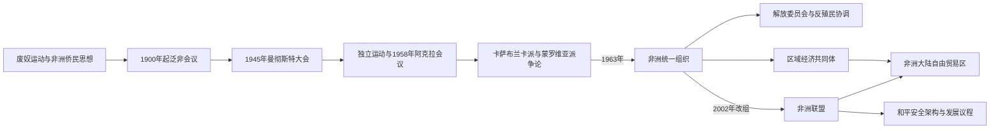

# 泛非主义、非洲统一组织与现代国家

## 时间

19世纪末至今

## 概括

泛非主义由非洲大陆和侨民知识分子、工会与反殖民活动家共同发展，强调非洲人及其后裔的共同解放。独立后，各国在立即政治联合与维护新国家主权之间产生分歧，1963年成立的非洲统一组织最终以主权平等、反殖民和尊重既有边界为基础。

## 思想与制度演进图

## 思想来源与关键转折

泛非主义既来自杜波依斯、乔治·帕德莫尔等侨民思想家，也来自非洲大陆的工会、学生、报刊、宗教组织和民族主义者。它不是单一政党纲领：有人强调全球黑人团结，有人主张非洲合众国，有人优先争取殖民地民族国家独立。

| 时间 | 转折 | 实质影响 |
|---|---|---|
| 1900年 | 伦敦泛非会议 | 把殖民统治、种族主义和全球黑人权利置于共同议程 |
| 1919—1927年 | 多届泛非大会 | 战后民族自决话语与殖民改革要求结合 |
| 1945年 | 曼彻斯特大会 | 工人、学生和未来非洲领导人推动群众性反殖民路线 |
| 1957—1958年 | 加纳独立、阿克拉会议 | 独立国家开始直接支持尚未解放地区 |
| 1960—1963年 | 卡萨布兰卡派与蒙罗维亚派争论 | 超国家联合与主权合作两种路径竞争 |
| 1963年 | 非洲统一组织成立 | 以主权平等、边界原则和反殖民合作达成最低共同制度 |
| 1991年 | 《阿布贾条约》 | 提出分阶段建立非洲经济共同体 |
| 2002年 | 非洲联盟成立 | 从不干涉原则转向在严重危机下讨论“不漠视”与集体行动 |
| 2018年以后 | 大陆自由贸易区推进 | 经济一体化由长期目标进入制度实施阶段 |

## 组织演变

| 阶段 | 时间 | 核心内容 |
|---|---|---|
| 早期泛非会议 | 1900—1945年 | 侨民领袖与殖民地知识分子反对种族主义和殖民统治 |
| 独立运动与国家会议 | 1945—1963年 | 恩克鲁玛等推动大陆联合，独立国家协调反殖民外交 |
| 非洲统一组织 | 1963—2002年 | 支持解放运动、维护主权与边界，调解国家间争端 |
| 非洲联盟 | 2002年至今 | 扩展至和平安全、经济一体化、治理和大陆发展议程 |

## 组织与区域机制比较

| 层级 | 核心职责 | 优势 | 主要限制 |
|---|---|---|---|
| 非洲统一组织（1963—2002年） | 反殖民、主权与边界、国家间调解 | 为解放运动提供外交平台，降低边界重划风险 | 不干涉原则限制处理成员国内部暴力 |
| 非洲联盟（2002年至今） | 和平安全、治理、发展与一体化 | 有和平安全理事会、委员会和大陆议程 | 财政、兵力和制裁执行依赖成员国 |
| 西非国家经济共同体 | 西非贸易、人员流动与安全 | 有较强的危机外交和部分军事干预经验 | 成员政变、退出争议和经济差异削弱一致性 |
| 东非共同体 | 关税、共同市场和政治合作 | 跨境贸易与基础设施整合较深 | 扩员后安全冲突和制度能力差异扩大 |
| 南部非洲发展共同体 | 发展协调、安全和区域市场 | 解放历史与电力、交通合作基础强 | 对成员内部危机常倾向协商，执行速度不一 |
| 中部非洲国家经济共同体 | 中非合作与安全 | 提供跨境危机协调平台 | 国家能力弱、重叠成员身份和冲突频繁 |
| 非洲大陆自由贸易区 | 降低关税、统一原产地与扩大大陆市场 | 可减少殖民出口通道造成的市场碎片化 | 基础设施、非关税壁垒和产业差异决定实际收益 |

## 主权、边界与干预的张力

- 非洲统一组织接受独立时既有边界，不是认定殖民边界“公正”，而是担心全面重划引发更大规模战争。厄立特里亚、南苏丹等后来独立通过特定战争与协议产生，不构成任意重划的通例。
- 早期“不干涉”保护新国家免受邻国颠覆，也使组织难以处理大规模国内暴力。非洲联盟制宪文件引入对战争罪、种族灭绝和反人类罪“不漠视”的原则，但授权、资金和政治共识仍是门槛。
- 军事政变后的暂停成员资格、调停与制裁形成规范，却在萨赫勒等地面临安全、民意和成员退出挑战。组织原则与执行结果必须分开评估。
- 区域共同体不是非洲联盟的简单下级：它们有各自条约、法院、军队安排和经济利益，与大陆机构既分工又重叠。

## 现代国家的共同课题

- 殖民边界与多语言社会要求在地方自治、中央集权和公民身份间寻找平衡。
- 一党制和军人政变常以国家统一、发展或安全为理由出现，但各国路径差异很大。
- 冷战援助与代理冲突影响安哥拉、刚果、埃塞俄比亚、莫桑比克和非洲之角等地。
- 区域组织如西非国家经济共同体、东非共同体和南部非洲发展共同体，兼具经济与安全功能。
- 债务、商品价格、结构调整、城市化与青年人口持续改变国家能力和社会政治。
- 民主选举扩大并不自动消除威权、腐败、政变或战争；同样，非洲政治也不能被单一“失败国家”叙事概括。

## 现代国家形成的比较矩阵

| 课题 | 形成机制 | 地区差异 | 判断要点 |
|---|---|---|---|
| 边界与公民身份 | 殖民行政区转为主权国家 | 联邦、王国、游牧区和跨境族群情况不同 | 边界本身不自动导致冲突，公民权和地方制度更关键 |
| 一党制 | 建国整合、安全与发展主义 | 有的由群众党转成优势党，有的靠军队建立 | 需区分合法化理由、实际组织和退出机制 |
| 军人政变 | 军队掌国家资源、文官危机或外部战争 | 西非、萨赫勒、中非频率与南部非洲不同 | 直接触发与军队制度、经济危机共同分析 |
| 联邦与地方自治 | 处理语言、岛屿、王国和地区差异 | 尼日利亚、埃塞俄比亚、喀麦隆等路径差异显著 | 单一制不必然稳定，联邦也不自动化解冲突 |
| 资源国家 | 石油、铜、钻石等形成集中财政 | 人口规模、合资制度和问责改变结果 | 资源不是宿命，产权、税制和公共投资是中介 |
| 民主与法院 | 选举、议会、司法和社会运动互动 | 轮替、优势党和君主制并存 | 举行选举不等于完整问责，也不能忽略真实制度改进 |
| 区域安全 | 难民、武装、干旱和贸易跨境 | 萨赫勒、大湖、非洲之角和南部战场各异 | 国内冲突与邻国、国际伙伴共同构成安全体系 |

截至2026年7月，非洲联盟和各区域组织同时面对政变后的制度秩序、苏丹及刚果东部等战争、人道位移、债务与气候风险。现代页应记录已经实施的决定，不把尚未完成的停火、选举或一体化目标写成既成事实。

## 历史意义

非洲统一组织支持剩余殖民地和反种族隔离斗争，并把殖民边界原则化，以减少领土战争。非洲联盟在此基础上允许更积极讨论严重危机、和平行动和大陆市场，但执行仍取决于成员国意愿与资源。
