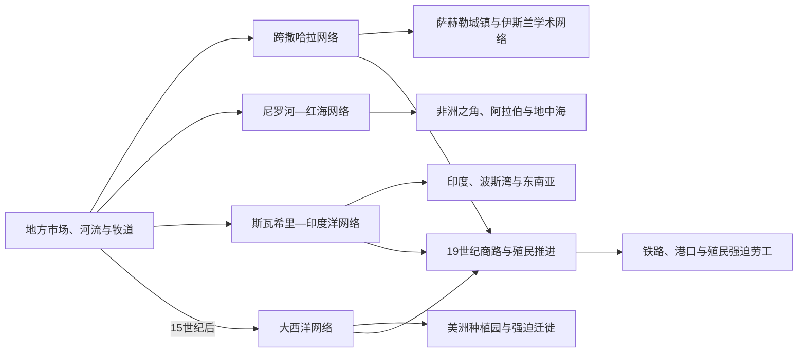

# 非洲贸易网络与奴隶贸易

## 概括

非洲贸易史由多条相互连接的陆海路线组成。跨撒哈拉贸易连接萨赫勒与马格里布，红海和印度洋贸易连接非洲之角、斯瓦希里海岸、阿拉伯、波斯、印度和东南亚，大西洋贸易则在15世纪后急剧扩大。贸易推动城市、国家和宗教网络，也伴随战争、强迫劳动与奴隶制度。

## 网络演进图

## 分阶段过程

### 区域交换先于跨洲航线

盐、鱼、粮食、牛、铁器、铜、拉菲亚布和陶器在村落、周期市场、王廷与牧道之间流通，构成跨洲贸易的基层。大国家可以征收关税、保护道路和控制矿区，但商人侨居社群、船主、驮运者、妇女市场和地方中介同样维持网络。

骆驼在古代晚期扩大撒哈拉运输能力后，盐、黄金和人口把马格里布与萨赫勒连接。伊斯兰传播带来信用、书信和共同法律语汇，却没有消除本地宗教或让所有贸易由北非人垄断。红海与印度洋季风航行则使阿克苏姆、非洲之角和斯瓦希里港口与阿拉伯、波斯、印度相连。

### 大西洋体系的规模跃迁

葡萄牙15世纪绕过撒哈拉抵达西非和刚果后，海上黄金与奴隶贸易扩大。16世纪起美洲糖、烟草、矿山和后来的棉花种植园形成持续劳动力需求，欧洲船运资本、保险、信贷、枪支和商品输入与非洲战争、司法奴役、债务及绑架结合。

俘虏从内陆被押往海岸、关入堡垒并经历“大西洋中间航程”。死亡发生在袭击、长途行军、囚禁、航海和种植园“适应期”多个阶段。西中非、贝宁湾、黄金海岸、塞内冈比亚和东南非在不同时期成为主要来源区，不能把整个大陆描述为同等受害。

### 废奴、合法贸易与劳工延续

英国1807年禁绝本国奴隶贸易后，海军拦截、各国条约、非洲政治变化和美洲废奴逐步压缩大西洋航运，但非法贸易延续数十年。棕榈油、花生、橡胶、可可、丁香和象牙等“合法贸易”扩大，生产仍可能依靠奴隶、债役或强迫劳动。

殖民征服把旧商路改造成出口走廊，以人头税、土地剥夺、合同、刑罚和强制种植迫使劳工进入矿山、铁路和庄园。因此，法律废奴与劳动自由必须分开判断。

## 贸易网络

| 网络 | 主要时期 | 代表商品与节点 |
|---|---|---|
| 跨撒哈拉 | 古代晚期—19世纪 | 黄金、盐、奴隶、马匹、纺织品；奥达戈斯特、廷巴克图、加奥、豪萨城市 |
| 尼罗河与红海 | 古代以来 | 金、象牙、牲畜、香料与朝圣交通；努比亚、阿克苏姆、马萨瓦、泽拉 |
| 印度洋 | 公元初期以来 | 象牙、黄金、奴隶、陶瓷、棉布与香料；摩加迪沙、蒙巴萨、基尔瓦、桑给巴尔 |
| 大西洋 | 15—19世纪 | 黄金、奴隶、棕榈油、橡胶、枪支和纺织品；塞内冈比亚、黄金海岸、贝宁湾、刚果—安哥拉 |
| 非洲内陆 | 始终存在 | 盐、铁、铜、牛、布匹和粮食；连接市场、朝廷与边疆社会 |

## 跨网络比较矩阵

| 网络 | 主要组织者 | 代表流向 | 强制与权力问题 | 长期影响 |
|---|---|---|---|---|
| 地方与河网 | 村落商人、王廷、船夫、牧民、市场妇女 | 近距离粮食、盐、铁、鱼、布与牛 | 税、贡赋与地方战争并存 | 支撑城镇、王权和跨生态互赖 |
| 跨撒哈拉 | 萨赫勒商人、柏柏尔商队、绿洲与苏丹 | 黄金、盐、纺织品、马匹和人口 | 奴役、护路费和国家垄断因时地不同 | 伊斯兰学术、城市和地中海联系 |
| 尼罗河—红海 | 努比亚、埃塞俄比亚、阿拉伯及港口商人 | 金、象牙、牲畜、香料和人口 | 边境掠夺、贡赋与长期奴隶贸易 | 朝圣、宗教和非洲之角国家网络 |
| 印度洋 | 斯瓦希里、阿拉伯、南亚与岛屿商人 | 黄金、象牙、奴隶、陶瓷、布和丁香 | 港口精英、内陆商队与种植园强制 | 斯瓦希里城市、侨民和马达加斯加联系 |
| 大西洋 | 欧洲船商、美洲种植园、非洲统治者和中介 | 被奴役人口西运，枪支、布、酒等输入 | 规模、死亡率和种植园世袭奴役空前 | 人口损失、战争重组与庞大非洲侨民 |
| 殖民出口走廊 | 殖民国家、公司、矿山和庄园 | 矿产、橡胶、棕榈油、可可、棉花 | 税收、征工、合同限制和土地剥夺 | 港口铁路格局、移工体系与地区不均 |

## 奴隶贸易

- 奴役制度在多地早于欧洲远洋贸易，但身份、继承和获释方式因社会而异。
- 跨撒哈拉、红海和印度洋奴隶贸易延续时间很长，受害者被运往北非、中东、印度洋岛屿和亚洲部分地区。
- 约16—19世纪大西洋贸易把超过千万非洲人强制运往美洲，西中非和西非沿岸受影响最深。
- 非洲统治者和商人有参与者、抵抗者与受害者，欧洲海运资本、种植园需求和枪械贸易则把规模推向前所未有的程度。
- 奴隶贸易造成死亡、人口迁移、战争和政治重组；废奴后，强制劳役、债役和殖民劳工制度仍长期延续。

## 过程、转折与影响

| 时段 | 实质转折 | 结果 |
|---|---|---|
| 古代晚期—中世纪 | 骆驼商队和伊斯兰商业法扩展 | 撒哈拉不再只是屏障，萨赫勒城市和国家更深接入北非 |
| 公元第一千纪后期 | 季风航行与斯瓦希里城市繁荣 | 东非港口连接内陆黄金象牙与印度洋商品 |
| 15—16世纪 | 欧洲船队进入大西洋和印度洋海岸 | 海上火力与美洲需求重构沿海竞争 |
| 17—18世纪 | 大西洋种植园体系达到高峰 | 强迫迁徙、战争融资和侨民社会规模跃升 |
| 19世纪 | 禁奴巡航与商品贸易并行 | 远洋奴隶贸易衰退，但内陆奴役和强迫劳动未同步终止 |
| 19世纪末—20世纪 | 殖民铁路、港口和矿山形成 | 贸易方向更集中于宗主国和世界商品市场 |
| 20世纪后期以来 | 独立、区域一体化与全球供应链 | 旧出口通道延续，同时出现大陆市场与加工政策诉求 |

- **国家兴起条件：** 控制矿产、关口和商队可提供财政与马匹、火器，却也使继承竞争围绕外贸收益军事化。
- **衰落条件：** 商路转移、外来海军或邻国绕开中介，会削弱依赖单一节点的王权；但贸易变化通常与内部政治共同作用。
- **人口与社会：** 数量统计只覆盖被装船或记录者，无法完整计算内陆死亡、逃亡和未出海奴役。侨民文化也不是被动保存，而是在美洲、加勒比和印度洋重新创造。
- **分析底线：** 承认部分非洲统治者参与奴隶贸易，不等于抹平欧洲种植园需求、海运资本和殖民武力造成的权力不对称；同样，不能把所有非洲国家都写成奴隶贸易产物。

## 大西洋之后

19世纪欧洲商业转向棕榈油、花生、橡胶、可可等“合法贸易”，并没有自动终结暴力。商贸路线和债务关系常成为殖民征服的先导。非洲侨民则在美洲、加勒比、欧洲和印度洋形成新的文化、宗教与政治共同体。
