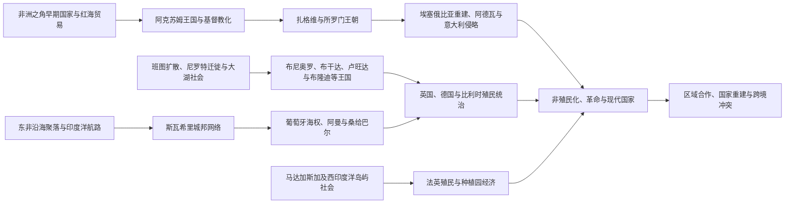

# 东非历史

东非并非一条单线历史，而是由非洲之角、斯瓦希里海岸、尼罗河上游—大湖区以及西印度洋岛屿四个相互连接的历史空间构成。红海与印度洋贸易、内陆农业和牧业国家、伊斯兰与基督教传统、十九世纪帝国扩张、殖民边界以及独立后的区域冲突，共同塑造了这一地区。

## 历史主线

东非古代发展的两个外向节点是红海高原与印度洋海岸。阿克苏姆依靠高原农业、红海港口和跨区域贸易成长为古代强国，并在四世纪接受基督教；斯瓦希里城镇则以非洲本地社会为基础，利用季风航行把内陆的黄金、象牙等商品接入阿拉伯、波斯和印度洋网络。内陆大湖区在长期人口流动、农业扩展与政治整合中形成多种王国，其权力结构不能简化为后世殖民者固化的族群分类。

十九世纪以后，埃塞俄比亚中央集权、桑给巴尔商贸帝国和大湖王国均面对欧洲扩张。殖民统治把海岸、内陆与岛屿划入不同帝国体系，重塑土地制度、劳工流动、族群身份和行政边界。二十世纪的独立并未自动消除这些结构遗产；联邦破裂、革命、军事政权、边界战争、国家崩溃与区域合作此后并行发展。

## 区域专题导航

| 顺序 | 专题 | 大致时段 | 简要概括 |
|---|---|---|---|
| 1 | [阿克苏姆、埃塞俄比亚与非洲之角](/%E4%BA%BA%E6%96%87%E7%A7%91%E5%AD%A6/%E5%8E%86%E5%8F%B2/%E9%9D%9E%E6%B4%B2/%E4%B8%9C%E9%9D%9E/%E9%98%BF%E5%85%8B%E8%8B%8F%E5%A7%86%E3%80%81%E5%9F%83%E5%A1%9E%E4%BF%84%E6%AF%94%E4%BA%9A%E4%B8%8E%E9%9D%9E%E6%B4%B2%E4%B9%8B%E8%A7%92.md) | 公元前一千纪—2026年 | 从早期高原国家、阿克苏姆与埃塞俄比亚王朝，到索马里诸苏丹国、殖民瓜分及现代非洲之角冲突 |
| 2 | [斯瓦希里海岸与印度洋世界](/%E4%BA%BA%E6%96%87%E7%A7%91%E5%AD%A6/%E5%8E%86%E5%8F%B2/%E9%9D%9E%E6%B4%B2/%E4%B8%9C%E9%9D%9E/%E6%96%AF%E7%93%A6%E5%B8%8C%E9%87%8C%E6%B5%B7%E5%B2%B8%E4%B8%8E%E5%8D%B0%E5%BA%A6%E6%B4%8B%E4%B8%96%E7%95%8C.md) | 约公元一千纪初—2026年 | 说明斯瓦希里社会的非洲根基、城邦贸易、葡萄牙与阿曼竞争、桑给巴尔种植园及殖民—独立转型 |
| 3 | [大湖王国、殖民统治与独立](/%E4%BA%BA%E6%96%87%E7%A7%91%E5%AD%A6/%E5%8E%86%E5%8F%B2/%E9%9D%9E%E6%B4%B2/%E4%B8%9C%E9%9D%9E/%E5%A4%A7%E6%B9%96%E7%8E%8B%E5%9B%BD%E3%80%81%E6%AE%96%E6%B0%91%E7%BB%9F%E6%B2%BB%E4%B8%8E%E7%8B%AC%E7%AB%8B.md) | 约公元一千纪—2026年 | 追踪布尼奥罗、布干达、卢旺达、布隆迪等政治体，以及殖民身份工程、独立危机和大湖跨境战争 |

## 重要转折与时间节点

| 时间 | 转折 | 历史意义 |
|---|---|---|
| 约1—7世纪 | 阿克苏姆兴盛并接受基督教 | 将埃塞俄比亚高原纳入红海贸易和晚期古代基督教世界 |
| 约9—15世纪 | 斯瓦希里城邦网络繁荣 | 海岸城镇把东非内陆资源接入季风驱动的印度洋商业体系 |
| 1270年 | 所罗门王朝建立 | 以王朝谱系和宗教正统重组埃塞俄比亚政治秩序 |
| 16世纪前半叶 | 阿达尔—埃塞俄比亚战争与葡萄牙介入 | 火器、红海竞争与宗教动员重塑非洲之角力量格局 |
| 1698年 | 阿曼攻取蒙巴萨耶稣堡 | 葡萄牙在北段斯瓦希里海岸的优势被阿曼势力取代 |
| 19世纪 | 大湖王国强化、桑给巴尔扩张与埃塞俄比亚再统一 | 本地国家重组与全球商业、欧洲扩张同时加速 |
| 1884—1885年后 | 欧洲列强瓜分东非 | 殖民边界、强制劳动、土地征收与间接统治塑造现代国家框架 |
| 1896年 | 阿德瓦战役 | 埃塞俄比亚击败意大利，维持主权并成为反殖民象征 |
| 1950—1960年代 | 多数东非国家进入非殖民化 | 独立国家继承殖民边界，同时面对联邦、土地和权力分配问题 |
| 1964年 | 坦噶尼喀与桑给巴尔联合 | 形成坦桑尼亚，同时保留桑给巴尔的特殊政治结构 |
| 1974年 | 埃塞俄比亚帝制终结 | 德尔格军政府、内战和地区民族主义进入新阶段 |
| 1991—1994年 | 埃塞俄比亚政权更替、索马里国家崩溃、卢旺达大屠杀 | 国家重建、难民流动和跨境武装网络成为地区核心问题 |
| 1993—2011年 | 厄立特里亚、南苏丹相继独立 | 殖民边界和内战产生两个新国家，但边界与权力争议延续 |
| 2020—2026年 | 提格雷战争后续、苏丹与大湖冲突外溢、索马里安全转型 | 和平协议、区域干预与持续武装冲突并存 |

## 国家入口

| 国家 | 入口 | 核心线索 |
|---|---|---|
| 埃塞俄比亚 | [埃塞俄比亚历史](/%E4%BA%BA%E6%96%87%E7%A7%91%E5%AD%A6/%E5%8E%86%E5%8F%B2/%E9%9D%9E%E6%B4%B2/%E4%B8%9C%E9%9D%9E/%E5%9F%83%E5%A1%9E%E4%BF%84%E6%AF%94%E4%BA%9A/README.md) | 阿克苏姆、所罗门王朝、阿德瓦与革命 |
| 厄立特里亚 | [厄立特里亚历史](/%E4%BA%BA%E6%96%87%E7%A7%91%E5%AD%A6/%E5%8E%86%E5%8F%B2/%E9%9D%9E%E6%B4%B2/%E4%B8%9C%E9%9D%9E/%E5%8E%84%E7%AB%8B%E7%89%B9%E9%87%8C%E4%BA%9A/README.md) | 红海港口、意大利殖民、联邦与独立战争 |
| 吉布提 | [吉布提历史](/%E4%BA%BA%E6%96%87%E7%A7%91%E5%AD%A6/%E5%8E%86%E5%8F%B2/%E9%9D%9E%E6%B4%B2/%E4%B8%9C%E9%9D%9E/%E5%90%89%E5%B8%83%E6%8F%90/README.md) | 阿法尔—伊萨社会、法国港口与红海战略 |
| 索马里 | [索马里历史](/%E4%BA%BA%E6%96%87%E7%A7%91%E5%AD%A6/%E5%8E%86%E5%8F%B2/%E9%9D%9E%E6%B4%B2/%E4%B8%9C%E9%9D%9E/%E7%B4%A2%E9%A9%AC%E9%87%8C/README.md) | 游牧社会、苏丹国、殖民分治与国家危机 |
| 南苏丹 | [南苏丹历史](/%E4%BA%BA%E6%96%87%E7%A7%91%E5%AD%A6/%E5%8E%86%E5%8F%B2/%E9%9D%9E%E6%B4%B2/%E4%B8%9C%E9%9D%9E/%E5%8D%97%E8%8B%8F%E4%B8%B9/README.md) | 尼罗河上游社会、英埃苏丹、内战与独立 |
| 乌干达 | [乌干达历史](/%E4%BA%BA%E6%96%87%E7%A7%91%E5%AD%A6/%E5%8E%86%E5%8F%B2/%E9%9D%9E%E6%B4%B2/%E4%B8%9C%E9%9D%9E/%E4%B9%8C%E5%B9%B2%E8%BE%BE/README.md) | 大湖王国、英国保护国与独立政治 |
| 肯尼亚 | [肯尼亚历史](/%E4%BA%BA%E6%96%87%E7%A7%91%E5%AD%A6/%E5%8E%86%E5%8F%B2/%E9%9D%9E%E6%B4%B2/%E4%B8%9C%E9%9D%9E/%E8%82%AF%E5%B0%BC%E4%BA%9A/README.md) | 斯瓦希里海岸、定居殖民、茅茅运动与共和国 |
| 坦桑尼亚 | [坦桑尼亚历史](/%E4%BA%BA%E6%96%87%E7%A7%91%E5%AD%A6/%E5%8E%86%E5%8F%B2/%E9%9D%9E%E6%B4%B2/%E4%B8%9C%E9%9D%9E/%E5%9D%A6%E6%A1%91%E5%B0%BC%E4%BA%9A/README.md) | 斯瓦希里贸易、德英殖民、坦噶尼喀—桑给巴尔联合 |
| 卢旺达 | [卢旺达历史](/%E4%BA%BA%E6%96%87%E7%A7%91%E5%AD%A6/%E5%8E%86%E5%8F%B2/%E9%9D%9E%E6%B4%B2/%E4%B8%9C%E9%9D%9E/%E5%8D%A2%E6%97%BA%E8%BE%BE/README.md) | 中央王国、殖民身份化、1994年大屠杀与重建 |
| 布隆迪 | [布隆迪历史](/%E4%BA%BA%E6%96%87%E7%A7%91%E5%AD%A6/%E5%8E%86%E5%8F%B2/%E9%9D%9E%E6%B4%B2/%E4%B8%9C%E9%9D%9E/%E5%B8%83%E9%9A%86%E8%BF%AA/README.md) | 王国、比利时托管、族群暴力与和平进程 |
| 马达加斯加 | [马达加斯加历史](/%E4%BA%BA%E6%96%87%E7%A7%91%E5%AD%A6/%E5%8E%86%E5%8F%B2/%E9%9D%9E%E6%B4%B2/%E4%B8%9C%E9%9D%9E/%E9%A9%AC%E8%BE%BE%E5%8A%A0%E6%96%AF%E5%8A%A0/README.md) | 南岛—非洲社会、梅里纳王国与法国殖民 |
| 科摩罗 | [科摩罗历史](/%E4%BA%BA%E6%96%87%E7%A7%91%E5%AD%A6/%E5%8E%86%E5%8F%B2/%E9%9D%9E%E6%B4%B2/%E4%B8%9C%E9%9D%9E/%E7%A7%91%E6%91%A9%E7%BD%97/README.md) | 斯瓦希里—伊斯兰岛屿、法国殖民与政变 |
| 毛里求斯 | [毛里求斯历史](/%E4%BA%BA%E6%96%87%E7%A7%91%E5%AD%A6/%E5%8E%86%E5%8F%B2/%E9%9D%9E%E6%B4%B2/%E4%B8%9C%E9%9D%9E/%E6%AF%9B%E9%87%8C%E6%B1%82%E6%96%AF/README.md) | 无原住民岛屿、殖民种植园、契约劳工与独立 |
| 塞舌尔 | [塞舌尔历史](/%E4%BA%BA%E6%96%87%E7%A7%91%E5%AD%A6/%E5%8E%86%E5%8F%B2/%E9%9D%9E%E6%B4%B2/%E4%B8%9C%E9%9D%9E/%E5%A1%9E%E8%88%8C%E5%B0%94/README.md) | 法英殖民、克里奥尔社会与岛国国家 |

## 专表

- [东非王国与苏丹国统治者世系表](/%E4%BA%BA%E6%96%87%E7%A7%91%E5%AD%A6/%E5%8E%86%E5%8F%B2/%E9%9D%9E%E6%B4%B2/%E4%B8%9C%E9%9D%9E/%E4%B8%9C%E9%9D%9E%E7%8E%8B%E5%9B%BD%E4%B8%8E%E8%8B%8F%E4%B8%B9%E5%9B%BD%E7%BB%9F%E6%B2%BB%E8%80%85%E4%B8%96%E7%B3%BB%E8%A1%A8.md)：集中维护长世系、复位、废立与史料空档。
- [东非独立国家元首与权力结构表](/%E4%BA%BA%E6%96%87%E7%A7%91%E5%AD%A6/%E5%8E%86%E5%8F%B2/%E9%9D%9E%E6%B4%B2/%E4%B8%9C%E9%9D%9E/%E4%B8%9C%E9%9D%9E%E7%8B%AC%E7%AB%8B%E5%9B%BD%E5%AE%B6%E5%85%83%E9%A6%96%E4%B8%8E%E6%9D%83%E5%8A%9B%E7%BB%93%E6%9E%84%E8%A1%A8.md)：区分国家元首、政府首脑、军政府和实际权力，核验至2026年7月14日。

## 阅读提示

- 跨国专题负责解释共同机制和区域联系；各国目录负责展开具体王朝、殖民制度、独立过程和现代政治阶段，避免重复维护同一段正文。
- 古代王表、口述谱系和早期年代常有争议；专题页以证据较稳固的政治阶段为主，具体君主序列在国家或王朝专页中处理。
- “族群”不是跨时代不变的政治单位。殖民人口分类、行政编制和身份文件往往改变了此前更具流动性的社会边界。
- 现代事件更新截至2026年7月；停火、和平框架和安全任务不等于冲突已经终结。

## 组织说明

苏丹主线归入[西亚](/%E4%BA%BA%E6%96%87%E7%A7%91%E5%AD%A6/%E5%8E%86%E5%8F%B2/%E8%A5%BF%E4%BA%9A/README.md)与[北非](/%E4%BA%BA%E6%96%87%E7%A7%91%E5%AD%A6/%E5%8E%86%E5%8F%B2/%E5%8C%97%E9%9D%9E/README.md)；南苏丹因其尼罗河上游社会和东非政治联系收在本目录。西印度洋岛屿虽与东非大陆经历不同，但其贸易、奴隶制、殖民种植园和劳工迁移均与东非海岸密切相连。

## 直接上级

- [撒哈拉以南非洲历史](/%E4%BA%BA%E6%96%87%E7%A7%91%E5%AD%A6/%E5%8E%86%E5%8F%B2/%E9%9D%9E%E6%B4%B2/README.md)
