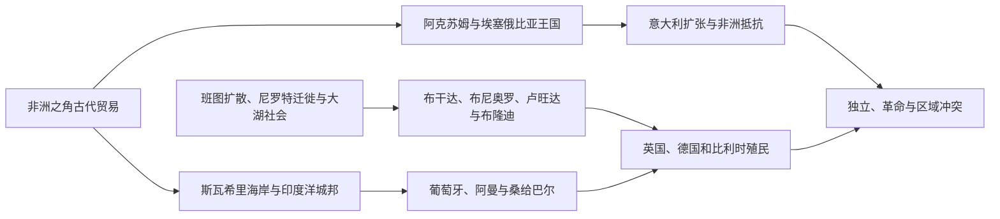

# 东非历史

东非跨越非洲之角、尼罗河上游、大湖区和印度洋岛屿。埃塞俄比亚高原形成阿克苏姆与所罗门王朝传统；斯瓦希里城市把非洲内陆商品连接到阿拉伯、波斯和印度洋；大湖区发展布干达、卢旺达、布隆迪等王国；马达加斯加则由南岛与非洲人群共同塑造。

## 区域专题

- [阿克苏姆、埃塞俄比亚与非洲之角](/%E4%BA%BA%E6%96%87%E7%A7%91%E5%AD%A6/%E5%8E%86%E5%8F%B2/%E9%9D%9E%E6%B4%B2/%E4%B8%9C%E9%9D%9E/%E9%98%BF%E5%85%8B%E8%8B%8F%E5%A7%86%E3%80%81%E5%9F%83%E5%A1%9E%E4%BF%84%E6%AF%94%E4%BA%9A%E4%B8%8E%E9%9D%9E%E6%B4%B2%E4%B9%8B%E8%A7%92.md)
- [斯瓦希里海岸与印度洋世界](/%E4%BA%BA%E6%96%87%E7%A7%91%E5%AD%A6/%E5%8E%86%E5%8F%B2/%E9%9D%9E%E6%B4%B2/%E4%B8%9C%E9%9D%9E/%E6%96%AF%E7%93%A6%E5%B8%8C%E9%87%8C%E6%B5%B7%E5%B2%B8%E4%B8%8E%E5%8D%B0%E5%BA%A6%E6%B4%8B%E4%B8%96%E7%95%8C.md)
- [大湖王国、殖民统治与独立](/%E4%BA%BA%E6%96%87%E7%A7%91%E5%AD%A6/%E5%8E%86%E5%8F%B2/%E9%9D%9E%E6%B4%B2/%E4%B8%9C%E9%9D%9E/%E5%A4%A7%E6%B9%96%E7%8E%8B%E5%9B%BD%E3%80%81%E6%AE%96%E6%B0%91%E7%BB%9F%E6%B2%BB%E4%B8%8E%E7%8B%AC%E7%AB%8B.md)

## 国家入口

| 国家 | 入口 | 核心线索 |
|---|---|---|
| 埃塞俄比亚 | [埃塞俄比亚历史](/%E4%BA%BA%E6%96%87%E7%A7%91%E5%AD%A6/%E5%8E%86%E5%8F%B2/%E9%9D%9E%E6%B4%B2/%E4%B8%9C%E9%9D%9E/%E5%9F%83%E5%A1%9E%E4%BF%84%E6%AF%94%E4%BA%9A/README.md) | 阿克苏姆、所罗门王朝、阿德瓦与革命 |
| 厄立特里亚 | [厄立特里亚历史](/%E4%BA%BA%E6%96%87%E7%A7%91%E5%AD%A6/%E5%8E%86%E5%8F%B2/%E9%9D%9E%E6%B4%B2/%E4%B8%9C%E9%9D%9E/%E5%8E%84%E7%AB%8B%E7%89%B9%E9%87%8C%E4%BA%9A/README.md) | 红海港口、意大利殖民、联邦与独立战争 |
| 吉布提 | [吉布提历史](/%E4%BA%BA%E6%96%87%E7%A7%91%E5%AD%A6/%E5%8E%86%E5%8F%B2/%E9%9D%9E%E6%B4%B2/%E4%B8%9C%E9%9D%9E/%E5%90%89%E5%B8%83%E6%8F%90/README.md) | 阿法尔—伊萨社会、法国港口与红海战略 |
| 索马里 | [索马里历史](/%E4%BA%BA%E6%96%87%E7%A7%91%E5%AD%A6/%E5%8E%86%E5%8F%B2/%E9%9D%9E%E6%B4%B2/%E4%B8%9C%E9%9D%9E/%E7%B4%A2%E9%A9%AC%E9%87%8C/README.md) | 游牧社会、苏丹国、殖民分治与国家危机 |
| 南苏丹 | [南苏丹历史](/%E4%BA%BA%E6%96%87%E7%A7%91%E5%AD%A6/%E5%8E%86%E5%8F%B2/%E9%9D%9E%E6%B4%B2/%E4%B8%9C%E9%9D%9E/%E5%8D%97%E8%8B%8F%E4%B8%B9/README.md) | 尼罗河上游社会、英埃苏丹、内战与独立 |
| 乌干达 | [乌干达历史](/%E4%BA%BA%E6%96%87%E7%A7%91%E5%AD%A6/%E5%8E%86%E5%8F%B2/%E9%9D%9E%E6%B4%B2/%E4%B8%9C%E9%9D%9E/%E4%B9%8C%E5%B9%B2%E8%BE%BE/README.md) | 大湖王国、英国保护国与独立政治 |
| 肯尼亚 | [肯尼亚历史](/%E4%BA%BA%E6%96%87%E7%A7%91%E5%AD%A6/%E5%8E%86%E5%8F%B2/%E9%9D%9E%E6%B4%B2/%E4%B8%9C%E9%9D%9E/%E8%82%AF%E5%B0%BC%E4%BA%9A/README.md) | 斯瓦希里海岸、定居殖民、茅茅运动与共和国 |
| 坦桑尼亚 | [坦桑尼亚历史](/%E4%BA%BA%E6%96%87%E7%A7%91%E5%AD%A6/%E5%8E%86%E5%8F%B2/%E9%9D%9E%E6%B4%B2/%E4%B8%9C%E9%9D%9E/%E5%9D%A6%E6%A1%91%E5%B0%BC%E4%BA%9A/README.md) | 斯瓦希里贸易、德英殖民、坦噶尼喀—桑给巴尔联合 |
| 卢旺达 | [卢旺达历史](/%E4%BA%BA%E6%96%87%E7%A7%91%E5%AD%A6/%E5%8E%86%E5%8F%B2/%E9%9D%9E%E6%B4%B2/%E4%B8%9C%E9%9D%9E/%E5%8D%A2%E6%97%BA%E8%BE%BE/README.md) | 中央王国、殖民身份化、1994年大屠杀与重建 |
| 布隆迪 | [布隆迪历史](/%E4%BA%BA%E6%96%87%E7%A7%91%E5%AD%A6/%E5%8E%86%E5%8F%B2/%E9%9D%9E%E6%B4%B2/%E4%B8%9C%E9%9D%9E/%E5%B8%83%E9%9A%86%E8%BF%AA/README.md) | 王国、比利时托管、族群暴力与和平进程 |
| 马达加斯加 | [马达加斯加历史](/%E4%BA%BA%E6%96%87%E7%A7%91%E5%AD%A6/%E5%8E%86%E5%8F%B2/%E9%9D%9E%E6%B4%B2/%E4%B8%9C%E9%9D%9E/%E9%A9%AC%E8%BE%BE%E5%8A%A0%E6%96%AF%E5%8A%A0/README.md) | 南岛—非洲社会、梅里纳王国与法国殖民 |
| 科摩罗 | [科摩罗历史](/%E4%BA%BA%E6%96%87%E7%A7%91%E5%AD%A6/%E5%8E%86%E5%8F%B2/%E9%9D%9E%E6%B4%B2/%E4%B8%9C%E9%9D%9E/%E7%A7%91%E6%91%A9%E7%BD%97/README.md) | 斯瓦希里—伊斯兰岛屿、法国殖民与政变 |
| 毛里求斯 | [毛里求斯历史](/%E4%BA%BA%E6%96%87%E7%A7%91%E5%AD%A6/%E5%8E%86%E5%8F%B2/%E9%9D%9E%E6%B4%B2/%E4%B8%9C%E9%9D%9E/%E6%AF%9B%E9%87%8C%E6%B1%82%E6%96%AF/README.md) | 无原住民岛屿、殖民种植园、契约劳工与独立 |
| 塞舌尔 | [塞舌尔历史](/%E4%BA%BA%E6%96%87%E7%A7%91%E5%AD%A6/%E5%8E%86%E5%8F%B2/%E9%9D%9E%E6%B4%B2/%E4%B8%9C%E9%9D%9E/%E5%A1%9E%E8%88%8C%E5%B0%94/README.md) | 法英殖民、克里奥尔社会与岛国国家 |

## 组织说明

苏丹主线归[西亚](/%E4%BA%BA%E6%96%87%E7%A7%91%E5%AD%A6/%E5%8E%86%E5%8F%B2/%E8%A5%BF%E4%BA%9A/README.md)与[北非](/%E4%BA%BA%E6%96%87%E7%A7%91%E5%AD%A6/%E5%8E%86%E5%8F%B2/%E5%8C%97%E9%9D%9E/README.md)；南苏丹因尼罗河上游和东非政治联系收在本目录。

## 直接上级

- [撒哈拉以南非洲历史](/%E4%BA%BA%E6%96%87%E7%A7%91%E5%AD%A6/%E5%8E%86%E5%8F%B2/%E9%9D%9E%E6%B4%B2/README.md)
