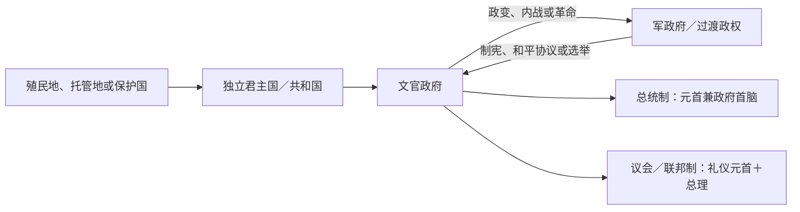

# 东非独立国家元首与权力结构表

## 使用范围

本表集中维护东非各国家自独立／共和国建立至 **2026 年 7 月 14 日** 的国家元首、政府首脑和实际权力连续性。君主立宪期、军政府、代理元首、并立政权与复位均明确标注；礼仪总统不与掌握行政权的总理混在同一角色中。

## 乌干达

| 顺序 | 国家元首 | 在任 | 身份与交接 |
| --- | --- | --- | --- |
| 1 | 伊丽莎白二世 | 1962—1963 | 乌干达女王；总督沃尔特·库茨代表 |
| 2 | 穆特萨二世 | 1963—1966 | 共和国首任总统兼布干达卡巴卡；同总理奥博特冲突后被逐 |
| 3 | 米尔顿·奥博特 | 1966—1971 | 强化总统制；阿明政变推翻 |
| 4 | 伊迪·阿明 | 1971—1979 | 军事总统；乌坦战争中被推翻 |
| 5 | 优素福·卢莱 | 1979-04—1979-06 | 乌干达民族解放阵线临时总统 |
| 6 | 戈弗雷·比奈萨 | 1979—1980 | 临时总统；被军事委员会解除 |
| 7 | 保罗·穆万加 | 1980-05-12—1980-05-22 | 军事委员会主席，推翻比奈萨后短暂行使实际元首权力 |
| 8 | 萨乌洛·穆索克；波利卡普·尼亚穆琼乔；约韦里·亨特·瓦查-奥尔沃尔 | 1980-05-22—1980-12-15 | 三人总统委员会，共同担任法定国家元首；军事委员会仍掌关键实权 |
| 9 | 米尔顿·奥博特 | 1980—1985 | 复任；内战中再次被军方推翻 |
| 10 | 巴西利奥·奥拉拉-奥凯洛 | 1985-07 | 政变初期短暂军政元首 |
| 11 | 蒂托·奥凯洛 | 1985—1986 | 军事委员会主席；全国抵抗军攻占坎帕拉 |
| 12 | **约韦里·穆塞韦尼** | 1986—至今 | 全国抵抗运动领导人；2026年选举后开启2026—2031任期 |

总理负责协调内阁但总统掌握行政与安全。奥博特（1962—1966）后，主要总理为萨姆森·基塞卡、乔治·阿迪耶博、金图·穆索克、阿波罗·恩西班比、阿马马·姆巴巴齐、鲁哈卡纳·鲁贡达和罗比娜·纳班贾（2021—至今）。

## 南苏丹

| 顺序 | 国家元首兼政府首脑 | 在任 | 权力结构 |
| --- | --- | --- | --- |
| 1 | **萨尔瓦·基尔·马亚尔迪特** | 2011—至今 | 独立首任总统；此前任苏丹第一副总统与南方政府主席 |

总统依过渡宪法兼任国家元首、政府首脑和武装力量统帅。里克·马沙尔曾在2011—2013、2016及2020—2025年任第一副总统／副总统并领导反对派武装；2013年权力冲突引发内战，2020年民族团结政府恢复其职位，2025年其被停职并受审后和平协议再度失稳。截至2026年7月，基尔仍掌总统、内阁和安全核心，首次全国大选定于2026-12-22但尚未举行。

## 卢旺达

| 顺序 | 国家元首 | 在任 | 身份与交接 |
| --- | --- | --- | --- |
| 1 | 多米尼克·姆博纽穆特瓦 | 1961 | 君主制被推翻后的临时共和国总统 |
| 2 | **格雷瓜尔·卡伊班达** | 1961／1962—1973 | 独立建国总统；哈比亚利马纳政变推翻 |
| 3 | **朱韦纳尔·哈比亚利马纳** | 1973—1994 | 军政上台后建立一党制；座机被击落身亡 |
| 4 | 泰奥多尔·辛迪库布瓦博 | 1994-04—1994-07 | 种族灭绝时期临时政府总统 |
| 5 | 巴斯德·比齐蒙古 | 1994—2000 | 爱国阵线胜利后的联合政府总统；辞职 |
| 6 | **保罗·卡加梅** | 2000—至今 | 爱国阵线核心领导人；2024年再次当选 |

总理序列为：卡伊班达（独立前过渡）、西尔韦斯特·恩桑齐马纳、迪斯马斯·恩森吉亚雷米耶、阿加特·乌维林吉伊马纳、让·坎班达、福斯坦·特瓦吉拉蒙古、皮埃尔-塞莱斯坦·鲁维盖马、贝尔纳·马库扎、皮埃尔·哈布穆雷米、阿纳斯塔斯·穆雷凯齐、爱德华·恩吉伦特和贾斯廷·恩森吉尤姆瓦（2025—至今）。总统确定国家路线并控制安全，政府首脑负责政策执行。

## 厄立特里亚

| 顺序 | 国家元首兼政府首脑 | 在任 | 权力结构 |
| --- | --- | --- | --- |
| 1 | **伊萨亚斯·阿费沃基** | 1993—至今 | 独立首任总统；人民民主与正义阵线主席、武装斗争核心领导人 |

1993年独立后未举行全国竞争性总统选举，1997年宪法未完整实施，不另设总理。总统同时控制政府、执政党和国防决策；国民议会长期未正常运作。1952—1962年埃塞俄比亚—厄立特里亚联邦时期，海尔·塞拉西是共同君主，特德拉·拜鲁、阿斯法哈·沃尔德米卡埃尔先后任厄立特里亚首席行政官，但该联邦职位不是独立国家元首。

## 吉布提

| 顺序 | 国家元首 | 在任 | 身份与交接 |
| --- | --- | --- | --- |
| 1 | **哈桑·古莱德·阿普蒂敦** | 1977—1999 | 独立建国总统；长期一党优势，后有限多党化 |
| 2 | **伊斯梅尔·奥马尔·盖莱** | 1999—至今 | 继任并多次连任；2026年获第六个任期 |

总理为政府协调者：艾哈迈德·迪尼·艾哈迈德（1977—1978）、阿卜杜拉·穆罕默德·卡米勒（1978）、巴尔卡特·古拉德·哈马杜（1978—2001）、迪莱塔·穆罕默德·迪莱塔（2001—2013）、阿卜杜勒卡德尔·卡米勒·穆罕默德（2013—至今）。总统掌握国防、外交和高级任命；2025年取消年龄限制后，盖莱在2026-04选举再次当选。

## 坦桑尼亚

### 联合共和国国家元首

| 顺序 | 国家元首 | 在任 | 身份 |
| --- | --- | --- | --- |
| 1 | 伊丽莎白二世 | 1961—1962 | 坦噶尼喀女王；总督理查德·特恩布尔代表 |
| 2 | **朱利叶斯·尼雷尔** | 1962—1985 | 先任坦噶尼喀总统，1964年起任联合共和国总统 |
| 3 | 阿里·哈桑·姆维尼 | 1985—1995 | 推动经济开放和多党化 |
| 4 | 本杰明·姆卡帕 | 1995—2005 | 两届总统 |
| 5 | 贾卡亚·基奎特 | 2005—2015 | 两届总统 |
| 6 | 约翰·马古富利 | 2015—2021 | 任内病逝 |
| 7 | **萨米娅·苏卢胡·哈桑** | 2021—至今 | 依宪继任；2025年在受限竞争和暴力争议中当选 |

主要总理依次为拉希迪·卡瓦瓦、爱德华·索科伊内、克莱奥帕·姆苏亚、索科伊内（复任）、萨利姆·艾哈迈德·萨利姆、约瑟夫·瓦里奥巴、约翰·马莱塞拉、姆苏亚（复任）、弗雷德里克·苏马耶、爱德华·洛瓦萨、米曾戈·平达、卡西姆·马贾利瓦、姆维古卢·恩琴巴（2025—至今）。

### 桑给巴尔自治政府首脑

桑给巴尔革命后由阿贝德·卡鲁姆（1964—1972）、阿布德·朱姆贝（1972—1984）、阿里·哈桑·姆维尼（1984—1985）、伊德里斯·瓦基勒（1985—1990）、萨勒明·阿穆尔（1990—2000）、阿马尼·阿贝德·卡鲁姆（2000—2010）、阿里·穆罕默德·谢因（2010—2020）、侯赛因·阿里·姆维尼（2020—至今）依次领导。联合总统掌握联盟事务；桑给巴尔总统与议会掌管非联盟事务，二者不能并入同一普通省级表。

## 埃塞俄比亚

| 阶段 | 国家元首 | 在任 | 身份 |
| --- | --- | --- | --- |
| 帝国末期 | **海尔·塞拉西一世** | 1930—1974 | 皇帝；1936—1941年意大利占领期间流亡，后复位 |
| 德尔格初期 | 阿曼·安多姆 | 1974-09—1974-11 | 临时军政委员会主席；在冲突中身亡 |
| 德尔格 | 特费里·本蒂 | 1974—1977 | 军政委员会主席；内部清洗中被杀 |
| 德尔格／人民共和国 | **门格斯图·海尔·马里亚姆** | 1977—1991 | 军政实际首脑，1987年起任共和国总统 |
| 临时 | 特斯法耶·格布雷·基丹 | 1991-05 | 门格斯图出逃后代理国家元首 |
| 过渡政府 | 梅莱斯·泽纳维 | 1991—1995 | 过渡总统；后转任总理 |
| 联邦共和国 | 内加索·吉达达 | 1995—2001 | 礼仪总统 |
| 联邦共和国 | 吉尔马·沃尔德-乔治斯 | 2001—2013 | 礼仪总统 |
| 联邦共和国 | 穆拉图·特肖梅 | 2013—2018 | 礼仪总统 |
| 联邦共和国 | 萨赫勒-沃克·祖德 | 2018—2024 | 礼仪总统 |
| 联邦共和国 | **塔耶·阿茨克-塞拉西** | 2024—至今 | 礼仪国家元首 |

帝国末期首相包括马康南·恩达尔卡丘、阿贝贝·阿雷盖、阿克利卢·哈布特-沃尔德、恩达尔卡丘·马康南和米卡埃尔·伊姆鲁。德尔格1974—1987年撤销首相；1987年后政府首脑依次为菲克雷·塞拉西·沃格德雷斯、海卢·伊梅努、特斯法耶·丁卡、塔姆拉特·拉伊内、梅莱斯·泽纳维、海尔马里亚姆·德萨莱尼和**阿比·艾哈迈德**（2018—至今）。现行联邦议会制中，总理掌握行政实权，总统主要履行礼仪职能。

## 塞舌尔

| 顺序 | 国家元首兼政府首脑 | 在任 | 交接 |
| --- | --- | --- | --- |
| 1 | 詹姆斯·曼卡姆 | 1976—1977 | 独立首任总统；勒内政变推翻 |
| 2 | **弗朗斯-阿尔贝·勒内** | 1977—2004 | 先任一党总统，1993年后多党选举连任 |
| 3 | 詹姆斯·米歇尔 | 2004—2016 | 勒内辞职后继任，后经选举执政 |
| 4 | 丹尼·富尔 | 2016—2020 | 副总统继任 |
| 5 | 韦维尔·拉姆卡拉旺 | 2020—2025 | 反对党首次赢得总统权 |
| 6 | **帕特里克·埃尔米尼** | 2025—至今 | 2025年胜选，10月26日就任 |

塞舌尔实行总统制，不设总理；总统兼国家元首和政府首脑。2020与2025年连续竞争性轮替说明一党遗产已转为选举竞争，但总统仍拥有较集中行政权。

## 布隆迪

| 顺序 | 国家元首 | 在任 | 身份 |
| --- | --- | --- | --- |
| 1 | 姆瓦姆布扎四世 | 1962—1966 | 独立君主；1966年被儿子废黜 |
| 2 | 恩塔雷五世 | 1966 | 末代国王；米孔贝罗废除君主制 |
| 3 | **米歇尔·米孔贝罗** | 1966—1976 | 军事总统 |
| 4 | 让-巴蒂斯特·巴加扎 | 1976—1987 | 政变上台 |
| 5 | 皮埃尔·布约亚 | 1987—1993 | 军政总统，组织多党选举 |
| 6 | **梅尔希奥·恩达达耶** | 1993 | 首位民选胡图总统；政变中遇害 |
| 7 | 弗朗索瓦·恩盖泽 | 1993-10 | 政变者短暂宣布的总统，未获广泛承认 |
| 8 | 西尔维·基尼吉 | 1993—1994 | 总理在危机中代行国家元首职责 |
| 9 | 西普里安·恩塔里亚米拉 | 1994 | 民选／议会协商总统；空难身亡 |
| 10 | 西尔维斯特·恩蒂班通加尼亚 | 1994—1996 | 内战期总统；被布约亚推翻 |
| 11 | 皮埃尔·布约亚 | 1996—2003 | 复任；按和平安排交权 |
| 12 | 多米蒂安·恩达伊泽耶 | 2003—2005 | 过渡总统 |
| 13 | 皮埃尔·恩库伦齐扎 | 2005—2020 | 和平进程后执政；第三任期引发2015年危机 |
| 14 | **埃瓦里斯特·恩达伊希米耶** | 2020—至今 | 当选总统；恩库伦齐扎去世后提前就任 |

首相职位在君主制时期存在，1966年后撤销，2020年恢复。恢复后依次为阿兰-纪尧姆·布尼奥尼（2020—2022）、热尔韦·恩迪拉科布卡（2022—2025）、内斯托尔·恩塔洪图耶（2025—至今）。总统控制安全和战略方向，总理协调政府；内战和过渡期还需考虑军队、反叛组织与权力分享机构。

## 毛里求斯

### 国家元首

| 阶段 | 国家元首 | 在任 | 说明 |
| --- | --- | --- | --- |
| 君主国 | 伊丽莎白二世 | 1968—1992 | 由总督代表；约翰·肖·伦尼、伦纳德·威廉斯、拉曼·奥斯曼、亨利·加里奥克（代理）、达延德拉纳特·伯伦乔贝、西沃萨古尔·拉姆古兰、卡萨姆·穆兰（代理）、维拉萨米·林加杜依次任职 |
| 共和国 | 维拉萨米·林加杜 | 1992 | 末任总督转任首任总统 |
| 共和国 | 卡萨姆·乌提姆 | 1992—2002 | 礼仪总统；因争议法案辞职 |
| 代理 | 安吉迪·切蒂亚尔；阿里兰加·皮莱 | 2002 | 副总统、最高法院首席法官先后代理 |
| 共和国 | 卡尔·奥夫曼 | 2002—2003 | 总统 |
| 代理 | 拉乌夫·本敦 | 2003 | 副总统代理 |
| 共和国 | 阿内鲁德·贾格纳特 | 2003—2012 | 礼仪总统 |
| 代理 | 莫妮克·奥桑-贝勒波 | 2012 | 副总统代理 |
| 共和国 | 凯拉什·普里亚格 | 2012—2015 | 总统 |
| 代理 | 莫妮克·奥桑-贝勒波 | 2015 | 第二次代理 |
| 共和国 | 阿米娜·古里布-法基姆 | 2015—2018 | 总统；金融争议中辞职 |
| 代理 | 巴朗·维亚普里 | 2018—2019 | 副总统代理 |
| 共和国 | 普里特维拉杰辛·鲁蓬 | 2019—2024 | 总统 |
| 共和国 | **达兰比尔·戈库尔** | 2024—至今 | 国民议会选出，礼仪元首 |

### 政府首脑

总理依次为西沃萨古尔·拉姆古兰（1968—1982）、阿内鲁德·贾格纳特（1982—1995）、纳文钱德拉·拉姆古兰（1995—2000）、贾格纳特（2000—2003）、保罗·贝朗热（2003—2005）、拉姆古兰（2005—2014）、贾格纳特（2014—2017）、普拉文德·贾格纳特（2017—2024）、**纳文钱德拉·拉姆古兰**（2024—至今）。议会多数和总理掌行政权，总统主要履行宪法任命与礼仪职责。

## 科摩罗

| 顺序 | 国家元首 | 在任 | 身份与交接 |
| --- | --- | --- | --- |
| 1 | 艾哈迈德·阿卜杜拉 | 1975-07—1975-08 | 独立首任元首；政变被推翻 |
| 2 | 赛义德·穆罕默德·贾法尔 | 1975—1976 | 革命委员会主席 |
| 3 | 阿里·萨利赫 | 1976—1978 | 革命政权总统；政变中被推翻并遇害 |
| 4 | 赛义德·阿图马尼 | 1978-05 | 政治军事委员会主席 |
| 5 | **艾哈迈德·阿卜杜拉** | 1978—1989 | 在雇佣兵支持下复任；遇刺身亡 |
| 6 | 赛义德·穆罕默德·乔哈尔 | 1989—1995／1996 | 民选总统；雇佣兵政变中被扣押，短暂复位后离任 |
| 7 | 孔博·阿尤巴／卡比·埃尔-亚希鲁图·穆罕默德 | 1995—1996 | 政变及国际干预期间先后代理 |
| 8 | 穆罕默德·塔基·阿卜杜勒卡里姆 | 1996—1998 | 民选总统；任内去世 |
| 9 | 塔吉丁·本·赛义德·马松德 | 1998—1999 | 代理总统 |
| 10 | **阿扎利·阿苏马尼** | 1999—2002 | 政变上台，后为参选辞去过渡职务 |
| 11 | 哈马达·马迪 | 2002 | 过渡总统 |
| 12 | 阿扎利·阿苏马尼 | 2002—2006 | 联盟总统 |
| 13 | 艾哈迈德·阿卜杜拉·穆罕默德·桑比 | 2006—2011 | 昂儒昂岛轮值背景下当选 |
| 14 | 伊基利卢·杜瓦尼纳 | 2011—2016 | 莫埃利岛出身总统 |
| 15 | **阿扎利·阿苏马尼** | 2016—2019 | 再次当选；为提前选举短期离任 |
| 16 | 穆斯塔德鲁瓦内·阿卜杜 | 2019 | 副总统代理 |
| 17 | 阿扎利·阿苏马尼 | 2019—至今 | 修宪后再任；2024年连任 |

2002年联盟宪法后不设全国总理，总统是政府首脑；各岛有自治行政。昂儒昂、莫埃利分离危机、马约特留法以及雇佣兵干预意味着法定元首并不总能控制所有岛屿。

## 索马里

| 阶段 | 国家元首 | 在任 | 身份 |
| --- | --- | --- | --- |
| 第一共和国 | 亚丁·阿卜杜拉·奥斯曼·达尔 | 1960—1967 | 首任总统，选举败北后交权 |
| 第一共和国 | 阿卜迪拉希德·阿里·舍马克 | 1967—1969 | 遇刺身亡 |
| 代理 | 谢赫·穆赫塔尔·穆罕默德·侯赛因 | 1969-10 | 国民议会议长代理 |
| 军政 | **穆罕默德·西亚德·巴雷** | 1969—1991 | 最高革命委员会主席／总统；政权在内战中崩溃 |
| 并立期 | 阿里·马赫迪·穆罕默德 | 1991—1997 | 国际上常称临时总统，但未控制全国；艾迪德阵营另行称总统 |
| 国家中枢断裂 | 无全国公认有效元首 | 1997—2000 | 地方政权、军阀和索马里兰等并立 |
| 过渡国家政府 | 阿卜迪卡西姆·萨拉德·哈桑 | 2000—2004 | 过渡总统，控制范围有限 |
| 过渡联邦 | 阿卜杜拉希·优素福·艾哈迈德 | 2004—2008 | 过渡联邦总统 |
| 代理 | 亚丁·马多贝 | 2008—2009 | 议会议长代理 |
| 过渡联邦 | 谢里夫·谢赫·艾哈迈德 | 2009—2012 | 过渡总统 |
| 代理 | 穆塞·哈桑·谢赫·赛义德·阿卜杜勒 | 2012 | 议长短期代理 |
| 联邦共和国 | **哈桑·谢赫·穆罕默德** | 2012—2017 | 联邦总统 |
| 联邦共和国 | 穆罕默德·阿卜杜拉希·穆罕默德 | 2017—2022 | 联邦总统 |
| 联邦共和国 | **哈桑·谢赫·穆罕默德** | 2022—至今 | 复任联邦总统 |

第一共和国总理为舍马克、阿卜迪拉扎克·哈吉·侯赛因和穆罕默德·哈吉·易卜拉欣·埃加勒。2000年后主要总理依次为阿里·哈利夫·加莱德、奥斯曼·贾马·阿里、哈桑·阿布希尔·法拉赫、穆罕默德·阿卜迪·优素福、阿里·穆罕默德·格迪、努尔·哈桑·侯赛因、奥马尔·阿卜迪拉希德·阿里·舍马克、穆罕默德·阿卜杜拉希·穆罕默德、阿卜迪韦利·穆罕默德·阿里、阿卜迪·法拉赫·希尔敦、阿卜迪韦利·谢赫·艾哈迈德、舍马克（复任）、哈桑·阿里·海尔、穆罕默德·侯赛因·罗布莱、**哈姆扎·阿卜迪·巴雷**（2022—至今）。联邦总统是国家元首，总理领导内阁；联邦成员州与索马里兰拥有各自权力中心。

## 肯尼亚

| 顺序 | 国家元首 | 在任 | 身份 |
| --- | --- | --- | --- |
| 1 | 伊丽莎白二世 | 1963—1964 | 肯尼亚女王；总督马尔科姆·麦克唐纳代表 |
| 2 | **乔莫·肯雅塔** | 1964—1978 | 共和国首任总统；此前任总理 |
| 3 | 丹尼尔·阿拉普·莫伊 | 1978—2002 | 依宪继任，后形成一党优势并在多党化后执政 |
| 4 | 姆瓦伊·齐贝吉 | 2002—2013 | 反对党联盟胜选；2008年后权力分享 |
| 5 | 乌胡鲁·肯雅塔 | 2013—2022 | 两届总统 |
| 6 | **威廉·鲁托** | 2022—至今 | 选举胜出，最高法院驳回异议后就任 |

1963—1964年乔莫·肯雅塔任总理；2008—2013年选举危机后的大联合政府中，拉伊拉·奥廷加任总理并分享行政协调。其余时期总统兼政府首脑。2010年宪法强化法院、议会和47郡权力，但总统仍控制国家行政与安全。

## 马达加斯加

| 顺序 | 国家元首 | 在任 | 身份与交接 |
| --- | --- | --- | --- |
| 1 | 菲利贝尔·齐拉纳纳 | 1959／1960—1972 | 独立建国总统；抗议与军方压力下交权 |
| 2 | 加布里埃尔·拉马南楚阿 | 1972—1975 | 军政政府首脑 |
| 3 | 理查德·拉齐曼德拉瓦 | 1975-02 | 就任六日后遇刺 |
| 4 | 吉勒·安德里亚马哈佐 | 1975-02—1975-06 | 全国军事领导委员会主席 |
| 5 | **迪迪埃·拉齐拉卡** | 1975—1993 | 第二共和国总统 |
| 6 | 阿尔贝·扎菲 | 1993—1996 | 第三共和国总统；被议会弹劾 |
| 7 | 诺贝尔·拉齐拉霍纳纳 | 1996—1997 | 总理／代理总统 |
| 8 | 迪迪埃·拉齐拉卡 | 1997—2002 | 复任；2001选举危机后离境 |
| 9 | 马克·拉瓦卢马纳纳 | 2002—2009 | 争议选举后掌权；军方倒向反对派后辞职 |
| 10 | 伊波利特·拉马鲁松／军事委员会 | 2009-03 | 获总统移交后迅速把权力交给拉乔利纳 |
| 11 | **安德里·拉乔利纳** | 2009—2014 | 高级过渡当局主席 |
| 12 | 埃里·拉乔纳里马曼皮亚尼纳 | 2014—2018 | 民选总统 |
| 13 | 里沃·拉科托瓦奥 | 2018—2019 | 参议院议长代理总统 |
| 14 | 安德里·拉乔利纳 | 2019—2025 | 经选举上台并于2023年连任；2025年抗议与军变中下台 |
| 15 | **米卡埃尔·兰德里亚尼里纳** | 2025—至今 | 军方支持的“共和国重建总统委员会”主席、过渡总统 |

总理职位长期存在并负责日常内阁，但总统和军方在危机期掌实权。2025年后先由埃林察拉马·拉扎纳里韦洛任总理；2026-03-15改任马米蒂亚纳·拉乔纳里松。过渡路线图设想2026—2027年约24个月重建期，截至2026年7月尚未举行恢复文官总统制的选举。

## 相关笔记

- [东非历史](/%E4%BA%BA%E6%96%87%E7%A7%91%E5%AD%A6/%E5%8E%86%E5%8F%B2/%E9%9D%9E%E6%B4%B2/%E4%B8%9C%E9%9D%9E/README.md)
- [大湖王国、殖民统治与独立](/%E4%BA%BA%E6%96%87%E7%A7%91%E5%AD%A6/%E5%8E%86%E5%8F%B2/%E9%9D%9E%E6%B4%B2/%E4%B8%9C%E9%9D%9E/%E5%A4%A7%E6%B9%96%E7%8E%8B%E5%9B%BD%E3%80%81%E6%AE%96%E6%B0%91%E7%BB%9F%E6%B2%BB%E4%B8%8E%E7%8B%AC%E7%AB%8B.md)
