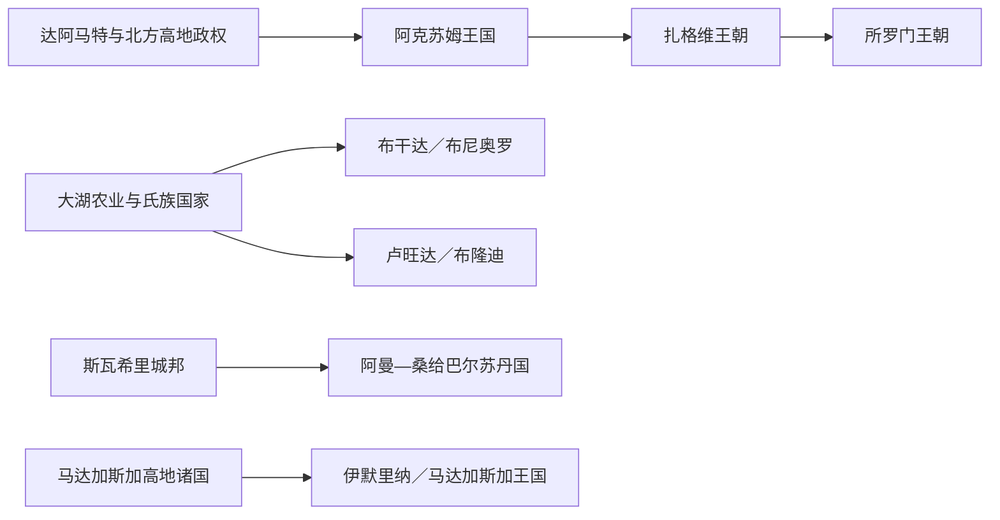

# 东非王国与苏丹国统治者世系表

## 编排原则

东非古代王统同时依靠铭文、钱币、宫廷编年、口述谱系和外来记录。下表列出学界与各王室传统中可辨认的连续序列；无同时代证据的早期名字标作传统谱系，无法确定的空档保留为空档。共治、复位、废立、殖民扶立和失去主权后的传统王位分别说明。

## 阿克苏姆：仅列可由铭文、钱币或较近文献确认者

阿克苏姆不存在一份可以无缝排到每一年的完整王表。早期《红海航行记》所称“佐斯卡勒斯”是否就是阿克苏姆王仍有争议；3世纪后钱币提供较可靠名字，但若干国王顺序会因新发现调整。

| 大致顺序 | 国王 | 在位约期 | 证据与备注 |
| --- | --- | --- | --- |
| 可能早期 | 佐斯卡勒斯 | 约1世纪 | 外来航海文献所见阿杜利斯地区统治者，身份有争议 |
| 1 | 恩杜比斯（Endubis） | 约295—310 | 最早发行阿克苏姆钱币的已知国王 |
| 2 | 阿菲拉斯（Aphilas） | 约310年代 | 多种金银铜币制式；具体起讫年仍有浮动 |
| 3 | 乌萨纳斯一世（Ousanas I） | 4世纪前期 | 异教币王之一；与后世同名统治者区分 |
| 4 | WZB／瓦泽巴（Wazeba） | 4世纪前期 | 钱币名只存辅音写法；通常置于埃扎纳之前 |
| 5 | **埃扎纳** | 约4世纪中叶 | 铭文记录扩张；统治期皈依基督教并改变钱币符号 |
| 6 | 欧阿泽巴斯（Ouazebas） | 约4世纪后期 | 继承埃扎纳后的币王；与早期WZB不是同一表记 |
| 7 | 埃翁（Eon） | 约4—5世纪 | 钱币所见；与外来文献人物的对应存在争议 |
| 8 | MHDYS（马赫迪斯，读法未定） | 约4—5世纪 | 仅由钱币确认；与埃翁的先后在不同重建中会互换 |
| 9 | 埃布哈纳（Ebana） | 约5世纪 | 钱币所见，具体顺序不能精确 |
| 10 | 内扎纳（Nezana） | 约5世纪 | 钱币所见；旧目录有时与相近名号混列 |
| 11 | 乌萨纳斯二世（Ousanas II） | 约5世纪后期 | 晚于埃扎纳的同名币王；位置仍属近似重建 |
| 12 | **卡莱布** | 约510—540 | 远征南阿拉伯；基督教王权高峰 |
| 13 | 阿尔马赫（Armah，或与埃拉·阿米达相关） | 6世纪中后期 | 钱币所见；旧排序常把他置于币制末期，新排序则置于卡莱布之后 |
| 14 | 瓦泽纳（Wazena，或埃拉·加巴兹） | 6世纪中后期 | 钱币所见；身份对应与在位顺序均有争议 |
| 15 | 以色列（Israel） | 6世纪后期 | 钱币所见；与传统王表同名人物未必完全对应 |
| 16 | 格尔森（Gersem） | 约6世纪末 | 金、银、铜币均有发现；与阿尔马赫的先后有不同意见 |
| 17 | 伊奥埃尔／约珥（Ioel／Joel） | 约6世纪末—7世纪初 | 钱币所见；确定晚于卡莱布，具体位置依目录而异 |
| 18 | 哈塔兹（Hataz／Hethasas） | 约7世纪初 | 钱币所见；按哈恩—韦斯特排序为最晚币王，其他重建并不一致 |

塔泽纳见于卡莱布家世材料，WʽZB／瓦泽布见于卡莱布之后的碑铭与传统；二者是否实际独立在位、是否与表中某位币王同人或共治，无法稳定判定，因此另列说明而不占虚假的确定顺位。13—18位采用哈恩—韦斯特钱币目录的近年排序以便阅读；蒙罗-海等重建会调整阿尔马赫、瓦泽纳、以色列、格尔森、伊奥埃尔和哈塔兹的先后。

阿克苏姆衰退是红海贸易格局、政治中心南移、生态与区域战争共同作用，不应写成某一“末代王被谁消灭”。7世纪以后北方王权记录稀疏，不能凭后世谱系补出连续名单。

## 扎格维王朝

扎格维统治年代有“约1137—1270”与更短方案，国王数量也有7、9、11位等传统。下表采用常见九王顺序，不把具体年份伪装成定论。

| 顺序 | 国王 | 约期与备注 |
| --- | --- | --- |
| 1 | 马拉·特克莱·海马诺特 | 传统开国者；可能通过婚姻连接前朝 |
| 2 | 塔塔迪姆 | 王族继承 |
| 3 | 扬·塞尤姆 | 顺序见王表 |
| 4 | 格尔马·塞尤姆 | 顺序见王表 |
| 5 | 耶姆雷哈纳·克雷斯托斯 | 以同名岩石教堂著名 |
| 6 | 凯杜斯·哈尔贝 | 拉利贝拉前任，关系有争议 |
| 7 | **格布雷·梅斯克尔·拉利贝拉** | 传统上与拉利贝拉岩石教堂群相连 |
| 8 | 纳库托·拉阿布 | 有时置于拉利贝拉之前，顺序有争议 |
| 9 | **耶特巴拉克** | 1270年前后被耶库诺·阿姆拉克取代，通常视为末代 |

## 所罗门王朝皇帝

### 1270—1706年

| 顺序 | 皇帝 | 在位 | 继承与关键说明 |
| --- | --- | --- | --- |
| 1 | **耶库诺·阿姆拉克** | 1270—1285 | 推翻扎格维末王，建立新王朝合法性 |
| 2 | 亚格贝乌·塞永 | 1285—1294 | 开国者之子 |
| 3 | 森法·阿雷德四世 | 1294—1295 | 亚格贝乌之子 |
| 4 | 赫兹巴·阿斯加德 | 1295—1296 | 兄弟继承 |
| 5 | 凯德马·阿斯加德 | 1296—1297 | 兄弟继承 |
| 6 | 金·阿斯加德 | 1297—1298 | 兄弟继承 |
| 7 | 萨巴·阿斯加德 | 1298—1299 | 兄弟继承 |
| 8 | 韦德姆·阿拉德 | 1299—1314 | 王族旁支 |
| 9 | **阿姆达·塞永一世** | 1314—1344 | 大规模南部扩张 |
| 10 | 内瓦亚·克雷斯托斯 | 1344—1372 | 阿姆达·塞永之子 |
| 11 | 内瓦亚·马里亚姆 | 1372—1382 | 前任之子 |
| 12 | 达维特一世 | 1382—1413 | 王族继承 |
| 13 | 特沃德罗斯一世 | 1413—1414 | 短期在位 |
| 14 | 伊萨克一世 | 1414—1429 | 对穆斯林苏丹国作战 |
| 15 | 安德烈亚斯 | 1429—1430 | 短期幼主 |
| 16 | 特克莱·马里亚姆 | 1430—1433 | 王族继承 |
| 17 | 萨尔韦·耶苏斯 | 1433 | 数月 |
| 18 | 阿姆达·耶苏斯 | 1433—1434 | 数月 |
| 19 | **扎拉·雅各布** | 1434—1468 | 教会整合、中央集权 |
| 20 | 贝达·马里亚姆一世 | 1468—1478 | 扎拉·雅各布之子 |
| 21 | 埃斯肯德尔 | 1478—1494 | 幼主，宫廷摄政竞争 |
| 22 | 阿姆达·塞永二世 | 1494 | 在位数月 |
| 23 | 纳奥德 | 1494—1508 | 王族继承 |
| 24 | **达维特二世／莱布纳·登格尔** | 1508—1540 | 阿达尔战争中流亡、去世 |
| 25 | **格拉乌德沃斯** | 1540—1559 | 在葡萄牙援助下击败艾哈迈德·格拉尼，后战死 |
| 26 | 梅纳斯 | 1559—1563 | 格拉乌德沃斯之弟 |
| 27 | 萨尔萨·登格尔 | 1563—1597 | 重建军政控制 |
| 28 | 雅各布 | 1597—1603 | 幼主，被废 |
| 29 | 扎·登格尔 | 1603—1604 | 篡位／旁支，战败身亡 |
| 30 | 雅各布（复位） | 1604—1606 | 复位后被苏塞尼奥斯击败 |
| 31 | **苏塞尼奥斯一世** | 1606—1632 | 改宗天主教引发内战，退位 |
| 32 | **法西利德斯** | 1632—1667 | 恢复正教、定都贡德尔 |
| 33 | 约翰内斯一世 | 1667—1682 | 法西利德斯之子 |
| 34 | **伊亚苏一世** | 1682—1706 | 贡德尔王朝高峰；被迫退位后遇害 |

### 1706—1855年：贡德尔继承危机与王子时代

| 顺序 | 皇帝 | 在位 | 共治、复位与备注 |
| --- | --- | --- | --- |
| 35 | 特克莱·海马诺特一世 | 1706—1708 | 伊亚苏一世之子；遇刺 |
| 36 | 特沃夫洛斯 | 1708—1711 | 伊亚苏一世之弟 |
| 37 | 约斯托斯 | 1711—1716 | 非主系贵族，后被废 |
| 38 | 达维特三世 | 1716—1721 | 伊亚苏一世之子 |
| 39 | 巴卡法 | 1721—1730 | 达维特三世之弟 |
| 40 | 伊亚苏二世 | 1730—1755 | 巴卡法之子；门特瓦布摄政影响大 |
| 41 | 伊约阿斯一世 | 1755—1769 | 伊亚苏二世之子；被权臣米卡埃尔·塞胡尔杀害 |
| 42 | 约翰内斯二世 | 1769 | 被扶立数月后中毒 |
| 43 | 特克莱·海马诺特二世 | 1769—1777 | 权臣控制下皇帝 |
| 44 | 所罗门二世 | 1777—1779 | 被废 |
| 45 | 特克莱·吉约吉斯一世 | 1779—1784；1788—1789；1794—1795；1795—1796；1797—1798；1800 | 多次被废、复位，是王子时代象征 |
| 46 | 伊亚苏三世 | 1784—1788 | 与地方权臣并立 |
| 47 | 希西家 | 1789—1794 | 被废 |
| 48 | 贝达·马里亚姆二世 | 1795 | 短期在位 |
| 49 | 所罗门三世 | 1796—1797；1799 | 两度在位 |
| 50 | 约纳斯 | 1797—1798 | 被废 |
| 51 | 德梅特罗斯 | 1799—1800；1800—1801 | 两度在位 |
| 52 | 埃格瓦勒·塞永 | 1801—1818 | 主要由耶朱的拉斯·古格萨掌政，其他地方领主仍保有独立军力 |
| 53 | 伊约阿斯二世 | 1818—1821 | 幼主 |
| 54 | 吉加尔 | 1821—1826；1826—1830 | 被废后复位 |
| 55 | 贝达·马里亚姆三世 | 1826 | 数日／短期 |
| 56 | 伊亚苏四世 | 1830—1832 | 被废 |
| 57 | 格布雷·克雷斯托斯 | 1832 | 在位数月，部分王表记有短暂复位 |
| 58 | 萨赫勒·登格尔 | 1832—1840；1841—1845；1845—1850；1851—1855 | 多次被废、复位 |
| 59 | 约翰内斯三世 | 1840—1841；1845；1850—1851 | 与萨赫勒·登格尔交替，由不同权臣扶立 |

### 1855—1974年：帝国再统一与终结

| 顺序 | 皇帝／主张者 | 在位 | 备注 |
| --- | --- | --- | --- |
| 60 | **特沃德罗斯二世** | 1855—1868 | 结束王子时代、重建中央；马格达拉战败自杀 |
| 61 | 特克莱·吉约吉斯二世 | 1868—1871 | 被卡萨·梅尔恰击败 |
| 62 | **约翰内斯四世** | 1871—1889 | 对埃及、马赫迪和意大利作战；战死 |
| 63 | **孟尼利克二世** | 1889—1913 | 扩张现代帝国；1896阿杜瓦战胜意大利 |
| 64 | 利吉·伊亚苏 | 1913—1916 | 指定继承人、未正式加冕；被贵族和教会废黜 |
| 65 | **佐迪图** | 1916—1930 | 女皇；塔法里·马康南任摄政兼继承人 |
| 66 | **海尔·塞拉西一世** | 1930—1974 | 1936—1941年意大利占领期流亡后复位；1974年被德尔格废黜 |

1936—1941年意大利国王维托里奥·埃马努埃莱三世自称“埃塞俄比亚皇帝”，属于占领政权主张，不列入本国王朝继承序列。

## 伊法特—阿达尔沃拉什马统治者

早期伊法特与阿达尔王表有支系并立。较可确认的晚期阿达尔苏丹如下；艾哈迈德·伊本·易卜拉欣“格拉尼”以伊玛目和军队统帅掌实权，并非通常王表中的世袭苏丹。

| 顺序 | 苏丹／实际统治者 | 在位 | 备注 |
| --- | --- | --- | --- |
| 1 | 萨布尔·丁一世 | 1415—1422 | 沃拉什马王族 |
| 2 | 曼苏尔·丁 | 1422—1424 | 前任兄弟／亲族 |
| 3 | 贾马尔·丁二世 | 1424—1433 | 对埃塞俄比亚作战 |
| 4 | 艾哈迈德·巴德莱 | 1433—1445 | 达瓦罗战败身亡 |
| 5 | 穆罕默德 | 1445—1471 | 贡赋与战争并行 |
| 6 | 沙姆斯·丁 | 1472—1488 | 王族继承 |
| 7 | 穆罕默德·伊本·阿兹哈尔·丁 | 1488—1518 | 哈拉尔政治中心 |
| 8 | 阿布·伯克尔·伊本·穆罕默德 | 1518—1526 | 被艾哈迈德·格拉尼杀死 |
| 实权 | **伊玛目艾哈迈德·伊本·易卜拉欣·格拉尼** | 1527—1543 | 以奥斯曼火器和穆斯林联盟大举进攻埃塞俄比亚；战死 |
| 9 | 乌马尔·丁 | 1526—1553 | 名义苏丹，格拉尼时期实权有限 |
| 10 | 阿里·伊本·乌马尔·丁 | 1553—1555 | 继承 |
| 11 | 巴拉卡特·伊本·乌马尔·丁 | 1555—1559 | 被埃塞俄比亚军击败身亡，旧阿达尔国家终结 |

## 布干达卡巴卡

早期卡巴卡长表以口述传统为主。下表从18世纪末以后较可排序的完整序列起列，并包括废立、复位和殖民后传统王位。

| 顺序 | 卡巴卡 | 在位 | 备注 |
| --- | --- | --- | --- |
| 1 | 塞马科基罗 | 约1797—1814 | 早期可较可靠排序者 |
| 2 | 卡曼亚 | 约1814—1832 | 王国扩张 |
| 3 | 苏纳二世 | 约1832—1856 | 强化宫廷与地区影响 |
| 4 | **穆特萨一世** | 1856—1884 | 接触穆斯林、欧洲使者和传教士 |
| 5 | **姆旺加二世** | 1884—1888 | 宫廷宗教战争中被废 |
| 6 | 基韦瓦 | 1888 | 穆斯林／贵族派系短期扶立 |
| 7 | 卡莱马 | 1888—1889 | 穆斯林派系扶立 |
| 8 | 姆旺加二世（复位） | 1889—1897 | 基督教派系支持复位；反殖民战争后被废、流放 |
| 9 | 达乌迪·奇瓦二世 | 1897—1939 | 幼主；1900年协定下成为保护国传统王 |
| 10 | **穆特萨二世** | 1939—1969 | 1963—1966兼乌干达总统；1966年被奥博特逐出，1967年王位被废 |
| 恢复 | 罗纳德·穆文达·穆特比二世 | 1993—至今 | 文化传统王位恢复，无国家主权 |

## 布尼奥罗—基塔拉奥穆卡马

更早巴比托王表年代分歧大，本表从18世纪末较可确认序列列起。

| 顺序 | 奥穆卡马 | 在位约期 | 备注 |
| --- | --- | --- | --- |
| 1 | 尼亚穆图库拉·基耶班贝三世 | 约1786—1835 | 巴比托王族 |
| 2 | 尼亚邦戈二世 | 约1835—1848 | 王族继承 |
| 3 | 奥利米五世 | 约1848—1852 | 短期在位 |
| 4 | 基耶班贝四世·卡穆拉西 | 约1852—1869 | 卡巴莱加之父 |
| 5 | **奇瓦二世·卡巴莱加** | 约1870—1899 | 抵抗英军与布干达盟军；被俘流放 |
| 6 | 基塔欣布瓦 | 1898—1902 | 英国扶立，与卡巴莱加主张重叠 |
| 7 | 杜哈加二世 | 1902—1924 | 保护国框架下统治 |
| 8 | 温伊四世 | 1925—1967 | 1967年传统王位被废 |
| 恢复 | 所罗门·伊古鲁一世 | 1994—2025 | 文化王位恢复，无国家主权 |

## 卢旺达姆瓦米

早期王表可能把仪式周期和真实世代混合；下表从鲁甘祖二世以后列出宫廷传统中较稳定的连续序列。

| 顺序 | 姆瓦米 | 在位约期 | 备注 |
| --- | --- | --- | --- |
| 1 | **鲁甘祖二世·恩多里** | 约17世纪初 | 王国复兴传统核心 |
| 2 | 穆塔拉一世·恩索罗三世·塞穆盖希 | 17世纪 | 顺序较稳、年代不详 |
| 3 | 基盖利二世·尼亚穆赫谢拉 | 17世纪 | 扩张传统 |
| 4 | 米班布韦二世·塞卡龙戈罗二世·吉萨努拉 | 17世纪后期 | 宫廷传统 |
| 5 | 尤希三世·马津帕卡 | 17—18世纪 | 宫廷冲突 |
| 6 | 西利马二世·鲁朱吉拉 | 18世纪 | 军政重组 |
| 7 | 基盖利三世·恩达巴拉萨 | 18世纪 | 扩张 |
| 8 | 米班布韦三世·森塔比奥 | 18世纪末 | 短期／争议年代 |
| 9 | 尤希四世·加欣迪罗 | 约1796—1830 | 摄政影响大 |
| 10 | 穆塔拉二世·鲁沃盖拉 | 约1830—1853 | 王国扩张 |
| 11 | **基盖利四世·鲁瓦布吉里** | 约1853／1867—1895 | 中央集权与军事扩张高峰；起年有争议 |
| 12 | 米班布韦四世·鲁塔林德瓦 | 1895—1896 | 继承战争中被推翻身亡 |
| 13 | 尤希五世·穆辛加 | 1896—1931 | 德、比殖民期；被比利时废黜 |
| 14 | 穆塔拉三世·鲁达希格瓦 | 1931—1959 | 殖民政府扶立；去世引发继承危机 |
| 15 | **基盖利五世·恩达欣杜尔瓦** | 1959—1961 | 末代国王；革命与公投后流亡 |

## 布隆迪姆瓦米

| 顺序 | 姆瓦米 | 在位约期 | 备注 |
| --- | --- | --- | --- |
| 传统开国 | 恩塔雷一世·鲁沙齐 | 约17世纪末 | 开国年代与是否单一人物存在争议 |
| 2 | 姆韦齐二世 | 约18世纪初 | 宫廷周期名号 |
| 3 | 穆塔加二世 | 约18世纪中叶 | 顺序见王室传统 |
| 4 | 姆瓦姆布扎三世 | 约18世纪后期 | 顺序见王室传统 |
| 5 | **恩塔雷四世·鲁甘巴** | 约1796—1850 | 扩张王国 |
| 6 | **姆韦齐四世·吉萨博** | 约1850—1908 | 抵抗德国后接受殖民安排 |
| 7 | 穆塔加四世·姆比基耶 | 1908—1915 | 幼主，短期 |
| 8 | **姆瓦姆布扎四世·班吉里森格** | 1915—1966 | 比利时托管与独立国王；被儿子废黜 |
| 9 | **恩塔雷五世·恩迪泽耶** | 1966 | 末代国王；米孔贝罗政变废除君主制 |

## 桑给巴尔布赛义德苏丹

| 顺序 | 苏丹 | 在位 | 继承与事件 |
| --- | --- | --- | --- |
| 1 | **马吉德·本·赛义德** | 1856—1870 | 赛义德·本·苏丹之子；同马斯喀特分立 |
| 2 | **巴尔加什·本·赛义德** | 1870—1888 | 扩建石头城、种植园和商贸行政 |
| 3 | 哈利法·本·赛义德 | 1888—1890 | 兄弟继承 |
| 4 | 阿里·本·赛义德 | 1890—1893 | 英国保护国确立 |
| 5 | 哈马德·本·苏韦尼 | 1893—1896 | 王族旁支 |
| 6 | 哈立德·本·巴尔加什 | 1896-08-25—1896-08-27 | 未获英国认可；英桑战争后被废 |
| 7 | 哈穆德·本·穆罕默德 | 1896—1902 | 英国扶立；宣布废奴 |
| 8 | 阿里·本·哈穆德 | 1902—1911 | 退位 |
| 9 | 哈利法·本·哈鲁布 | 1911—1960 | 长期保护国苏丹 |
| 10 | 阿卜杜拉·本·哈利法 | 1960—1963 | 前任之子 |
| 11 | **贾姆希德·本·阿卜杜拉** | 1963—1964 | 独立苏丹；1964年革命推翻 |

## 伊默里纳／马达加斯加王国

| 顺序 | 统治者 | 在位约期 | 继承与事件 |
| --- | --- | --- | --- |
| 1 | 安德里亚马内洛 | 约1540—1575 | 阿拉索拉早期王国 |
| 2 | 拉兰博 | 约1575—1612 | 王国礼仪与扩张传统 |
| 3 | 安德里安扎卡 | 约1612—1630 | 占据塔那那利佛高地 |
| 4 | 安德里安齐塔卡特兰德里亚纳 | 约1630—1650 | 王族继承 |
| 5 | 安德里安齐米托维亚米南德里安德希贝 | 约1650—1670 | 王族继承 |
| 6 | 安德里安扎卡·拉扎卡齐塔卡特兰德里亚纳 | 约1670—1675 | 短期／名称版本有异 |
| 7 | **安德里亚马西纳瓦洛纳** | 约1675—1710 | 扩张后把王国分给诸子，引发长期分裂 |
| 分支期 | 伊默里纳四个继承政权 | 约1710—1787 | 以塔那那利佛、安博希德拉诺和安博希曼加为代表的数个分支并立；它们不是同一王位的连续继承，本表保留分裂空档。安博希曼加末期可确认安德里安贾菲（约1770—1787），继而由安德里亚南普伊奈梅里纳取代 |
| 8 | **安德里亚南普伊奈梅里纳** | 1787—1810 | 重新统一伊默里纳，提出“海为稻田边界” |
| 9 | **拉达马一世** | 1810—1828 | 扩张多数岛内地区；英国承认“马达加斯加国王” |
| 10 | **腊纳瓦洛娜一世** | 1828—1861 | 强化王权、限制欧洲影响；劳役与战争沉重 |
| 11 | 拉达马二世 | 1861—1863 | 改革过快，被贵族政变杀死 |
| 12 | 拉苏赫里纳 | 1863—1868 | 同首相赖尼沃尼纳希特里尼奥尼／赖尼莱亚里沃尼共治 |
| 13 | 腊纳瓦洛娜二世 | 1868—1883 | 宫廷改宗基督教；首相赖尼莱亚里沃尼掌政府 |
| 14 | **腊纳瓦洛娜三世** | 1883—1897 | 法马战争后成为保护国君主，1897年被法国废黜流放 |

## 史料不足而不造表的节点

- **基尔瓦与早期斯瓦希里城邦**：基尔瓦编年史保存“设拉子”苏丹名单，但不同手稿的顺序、世代和绝对年代冲突。目前能交叉确认的姓名包括传统开国者阿里·本·哈桑、13世纪哈桑·本·苏莱曼，以及14世纪的达乌德和苏莱曼；每人仍须分别结合钱币和考古使用，不能把整份后世编年当作逐年实录。
- **阿朱兰、伊法特早期支系、哈拉尔与索马里诸苏丹国**：王族名号在地方文献中存在，跨政权同名和并立严重；国家页按具体事件说明，并把无法确认的姓名和顺位直接标作资料缺口。
- **大湖更早王统**：布干达、布尼奥罗、卢旺达和布隆迪的传统王表可追溯更早，但口述谱系可能压缩／扩张世代。本表从相对稳定段落列全，早期只保留传统开国者及争议说明。

## 相关笔记

- [阿克苏姆、埃塞俄比亚与非洲之角](/%E4%BA%BA%E6%96%87%E7%A7%91%E5%AD%A6/%E5%8E%86%E5%8F%B2/%E9%9D%9E%E6%B4%B2/%E4%B8%9C%E9%9D%9E/%E9%98%BF%E5%85%8B%E8%8B%8F%E5%A7%86%E3%80%81%E5%9F%83%E5%A1%9E%E4%BF%84%E6%AF%94%E4%BA%9A%E4%B8%8E%E9%9D%9E%E6%B4%B2%E4%B9%8B%E8%A7%92.md)
- [大湖王国、殖民统治与独立](/%E4%BA%BA%E6%96%87%E7%A7%91%E5%AD%A6/%E5%8E%86%E5%8F%B2/%E9%9D%9E%E6%B4%B2/%E4%B8%9C%E9%9D%9E/%E5%A4%A7%E6%B9%96%E7%8E%8B%E5%9B%BD%E3%80%81%E6%AE%96%E6%B0%91%E7%BB%9F%E6%B2%BB%E4%B8%8E%E7%8B%AC%E7%AB%8B.md)
- [斯瓦希里海岸与印度洋世界](/%E4%BA%BA%E6%96%87%E7%A7%91%E5%AD%A6/%E5%8E%86%E5%8F%B2/%E9%9D%9E%E6%B4%B2/%E4%B8%9C%E9%9D%9E/%E6%96%AF%E7%93%A6%E5%B8%8C%E9%87%8C%E6%B5%B7%E5%B2%B8%E4%B8%8E%E5%8D%B0%E5%BA%A6%E6%B4%8B%E4%B8%96%E7%95%8C.md)
