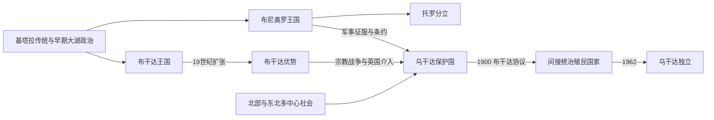

# 乌干达的前殖民社会与殖民统治

## 时间

古代—1962年

## 概括

乌干达地区由大湖王国和北部尼罗特社会共同构成。布尼奥罗曾控制盐场和广阔属地，19世纪布干达凭军队、独木舟舰队和地方官制扩张；安科莱、托罗、布索加等也有不同政治结构。

## 历史演进

## 王国形成与治理机制

布尼奥罗凭基巴莱高原、基布罗盐场和跨湖贸易形成较早的奇塔拉王权传统，国王“奥穆卡马”通过王族、地方首领与仪式维系广阔但松散的属地。布干达在17—19世纪逐步扩大，卡巴卡任免“巴孔古”“巴通戈莱”等官员，以贡赋、军队和维多利亚湖独木舟舰队绕开世袭氏族限制。安科莱的牧业王权、托罗的分立王室、布索加诸酋邦以及北方年龄组和谱系联盟各有制度，后来被英国置于同一行政边界内。

## 主要社会与政权

| 社会或政权 | 大致时期 | 特征 |
|---|---|---|
| 布尼奥罗—基塔拉 | 约14—19世纪 | 大湖西部王国、盐业和巴奇韦齐传统 |
| 布干达王国 | 约17世纪以后 | 卡巴卡王权、行政任命和维多利亚湖舰队 |
| 安科莱与托罗 | 近代 | 牛牧王权与从布尼奥罗分立的王国 |
| 阿乔利、兰戈、卡拉莫贾等社会 | 北部与东北 | 谱系、年龄组、牧业和地方联盟 |

## 殖民统治或外来占领

19世纪阿拉伯—斯瓦希里商人和基督教传教士进入布干达，宗教派系战争改变宫廷。英国东非公司介入，1894年建立保护国，1900年《布干达协议》以土地分配和地方首领确立间接统治，同时把其他地区纳入以布干达为行政中心的殖民国家。

## 宗教战争、征服与殖民统治过程

1870年代穆斯林商人、英国圣公会和法国天主教传教士先后进入布干达宫廷。姆旺加二世试图限制外来派系，1888—1892年穆斯林、天主教与新教集团围绕王位和土地交战；英国东非公司军官卢加德凭火器支持新教派，在门戈战斗后占优。公司无力长期负担，英国1894年宣布保护国，并借布干达军队征服布尼奥罗等地。1900年《布干达协议》确认卡巴卡与卢基科议会、把大片土地转为“迈洛”私有地，并以地方首领征税；布尼奥罗的“失地郡”则加深地区怨恨。

殖民政府随后把棉花作为现金作物，用人头税、道路劳役和受任首领扩大统治；亚洲商人和铁路网络连接东非市场。二战后合作社、城市工会和民族主义政党兴起，布干达要求特殊地位，中央主义政党则主张统一。1950年代卡巴卡危机与制宪谈判最终形成独立时的联邦、半联邦混合安排。

## 重要事件

- 1860年代穆特萨一世接触斯瓦希里商人与欧洲来访者。
- 1886年布干达宫廷处死多名基督徒，后来被尊为乌干达殉道者。
- 1894年英国宣布乌干达保护国。
- 1900年《布干达协议》确立邮件土地制度和王国自治框架。
- 1940—1950年代棉花农民、工会和民族主义组织扩大。

## 王国兴衰与殖民转型原因

| 层次 | 主要因素 |
|---|---|
| 布干达崛起 | 湖上交通、集权官僚、军队和吸纳外来宗教与商贸资源，使其在19世纪超过布尼奥罗 |
| 布尼奥罗衰退 | 王位与边疆压力、布干达扩张、疾病和英国—布干达联军征服共同削弱领土，不能归为单一“落后”原因 |
| 殖民支柱 | 《布干达协议》、受任首领、棉花税收和王国差别待遇降低英国直接治理成本 |
| 直接转折 | 宗教派系战争给英国军事介入机会；公司移交与1894年保护国声明把商业扩张变为国家殖民统治 |

## 王朝世系与殖民权力

布干达卡巴卡、布尼奥罗奥穆卡马及相关王国的公认统治顺序、复位和年代争议见[东非王国与苏丹国统治者世系表](/%E4%BA%BA%E6%96%87%E7%A7%91%E5%AD%A6/%E5%8E%86%E5%8F%B2/%E9%9D%9E%E6%B4%B2/%E4%B8%9C%E9%9D%9E/%E4%B8%9C%E9%9D%9E%E7%8E%8B%E5%9B%BD%E4%B8%8E%E8%8B%8F%E4%B8%B9%E5%9B%BD%E7%BB%9F%E6%B2%BB%E8%80%85%E4%B8%96%E7%B3%BB%E8%A1%A8.md)。保护国最高行政权属于英国专员、后来的总督；卡巴卡、王国议会和地方首领管理土地、基层司法及征税，却受殖民法和行政否决约束，不能与独立主权君主等同。

## 演变关系

这一阶段的边界、行政与政治冲突直接影响[乌干达的独立建国与现代发展](/%E4%BA%BA%E6%96%87%E7%A7%91%E5%AD%A6/%E5%8E%86%E5%8F%B2/%E9%9D%9E%E6%B4%B2/%E4%B8%9C%E9%9D%9E/%E4%B9%8C%E5%B9%B2%E8%BE%BE/%E7%8B%AC%E7%AB%8B%E5%BB%BA%E5%9B%BD%E4%B8%8E%E7%8E%B0%E4%BB%A3%E5%8F%91%E5%B1%95.md)。
