# 乌干达的独立建国与现代发展

## 时间

1962年至今

## 概括

乌干达独立时以联邦和半联邦安排保留布干达等王国。米尔顿·奥博特1966年攻击布干达王宫并废除王国自治，伊迪·阿明1971年政变后实行暴力统治；坦桑尼亚军队和流亡者1979年推翻阿明。1986年约韦里·穆塞韦尼领导全国抵抗军掌权。

## 政治演进

```mermaid
flowchart LR
    I["1962 独立与王国联邦安排"] --> C["1966 宪政危机"]
    C --> R["1967 中央集权共和国"]
    R -->|1971 政变| A["伊迪·阿明军政"]
    A -->|1979 乌坦战争| T["多届临时政府"]
    T -->|1980 争议选举| W["丛林战争"]
    W -->|1986 全国抵抗军胜利| N["全国抵抗运动体制"]
    N -->|2005 恢复多党| M["长期总统制下的选举竞争"]
    M -->|2026 连任| P["穆塞韦尼新任期"]
```

## 建国、军政循环与权力重建

独立宪法让布干达卡巴卡穆特萨二世兼任国家总统，奥博特任总理，王国与中央各保留权限。1966年围绕军队、黄金走私调查和联邦权力的冲突导致奥博特暂停宪法、命令阿明进攻卡巴卡王宫，1967年新宪法废除王国政治地位。军队从殖民时期地区化征募中成长为政权仲裁者，阿明、奥博特复辟和短命军政府相继依赖武装。1986年全国抵抗运动以地方“抵抗委员会”、较统一军队和无党派“运动制”重建基层国家，1993年恢复传统王国的文化地位但不恢复主权。

## 主要政治阶段

| 阶段 | 时间 | 权力结构与特征 |
|---|---|---|
| 独立联邦与奥博特 | 1962—1971年 | 王国与中央冲突，1967年建立共和国和中央集权 |
| 阿明与第二次奥博特时期 | 1971—1985年 | 大规模国家暴力、经济破坏和游击战争 |
| 全国抵抗运动时期 | 1986年至今 | 恢复秩序和增长，长期执政与多党制度并存 |

## 暴力政权、战争与长期执政过程

阿明1971年趁奥博特出访政变，清洗军队、秘密警察和大规模失踪造成严重伤亡；1972年驱逐亚洲裔居民及企业没收破坏商业网络。1978年乌军进入坦桑尼亚卡盖拉地区，坦军与乌干达流亡武装反攻，1979年占领坎帕拉。1980年选举被反对派指为操纵，穆塞韦尼发动“丛林战争”；政府军反叛乱和派系冲突重创卢韦罗三角，1985年奥博特再遭军变，翌年全国抵抗军取胜。

新政府恢复经济和行政，但北部圣灵运动、圣主抵抗军等叛乱持续二十余年，军队也介入刚果战争。2005年公投恢复多党，同年取消总统任期限制；2017年又取消年龄上限。选举、网络管制和反对派受压引发争议。穆塞韦尼在2026年总统选举后进入2026—2031年任期，政权延续与代际交接仍是核心问题。

## 重要转折

- 1962年10月9日独立。
- 1966年奥博特与布干达决裂，次年废除传统王国政治权力。
- 1971年阿明政变；1972年驱逐大批亚洲裔居民。
- 1978—1979年乌坦战争推翻阿明。
- 1986年全国抵抗军占领坎帕拉，北部随后出现长期叛乱。

## 政权兴衰与延续原因

- **早期宪制崩溃**：王国特殊地位与中央统一目标冲突，军队政治化和个人权力竞争把可谈判矛盾转为武力摊牌。
- **阿明垮台**：国家暴力、经济崩坏和军队派系化削弱内部支持，入侵坦桑尼亚则成为直接触发外部反攻的因素。
- **全国抵抗运动崛起**：游击区基层组织、军纪叙事、对旧军政循环的厌倦及地区盟友帮助其夺权。
- **长期延续**：执政党组织、军队、行政资源和经济稳定构成支柱；青年人口、腐败、土地和政治竞争限制合法性。

## 国家元首、政府首脑与实际权力

独立以来完整总统、临时委员会和总理序列见[东非独立国家元首与权力结构表](/%E4%BA%BA%E6%96%87%E7%A7%91%E5%AD%A6/%E5%8E%86%E5%8F%B2/%E9%9D%9E%E6%B4%B2/%E4%B8%9C%E9%9D%9E/%E4%B8%9C%E9%9D%9E%E7%8B%AC%E7%AB%8B%E5%9B%BD%E5%AE%B6%E5%85%83%E9%A6%96%E4%B8%8E%E6%9D%83%E5%8A%9B%E7%BB%93%E6%9E%84%E8%A1%A8.md)。截至2026年7月14日，约韦里·穆塞韦尼任总统，是武装力量、执政党和重大政策的核心；罗比娜·纳班贾任总理，负责协调内阁与政府执行。议会、法院和文化王国各有职能，但传统君主不行使国家主权。

## 演变关系

前接[乌干达的前殖民社会与殖民统治](/%E4%BA%BA%E6%96%87%E7%A7%91%E5%AD%A6/%E5%8E%86%E5%8F%B2/%E9%9D%9E%E6%B4%B2/%E4%B8%9C%E9%9D%9E/%E4%B9%8C%E5%B9%B2%E8%BE%BE/%E5%89%8D%E6%AE%96%E6%B0%91%E7%A4%BE%E4%BC%9A%E4%B8%8E%E6%AE%96%E6%B0%91%E7%BB%9F%E6%B2%BB.md)。现代国家同时受到大湖区、非洲之角或印度洋跨境网络影响。
