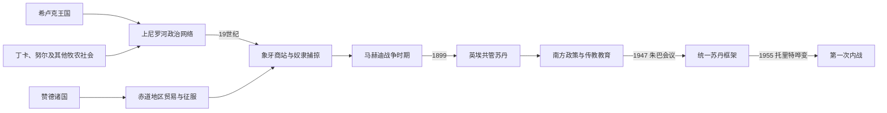

# 南苏丹的前殖民社会与殖民统治

## 时间

古代—1956年

## 概括

南苏丹拥有丁卡、努尔、希卢克、赞德、巴里等多种社会。希卢克形成以雷特王为中心的尼罗河王国，赞德建立地方君主体系，丁卡和努尔则多以谱系、年龄组和牛牧关系组织，不宜用“无国家”简单等同缺乏政治秩序。

## 历史演进

## 社会形成与治理机制

南苏丹各社会的国家形态差异很大。希卢克的“雷特”王权以王室仪式、河岸聚落和军事征收维系；赞德诸国由阿万加拉王族任命地方首领并吸收被征服群体。丁卡、努尔等群体没有覆盖全族的常设中央政府，却通过分支谱系、先知、年龄组、牛群关系和赔偿规则组织政治秩序。苏德沼泽、季节洪水和稀疏交通限制外来国家深入，也使不同群体在贸易、迁徙和冲突中长期保持多中心格局。

## 主要社会与政权

| 社会或政权 | 大致时期 | 特征 |
|---|---|---|
| 希卢克王国 | 约16世纪以后 | 白尼罗河王权与河岸农业 |
| 赞德诸国 | 18—19世纪 | 阿万加拉王族与地方行政 |
| 丁卡、努尔牧农社会 | 长期存在 | 牛群、谱系、年龄组和季节迁徙 |
| 巴里等赤道社会 | 长期存在 | 河谷农业和区域贸易 |

## 殖民统治或外来占领

19世纪土耳其—埃及统治和商人深入上尼罗河，象牙与奴隶捕掠造成破坏。马赫迪国家后，英埃共管苏丹实行“南方政策”，限制北南交流并扩大传教教育；1940年代又转向统一苏丹，南方代表担忧行政与教育差距。

## 外来征服与殖民治理的具体过程

1820年代土耳其—埃及政权占领北苏丹后，商人和军官沿白尼罗河南进；19世纪中叶“扎里巴”武装商站把象牙收购、奴隶捕掠和私人军队结合，破坏人口与地方权力。马赫迪国家在1880年代推翻土埃统治，但对南部的控制依赖远征且并不稳定。1899年英埃共管建立后，英国官员以军事“平定”、首领法庭和税收逐步扩张，1920—1930年代的南方政策限制阿拉伯语、北方商人和人员流动，并让基督教传教团承担多数教育。

二战后殖民当局为统一独立进程，突然放弃分隔政策。1947年朱巴会议接受南方加入统一立法框架，但南方代表人数、教育和官僚经验明显不足；联邦保障未落实，北方官员快速接替殖民职位。1955年托里特南方部队因调防和政治恐惧哗变，成为内战的直接开端，说明殖民退出没有完成可信的权力交接。

## 重要事件

- 19世纪中叶象牙商站和奴隶军队深入苏德沼泽与赤道地区。
- 1880年代马赫迪运动推翻土埃统治，但对南部控制不均。
- 1899年英埃共管苏丹建立。
- 1947年朱巴会议决定南部参与统一苏丹政治框架。
- 1955年托里特南方士兵哗变，第一次苏丹内战在独立前夕爆发。

## 政治转型原因

| 层次 | 主要因素 |
|---|---|
| 结构因素 | 生态与交通造成多中心政治；奴隶捕掠摧毁信任；殖民时期南北教育和行政投入严重不均 |
| 统治机制 | 共管政府依靠少数官员、传教学校和受任首领，边界安全优先于代表性制度建设 |
| 外部压力 | 北苏丹民族主义推动快速统一独立，英埃竞争使南方安排缺乏长期承诺 |
| 直接触发 | “南方政策”突然逆转、职位北方化、联邦承诺落空和托里特部队调防共同引爆1955年兵变 |

## 统治者与殖民行政权力

希卢克雷特、赞德阿万加拉等可考统治序列及口述传统争议见[东非王国与苏丹国统治者世系表](/%E4%BA%BA%E6%96%87%E7%A7%91%E5%AD%A6/%E5%8E%86%E5%8F%B2/%E9%9D%9E%E6%B4%B2/%E4%B8%9C%E9%9D%9E/%E4%B8%9C%E9%9D%9E%E7%8E%8B%E5%9B%BD%E4%B8%8E%E8%8B%8F%E4%B8%B9%E5%9B%BD%E7%BB%9F%E6%B2%BB%E8%80%85%E4%B8%96%E7%B3%BB%E8%A1%A8.md)；丁卡、努尔等不应强套全国君主表。英埃共管名义上由英埃共同主权管理，实际南部行政主要由英国总督体系、地方区专员和受任首领执行；传教团掌握大量教育与医疗资源，却不是殖民主权机关。

## 演变关系

这一阶段的边界、行政与政治冲突直接影响[南苏丹的独立建国与现代发展](/%E4%BA%BA%E6%96%87%E7%A7%91%E5%AD%A6/%E5%8E%86%E5%8F%B2/%E9%9D%9E%E6%B4%B2/%E4%B8%9C%E9%9D%9E/%E5%8D%97%E8%8B%8F%E4%B8%B9/%E7%8B%AC%E7%AB%8B%E5%BB%BA%E5%9B%BD%E4%B8%8E%E7%8E%B0%E4%BB%A3%E5%8F%91%E5%B1%95.md)。
