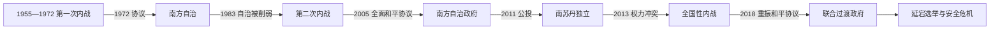

# 南苏丹的独立建国与现代发展

## 时间

2011年至今

## 概括

南方两次长期内战围绕自治、资源、宗教国家化和政治排斥展开。2005年《全面和平协议》建立自治政府和独立公投安排，2011年南苏丹建国；2013年领导层冲突演变为内战并被族群化，2018年和平协议建立权力分享过渡。

## 政治演进

## 独立运动与国家权力结构

第一次内战中的阿尼亚尼亚武装以地区自治为目标，1972年协议把南方合为自治区域并吸收部分战士。1983年中央分割南方、推行伊斯兰法并重启博尔运河等争议后，约翰·加朗创建苏丹人民解放运动，最初主张重建世俗“新苏丹”，战争中又容纳独立诉求。2005年协议建立南方自治政府、石油分成和公投机制；加朗去世后萨尔瓦·基尔接任。独立后的总统制把军队、执政党和州级任命集中于总统，但反对派、地方武装和传统权威仍控制部分实际治理。

## 主要政治阶段

| 阶段 | 时间 | 权力结构与特征 |
|---|---|---|
| 第一次内战与自治 | 1955—1983年 | 阿尼亚尼亚反叛，1972年亚的斯亚贝巴协议给予南方自治 |
| 第二次内战与和平协议 | 1983—2005年 | 苏丹人民解放运动争取新苏丹或南方自决 |
| 独立共和国与内战 | 2011年至今 | 国家机构薄弱，2013年冲突后推进权力分享和平进程 |

## 两次内战、独立与再度内战的具体过程

1972年自治结束第一次战争，却没有解决石油、边界和全国政体问题。尼迈里政府1983年废弃核心安排后，第二次内战扩展；运动内部在1991年分裂，平民屠杀和地区代理战争加深族群化。2005年《全面和平协议》在国际调停下停战，2011年公投以压倒性多数支持独立。新国家继承有限道路、行政和税收体系，石油又必须经苏丹管道出口；2012年停产争端迅速打击财政。

2013年基尔与前副总统里克·马沙尔的权力冲突在朱巴爆发，军队分裂并沿丁卡—努尔身份动员，战争、饥荒和流离失所蔓延。2015年协议失败后，2018年“重振协议”规定联合政府、统一军队、制宪与选举；2020年联合过渡政府成立，但安全部门整合和地方冲突进展缓慢。2025年马沙尔被暂停履职并面临审判，和平安排再受冲击；截至2026年7月14日，首次全国大选宣布于2026年12月22日举行，尚未发生。

## 重要转折

- 1972年亚的斯亚贝巴协议结束第一次内战。
- 1983年南方自治被削弱，苏丹人民解放军成立。
- 2005年全面和平协议结束第二次内战。
- 2011年公投后于7月9日独立。
- 2013年政治冲突转为全国内战，2018年重振和平协议确立过渡安排。

## 国家危机与延续原因

- **结构因素**：殖民发展不足、战争形成的军事化精英、石油单一财政、跨苏丹管道依赖及地方土地冲突限制国家能力。
- **外部压力**：苏丹内战和边界争端、邻国调停与武器流动、国际援助条件共同影响派系选择。
- **直接触发**：1983年自治安排被废引发第二次战争；2013年执政党继承争执和总统卫队分裂引爆独立后内战。
- **和平延宕**：职位分享降低首都冲突，却未完成统一军队、问责、宪法和稳定财政，地方暴力因而持续。

## 国家元首、政府首脑与实际权力

完整自治时期与独立后领导序列见[东非独立国家元首与权力结构表](/%E4%BA%BA%E6%96%87%E7%A7%91%E5%AD%A6/%E5%8E%86%E5%8F%B2/%E9%9D%9E%E6%B4%B2/%E4%B8%9C%E9%9D%9E/%E4%B8%9C%E9%9D%9E%E7%8B%AC%E7%AB%8B%E5%9B%BD%E5%AE%B6%E5%85%83%E9%A6%96%E4%B8%8E%E6%9D%83%E5%8A%9B%E7%BB%93%E6%9E%84%E8%A1%A8.md)。截至2026年7月14日，萨尔瓦·基尔任总统并兼具国家元首、政府首脑和武装力量统帅地位，内阁没有独立于总统的总理。副总统席位、州长、军队派系、苏丹人民解放运动各派及传统首领共同影响实际权力；马沙尔的停职与审判使2018年设计的分享机制处于严重不确定状态。

## 演变关系

前接[南苏丹的前殖民社会与殖民统治](/%E4%BA%BA%E6%96%87%E7%A7%91%E5%AD%A6/%E5%8E%86%E5%8F%B2/%E9%9D%9E%E6%B4%B2/%E4%B8%9C%E9%9D%9E/%E5%8D%97%E8%8B%8F%E4%B8%B9/%E5%89%8D%E6%AE%96%E6%B0%91%E7%A4%BE%E4%BC%9A%E4%B8%8E%E6%AE%96%E6%B0%91%E7%BB%9F%E6%B2%BB.md)。现代国家同时受到大湖区、非洲之角或印度洋跨境网络影响。
