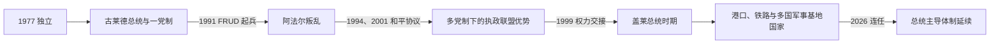

# 吉布提的独立建国与现代发展

## 时间

1977年至今

## 概括

吉布提独立后由伊萨政治精英主导一党国家，阿法尔不满在1991年引发内战。和平协议后逐步实行多党制。国家凭借港口、亚丁湾航线和外国军事基地获得收入，同时受水资源、就业和地区不平等限制。

## 政治演进

## 建国与权力平衡机制

独立联盟领袖哈桑·古莱德·阿普蒂敦成为首任总统，人民进步联盟很快成为唯一合法政党。政府以总统府、执政党、军队和行政任命维持伊萨主导，同时通过总理等职位吸纳阿法尔精英。1992年宪法恢复有限多党竞争，1994、2001年和平协议把恢复团结与民主阵线的主要派别纳入政治和军队。1999年伊斯梅尔·奥马尔·盖莱通过选举接班，但执政联盟对议会、资源和媒体仍占显著优势。

## 主要政治阶段

| 阶段 | 时间 | 权力结构与特征 |
|---|---|---|
| 古莱德一党时期 | 1977—1991年 | 人民进步联盟主导，依赖法国安全支持 |
| 阿法尔叛乱与和解 | 1991—2001年 | 恢复团结与民主阵线起兵，分阶段签署和平协议 |
| 港口与基地国家 | 2001年至今 | 执政党优势、多国军事存在和基础设施扩张 |

## 内战、和解与基地经济的具体过程

1991年阿法尔主导的恢复团结与民主阵线在北部起兵，军队一度失去大片内陆；法国调停与军事压力促使政府开放政党体系。1994年主流派停火并加入政府，残余武装在2001年签署最终协议，国家避免全面崩溃，但地区发展和职位分配仍是政治核心。21世纪集装箱港、自由区、通往埃塞俄比亚的新铁路和输水工程扩大财政来源；法国、美国、日本、中国等国设基地，使安全租金成为经济支柱，也让外交需要精细平衡。

2010年修宪取消总统两届限制，反对派质疑选举公平；2025年又取消候选人年龄上限。盖莱在2026年4月总统选举中再次当选。港口投资带来基础设施，却伴随债务、失业、城市贫困和对埃塞俄比亚转口需求的高度依赖。

## 重要转折

- 1977年6月27日独立。
- 1991年阿法尔主导的反对武装发动叛乱。
- 1994年主要反对派与政府签署和平协议，2001年剩余派别和解。
- 21世纪吉布提成为反海盗和国际安全行动基地，港口与埃塞俄比亚经济联系进一步加强。

## 政权延续与风险原因

- **延续机制**：执政联盟控制候选人提名、行政资源和安全机构，并以族群职位平衡及和平协议吸纳部分反对力量。
- **外部支撑**：战略海峡、外国驻军租金和埃塞俄比亚货运给中央政府稳定财政与国际伙伴。
- **结构弱点**：水资源匮乏、就业不足、首都—内陆差距和单一转口经济，使社会稳定依赖外部形势。
- **直接危机触发**：1991年战争源于阿法尔对权力排斥的武装回应；此后抗议多围绕选举规则和长期执政展开。

## 国家元首、政府首脑与实际权力

完整名单见[东非独立国家元首与权力结构表](/%E4%BA%BA%E6%96%87%E7%A7%91%E5%AD%A6/%E5%8E%86%E5%8F%B2/%E9%9D%9E%E6%B4%B2/%E4%B8%9C%E9%9D%9E/%E4%B8%9C%E9%9D%9E%E7%8B%AC%E7%AB%8B%E5%9B%BD%E5%AE%B6%E5%85%83%E9%A6%96%E4%B8%8E%E6%9D%83%E5%8A%9B%E7%BB%93%E6%9E%84%E8%A1%A8.md)。截至2026年7月14日，伊斯梅尔·奥马尔·盖莱任总统，是外交、安全和重大经济决策的核心；阿卜杜勒卡德尔·卡米勒·穆罕默德任总理，负责政府日常协调，但不与总统分享同等政治权威。议会、地方行政和传统首领参与执行与调解，外国军队仅按协议驻扎，不是国家主权机关。

## 演变关系

前接[吉布提的前殖民社会与殖民统治](/%E4%BA%BA%E6%96%87%E7%A7%91%E5%AD%A6/%E5%8E%86%E5%8F%B2/%E9%9D%9E%E6%B4%B2/%E4%B8%9C%E9%9D%9E/%E5%90%89%E5%B8%83%E6%8F%90/%E5%89%8D%E6%AE%96%E6%B0%91%E7%A4%BE%E4%BC%9A%E4%B8%8E%E6%AE%96%E6%B0%91%E7%BB%9F%E6%B2%BB.md)。现代国家同时受到大湖区、非洲之角或印度洋跨境网络影响。
