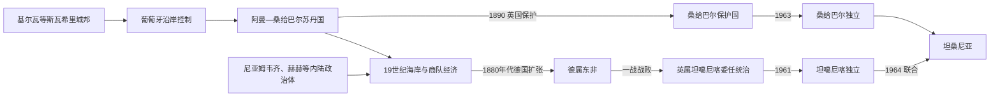

# 坦桑尼亚的前殖民社会与殖民统治

## 时间

古代—1964年

## 概括

坦桑尼亚大陆的班图农民、尼罗特牧民和采集狩猎者形成多样社会，海岸基尔瓦、巴加莫约等属于斯瓦希里印度洋网络。19世纪桑给巴尔苏丹控制沿岸贸易，尼亚姆韦齐商队和米拉姆博、姆夸瓦等内陆领袖建立新国家。

## 历史演进

## 海岸、内陆国家与统治机制

斯瓦希里港市以苏丹、商人家族、伊斯兰法和海关连接内陆黄金、象牙与印度洋市场；基尔瓦的实际控制随贸易路线而涨落。19世纪桑给巴尔布赛义德王朝把丁香种植园、奴隶劳动、海关和沿岸宗主权结合，内陆尼亚姆韦齐商队领袖则凭火器和贸易建国，米拉姆博整合乌拉姆博，姆夸瓦领导赫赫联盟。许多农业与牧业社会仍由氏族、年龄组和地方首领治理，因此今日坦桑尼亚是殖民边界整合的多政治体空间。

## 主要社会与政权

| 社会或政权 | 大致时期 | 特征 |
|---|---|---|
| 基尔瓦苏丹国 | 约10—16世纪 | 控制黄金转运与斯瓦希里海岸贸易 |
| 桑给巴尔苏丹国 | 19世纪 | 丁香种植、象牙奴隶贸易和沿岸宗主权 |
| 尼亚姆韦齐商贸国家 | 19世纪 | 塔波拉商队与米拉姆博军事政治重组 |
| 赫赫国家 | 19世纪 | 姆夸瓦领导内陆抵抗德国 |

## 殖民统治或外来占领

德国1880年代通过公司和条约建立德属东非，镇压阿布希里起义和赫赫抵抗。1905—1907年马吉马吉起义席卷南部，殖民焦土政策造成饥荒。德国一战战败后，英国取得坦噶尼喀委任统治；桑给巴尔仍为英国保护下苏丹国。

## 德国征服、英国委任与桑给巴尔保护过程

卡尔·彼得斯1884—1885年以含义可疑的“保护条约”取得内陆主张，德国政府随后承认公司特许；1888年公司接管桑给巴尔苏丹沿岸税关，引发阿布希里起义，帝国海军和殖民军镇压后于1891年改为直接统治。赫赫在1891年卢加洛伏击德军，抵抗延续至姆夸瓦1898年身亡。1905年南部民众以“马吉”信仰联合反抗棉花强制种植、税役与首领暴政；德军焦土镇压及饥荒造成巨大死亡，随后调整农业政策。

一战德军以游击牵制协约国，战后大陆成为英国的国际联盟委任地；英国以间接统治、合作社和咖啡、棉花、剑麻出口维持财政。桑给巴尔自1890年为英国保护国，苏丹和行政机关保留，英国驻扎官掌握实际外交与安全。坦噶尼喀民族联盟通过斯瓦希里语群众组织和平推进自治，1961年大陆独立；桑给巴尔在族群化政党竞争下于1963年以苏丹君主制独立。

## 重要事件

- 约13—15世纪基尔瓦依靠黄金贸易达到繁荣。
- 1840年阿曼苏丹把宫廷重心迁至桑给巴尔。
- 1888—1889年阿布希里起义反对德国沿岸接管。
- 1905—1907年马吉马吉起义及镇压造成大规模死亡。
- 1954年尼雷尔领导坦噶尼喀非洲民族联盟组织群众独立运动。

## 政权兴衰与殖民转型原因

| 层次 | 主要因素 |
|---|---|
| 海岸繁荣 | 季风航海、黄金象牙转运、伊斯兰商贸法和港口税支撑城邦与桑给巴尔王权 |
| 本地政权压力 | 商路改道、葡萄牙与阿曼竞争、奴隶—象牙经济暴力和内陆火器国家兴起不断重组权力 |
| 殖民支柱 | 德国公司条约、殖民军与强制生产，英国的受任首领和出口合作社，分别构成两种治理方式 |
| 直接终结 | 德国因一战战败失去殖民地；英国战后去殖民化、民族联盟组织和联合国监督促成大陆独立，桑给巴尔则经选举和制宪独立 |

## 王朝世系与殖民行政首脑

基尔瓦可考苏丹、桑给巴尔布赛义德王朝及内陆领袖序列见[东非王国与苏丹国统治者世系表](/%E4%BA%BA%E6%96%87%E7%A7%91%E5%AD%A6/%E5%8E%86%E5%8F%B2/%E9%9D%9E%E6%B4%B2/%E4%B8%9C%E9%9D%9E/%E4%B8%9C%E9%9D%9E%E7%8E%8B%E5%9B%BD%E4%B8%8E%E8%8B%8F%E4%B8%B9%E5%9B%BD%E7%BB%9F%E6%B2%BB%E8%80%85%E4%B8%96%E7%B3%BB%E8%A1%A8.md)，证据不足者明确标“约”或有争议。德属东非由总督和“防卫军”掌权；英国坦噶尼喀由总督在委任/托管监督下治理。桑给巴尔苏丹是名义君主，英国驻扎官、后来的高级专员控制保护国关键事务，二者不可合并为同一权力角色。

## 演变关系

这一阶段的边界、行政与政治冲突直接影响[坦桑尼亚的独立建国与现代发展](/%E4%BA%BA%E6%96%87%E7%A7%91%E5%AD%A6/%E5%8E%86%E5%8F%B2/%E9%9D%9E%E6%B4%B2/%E4%B8%9C%E9%9D%9E/%E5%9D%A6%E6%A1%91%E5%B0%BC%E4%BA%9A/%E7%8B%AC%E7%AB%8B%E5%BB%BA%E5%9B%BD%E4%B8%8E%E7%8E%B0%E4%BB%A3%E5%8F%91%E5%B1%95.md)。
