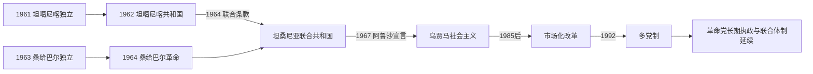

# 坦桑尼亚的独立建国与现代发展

## 时间

1961—1964年至今

## 概括

坦噶尼喀1961年独立，桑给巴尔1963年独立后于1964年发生革命，随后两地联合为坦桑尼亚。尼雷尔1967年《阿鲁沙宣言》推动乌贾马社会主义和村庄化；经济困难后逐步市场化，1992年恢复多党制。

## 政治演进

## 联合国家与双层权力结构

坦噶尼喀独立后先以英国君主为元首、尼雷尔任总理，1962年改共和国。桑给巴尔1963年由苏丹、政府和议会构成独立君主国，1964年革命委员会推翻苏丹；同年《联合条款》建立联合共和国。联合政府管理外交、国防、货币等联合事务，桑给巴尔总统和革命政府管理岛内非联合事务，大陆则没有对等的独立政府。1977年大陆民族联盟与桑给巴尔非洲—设拉子党合并为革命党，党组织长期连接两套政府与议会。

## 主要政治阶段

| 阶段 | 时间 | 权力结构与特征 |
|---|---|---|
| 独立与联合 | 1961—1964年 | 坦噶尼喀共和国、桑给巴尔革命及联合共和国形成 |
| 乌贾马社会主义 | 1967—1985年 | 国有化、教育扩张、村庄化和非洲解放外交 |
| 市场改革与多党制 | 1985年至今 | 经济开放、选举竞争和联合体制延续 |

## 革命、联合与政策转型过程

桑给巴尔独立选举中议席与得票分布不一致，加上土地、族群和历史等级矛盾，1964年1月革命迅速推翻苏丹，伴随严重杀戮与外逃。尼雷尔与革命委员会主席阿贝德·卡鲁姆在冷战安全和泛非联合背景下谈判，4月完成联合；联合解决部分外交风险，却留下权限、财政和身份争议。1967年《阿鲁沙宣言》国有化银行和大企业，强调自力更生；教育与医疗覆盖扩大，强制村庄化、国企低效、石油冲击和乌坦战争则加重财政危机。

尼雷尔1985年退休后，政府与国际金融机构合作推进市场改革；1992年恢复多党，但革命党凭全国组织、国家建构声望和反对派分散保持优势。桑给巴尔1995、2000、2015等选举多次出现争议与对峙，联合框架仍延续。马古富力2015—2021年强化基建和总统治理，去世后副总统萨米娅·苏卢胡·哈桑依宪继任；她在2025年选举后继续执政，反对派参与条件和选举过程仍有争议。

## 重要转折

- 1961年12月9日坦噶尼喀独立。
- 1964年1月桑给巴尔革命推翻苏丹，4月与坦噶尼喀联合。
- 1967年《阿鲁沙宣言》确立自力更生和社会主义路线。
- 1978—1979年坦桑尼亚军队反击乌干达入侵并推翻阿明。
- 1992年修宪恢复多党政治。

## 政策兴衰与体制延续原因

- **联合形成**：桑给巴尔革命后的安全脆弱、冷战干预担忧和尼雷尔的泛非理念共同促成，不能视为大陆单方面吞并。
- **乌贾马得失**：共同语言、基层党组织和公共服务推动民族整合；强制迁村、低生产激励、外部价格冲击和战争导致经济路线难以持续。
- **革命党优势**：斯瓦希里国家认同、广泛地方组织、和平接班和行政资源提供延续条件，多党竞争则持续检验其开放程度。
- **结构风险**：青年就业、公共债务、资源收益分配和联合权限争议仍可能触发社会与岛陆政治紧张。

## 国家元首、政府首脑与实际权力

坦噶尼喀、联合共和国及总理的完整序列见[东非独立国家元首与权力结构表](/%E4%BA%BA%E6%96%87%E7%A7%91%E5%AD%A6/%E5%8E%86%E5%8F%B2/%E9%9D%9E%E6%B4%B2/%E4%B8%9C%E9%9D%9E/%E4%B8%9C%E9%9D%9E%E7%8B%AC%E7%AB%8B%E5%9B%BD%E5%AE%B6%E5%85%83%E9%A6%96%E4%B8%8E%E6%9D%83%E5%8A%9B%E7%BB%93%E6%9E%84%E8%A1%A8.md)。截至2026年7月14日，萨米娅·苏卢胡·哈桑任联合共和国总统，是国家元首、政府首脑和武装力量统帅；姆维古卢·恩琴巴任总理，领导政府日常执行。桑给巴尔总统、革命委员会和众议院处理岛内非联合事务，因而国家实际权力必须同时理解联合层与桑给巴尔自治层。

## 演变关系

前接[坦桑尼亚的前殖民社会与殖民统治](/%E4%BA%BA%E6%96%87%E7%A7%91%E5%AD%A6/%E5%8E%86%E5%8F%B2/%E9%9D%9E%E6%B4%B2/%E4%B8%9C%E9%9D%9E/%E5%9D%A6%E6%A1%91%E5%B0%BC%E4%BA%9A/%E5%89%8D%E6%AE%96%E6%B0%91%E7%A4%BE%E4%BC%9A%E4%B8%8E%E6%AE%96%E6%B0%91%E7%BB%9F%E6%B2%BB.md)。现代国家同时受到大湖区、非洲之角或印度洋跨境网络影响。
