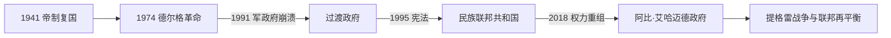

# 埃塞俄比亚的独立建国与现代发展

## 时间

1941年恢复主权至今

## 概括

海尔·塞拉西1941年复位，推动中央集权和国际外交，但土地与民族问题未解决。1974年德尔格军政府推翻帝制，实行社会主义、土地改革与红色恐怖；1991年埃塞俄比亚人民革命民主阵线掌权，1995年建立民族联邦制。

## 政治演进

## 统治机制与国家重建

复位后的帝国以皇帝、宫廷和任命官僚为中心，扩充学校、军队与国际组织外交，却未完成土地再分配。德尔格以军官委员会和工人党组织垄断权力，土地国有化扩大国家渗透，也以红色恐怖和强制迁村压制反对。1991年后，提格雷人民解放阵线为核心的执政联盟把族群—语言边界制度化为联邦州，并以执政党网络、发展计划和安全机构协调中央与地方；2018年以后旧联盟瓦解，繁荣党试图重建跨族群中央权威。

## 主要政治阶段

| 阶段 | 时间 | 权力结构与特征 |
|---|---|---|
| 海尔·塞拉西复位时期 | 1941—1974年 | 帝制现代化、厄立特里亚合并与学生反对运动 |
| 德尔格军政府 | 1974—1991年 | 社会主义军事统治、红色恐怖、战争与饥荒 |
| 民族联邦共和国 | 1991年至今 | 民族州联邦、发展型国家与中央—地区冲突 |

## 具体过程与关键冲突

1940年代至1960年代，皇帝收回战时被英国限制的主权，推动厄立特里亚联邦并最终吞并，但土地集中、地区不平等和继承问题日益尖锐。1974年兵变、物价上涨、饥荒曝光与学生运动共同击穿帝制合法性；德尔格废帝后内部清洗，1977—1978年在苏联和古巴支援下击退索马里，却长期面对厄立特里亚、提格雷等武装。1980年代战争、旱灾、征粮和迁村放大饥荒，1991年反政府联盟进入首都。

联邦制一度容纳地区自治并支撑快速增长，但选举空间收缩、土地与族群边界冲突积累。2018年阿比·艾哈迈德出任总理，释放政治犯并与厄立特里亚和解；中央与提格雷地区领导层随后决裂，2020—2022年战争造成严重人道灾难，《比勒陀利亚协议》停止大规模战事。此后阿姆哈拉、奥罗米亚等地安全冲突、财政与联邦权责仍是国家整合难题。

## 重要转折

- 1941年海尔·塞拉西返回亚的斯亚贝巴。
- 1952年厄立特里亚与埃塞俄比亚结成联邦，1962年被正式吞并。
- 1974年德尔格废黜皇帝，1975年宣布土地国有。
- 1991年德尔格垮台，厄立特里亚力量取得事实独立。
- 1995年新宪法建立民族联邦结构；21世纪中央与地方权力矛盾持续。

## 兴衰、危机与延续原因

- **帝制衰落的结构因素**：土地高度集中、地方差异和有限政治参与使现代化收益分配失衡；军队、学生与官僚都产生改革诉求。
- **德尔格垮台的外部与内部压力**：持续内战、饥荒治理失败、苏联援助收缩和反对武装协同，使军政府在1991年失去军政支点。
- **联邦冲突的直接触发**：执政联盟重组、地方选举与中央合法性争执、军队指挥权竞争，把长期制度矛盾推向战争。
- **国家延续条件**：高原国家传统、行政体系、非盟总部带来的外交中心地位，以及全国市场仍支撑统一框架。

## 国家元首、政府首脑与实际权力

帝制终结后的完整国家元首与政府首脑序列见[东非独立国家元首与权力结构表](/%E4%BA%BA%E6%96%87%E7%A7%91%E5%AD%A6/%E5%8E%86%E5%8F%B2/%E9%9D%9E%E6%B4%B2/%E4%B8%9C%E9%9D%9E/%E4%B8%9C%E9%9D%9E%E7%8B%AC%E7%AB%8B%E5%9B%BD%E5%AE%B6%E5%85%83%E9%A6%96%E4%B8%8E%E6%9D%83%E5%8A%9B%E7%BB%93%E6%9E%84%E8%A1%A8.md)。截至2026年7月14日，塔耶·阿茨克·塞拉西任联邦总统，主要承担礼仪和宪法性职能；总理阿比·艾哈迈德领导内阁、执政党与联邦安全决策，是实际政府首脑。联邦州政府、议会、军队与地区政治组织各有权力，不能仅以总统名单概括国家运行。

## 演变关系

前接[埃塞俄比亚的前殖民社会与殖民统治](/%E4%BA%BA%E6%96%87%E7%A7%91%E5%AD%A6/%E5%8E%86%E5%8F%B2/%E9%9D%9E%E6%B4%B2/%E4%B8%9C%E9%9D%9E/%E5%9F%83%E5%A1%9E%E4%BF%84%E6%AF%94%E4%BA%9A/%E5%89%8D%E6%AE%96%E6%B0%91%E7%A4%BE%E4%BC%9A%E4%B8%8E%E6%AE%96%E6%B0%91%E7%BB%9F%E6%B2%BB.md)。现代国家同时受到大湖区、非洲之角或印度洋跨境网络影响。
