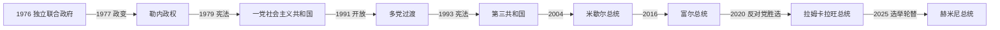

# 塞舌尔的独立建国与现代发展

## 时间

1976年至今

## 概括

塞舌尔1976年独立，詹姆斯·曼卡姆任总统；1977年弗朗斯-阿尔贝·勒内政变，建立社会主义和一党体制。1993年恢复多党宪政，国家依靠旅游、渔业和海洋经济，并在2020年首次由反对党赢得总统职位。

## 政治演进

## 建国、政变与宪政机制

独立宪法设总统制，曼卡姆任总统、勒内任总理，两党共享政府却在外交和社会路线方面对立。1977年曼卡姆出访时，勒内支持者夺取警察、广播和政府机关；1979年宪法确立塞舌尔人民进步阵线为唯一政党，总统、党和安全机构合一。政府扩大教育、医疗和住房，同时限制反对派。1991年在冷战结束与内外压力下开放政党，1993年新宪法以直选总统、国民议会和司法组成第三共和国。

## 主要政治阶段

| 阶段 | 时间 | 权力结构与特征 |
|---|---|---|
| 独立与1977年政变 | 1976—1979年 | 短暂联合政府后勒内夺权 |
| 一党社会主义 | 1979—1993年 | 塞舌尔人民进步阵线主导、社会福利扩张 |
| 多党第三共和国 | 1993年至今 | 竞争性选举、旅游经济与政权轮替 |

## 政变未遂、经济调整与两次轮替过程

1981年南非背景的雇佣兵伪装游客入境，因机场武器暴露而政变失败；1982年军中兵变也被平定，促使安全体制进一步集中。1990年代多党恢复后，勒内及其继承者凭福利政绩、组织资源和反对派分裂继续胜选。旅游和渔业取代传统种植园成为外汇核心，2008年债务与外汇危机后，政府在国际援助下实行汇率、财政和国企改革。

2016年反对党先赢得议会多数，丹尼·富尔依宪继任总统并与反对派共治。2020年瓦韦尔·拉姆卡拉旺胜选，实现独立后首次反对党接管总统职位；2025年选举又由联合塞舌尔党的帕特里克·埃尔米尼获胜并和平就职，显示轮替已能通过选票完成。小岛经济仍易受旅游中断、气候变化、毒品与海洋资源治理影响。

## 重要转折

- 1976年6月29日独立。
- 1977年勒内在曼卡姆出访时发动政变。
- 1981年雇佣兵政变未遂。
- 1991年宣布恢复多党制，1993年新宪法生效。
- 2020年反对党候选人赢得总统选举，首次实现执政党轮替。

## 政权转型与制度延续原因

- **1977年政变条件**：联合政府互不信任、警察和青年组织政治化以及总统出访造成权力真空，武装夺权成为直接转折。
- **一党制延续**：社会福利、基层党组织和安全控制提供支柱；小国精英网络与外援也降低反对派组织空间。
- **民主转型**：冷战外援环境变化、国内反对力量和经济开放需求促成1991—1993年谈判。
- **轮替巩固**：选举机构、议会制衡和败选方接受结果使2020、2025年两次不同方向交接未演变为政变。

## 国家元首、政府首脑与实际权力

历届总统及独立初期总理安排见[东非独立国家元首与权力结构表](/%E4%BA%BA%E6%96%87%E7%A7%91%E5%AD%A6/%E5%8E%86%E5%8F%B2/%E9%9D%9E%E6%B4%B2/%E4%B8%9C%E9%9D%9E/%E4%B8%9C%E9%9D%9E%E7%8B%AC%E7%AB%8B%E5%9B%BD%E5%AE%B6%E5%85%83%E9%A6%96%E4%B8%8E%E6%9D%83%E5%8A%9B%E7%BB%93%E6%9E%84%E8%A1%A8.md)。截至2026年7月14日，帕特里克·埃尔米尼任总统；塞舌尔不设总理，总统同时领导内阁并掌握政府行政。国民议会、法院和地方行政构成制度制衡，军队与警察服从文官政府，不再是独立的权力职位。

## 演变关系

前接[塞舌尔的前殖民社会与殖民统治](/%E4%BA%BA%E6%96%87%E7%A7%91%E5%AD%A6/%E5%8E%86%E5%8F%B2/%E9%9D%9E%E6%B4%B2/%E4%B8%9C%E9%9D%9E/%E5%A1%9E%E8%88%8C%E5%B0%94/%E5%89%8D%E6%AE%96%E6%B0%91%E7%A4%BE%E4%BC%9A%E4%B8%8E%E6%AE%96%E6%B0%91%E7%BB%9F%E6%B2%BB.md)。现代国家同时受到大湖区、非洲之角或印度洋跨境网络影响。
