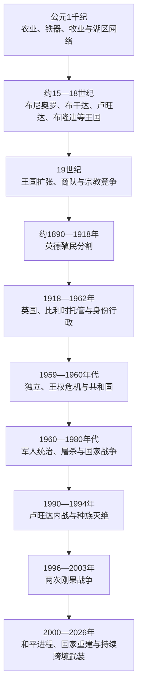

# 大湖王国、殖民统治与独立

## 时间

约公元1千纪至2026年

## 概括

维多利亚湖、阿尔伯特湖、爱德华湖、基伍湖和坦噶尼喀湖北部周围高地降雨充足、火山土肥沃，适合香蕉、谷物、豆类、畜牧和渔业，因而形成非洲人口最密集的区域之一。班图语、尼罗特语和中苏丹语社群长期迁徙、通婚与竞争；语言、生产方式和政治身份从未整齐重合。布尼奥罗、布干达、安科莱、托罗、卢旺达、布隆迪和卡拉圭等王国通过神圣王权、氏族、牛群、土地、军队和地方官建立不同程度的中央权力。

殖民者没有“创造”大湖区的王国和胡图、图西等身份，但德国、英国和比利时以所谓“含米特种族”理论解释历史，偏袒特定精英、改革首领制，并用学校、人口登记和身份证把原本具有地域、氏族、经济和政治流动性的分类种族化。英国在乌干达利用布干达扩张行政，德国及后来的比利时在卢旺达—乌隆迪强化王权和强制劳动。殖民制度、土地压力和去殖民化权力竞争共同促成1959年后卢旺达流亡、布隆迪反复屠杀和王权崩溃。

1994年卢旺达针对图西人的种族灭绝、卢旺达爱国阵线胜利及难民—武装人员进入扎伊尔，把危机扩展为两次刚果战争和延续至今的刚果东部武装冲突。截至2026年6—7月，刚果民主共和国与卢旺达虽已签署和平安排，卡塔尔多哈框架和非盟调停也提供谈判路径，得到卢旺达军支持的M23 / 刚果河联盟同刚果政府军及盟军仍有激战。大湖区历史必须把王国制度、殖民身份工程、国家安全、难民和跨境资源网络放在同一因果链中。

## 环境、人口与早期社会

公元1千纪前后，铁器农业和畜牧已在大湖区多地发展。香蕉等亚洲来源作物通过印度洋—东非网络分阶段传播，提高湿润高地的粮食承载力；其确切到达年代和对人口增长的幅度仍有争议。维多利亚湖航运、基比罗盐场、卡坦加铜、草原牛群和斯瓦希里海岸商品使湖区并不封闭。

“班图迁徙”“尼罗特迁徙”描述跨越数百年的语言与人口过程，不是两个整齐民族集团一次会战。农民可以养牛，牧民也会定居耕作；氏族常跨越后来所谓胡图、图西或不同王国边界。考古、语言、口述王统和19世纪旅行记录需要互相校验，不能把传说王朝按现代年份机械连续排列。

## 布尼奥罗—基塔拉与相邻王国

### 基塔拉与巴奇韦齐传统

大湖西部口述传统讲述巴特姆布齐、巴奇韦齐等早期统治者及广阔“基塔拉帝国”。巴奇韦齐故事解释王权礼仪、氏族起源和遗址，可能保存早期国家与牧业精英记忆，却不能证明一个拥有固定边界的庞大帝国。布尼奥罗后来的巴比托王朝常约置于15—16世纪形成，王“奥穆卡马”依靠氏族首领、宫廷官员和各地属领治理。

布尼奥罗控制阿尔伯特湖航路、基比罗盐场、铁器和同刚果盆地、尼罗河上游的贸易，17—18世纪在湖区具有优势。王族继承、属地自治、疾病和邻国扩张逐渐削弱中心。19世纪布干达取得枪支和商贸优势后夺取东部省份；英国又支持布干达及托罗等从布尼奥罗分离，布尼奥罗王卡巴雷加进行长期抵抗，1899年被俘。殖民边界和土地转移把旧区域竞争固化为乌干达内部政治。

安科莱王国以“穆加贝”为王，牧牛与农业社群通过贡赋、庇护和氏族关系相连；托罗王国19世纪从布尼奥罗分离。英国把两者都纳入保护国并保留王室。1967年乌干达废除传统王国政治地位，1993年后恢复文化王位，但不恢复主权和行政权。

## 布干达王国

### 国家结构

布干达约在维多利亚湖北岸逐步形成，王“卡巴卡”并非单靠血缘氏族统治。早期氏族首领“巴塔卡”掌土地与祖先礼仪，王室后来任命县、分县首领，建立不完全世袭的行政服务。卢基科会议、王母“纳马索莱”、王姐“卢本加”、王室侍从和舰队构成多层权力。卡巴卡可在氏族外娶妻，使众多氏族同王室建立联系；继承候选多而规则弹性，也会引发宫廷斗争。

18—19世纪，布干达利用湖上独木舟舰队、肥沃香蕉区、军役和对边缘地区掠夺扩张。布尼奥罗衰落、斯瓦希里—阿拉伯商人带来布匹和枪支，使其在穆特萨一世时期成为区域强国。穆特萨让穆斯林、圣公会和天主教使团相互制衡，同时希望获得武器与外援。

### 宗教战争与殖民介入

穆特萨1884年去世后，姆旺加二世担忧外来宗教团体形成脱离王权的青年侍从网络。1885年处死英国圣公会主教汉宁顿，1885—1887年又处死多名天主教、圣公会和穆斯林侍从，后来被称作乌干达殉道者。1888年基督徒和穆斯林派系推翻姆旺加，随后各派围绕王位和土地作战。宗教标签与首领、代际和对外联盟重叠，不是纯教义战争。

英国东非公司军官卢加德以武器支持新教派别，1892年击败天主教派系；英国1894年宣布乌干达保护国。姆旺加和布尼奥罗王卡巴雷加后来反抗，1899年同被俘流放。1900年《布干达协议》确认未成年卡巴卡、卢基科和县级首领，把土地划成“迈洛”私有地、王室地和英国王室土地。首领获得大片土地并替殖民政府征税，普通耕作者从较具习惯权利的居民转为向地主交租，国家与阶级结构被重塑。

## 卢旺达王国

### 王权扩张

卢旺达王“姆瓦米”来自尼金亚王族，王母、仪式专家、军队、牛群首领和土地首领共同维持权力。早期王表包含神话和不同支系，较可靠的中央扩张多发生在17世纪以后。19世纪基格利·鲁瓦布吉里将军队和宫廷深入西部、北部，设立土地、牛群与军政首领，形成殖民者后来接管的集中王国，但边缘地区仍有反抗。

胡图、图西和特瓦身份在殖民前真实存在，却不是外观即可确定的三个“种族”。它们同畜牧、农业、陶工、权力和家族历史有关；社会地位存在不平等，也有通婚、财富变化、效忠和地区差异。牛只庇护“乌布哈克”可把较弱者同强者相连，劳役“乌布雷特瓦”在鲁瓦布吉里时期扩张，主要压在农民身上。不能把身份浪漫化为完全自由阶级，也不能把它解释成外来图西人征服本地胡图人的固定种族史。

### 殖民身份化

德国以少量官员承认姆瓦米和首领，第一次世界大战中比利时占领。1922年卢旺达—乌隆迪成为比利时委任统治地，后转联合国托管。比利时和天主教会起初认为图西是更接近欧洲人的“含米特人”，集中任用图西首领，取消重叠的土地、牛群和军事首领，把复杂治理简化成更集中的等级链。强制劳动、咖啡种植、税收和体罚加重农民负担。

1930年代人口登记和身份证固定胡图、图西、特瓦分类。殖民后期教会与政府转而支持受教育的胡图精英，1959年王党与胡图活动者冲突升级为“社会革命”，大批图西被杀或流亡，地方首领被替换。1961年公投废除王位，1962年共和国独立。这个转向既反抗旧等级，也以集体身份惩罚平民，制造后来难民回返与权力安全困境。

## 布隆迪王国

布隆迪王“姆瓦米”由甘瓦王族的不同支系竞争产生。巴甘瓦王公、地方首领、胡图与图西家族、特瓦社群和各地区仪式中心共同构成政体。胡图、图西身份同卢旺达一样具有历史和不平等，却不能归结为两支固定种族；甘瓦内部斗争有时比胡图—图西界线更直接决定政治。

德国、后来的比利时保留王室并重组首领，强制劳动、咖啡和传教教育改变社会。殖民者的种族理论和行政偏好强化图西精英优势，但布隆迪没有完全照搬卢旺达模式。民族进步联盟领袖、王子路易·鲁瓦加索尔主张跨身份独立，1961年选举获胜后即被暗杀。布隆迪1962年以君主国独立，1966年王室政变和军人政变相继发生，末代国王恩塔雷五世被废，共和国建立。

## 卡拉圭、尼亚姆韦齐与区域网络

卡拉圭位于今坦桑尼亚西北，王“奥穆卡马”控制牛群、铁器和通往维多利亚湖的贸易，19世纪接待沿海商人与欧洲旅行者。德国殖民统治削弱王权，坦桑尼亚独立后传统政治地位消失。更南的尼亚姆韦齐并非统一王国，却以商队和酋邦网络连接塔波拉、桑给巴尔与刚果；米拉姆博19世纪用火器和结盟建立军政联盟，说明海岸商队改变内陆国家而非单向“发现”内陆。

## 殖民分割与经济重组

### 英属乌干达和肯尼亚走廊

英国以布干达为行政和军事伙伴，把其首领派往乌干达东部、北部征税和传播行政模式，造成“布干达化”反弹。棉花成为主要现金作物，亚洲商人参与轧花、零售和信贷；铁路把蒙巴萨、肯尼亚高地和维多利亚湖相连。布干达首领和农民从出口受益不均，布尼奥罗“失地”和北部征兵形成长期地区差异。

肯尼亚高地被划为欧洲定居区，吉库尤等社群失地并进入工资劳动。1952—1960年茅茅战争主要由土地、劳工和政治排除引发，武装者、殖民军及“忠诚派”之间的暴力都深入村庄。紧急状态的拘禁、酷刑和迁村加速英国改革，不能把肯尼亚独立只归因于一次宪政谈判。

### 德属东非与比利时托管

德国把坦噶尼喀、卢旺达和布隆迪纳入德属东非，实际控制依赖沿海军队、王室和首领。1905—1907年马吉马吉战争在坦噶尼喀南部爆发，虽不以大湖王国为中心，却改变整个殖民地的行政和强制作物政策。第一次世界大战后，英国取得坦噶尼喀委任统治，比利时取得卢旺达—乌隆迪。

比利时通过首领和教会推行咖啡、劳役、税收、医学和学校。道路与卫生有公共效果，制度主要服务殖民财政并以强制执行。人口增长、土地稀缺和外出劳工使社会压力上升；殖民官员把政治矛盾解释成“种族天性”，掩盖其行政选择。

## 独立与国家危机

### 坦噶尼喀、肯尼亚与乌干达

朱利叶斯·尼雷尔领导的坦噶尼喀非洲民族联盟以斯瓦希里语和全国组织推动1961年独立；1964年同桑给巴尔联合。肯尼亚1963年独立后，殖民土地分配通过“自愿买卖”部分调整，购买能力差异使土地争议延续。乌干达1962年采用联邦—准联邦妥协，总统由布干达卡巴卡穆特萨二世担任，米尔顿·奥博特任总理。

1966年奥博特与布干达围绕宪法、军权和财政决裂，军队进攻卡巴卡宫，1967年新宪法废除王国政治地位。伊迪·阿明1971年政变后实行军事统治、大规模杀戮并驱逐亚洲人；1978年入侵坦桑尼亚，坦军与乌干达流亡者1979年推翻其政权。1980年代内战后，穆塞韦尼领导的全国抵抗军1986年掌权，地方安全与经济重建推进，长期执政、选举公平和军队区域介入则成为后续争议。

### 卢旺达独立、内战与种族灭绝

卢旺达第一、第二共和国以胡图多数统治为基础，1960年代针对图西的暴力制造新难民。1973年哈比亚利马纳政变后建立一党体制，地区和家族网络掌权。流亡者在乌干达建立卢旺达爱国阵线，1990年入侵引发内战；经济危机、多党化、极端宣传和政府组织民兵使身份恐惧军事化。1993年《阿鲁沙协议》规定权力分享和部队整合，遭极端派抵制。

1994年4月6日，载有卢旺达总统哈比亚利马纳和布隆迪总统恩塔里亚米拉的飞机被击落，责任至今未有普遍接受的司法结论。总统卫队、军队、地方官员和“联攻派”等随即实施有组织的种族灭绝，主要目标是图西平民，也杀害反对屠杀的胡图及其他人。联合国部队授权和兵力不足，国际社会未及时阻止。约百日后卢旺达爱国阵线取胜，种族灭绝政权军人、民兵和平民大批逃入扎伊尔。

种族灭绝不是“古老部族仇恨”自发爆发，而是殖民身份制度、独立后排斥、战争、难民问题、精英权力危机、宣传和国家行政动员叠加的结果。战后卢旺达通过国内“加查查”法庭、国际刑事法庭、纪念和统一身份重建国家，同时政治开放、言论空间和区域军事角色受到持续争论。

### 布隆迪的暴力循环

1965年胡图军官政变失败后，军队和政权清洗胡图精英。1972年胡图武装在南部起事并杀害图西平民，米孔贝罗政府随后系统杀害大批受教育胡图和平民，常被研究者称为针对胡图的种族灭绝；死亡数字和法律定性仍有讨论。1988年、1991年又发生屠杀。

1993年首位民选胡图总统梅尔希奥·恩达达耶被图西军官杀害，引发对图西平民的屠杀和军队报复，内战持续。2000年《阿鲁沙和平与和解协议》设计族群权力分享、军队整合和过渡制度，多数武装后来加入，2005年建立新宪制。2015年总统第三任期争议引发抗议、政变失败、镇压和难民潮，显示和平配额不能替代法治和政治竞争。

## 刚果战争与跨境安全

1994年后，扎伊尔东部难民营同时容纳普通难民、前卢旺达军和种族灭绝民兵；后者跨境袭击，扎伊尔政府又长期歧视当地卢旺达语社群。1996年卢旺达、乌干达支持洛朗·卡比拉联盟推翻蒙博托，第一次刚果战争结束扎伊尔政权。1998年卡比拉同原盟友决裂，卢旺达、乌干达及多个非洲国家介入第二次刚果战争，地方武装和资源经济使战争即使在国家协议后仍延续。

刚果东部的民主力量解放军、各种马伊马伊、乌干达民主同盟军、全国保卫人民大会和M23等有不同起源，不能统称“卢旺达—刚果族群战争”。M23在2012年一度占领戈马，2021年后再次扩张；联合国多次认定卢旺达军队给予其支持，卢旺达则强调刚果境内反卢武装和自身安全。刚果政府、地方武装和外部军队也被记录有严重侵权。

2025年刚果民主共和国与卢旺达签署和平协议，M23 / 刚果河联盟同刚果政府另在多哈进程谈判。到2026年6月，联合国仍报告卢旺达军支持的M23同刚果军及“瓦扎伦多”盟军激战，停火监测和解除武装尚未落实。和平文本提供路径，却不能写成战争已经结束。

## 统治结构比较

| 政体 | 最高权力 | 制衡或地方层次 | 关键资源 |
|---|---|---|---|
| 布尼奥罗、安科莱、托罗 | 奥穆卡马 / 穆加贝 | 氏族、地方首领、王室官员 | 盐、牛群、土地和区域贸易 |
| 布干达 | 卡巴卡 | 卢基科、巴塔卡、县首领、王母与舰队 | 香蕉农业、湖运、贡赋和军役 |
| 卢旺达 | 姆瓦米 | 王母、土地 / 牛群 / 军政首领、仪式专家 | 牛群、劳役、土地和军队 |
| 布隆迪 | 姆瓦米 | 甘瓦王公、地方首领和氏族 | 农牧贡赋、地区联盟和王权仪式 |
| 殖民保护国 / 托管地 | 欧洲君主、总督或驻地官 | 国王、酋长、教会、殖民行政 | 人头税、咖啡、棉花、土地与劳役 |
| 独立共和国 | 总统、总理、议会 | 军队、政党、地方政府和传统王室 | 税收、援助、出口品和安全机构 |
| 跨境武装秩序 | 无统一合法最高权力 | 国家军队、叛军、民兵、外军和地方网络 | 矿产、边境税、土地、援助和安全庇护 |

## 重要事件

| 时间 | 事件 | 结果与长期影响 |
|---|---|---|
| 约15—16世纪 | 巴比托布尼奥罗及大湖王国形成 | 口述王统、牛群和盐—湖贸易制度化 |
| 18—19世纪 | 布干达扩张、布尼奥罗相对衰落 | 湖区权力中心东移 |
| 1885—1892年 | 布干达殉道与宗教派系战争 | 王权、传教团和外部公司介入相互强化 |
| 1894—1900年 | 乌干达保护国与《布干达协议》 | 王国首领、迈洛土地和殖民税制固定 |
| 1916—1922年 | 比利时占领并托管卢旺达—乌隆迪 | 德国间接统治转为更集中的身份—首领体系 |
| 1930年代 | 卢旺达人口登记与身份证 | 胡图、图西、特瓦身份行政固定化 |
| 1952—1960年 | 肯尼亚茅茅战争与紧急状态 | 土地、劳工和代表权危机推动殖民改革 |
| 1959—1962年 | 卢旺达革命、王位废除与独立 | 图西流亡和多数政治重组 |
| 1962—1967年 | 乌干达、卢旺达、布隆迪独立及王国危机 | 殖民边界转为共和国，传统王权多被废 |
| 1972年 | 布隆迪大规模屠杀 | 国家精英和社会结构受长期创伤 |
| 1978—1979年 | 乌坦战争 | 阿明政权被坦桑尼亚军和流亡者推翻 |
| 1990—1994年 | 卢旺达内战、阿鲁沙协议与种族灭绝 | 国家政权更替，难民与武装危机外溢 |
| 1996—2003年 | 两次刚果战争 | 多国军队和地方武装使大湖安全区域化 |
| 2000—2005年 | 布隆迪和平协议与新宪制 | 族群配额、军队整合和选举制度形成 |
| 2012、2021年后 | M23两轮扩张 | 刚果—卢旺达关系和地区安全再度恶化 |
| 2025—2026年 | 和平协议、谈判与持续战斗并存 | 有外交路径但停火、撤军和武装整合未完成 |

## 兴衰与冲突原因

### 王国崛起

- 高产香蕉农业、牛群、盐场、湖运和密集人口为王权提供稳定贡赋与军队。
- 王室通过跨氏族婚姻、仪式和任命官员削弱单一氏族垄断。
- 火器、斯瓦希里商路和传教团使19世纪对外联盟成为国内权力资源。
- 中央集权程度不一：布干达与卢旺达扩张不能代表所有大湖社会都采用同一制度。

### 现代暴力的层次

| 层次 | 因素 | 作用 |
|---|---|---|
| 结构因素 | 人口密度、土地不均、中央集权和军队政治 | 权力危机容易深入村庄和行政链 |
| 殖民遗产 | 种族理论、身份证、首领偏袒和不均教育 | 把政治—社会分类固定为集体权利与威胁 |
| 独立后制度 | 多数统治、军人政变、一党制和难民排除 | 失败者难以通过和平轮替保障安全 |
| 区域因素 | 难民营、跨境同族、武装庇护和矿产经济 | 一国冲突迅速外溢并自我融资 |
| 直接触发 | 总统遇刺、政变、军队入侵、和平协议破裂 | 把长期恐惧转为组织化屠杀或战争 |
| 外部介入 | 殖民军、邻国军队、维和与大国援助 | 可能制止暴力，也可能延长代理战争 |

## 关键辨析

- 胡图、图西和特瓦不是殖民者凭空发明，但殖民者把复杂、可流动且地区差异显著的身份种族化、行政化。
- 牧牛与务农不是固定血统标志，财富与政治地位也不能解释全部身份。
- “无中央王国”不等于无政府；氏族、年龄级、长老、仪式和市场可共同维持秩序。
- 1994年是有国家组织、宣传和民兵执行的针对图西人的种族灭绝，不应被模糊成双方一般“部族冲突”；卢旺达爱国阵线战争罪指控应另行调查，不能用来否认种族灭绝。
- 刚果东部武装众多，M23、反卢武装、乌干达来源组织和本地马伊马伊的目标与支持者不同，不能合并成一方。
- 签署和平文本与实现停火是两个阶段；截至2026年，刚果东部战争尚未因协议自动结束。

## 统治者世系

阿克苏姆、扎格维、所罗门王朝、布干达、布尼奥罗、卢旺达、布隆迪、桑给巴尔和伊默里纳的完整可确认序列、复位与争议年代，集中见[东非王国与苏丹国统治者世系表](/%E4%BA%BA%E6%96%87%E7%A7%91%E5%AD%A6/%E5%8E%86%E5%8F%B2/%E9%9D%9E%E6%B4%B2/%E4%B8%9C%E9%9D%9E/%E4%B8%9C%E9%9D%9E%E7%8E%8B%E5%9B%BD%E4%B8%8E%E8%8B%8F%E4%B8%B9%E5%9B%BD%E7%BB%9F%E6%B2%BB%E8%80%85%E4%B8%96%E7%B3%BB%E8%A1%A8.md)。史料不能连续复原的早期节点明确保留空档。

## 独立国家权力连续性

各国国家元首、政府首脑、军政府／过渡元首与截至2026年7月的实际权力结构，集中见[东非独立国家元首与权力结构表](/%E4%BA%BA%E6%96%87%E7%A7%91%E5%AD%A6/%E5%8E%86%E5%8F%B2/%E9%9D%9E%E6%B4%B2/%E4%B8%9C%E9%9D%9E/%E4%B8%9C%E9%9D%9E%E7%8B%AC%E7%AB%8B%E5%9B%BD%E5%AE%B6%E5%85%83%E9%A6%96%E4%B8%8E%E6%9D%83%E5%8A%9B%E7%BB%93%E6%9E%84%E8%A1%A8.md)。该表区分礼仪总统、实权总理、并立政权和军事委员会。

## 演变关系

## 演变关系

- 海岸联系：[斯瓦希里海岸与印度洋世界](/%E4%BA%BA%E6%96%87%E7%A7%91%E5%AD%A6/%E5%8E%86%E5%8F%B2/%E9%9D%9E%E6%B4%B2/%E4%B8%9C%E9%9D%9E/%E6%96%AF%E7%93%A6%E5%B8%8C%E9%87%8C%E6%B5%B7%E5%B2%B8%E4%B8%8E%E5%8D%B0%E5%BA%A6%E6%B4%8B%E4%B8%96%E7%95%8C.md)
- 国家视角：[乌干达](/%E4%BA%BA%E6%96%87%E7%A7%91%E5%AD%A6/%E5%8E%86%E5%8F%B2/%E9%9D%9E%E6%B4%B2/%E4%B8%9C%E9%9D%9E/%E4%B9%8C%E5%B9%B2%E8%BE%BE/README.md)、[卢旺达](/%E4%BA%BA%E6%96%87%E7%A7%91%E5%AD%A6/%E5%8E%86%E5%8F%B2/%E9%9D%9E%E6%B4%B2/%E4%B8%9C%E9%9D%9E/%E5%8D%A2%E6%97%BA%E8%BE%BE/README.md)、[布隆迪](/%E4%BA%BA%E6%96%87%E7%A7%91%E5%AD%A6/%E5%8E%86%E5%8F%B2/%E9%9D%9E%E6%B4%B2/%E4%B8%9C%E9%9D%9E/%E5%B8%83%E9%9A%86%E8%BF%AA/README.md)、[肯尼亚](/%E4%BA%BA%E6%96%87%E7%A7%91%E5%AD%A6/%E5%8E%86%E5%8F%B2/%E9%9D%9E%E6%B4%B2/%E4%B8%9C%E9%9D%9E/%E8%82%AF%E5%B0%BC%E4%BA%9A/README.md)、[坦桑尼亚](/%E4%BA%BA%E6%96%87%E7%A7%91%E5%AD%A6/%E5%8E%86%E5%8F%B2/%E9%9D%9E%E6%B4%B2/%E4%B8%9C%E9%9D%9E/%E5%9D%A6%E6%A1%91%E5%B0%BC%E4%BA%9A/README.md)
- 刚果盆地区域：[中非历史](/%E4%BA%BA%E6%96%87%E7%A7%91%E5%AD%A6/%E5%8E%86%E5%8F%B2/%E9%9D%9E%E6%B4%B2/%E4%B8%AD%E9%9D%9E/README.md)
- 上级入口：[东非历史](/%E4%BA%BA%E6%96%87%E7%A7%91%E5%AD%A6/%E5%8E%86%E5%8F%B2/%E9%9D%9E%E6%B4%B2/%E4%B8%9C%E9%9D%9E/README.md)
