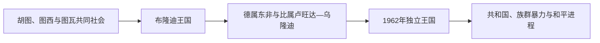

# 布隆迪历史

布隆迪王国以姆瓦米为中心，王族甘瓦在地方首领之间平衡。胡图、图西和图瓦身份与农业、牧业、地位和政治关系交织，并非固定“种族”。德国和比利时殖民统治通过首领改革和身份分类使社会等级更加僵化。

## 历史坐标

- 地理范围：坦噶尼喀湖东北高原。
- 国家形成：现代边界由区域历史、殖民分割和去殖民化共同塑造。
- 阅读方法：把内陆社会、海洋网络和跨境人群放在国家边界之前理解。

## 阶段导航

| 顺序 | 阶段 | 时间 | 核心内容 |
|---|---|---|---|
| 1 | [前殖民社会与殖民统治](/%E4%BA%BA%E6%96%87%E7%A7%91%E5%AD%A6/%E5%8E%86%E5%8F%B2/%E9%9D%9E%E6%B4%B2/%E4%B8%9C%E9%9D%9E/%E5%B8%83%E9%9A%86%E8%BF%AA/%E5%89%8D%E6%AE%96%E6%B0%91%E7%A4%BE%E4%BC%9A%E4%B8%8E%E6%AE%96%E6%B0%91%E7%BB%9F%E6%B2%BB.md) | 古代—1962年 | 地方社会、王国、贸易与殖民重组 |
| 2 | [独立建国与现代发展](/%E4%BA%BA%E6%96%87%E7%A7%91%E5%AD%A6/%E5%8E%86%E5%8F%B2/%E9%9D%9E%E6%B4%B2/%E4%B8%9C%E9%9D%9E/%E5%B8%83%E9%9A%86%E8%BF%AA/%E7%8B%AC%E7%AB%8B%E5%BB%BA%E5%9B%BD%E4%B8%8E%E7%8E%B0%E4%BB%A3%E5%8F%91%E5%B1%95.md) | 1962年至今 | 主权、政治制度和现代转型 |

## 关键节点

| 时间 | 事件 | 意义 |
|---|---|---|
| 约17世纪 | 布隆迪王国形成 | 高原政治整合 |
| 1962年 | 独立 | 君主国建立 |
| 1966年 | 废除王制 | 共和国成立 |
| 1972年 | 大规模暴力 | 社会与流亡结构改变 |
| 1993—2000年 | 内战与阿鲁沙协议 | 和平制度基础形成 |

## 区域联系

- 上级：[东非历史](/%E4%BA%BA%E6%96%87%E7%A7%91%E5%AD%A6/%E5%8E%86%E5%8F%B2/%E9%9D%9E%E6%B4%B2/%E4%B8%9C%E9%9D%9E/README.md)
- 跨区域背景：[阿克苏姆、埃塞俄比亚与非洲之角](/%E4%BA%BA%E6%96%87%E7%A7%91%E5%AD%A6/%E5%8E%86%E5%8F%B2/%E9%9D%9E%E6%B4%B2/%E4%B8%9C%E9%9D%9E/%E9%98%BF%E5%85%8B%E8%8B%8F%E5%A7%86%E3%80%81%E5%9F%83%E5%A1%9E%E4%BF%84%E6%AF%94%E4%BA%9A%E4%B8%8E%E9%9D%9E%E6%B4%B2%E4%B9%8B%E8%A7%92.md)、[斯瓦希里海岸与印度洋世界](/%E4%BA%BA%E6%96%87%E7%A7%91%E5%AD%A6/%E5%8E%86%E5%8F%B2/%E9%9D%9E%E6%B4%B2/%E4%B8%9C%E9%9D%9E/%E6%96%AF%E7%93%A6%E5%B8%8C%E9%87%8C%E6%B5%B7%E5%B2%B8%E4%B8%8E%E5%8D%B0%E5%BA%A6%E6%B4%8B%E4%B8%96%E7%95%8C.md)
