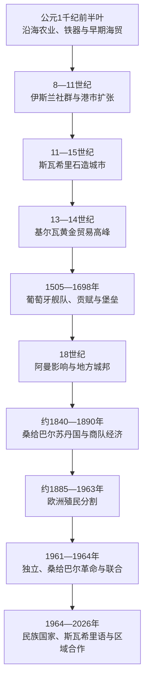

# 斯瓦希里海岸与印度洋世界

## 时间

公元前后至2026年

## 概括

斯瓦希里海岸通常指索马里南部至莫桑比克北部、包括拉穆群岛、桑给巴尔、奔巴、马菲亚和基尔瓦等岛屿的沿海带。季风让帆船能够按季节往返阿拉伯半岛、波斯湾、印度和更远地区，本地班图语居民由此发展出港口、伊斯兰社群和跨海亲缘。斯瓦希里语属于班图语支，阿拉伯语借词和阿拉伯字母书写体现长期交流，却不证明沿海文明是外来“阿拉伯殖民地”。

9—15世纪，摩加迪沙、拉穆、马林迪、蒙巴萨、桑给巴尔、基尔瓦和索法拉等石造城市各有统治者、商人家族和内陆伙伴，没有形成统一“斯瓦希里帝国”。基尔瓦在13—14世纪凭索法拉黄金贸易达到高峰。葡萄牙自1505年以舰队、贡赋和堡垒控制部分海路，无法长期垄断全部城镇；阿曼军队与沿海盟友在1698年夺取蒙巴萨耶稣堡，18—19世纪布赛义德王朝又以桑给巴尔为中心建立丁香种植园和象牙—奴隶商队体系。

19世纪末，德国、英国、意大利和葡萄牙把海岸及腹地划入殖民领地，铁路和蒸汽船改变旧商路。坦噶尼喀、肯尼亚和桑给巴尔独立后，斯瓦希里语成为跨国教育、行政和大众文化语言；1964年桑给巴尔革命及其同坦噶尼喀联合建立坦桑尼亚，是海岸王朝向现代国家转型的关键。到2026年，港口、旅游、移民、海洋边界和印度洋安全仍使沿海社会保持跨国性质。

## 季风、港口与腹地

印度洋季风并非“自动产生贸易”。远航需要熟悉海流、船舶、信贷、仓储、翻译和港口保护，沿海城市也必须依靠大陆农民与牧民供给粮食、木材和运输。主要交换结构如下：

| 来源 | 主要货物 | 流向与用途 |
|---|---|---|
| 东非沿海与岛屿 | 红树林木材、椰子、鱼、贝壳、铁器、粮食 | 港口建设、阿拉伯湾建筑、区域日常交换 |
| 内陆与南方 | 黄金、象牙、铜、兽皮、犀角、被奴役者 | 经索法拉、基尔瓦、蒙巴萨、桑给巴尔出口 |
| 阿拉伯与波斯湾 | 枣、马匹、香料、银、陶器和宗教文献 | 商人消费、王权礼物、清真寺和学术 |
| 印度与东南亚 | 棉布、珠饰、香料、稻作和椰作物种 | 衣着、货币替代、农业与饮食 |
| 中国及更远地区 | 瓷器等高价值商品 | 城市精英消费，也成为考古断代材料 |

进口瓷器常集中于富裕住宅和墓葬，不能据此把城市人口都看作外来商人。黄金主要来自赞比西河与大津巴布韦相关网络，象牙和奴隶则由非洲内陆商人、酋长和商队层层运送；沿海统治者对腹地的直接权力通常有限。

## 早期沿海社会

公元1世纪的希腊文航海记录提到“拉普塔”等东非市场，但其准确位置尚有争论。考古显示公元1千纪前半叶，沿海班图语农业—渔业聚落已使用铁器，参与红海和印度洋交换。曼达、尚加、温古贾乌库和通布等遗址证明8—10世纪贸易和伊斯兰社群扩大；最初建筑多用木、土和珊瑚碎块，后来才出现密集石屋。

伊斯兰化是渐进过程。商人和城市精英较早建清真寺、采用穆斯林姓名和葬俗，乡村与岛屿社群保留祖先、精灵和地方仪式；许多实践后来在斯瓦希里伊斯兰内部重新解释。阿拉伯字母长期书写斯瓦希里诗歌、契约和家谱，拉丁字母在殖民教育后才成为标准。

## 石造城市与地方王权

### 城市不是单一帝国

斯瓦希里城市常由“苏丹”或谢赫代表最高权威，商人家族、长老、清真寺学者和各街区首领共同决定税收、港务与外交。统治者可向邻城索贡、控制岛屿或同内陆首领结盟，却难以建立连续海岸行政。城市兴衰往往因港口淤积、王位争夺、贸易转向或竞争城镇上升，而不是整个文明同时崩溃。

| 城市或区域 | 高峰与作用 | 政治特点 |
|---|---|---|
| 摩加迪沙 | 约10—15世纪，布匹、黄金与北印度洋贸易 | 商人城市和地方苏丹，联系阿居兰等索马里政权 |
| 拉穆—帕泰 | 中世纪后期至19世纪，北部斯瓦希里文化与诗歌中心 | 岛屿城邦、纳巴哈尼王族和阿曼影响交替 |
| 蒙巴萨 | 港湾、造船和北南航路节点 | 同马林迪竞争，葡萄牙、马兹鲁伊和阿曼反复争夺 |
| 马林迪 | 15—16世纪重要港口 | 借同葡萄牙结盟制衡蒙巴萨 |
| 桑给巴尔—奔巴 | 19世纪丁香、象牙和奴隶贸易中心 | 布赛义德苏丹、阿拉伯种植园主、印度商人与非洲劳动者并存 |
| 基尔瓦 | 13—14世纪控制南方黄金转运 | 自铸铜币，王朝与商人共同经营港口 |
| 索法拉 | 连接赞比西河和南部黄金区 | 沿海商人依赖内陆政治与河道运输 |

### 基尔瓦高峰

基尔瓦传统称波斯“设拉子”王子阿里·伊本·哈桑购得岛屿并开创新王系。设拉子谱系为精英提供印度洋声望，可能保存移民与婚姻记忆，但城市人口、语言和物质文化主要具有本地非洲连续性。11—14世纪基尔瓦铸造自己的硬币，大清真寺扩建，14世纪初修建胡苏尼库布瓦宫殿；1331年前后来访的伊本·白图泰描述其富裕和虔敬。

基尔瓦的优势来自控制或影响索法拉黄金出口，而非直接统治大津巴布韦。王位争夺、黑死病时代的贸易波动、内陆路线变化和其他港口竞争在15世纪已削弱城市；葡萄牙1505年进攻加速衰落，但不是唯一原因。基尔瓦和松戈姆纳拉此后仍有人居住，18—19世纪又因贸易部分复兴。

## 葡萄牙进入与海岸战争

瓦斯科·达伽马1498年沿海北上，依靠或强迫当地领航员进入印度洋。葡萄牙王室希望以“航行许可证”、舰队和炮火截取印度洋贸易，不只是建立普通商站。1505年弗朗西斯科·德阿尔梅达远征袭击基尔瓦、蒙巴萨等城，扶立顺从统治者；马林迪因同蒙巴萨竞争而长期与葡萄牙结盟。

葡萄牙控制以海上巡逻、贡赋和少数据点为主，沿海商船可以绕行，内陆贸易仍由非洲和穆斯林商人掌握。1593年蒙巴萨耶稣堡成为军事中心，王位候选人与葡萄牙关系反复。1631年蒙巴萨苏丹优素福·本·哈桑起兵杀死堡内葡人，后来失败；17世纪阿曼雅鲁布王朝扩张，沿海城市也借其反抗。1696—1698年长期围城后，阿曼军和当地盟友取得耶稣堡，葡萄牙在肯尼亚—坦桑尼亚海岸的主导权终结，但仍保持莫桑比克。

## 阿曼、桑给巴尔与商队经济

### 阿曼主权与地方自主

阿曼驱逐葡萄牙后，并未立即直接治理全海岸。蒙巴萨马兹鲁伊家族在18世纪形成近乎独立王朝，同拉穆、帕泰及阿曼苏丹反复结盟或交战。布赛义德苏丹赛义德·本·苏尔坦在1820—1830年代重建对蒙巴萨的控制，1837年终结马兹鲁伊独立；约1840年把主要宫廷移往桑给巴尔，使东非贸易成为王朝核心。

赛义德1856年去世后，继承争议经英国调停，把阿曼与桑给巴尔分给不同儿子，两个苏丹国正式分立。桑给巴尔苏丹对从摩加迪沙以南至莫桑比克北部的若干海岸地带主张宗主权，实际权力在岛屿、关税口岸和部分商队站最强；内陆首领与商人仍是必要伙伴。

### 丁香、象牙与奴隶制

丁香在19世纪初引入并迅速覆盖桑给巴尔、奔巴种植园。阿拉伯和斯瓦希里地主、印度放贷商与海关承包人共同支撑出口，来自大陆的被奴役者承担清林、种植和收获。奴隶还在家庭、港口、椰林和商队中劳动，身份可因释放、婚姻或依附而变化，但制度核心仍是强迫和可转让占有。

桑给巴尔商队从巴加莫约、潘加尼和基尔瓦深入塔波拉、乌吉吉、布干达及刚果东部，以布匹、珠子和枪支交换象牙与人。尼亚姆韦齐、尧族、斯瓦希里—阿拉伯商人和内陆统治者都参与，蒂普·蒂普等商人一度在刚果东部建立武装据点。需求造成猎象、掠奴和村落战争，也发展道路、市场和斯瓦希里通用语。

英国以反奴隶贸易和保护航路扩大影响。1822、1845年条约逐步限制苏丹臣民海运奴隶，1873年巴尔加什苏丹在海军压力下关闭公开奴隶市场，但走私和种植园奴役继续。1897年保护国正式废除桑给巴尔奴隶法律，解放需要登记或诉讼，许多人因土地、债务和工作依赖仍留在旧主人附近。

## 岛屿世界

科摩罗群岛由非洲、南岛和西亚移民长期混合，伊斯兰苏丹国之间频繁竞争，并同马达加斯加、斯瓦希里海岸和阿拉伯贸易。19世纪法国逐岛建立保护和殖民统治。马达加斯加语属南岛语系，人口与文化同时有非洲来源；梅里纳等王国和岛内奴隶—稻作体系有自身主线，不能简单归入斯瓦希里城邦。

毛里求斯和塞舌尔在欧洲定居前没有已知永久原住民。荷兰、法国、英国的种植园把非洲和马达加斯加奴隶、印度契约劳工及欧洲、华人移民带到岛上，形成克里奥尔社会。它们属于广义西印度洋史，却不是中世纪斯瓦希里城市的分支。

## 欧洲殖民分割

### 德国、英国、意大利与葡萄牙

1885年德国东非公司取得被其解释为主权让渡的海岸和内陆条约，桑给巴尔苏丹及沿海精英并不接受。1888—1890年阿布希里起义联合商人、城镇和内陆力量反抗公司征税，德国海军和帝国军队镇压后改为政府直辖。德国在坦噶尼喀发展种植园、税收和强制棉作，1905—1907年马吉马吉战争席卷南部；殖民军焦土政策与饥荒造成巨大死亡。

英德1890年协议确认英国在桑给巴尔的保护地和德国在大陆的地位；“赫尔戈兰—桑给巴尔条约”并非德国把自己拥有的桑给巴尔简单交换出去，而是列强相互承认势力范围。1895年英国建立东非保护地，以乌干达铁路和蒙巴萨港向内陆扩张。1896年桑给巴尔继承争议引发不到一小时的英桑战争，英国扶立认可的苏丹，保护国主权进一步收紧。

葡萄牙保留莫桑比克，意大利在索马里海岸扩张。殖民边界切断桑给巴尔苏丹、港市和内陆商队的旧关系；铁路把蒙巴萨—维多利亚湖、达累斯萨拉姆—坦噶尼喀湖连成新走廊，部分旧港口衰落，新的殖民城市和劳工迁移兴起。

### 殖民社会并非文化终止

斯瓦希里商人失去部分海关和政治权，却在翻译、行政、教育、宗教和沿海商业中继续发挥作用。殖民者常把“阿拉伯”“斯瓦希里”和“土著”固定成等级类别，实际家族和身份更流动。基督教传教学校扩大，伊斯兰学校、苏非教团和阿拉伯文书写同样延续。第一次世界大战中德英军队征调大量非洲士兵和搬运工，战争与疫病进一步重塑海岸。

## 独立、革命与现代联系

坦噶尼喀非洲民族联盟以斯瓦希里语进行跨族群动员，1961年独立、1962年成为共和国。肯尼亚经历定居殖民、土地剥夺和茅茅战争后于1963年独立。桑给巴尔在1963年12月成为由苏丹贾姆希德领导的独立君主国，选举制度与人口—阶级分化使非洲—设拉子党虽然得票较多却未获议会多数。

1964年1月革命推翻苏丹，非洲裔革命者和民兵杀害、拘押或驱逐许多阿拉伯人与南亚裔居民，死亡人数在不同叙述中差异很大。革命政府实行土地国有化；4月同坦噶尼喀联合，建立坦桑尼亚联合共和国，桑给巴尔保留总统、革命委员会、众议院和部分内部自治。联合既受泛非理想推动，也同冷战安全和革命政权生存有关。

尼雷尔政府把斯瓦希里语推广为全国政治和教育媒介，使其从海岸母语发展为东非重要通用语。肯尼亚、乌干达、刚果东部、卢旺达等也在不同程度使用。1967年建立、1977年解体、2000年重建的东非共同体通过港口、铁路、人员和共同市场恢复区域联系；成员扩展并不意味着政治统一。

20—21世纪集装箱港口、海湾资本、旅游、渔业、海上油气和劳工移民重新连接印度洋。索马里海盗活动、红海战争风险和大国海军基地显示海岸仍处全球航运要冲。截至2026年，传统港市遗产、海洋生态和港口扩建之间的矛盾，同殖民前贸易一样跨越单一国家边界。

## 统治结构比较

| 阶段 | 最高或代表权力 | 实际治理网络 | 特点 |
|---|---|---|---|
| 石造城邦 | 苏丹、谢赫或城主 | 商人家族、长老、清真寺学者、街区和内陆盟友 | 主权以港口、岛屿和贸易关系为核心 |
| 葡萄牙体系 | 葡王及印度总督体系 | 舰长、堡垒、获扶立苏丹和盟友城镇 | 海军许可证与贡赋，难以直辖全部海岸 |
| 阿曼—桑给巴尔 | 布赛义德苏丹 | 港口总督、阿拉伯地主、印度商人、斯瓦希里商队领袖 | 王朝宗主、种植园和商队贸易结合 |
| 欧洲殖民 | 德、英、意、葡殖民政府 | 总督、公司、地方首领、苏丹和行政官 | 固定边界、税收、铁路、强制作物与劳工 |
| 独立国家 | 总统、议会与地方政府 | 港口机构、桑给巴尔自治机关、商贸与宗教网络 | 法定国家边界内仍保持跨国语言和海洋联系 |

## 重要事件

| 时间 | 事件 | 结果与意义 |
|---|---|---|
| 8—10世纪 | 尚加、曼达、温古贾乌库等港市扩大 | 本地班图社会同伊斯兰—印度洋网络深度连接 |
| 11—14世纪 | 基尔瓦铸币并控制黄金转运 | 石造城市和远洋贸易达到高峰 |
| 1331年前后 | 伊本·白图泰访问基尔瓦 | 留下城市财富、王权和宗教生活的重要外部记载 |
| 1498年 | 达伽马抵达海岸 | 葡萄牙开始以武装航海介入印度洋 |
| 1505年 | 葡萄牙攻击基尔瓦、蒙巴萨 | 贡赋和堡垒体系形成，地方竞争加剧 |
| 1593年 | 蒙巴萨耶稣堡建成 | 葡萄牙海岸军政中心制度化 |
| 1698年 | 阿曼—沿海联军夺取耶稣堡 | 葡萄牙在北部斯瓦希里海岸主导权终结 |
| 1837—1840年前后 | 布赛义德控制蒙巴萨并移宫桑给巴尔 | 丁香—象牙—奴隶贸易中心形成 |
| 1856年 | 阿曼与桑给巴尔分立 | 东非布赛义德苏丹国成为独立王朝 |
| 1873年 | 桑给巴尔公开奴隶市场关闭 | 海运奴隶贸易受压，种植园奴役仍延续 |
| 1888—1890年 | 阿布希里起义 | 德国公司统治危机，帝国政府转为直接殖民 |
| 1890—1896年 | 英国保护桑给巴尔并干预继承 | 苏丹保留名义王位，主权归英国掌控 |
| 1905—1907年 | 马吉马吉战争 | 德属东非大规模抵抗遭焦土镇压 |
| 1964年 | 桑给巴尔革命与坦桑尼亚联合 | 海岸君主制终结，形成保留岛屿自治的共和国 |
| 2000年 | 东非共同体重建 | 区域市场、人员和基础设施合作恢复 |

## 崛起、转型与衰落原因

### 城市繁荣条件

- 季风规律使远航可预测，港口和商人以信贷、仓储与翻译降低交易风险。
- 沿海农业、渔业、木材和淡水供给远洋船只，腹地黄金、象牙和其他商品提供出口价值。
- 伊斯兰法律、婚姻和朝觐建立跨海信任，但地方祖先与城市身份仍塑造政治。
- 多城竞争让商船可以转换港口，也限制任何一城长期垄断。

### 权力转移原因

| 层次 | 因素 | 作用 |
|---|---|---|
| 结构因素 | 王位争夺、港口间竞争、对内陆中介依赖 | 强盛城邦难以转化为统一海岸国家 |
| 经济变化 | 黄金路线转移、丁香和象牙兴起、蒸汽船与铁路 | 贸易中心由基尔瓦等旧港转向桑给巴尔和殖民港 |
| 外部军事 | 葡萄牙炮舰、阿曼舰队、欧洲殖民军 | 能夺取堡垒和关税，却仍需地方盟友与劳工 |
| 社会基础 | 种植园奴隶制、债务与族群等级 | 创造财富，也积累1964年革命等政治爆发条件 |
| 直接触发 | 条约、继承争议、公司征税和市场垄断 | 把贸易冲突转化为政权更替或殖民战争 |

## 史料与争议

- “设拉子起源”是重要的沿海家族传统，体现跨海联系和精英身份；考古、语言和人口史不支持把斯瓦希里文明整体说成波斯殖民。
- “阿拉伯人”“非洲人”“斯瓦希里人”在不同时期是语言、法律、血缘、阶级或政治标签，不能按现代种族边界固定。
- 沿海国家参与奴隶贸易必须如实说明，欧洲、阿曼、印度商人、非洲统治者和内陆中间人责任层次也需区分。
- 1873年关闭市场不等于奴隶制即时结束；海运、走私、种植园和家内依附结束时间不同。
- 1964年桑给巴尔革命死亡人数和责任在政治叙事中差异很大，应确认大规模暴力和驱逐事实，同时避免未经核实的单一数字。

## 统治者世系

阿克苏姆、扎格维、所罗门王朝、布干达、布尼奥罗、卢旺达、布隆迪、桑给巴尔和伊默里纳的完整可确认序列、复位与争议年代，集中见[东非王国与苏丹国统治者世系表](/%E4%BA%BA%E6%96%87%E7%A7%91%E5%AD%A6/%E5%8E%86%E5%8F%B2/%E9%9D%9E%E6%B4%B2/%E4%B8%9C%E9%9D%9E/%E4%B8%9C%E9%9D%9E%E7%8E%8B%E5%9B%BD%E4%B8%8E%E8%8B%8F%E4%B8%B9%E5%9B%BD%E7%BB%9F%E6%B2%BB%E8%80%85%E4%B8%96%E7%B3%BB%E8%A1%A8.md)。史料不能连续复原的早期节点明确保留空档。

## 演变关系

- 内陆联系：[大湖王国、殖民统治与独立](/%E4%BA%BA%E6%96%87%E7%A7%91%E5%AD%A6/%E5%8E%86%E5%8F%B2/%E9%9D%9E%E6%B4%B2/%E4%B8%9C%E9%9D%9E/%E5%A4%A7%E6%B9%96%E7%8E%8B%E5%9B%BD%E3%80%81%E6%AE%96%E6%B0%91%E7%BB%9F%E6%B2%BB%E4%B8%8E%E7%8B%AC%E7%AB%8B.md)
- 国家视角：[坦桑尼亚](/%E4%BA%BA%E6%96%87%E7%A7%91%E5%AD%A6/%E5%8E%86%E5%8F%B2/%E9%9D%9E%E6%B4%B2/%E4%B8%9C%E9%9D%9E/%E5%9D%A6%E6%A1%91%E5%B0%BC%E4%BA%9A/README.md)、[肯尼亚](/%E4%BA%BA%E6%96%87%E7%A7%91%E5%AD%A6/%E5%8E%86%E5%8F%B2/%E9%9D%9E%E6%B4%B2/%E4%B8%9C%E9%9D%9E/%E8%82%AF%E5%B0%BC%E4%BA%9A/README.md)、[索马里](/%E4%BA%BA%E6%96%87%E7%A7%91%E5%AD%A6/%E5%8E%86%E5%8F%B2/%E9%9D%9E%E6%B4%B2/%E4%B8%9C%E9%9D%9E/%E7%B4%A2%E9%A9%AC%E9%87%8C/README.md)、[科摩罗](/%E4%BA%BA%E6%96%87%E7%A7%91%E5%AD%A6/%E5%8E%86%E5%8F%B2/%E9%9D%9E%E6%B4%B2/%E4%B8%9C%E9%9D%9E/%E7%A7%91%E6%91%A9%E7%BD%97/README.md)、[毛里求斯](/%E4%BA%BA%E6%96%87%E7%A7%91%E5%AD%A6/%E5%8E%86%E5%8F%B2/%E9%9D%9E%E6%B4%B2/%E4%B8%9C%E9%9D%9E/%E6%AF%9B%E9%87%8C%E6%B1%82%E6%96%AF/README.md)、[塞舌尔](/%E4%BA%BA%E6%96%87%E7%A7%91%E5%AD%A6/%E5%8E%86%E5%8F%B2/%E9%9D%9E%E6%B4%B2/%E4%B8%9C%E9%9D%9E/%E5%A1%9E%E8%88%8C%E5%B0%94/README.md)
- 上级入口：[东非历史](/%E4%BA%BA%E6%96%87%E7%A7%91%E5%AD%A6/%E5%8E%86%E5%8F%B2/%E9%9D%9E%E6%B4%B2/%E4%B8%9C%E9%9D%9E/README.md)
