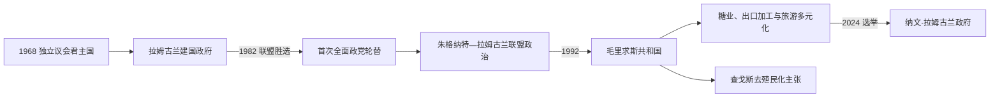

# 毛里求斯的独立建国与现代发展

## 时间

1968年至今

## 概括

毛里求斯1968年以议会制独立，围绕族群和语言的政党通过联盟执政。出口加工、旅游、金融与信息服务使经济逐步脱离单一糖业，1992年改为共和国；选举轮替和法律制度总体稳定。

## 政治演进

## 议会制、联盟政治与经济转型

1968—1992年英国君主由总督代表，实际行政权属于对国民议会负责的总理和内阁；共和国化后，总统由议会选出并主要承担礼仪与宪法保障职能，政府首脑仍是总理。政党往往在选前组成跨族群联盟，“最佳败选者”制度补充社群代表，选区竞争与内阁责任制使政权能够轮替。国家以糖业出口收入投资教育和基础设施，1970年代起用出口加工区、旅游、离岸金融和信息服务分散风险。

## 主要政治阶段

| 阶段 | 时间 | 权力结构与特征 |
|---|---|---|
| 独立议会君主国 | 1968—1992年 | 拉姆古兰领导建国，社会福利和出口加工发展 |
| 毛里求斯共和国 | 1992年至今 | 总统为礼仪元首，议会联盟政治与经济多元化 |
| 查戈斯主权与侨民议题 | 持续 | 毛里求斯主张英国分离查戈斯群岛不合法 |

## 轮替、经济调整与查戈斯问题过程

独立初期政府面对族群骚乱、失业和糖价波动，曾推迟选举并与反对党组成联盟；出口加工区随后吸纳大量劳动力。1982年毛里求斯战斗运动—社会党联盟席卷全部直选席位，证明殖民后执政党可经选举下台；联盟不久分裂，阿内罗德·朱格纳特重组多数，此后朱格纳特与拉姆古兰两大家族领导的政党联盟多次轮替。1992年共和国化没有改变议会政府核心，法院、选举委员会和公务员体系保持连续。

查戈斯岛民在1960—1970年代被迁往毛里求斯和塞舌尔，毛里求斯持续主张1965年分离违反去殖民化原则，国际法院咨询意见和联合国表决增强其外交立场。国内方面，2024年反对联盟赢得大选，纳文·拉姆古兰再次出任总理；经济仍须平衡高收入转型、老龄化、气候风险和全球金融合规。

## 重要转折

- 1968年3月12日独立。
- 1970年代出口加工区吸引纺织制造并扩大女性就业。
- 1982年反对联盟压倒性胜选，实现政权轮替。
- 1992年3月12日改为共和国。
- 查戈斯群岛分离和岛民被迁离成为长期去殖民化争议。

## 制度延续与风险原因

- **稳定基础**：议会负责制、专业公务员、独立司法与定期选举限制个人总统化，跨社群联盟降低零和竞争。
- **经济崛起**：优惠糖价、出口加工、女性就业、旅游与教育共同推动多元化，不能只归因于单一“自由港”政策。
- **结构弱点**：小岛市场、进口能源、气候灾害、财富与土地集中以及对外部金融规则依赖带来周期性压力。
- **领土延续问题**：查戈斯分离和岛民迁徙使国家独立并未完全结束去殖民化争议。

## 国家元首、政府首脑与实际权力

独立以来总督、总统和历届总理完整序列见[东非独立国家元首与权力结构表](/%E4%BA%BA%E6%96%87%E7%A7%91%E5%AD%A6/%E5%8E%86%E5%8F%B2/%E9%9D%9E%E6%B4%B2/%E4%B8%9C%E9%9D%9E/%E4%B8%9C%E9%9D%9E%E7%8B%AC%E7%AB%8B%E5%9B%BD%E5%AE%B6%E5%85%83%E9%A6%96%E4%B8%8E%E6%9D%83%E5%8A%9B%E7%BB%93%E6%9E%84%E8%A1%A8.md)。截至2026年7月14日，达兰比尔·戈库尔任总统，主要行使礼仪和宪法职能；纳文钱德拉·拉姆古兰任总理，领导内阁并掌握实际行政。国民议会多数决定政府存续，最高法院、选举委员会和反对党构成重要制衡。

## 演变关系

前接[毛里求斯的前殖民社会与殖民统治](/%E4%BA%BA%E6%96%87%E7%A7%91%E5%AD%A6/%E5%8E%86%E5%8F%B2/%E9%9D%9E%E6%B4%B2/%E4%B8%9C%E9%9D%9E/%E6%AF%9B%E9%87%8C%E6%B1%82%E6%96%AF/%E5%89%8D%E6%AE%96%E6%B0%91%E7%A4%BE%E4%BC%9A%E4%B8%8E%E6%AE%96%E6%B0%91%E7%BB%9F%E6%B2%BB.md)。现代国家同时受到大湖区、非洲之角或印度洋跨境网络影响。
