# 科摩罗的独立建国与现代发展

## 时间

1975年至今

## 概括

科摩罗议会1975年单方面宣布四岛独立，但法国继续控制马约特。新国家频繁发生政变，法国雇佣兵鲍勃·德纳尔多次介入。1997年昂儒昂、莫埃利分离危机促成2001年联邦宪法和岛屿轮值安排。

## 政治演进

```mermaid
flowchart LR
    I["1975 三岛单方面独立"] --> C1["1975 政变与阿里·萨利赫"]
    C1 -->|1978 雇佣兵政变| A["艾哈迈德·阿卜杜拉复位"]
    A -->|1989 遇刺| M["多党化与持续政变"]
    M -->|1997| S["昂儒昂、莫埃利分离危机"]
    S -->|1999 阿扎利政变| T["过渡谈判"]
    T -->|2001 丰博尼协议| U["科摩罗联盟与轮值总统制"]
    U -->|2018 宪法| R["权力再集中与轮值重设"]
```

## 建国、雇佣兵政治与联邦机制

首任总统艾哈迈德·阿卜杜拉宣布独立后数周即被推翻，阿里·萨利赫以革命委员会推行激进世俗化；1978年鲍勃·德纳尔率雇佣兵政变，阿卜杜拉复位，私人卫队和外部商业利益成为政权支柱。1989年阿卜杜拉遇刺后法国迫使雇佣兵撤离，1990年代开始竞争性选举，却仍受军变干扰。2001年宪法把国家改为“科摩罗联盟”，三岛各有总统/后改称总督，联盟总统按岛轮值，以制度性保障缓和分离诉求。

## 主要政治阶段

| 阶段 | 时间 | 权力结构与特征 |
|---|---|---|
| 独立与雇佣兵政变 | 1975—1990年 | 阿卜杜拉、阿里·萨利赫等政权反复更替 |
| 多党化与岛屿分离危机 | 1990—2001年 | 总统选举、政变和昂儒昂分离主义 |
| 科摩罗联盟 | 2001年至今 | 联邦权力与岛屿自治多次调整 |

## 政变、分离危机与再集中过程

1995年德纳尔再次发动政变，法国“杜鹃花行动”出兵结束其控制。1997年昂儒昂和莫埃利以贫困、中央分配不公为由宣布分离；军事统一失败后，非盟和地区调停促成《丰博尼协议》。阿扎利·阿苏马尼1999年政变掌权，辞去军职后赢得2002年轮值总统选举。2008年昂儒昂领导人拒绝离任，科摩罗与非盟部队登陆恢复联盟控制，显示自治并不等于退出权。

2018年公投通过新宪法，扩大总统权限、改变轮值时间表并取消副总统职位；反对派认为这削弱岛屿平衡。阿扎利在2019年提前选举和2024年选举中获胜，结果均引发反对派质疑与抗议。国家依赖侨汇、香料出口和外援，青年就业、岛际交通及马约特争端继续影响政治稳定。

## 重要转折

- 1975年7月6日宣布独立。
- 1976年联合国接纳科摩罗，马约特地位争议延续。
- 1978年德纳尔推翻阿里·萨利赫并恢复艾哈迈德·阿卜杜拉。
- 1989年阿卜杜拉遇刺，德纳尔被迫离开。
- 1997年昂儒昂和莫埃利宣布分离，2001年《丰博尼协议》建立科摩罗联盟。

## 政权反复与联盟延续原因

- **政变频发**：小型军队、薄弱财政、个人化政党与外国雇佣兵使夺取首都即可改变中央政权。
- **分离根源**：群岛交通困难、资源分配不均和马约特相对繁荣强化各岛比较，1997年危机并非单纯个人叛乱。
- **联盟稳定机制**：轮值总统、岛屿自治和非盟安全保证降低退出动机；2008年干预也确立领土统一红线。
- **再集中风险**：2018年后总统权力扩大提高决策效率，却可能削弱轮值安排的包容合法性。

## 国家元首、政府首脑与实际权力

历届总统、革命委员会、军政首脑及过渡安排见[东非独立国家元首与权力结构表](/%E4%BA%BA%E6%96%87%E7%A7%91%E5%AD%A6/%E5%8E%86%E5%8F%B2/%E9%9D%9E%E6%B4%B2/%E4%B8%9C%E9%9D%9E/%E4%B8%9C%E9%9D%9E%E7%8B%AC%E7%AB%8B%E5%9B%BD%E5%AE%B6%E5%85%83%E9%A6%96%E4%B8%8E%E6%9D%83%E5%8A%9B%E7%BB%93%E6%9E%84%E8%A1%A8.md)。截至2026年7月14日，阿扎利·阿苏马尼任联盟总统，同时是国家元首和实际政府首脑；现行政体不设总理。三岛总督和地方议会管理自治事务，但外交、国防、货币及主要国家资源由联盟层掌握。

## 演变关系

前接[科摩罗的前殖民社会与殖民统治](/%E4%BA%BA%E6%96%87%E7%A7%91%E5%AD%A6/%E5%8E%86%E5%8F%B2/%E9%9D%9E%E6%B4%B2/%E4%B8%9C%E9%9D%9E/%E7%A7%91%E6%91%A9%E7%BD%97/%E5%89%8D%E6%AE%96%E6%B0%91%E7%A4%BE%E4%BC%9A%E4%B8%8E%E6%AE%96%E6%B0%91%E7%BB%9F%E6%B2%BB.md)。现代国家同时受到大湖区、非洲之角或印度洋跨境网络影响。
