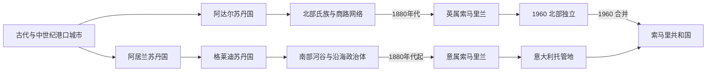

# 索马里的前殖民社会与殖民统治

## 时间

古代—1960年

## 概括

索马里社会以骆驼牧业、河谷农业、港口贸易和氏族谱系组织为基础。泽拉、柏培拉、摩加迪沙等港口参与红海和印度洋网络，阿达尔、阿居兰、格莱迪、马吉尔廷与霍比奥等国家在不同时期控制商路、河谷或沿岸。

## 历史演进

## 国家形成与社会治理

索马里政治并非只有氏族，也不是始终统一王国。港口城邦依靠海关、商人议事和伊斯兰法连接亚丁、阿拉伯和印度；阿居兰、格莱迪等苏丹国以灌溉、水井、河谷贡赋和骑兵控制南部。牧区氏族通过谱系联盟、长老会议和“习惯法”处理赔偿、放牧与战争，宗教圣裔和苏菲教团提供跨氏族权威。19世纪马吉尔廷、霍比奥等苏丹与欧洲签保护条约，试图利用外援维持自主，却也为殖民接管提供法律借口。

## 主要社会与政权

| 社会或政权 | 大致时期 | 特征 |
|---|---|---|
| 阿达尔苏丹国 | 约13—16世纪 | 泽拉贸易与对埃塞俄比亚高原战争 |
| 阿居兰苏丹国 | 中世纪晚期—17世纪 | 谢贝利—朱巴河农业、水井与贸易 |
| 格莱迪苏丹国 | 17—19世纪 | 阿夫戈耶河谷和南部商路 |
| 马吉尔廷、霍比奥苏丹国 | 19世纪 | 东北沿海国家与条约外交 |

## 殖民统治或外来占领

19世纪末英国控制北部亚丁航线补给地，意大利在南部通过公司和条约扩张；法属索马里兰、埃塞俄比亚欧加登和肯尼亚北部又切分索马里人。意属地区发展种植园和强制劳工，英国北部治理较间接。

## 瓜分、抵抗与托管的具体过程

英国1884—1886年与北部氏族签约，把柏培拉一带作为亚丁的牲畜和补给来源；意大利先借商业公司和保护条约进入南部，1905年改为直接殖民地，1920年代法西斯当局再以军事行动征服内陆苏丹国并扩种香蕉、棉花。穆罕默德·阿卜杜拉·哈桑1899年建立托钵僧政权，在英、意、埃塞俄比亚之间机动作战，英国1920年以空袭和地面进攻摧毁其堡垒。殖民边界把欧加登、北部边区及法属领地留在邻国，泛索马里问题由此制度化。

1941年英军攻占意属区，并一度把南北置于同一军管；1950年南部成为联合国监督下的意大利托管地，任务是在十年内培养自治。北部按英国制度独立，南部按意大利制度建国，两地在1960年仓促合并，宪法、司法、官僚语言和政党基础并未完全整合。

## 重要事件

- 16世纪艾哈迈德·格兰领导阿达尔军队深入埃塞俄比亚高原。
- 1880年代英、意、法与埃塞俄比亚分别取得索马里人地区。
- 1899—1920年穆罕默德·阿卜杜拉·哈桑领导“托钵僧”运动反抗英意埃势力。
- 1941年英国占领意属索马里兰，1950年联合国托管交还意大利管理。
- 1960年英属索马里兰与意属托管地先后独立并合并。

## 政权兴衰与殖民转型原因

| 层次 | 主要因素 |
|---|---|
| 本地国家基础 | 港口贸易、河谷灌溉和氏族调解形成多中心秩序；权力随雨季、商路和联盟变化，难以固定边界 |
| 衰落因素 | 海运竞争、内部分裂、火器差距与欧洲“保护条约”逐步削弱苏丹国主权 |
| 外部压力 | 英国保卫亚丁航线、意大利寻求殖民地、埃塞俄比亚东扩和法国占领吉布提共同完成瓜分 |
| 直接转折 | 1920年托钵僧堡垒被摧毁、1920年代意大利军事统一南部、1941年英军占领及1950年托管安排依次改写权力结构 |

## 统治者与殖民行政首脑

阿达尔、阿居兰、格莱迪、马吉尔廷和霍比奥的可考苏丹及资料缺口见[东非王国与苏丹国统治者世系表](/%E4%BA%BA%E6%96%87%E7%A7%91%E5%AD%A6/%E5%8E%86%E5%8F%B2/%E9%9D%9E%E6%B4%B2/%E4%B8%9C%E9%9D%9E/%E4%B8%9C%E9%9D%9E%E7%8E%8B%E5%9B%BD%E4%B8%8E%E8%8B%8F%E4%B8%B9%E5%9B%BD%E7%BB%9F%E6%B2%BB%E8%80%85%E4%B8%96%E7%B3%BB%E8%A1%A8.md)；共治、地区分支和口述谱系必须分别标注，不能拼成一条全国王统。英属区由保护地专员及殖民官员掌权，意属区先由公司后由总督掌权；1950—1960年南部由意大利托管行政官在联合国监督下治理，本地行政委员会和议会逐步扩大权限。

## 演变关系

这一阶段的边界、行政与政治冲突直接影响[索马里的独立建国与现代发展](/%E4%BA%BA%E6%96%87%E7%A7%91%E5%AD%A6/%E5%8E%86%E5%8F%B2/%E9%9D%9E%E6%B4%B2/%E4%B8%9C%E9%9D%9E/%E7%B4%A2%E9%A9%AC%E9%87%8C/%E7%8B%AC%E7%AB%8B%E5%BB%BA%E5%9B%BD%E4%B8%8E%E7%8E%B0%E4%BB%A3%E5%8F%91%E5%B1%95.md)。
