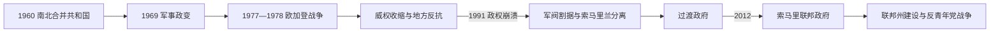

# 索马里的独立建国与现代发展

## 时间

1960年至今

## 概括

1960年南北合并建立索马里共和国，但殖民制度差异和“大索马里”领土主张造成压力。西亚德·巴雷1969年政变后实行科学社会主义，1977年欧加登战争失败削弱政权；1991年中央崩溃，索马里兰宣布恢复独立，南部长期内战，后来建立联邦政府。

## 政治演进

## 建国与权力结构

1960年合并后，总统、议会和总理构成议会共和国，但北部和南部行政体系、精英网络与法律传统不同。1969年军方以最高革命委员会取代民选机构，巴雷把军队、革命社会主义党、援助和氏族任用结合为总统制威权。1991年以后全国主权碎片化：索马里兰建立事实独立机构，邦特兰选择自治，南中部军阀与伊斯兰组织竞争。2004年过渡联邦宪章和2012年临时宪法确立联邦制，以成员州、联邦议会、总统和总理分享权力；安全仍依赖本国军警、地方部队及非盟支持任务。

## 主要政治阶段

| 阶段 | 时间 | 权力结构与特征 |
|---|---|---|
| 议会共和国 | 1960—1969年 | 多党政治、泛索马里主义和边境争端 |
| 巴雷军事政权 | 1969—1991年 | 社会主义改革、氏族压制与欧加登战争 |
| 国家崩溃与联邦重建 | 1991年至今 | 地方政权、军阀、伊斯兰武装、国际干预和联邦制度并存 |

## 国家崩溃与重建的具体过程

早期共和国在选举竞争中维持文官政治，却因泛索马里战争、腐败和南北不平衡承压。巴雷政权先推行文字标准化、识字运动和国有化，1977年趁埃塞俄比亚革命入侵欧加登；苏联改援埃塞俄比亚后，索军1978年撤退，难民、军费和政变未遂削弱政权。政府转以氏族惩罚和城市轰炸压制反对派，1988年北部战争尤其惨烈。1991年首都武装推翻巴雷，却未形成共同继承政府，饥荒和军阀战促成联合国干预。

2000年后多轮和会建立过渡机构；2006年伊斯兰法院联盟短暂控制摩加迪沙，埃塞俄比亚军事介入后青年党发展为持续叛乱。2012年联邦政府成立，成员州陆续建制，债务减免和国家军队重建取得进展；但选举模式、首都地位、资源分配及与索马里兰关系仍未定型，青年党继续通过乡村控制、税收和袭击挑战国家。

## 重要转折

- 1960年7月1日南北合并建国。
- 1969年巴雷政变建立最高革命委员会。
- 1977—1978年入侵欧加登失败，苏联转而支持埃塞俄比亚。
- 1991年巴雷政权垮台，索马里兰单方面宣布独立。
- 2012年结束长期过渡政府，建立索马里联邦政府。

## 崩溃、重建与持续冲突原因

- **结构因素**：殖民南北制度差异、氏族代表与现代职位分配的张力、干旱牧业经济及薄弱税基限制中央整合。
- **外部压力**：冷战援助骤变、埃塞俄比亚和肯尼亚安全介入、海湾国家竞争及国际反恐政策深刻影响国内联盟。
- **直接触发**：欧加登战败削弱巴雷；1980年代国家暴力促使各地武装化；1991年反对派缺乏共同过渡协议导致中央崩溃。
- **重建条件**：城市商业与侨汇、地方自治机构、联邦谈判和非盟安全支持使国家不再停留于1990年代的完全真空。

## 国家元首、政府首脑与实际权力

完整总统、临时领导和总理序列见[东非独立国家元首与权力结构表](/%E4%BA%BA%E6%96%87%E7%A7%91%E5%AD%A6/%E5%8E%86%E5%8F%B2/%E9%9D%9E%E6%B4%B2/%E4%B8%9C%E9%9D%9E/%E4%B8%9C%E9%9D%9E%E7%8B%AC%E7%AB%8B%E5%9B%BD%E5%AE%B6%E5%85%83%E9%A6%96%E4%B8%8E%E6%9D%83%E5%8A%9B%E7%BB%93%E6%9E%84%E8%A1%A8.md)。截至2026年7月14日，哈桑·谢赫·穆罕默德任联邦总统，负责国家方向、外交与任命；哈姆扎·阿卜迪·巴雷任总理，领导内阁。联邦成员州总统、议会、军队、氏族长老及国际安全伙伴都影响实际决策；索马里兰不受摩加迪沙日常统治，因此不能只用联邦总统表描述全境权力。

## 演变关系

前接[索马里的前殖民社会与殖民统治](/%E4%BA%BA%E6%96%87%E7%A7%91%E5%AD%A6/%E5%8E%86%E5%8F%B2/%E9%9D%9E%E6%B4%B2/%E4%B8%9C%E9%9D%9E/%E7%B4%A2%E9%A9%AC%E9%87%8C/%E5%89%8D%E6%AE%96%E6%B0%91%E7%A4%BE%E4%BC%9A%E4%B8%8E%E6%AE%96%E6%B0%91%E7%BB%9F%E6%B2%BB.md)。现代国家同时受到大湖区、非洲之角或印度洋跨境网络影响。
