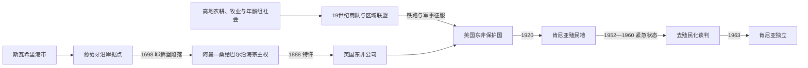

# 肯尼亚的前殖民社会与殖民统治

## 时间

古代—1963年

## 概括

肯尼亚海岸属于斯瓦希里印度洋世界，拉穆、蒙巴萨、马林迪等港市与内陆贸易；高地和裂谷由基库尤、坎巴、卢奥、伦迪勒、马赛等农牧社会组成。现代边界把差异很大的生态和政治共同体纳入一国。

## 历史演进

## 区域社会与政治机制

肯尼亚殖民前没有覆盖今日边界的统一王朝。斯瓦希里港市由苏丹、商人家族、清真寺和城市议事群体治理，以海关和远洋贸易维持权力；米吉肯达“卡亚”以长老和圣林组织沿海腹地。高地基库尤依靠家族、年龄级和土地委员会，坎巴经营长途商贸，马赛通过年龄组与分区联盟组织牧业和战争，卢奥及西部诸群体亦有各自首领和议事制度。政治权威随生态和贸易而异，殖民国家后来以“部族”行政把流动边界固定化。

## 主要社会与政权

| 社会或政权 | 大致时期 | 特征 |
|---|---|---|
| 斯瓦希里城邦 | 约9—19世纪 | 伊斯兰港市、珊瑚石建筑与印度洋贸易 |
| 米吉肯达卡亚聚落 | 近代早期 | 沿海腹地的防御性圣林聚落 |
| 马赛年龄组社会 | 18—19世纪 | 裂谷牧业、年龄组与战士组织 |
| 基库尤、坎巴等高地社会 | 长期存在 | 农业、宗族、市场和跨区贸易 |

## 殖民统治或外来占领

英国东非公司1888年取得沿海特许，1895年建立保护国并修筑乌干达铁路。殖民政府夺取“白人高地”供欧洲定居者，征收人头税、实施通行证和劳工控制；1920年内陆改为肯尼亚殖民地，非洲居民土地与政治权受限。

## 军事征服、定居殖民与紧急状态过程

1888年英国东非公司取得桑给巴尔苏丹的沿岸特许，1895年因公司财政失败由英国政府接管保护国。铁路施工需要土地、劳工和治安，英军在1895—1905年与南迪等群体长期作战；殖民当局随后把中部高原划为欧洲定居区，迁移非洲居民并设“原住民保留地”。1902年起鼓励白人移民，税收、劳工招募和1919年“基潘德”通行证迫使许多人进入农场与城市劳动。1920年内陆成为王室殖民地，沿海十英里地带仍名义属于桑给巴尔苏丹、由英国代管。

非洲人从地方协会、独立教会和工会发展为全国政党。二战退伍军人、土地匮乏和定居者政治僵局促成“土地与自由军”秘密动员；1952年殖民政府宣布紧急状态，大规模拘禁、村庄化和军事行动压制茅茅运动，同时也迫使伦敦扩大非洲代表和土地改革。兰开斯特宫会议确立独立宪法，沿海主权安排经协议并入肯尼亚。

## 重要事件

- 1498年达·伽马到达蒙巴萨，葡萄牙随后争夺海岸。
- 1698年阿曼军队攻陷耶稣堡，削弱葡萄牙势力。
- 1896—1901年乌干达铁路从蒙巴萨修至维多利亚湖。
- 1920年代哈里·图库等组织城市和农民抗议。
- 1952—1960年紧急状态期间，茅茅运动主要在基库尤地区反抗土地与殖民统治。

## 殖民体系兴衰原因

| 层次 | 主要因素 |
|---|---|
| 建立条件 | 桑给巴尔特许、铁路战略、欧洲火器和本地政治多中心使英国能够分区征服 |
| 统治支柱 | 白人高地、出口农业、税收、劳工通行证、受任首领和种族化法律构成定居殖民制度 |
| 结构矛盾 | 土地剥夺、工资与政治权差别、城市化和退伍军人经验让殖民秩序失去可持续性 |
| 直接转折 | 紧急状态未能恢复长期合法性；镇压成本、英国战后收缩和非洲多数政治谈判共同推动1963年独立 |

## 统治者与殖民行政首脑

斯瓦希里城邦、阿曼—桑给巴尔沿海君主的可考序列与年代争议见[东非王国与苏丹国统治者世系表](/%E4%BA%BA%E6%96%87%E7%A7%91%E5%AD%A6/%E5%8E%86%E5%8F%B2/%E9%9D%9E%E6%B4%B2/%E4%B8%9C%E9%9D%9E/%E4%B8%9C%E9%9D%9E%E7%8E%8B%E5%9B%BD%E4%B8%8E%E8%8B%8F%E4%B8%B9%E5%9B%BD%E7%BB%9F%E6%B2%BB%E8%80%85%E4%B8%96%E7%B3%BB%E8%A1%A8.md)；内陆多数社会不适用全国君主表。保护国专员、1920年后的肯尼亚总督掌握最高行政和军事权，白人定居者立法机关影响土地政策；受任酋长执行基层税役。沿海苏丹只保留名义宗主权，实际治理仍由英国官员负责。

## 演变关系

这一阶段的边界、行政与政治冲突直接影响[肯尼亚的独立建国与现代发展](/%E4%BA%BA%E6%96%87%E7%A7%91%E5%AD%A6/%E5%8E%86%E5%8F%B2/%E9%9D%9E%E6%B4%B2/%E4%B8%9C%E9%9D%9E/%E8%82%AF%E5%B0%BC%E4%BA%9A/%E7%8B%AC%E7%AB%8B%E5%BB%BA%E5%9B%BD%E4%B8%8E%E7%8E%B0%E4%BB%A3%E5%8F%91%E5%B1%95.md)。
