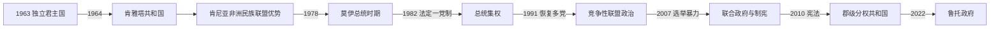

# 肯尼亚的独立建国与现代发展

## 时间

1963年至今

## 概括

肯尼亚1963年独立，乔莫·肯雅塔领导土地重分配和资本主义发展，但殖民定居土地和精英权力结构部分延续。丹尼尔·阿拉普·莫伊时期形成一党优势，1991年恢复多党；2007年选举暴力推动2010年新宪法和权力下放。

## 政治演进

## 建国、政党联盟与宪制机制

独立时英国君主仍为国家元首，肯雅塔任总理；1964年共和国化后总统兼任国家元首和政府首脑。肯尼亚非洲民族联盟吸收或排挤主要对手，以总统任命、地方精英联盟和土地安置维持统治。莫伊继任后强化省行政和安全机关，1982年把一党制写入宪法；国内反对、教会、公民组织和外援条件促使1991年恢复多党。2010年宪法设更强权利法案、独立法院和47个民选郡，把财政与服务下放，旨在减少“赢者通吃”的总统选举风险。

## 主要政治阶段

| 阶段 | 时间 | 权力结构与特征 |
|---|---|---|
| 肯雅塔建国时期 | 1963—1978年 | 共和国化、土地安置与肯尼亚非洲民族联盟优势 |
| 莫伊时代 | 1978—2002年 | 一党制、总统集权和1991年后多党竞争 |
| 宪制改革时期 | 2002年至今 | 政党联盟轮替、司法改革和郡级分权 |

## 土地、选举危机与制度改革过程

肯雅塔政府通过“自愿买主—自愿卖主”及贷款安置部分无地农民，保留出口农业和私人资本，却使土地集中与精英获益争议延续。1969年基苏木冲突及反对党被禁后，一党优势巩固；莫伊在1982年未遂政变后扩大镇压。1992、1997年多党选举伴随地方暴力，反对派分裂帮助执政党延续，2002年跨党派联盟才首次实现政权和平轮替。

2007年总统计票争议引发大规模杀戮和流离失所，国际调停建立基巴基—奥廷加联合政府，制宪成为危机出口。2013年后郡政府改变资源分配；最高法院2017年宣布总统选举无效并要求重选，显示司法独立增强。威廉·鲁托2022年当选总统，2024年反财政法案青年抗议迫使政府撤回法案，也暴露债务、税负、警务问责与青年就业问题。

## 重要转折

- 1963年12月12日独立，1964年成为共和国。
- 1969年主要反对党被禁，一党优势加强。
- 1982年正式确立法律一党制，1991年在压力下恢复多党。
- 2007—2008年选举后暴力造成严重伤亡和流离失所。
- 2010年公投通过新宪法，设47个郡并改革司法与土地制度。

## 政权延续、危机与改革原因

- **一党优势**：独立运动声望、总统任命和土地—商业联盟帮助执政党吸纳地区精英；反对派遭限制又常因联盟分裂而弱化。
- **危机根源**：殖民土地遗产、地区不平等、选举职位控制资源及族群化联盟叠加，2007年计票争议只是直接触发。
- **改革条件**：公民社会、法院、媒体、商业界和国际调停共同促成2010年宪法，分权把部分竞争从中央转到郡级。
- **持续风险**：公共债务、生活成本、腐败和安全机关暴力可能削弱制度信任，但定期选举与司法审查提供纠错渠道。

## 国家元首、政府首脑与实际权力

独立君主制、历届总统和总理/联合政府序列见[东非独立国家元首与权力结构表](/%E4%BA%BA%E6%96%87%E7%A7%91%E5%AD%A6/%E5%8E%86%E5%8F%B2/%E9%9D%9E%E6%B4%B2/%E4%B8%9C%E9%9D%9E/%E4%B8%9C%E9%9D%9E%E7%8B%AC%E7%AB%8B%E5%9B%BD%E5%AE%B6%E5%85%83%E9%A6%96%E4%B8%8E%E6%9D%83%E5%8A%9B%E7%BB%93%E6%9E%84%E8%A1%A8.md)。截至2026年7月14日，威廉·鲁托任总统，同时是国家元首和政府首脑；肯尼亚没有总理。内阁中的“总理内阁秘书”负责跨部门协调，但不是宪法上的政府首脑；议会、最高法院、47个郡长和独立委员会形成重要制衡。

## 演变关系

前接[肯尼亚的前殖民社会与殖民统治](/%E4%BA%BA%E6%96%87%E7%A7%91%E5%AD%A6/%E5%8E%86%E5%8F%B2/%E9%9D%9E%E6%B4%B2/%E4%B8%9C%E9%9D%9E/%E8%82%AF%E5%B0%BC%E4%BA%9A/%E5%89%8D%E6%AE%96%E6%B0%91%E7%A4%BE%E4%BC%9A%E4%B8%8E%E6%AE%96%E6%B0%91%E7%BB%9F%E6%B2%BB.md)。现代国家同时受到大湖区、非洲之角或印度洋跨境网络影响。
