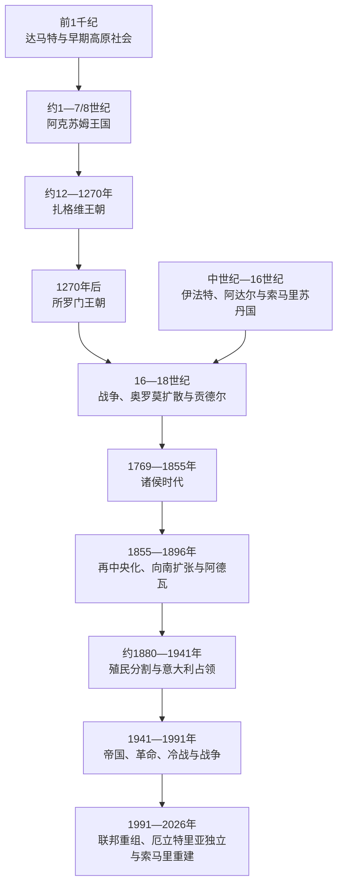

# 阿克苏姆、埃塞俄比亚与非洲之角

## 时间

公元前1千纪至2026年

## 概括

非洲之角由埃塞俄比亚—厄立特里亚高原、红海低地、阿法尔裂谷、索马里半岛和朱巴—谢贝利河谷构成。它同时面向尼罗河流域、阿拉伯半岛和印度洋，农耕高原、牧业低地、港口城市和商队路线相互依赖。达马特和阿克苏姆不是“南阿拉伯殖民地”，而是在本地社会基础上吸收红海两岸文字、建筑和宗教元素的国家。阿克苏姆约在1—7/8世纪控制高原与阿杜利斯港，4世纪王室接受基督教，并留下格尔兹文碑铭、铸币和大型石碑。

阿克苏姆衰落后，政治中心南移。扎格维王朝、1270年后所罗门王朝、伊法特—阿达尔等穆斯林苏丹国和索马里河谷—港口国家长期贸易、战争与通婚。16世纪阿达尔—埃塞俄比亚战争引入奥斯曼火器和葡萄牙援军，随后奥罗莫扩散及“加达”制度重组高原—低地秩序。19世纪埃塞俄比亚再中央化、向南扩张与欧洲瓜分同步发生：意大利建立厄立特里亚并夺取索马里据点，法国建立吉布提，英国控制索马里北岸；埃塞俄比亚在1896年阿德瓦战役守住主权，却在1936—1941年遭意大利占领。

20世纪后半叶的革命、冷战、索马里国家崩溃、厄立特里亚独立和埃塞俄比亚联邦重组，使国界、民族自治、港口和红海安全成为新主线。截至2026年，索马里联邦重建与武装叛乱、埃塞俄比亚内部冲突及提格雷和平安排、埃塞俄比亚—厄立特里亚关系和出海通道争议仍相互牵连。具体国家的完整君主或国家领导人序列应在各国专页维护，本篇只比较跨国政权和机制。

## 地理与贸易结构

| 空间 | 资源与交通 | 主要历史作用 |
|---|---|---|
| 北部高原 | 高海拔农业、降雨、石材、通往红海的山口 | 达马特、阿克苏姆及后来的提格雷政治中心 |
| 中南高原 | 谷物、畜牧、咖啡、可防守山地 | 扎格维、所罗门王朝与奥罗莫诸国整合空间 |
| 红海港口 | 阿杜利斯、马萨瓦、泽拉及塔朱拉等 | 连接地中海、阿拉伯、印度洋与内陆商队 |
| 阿法尔裂谷与盐区 | 盐块、骆驼运输、低地牧业 | 高原税收与商路的重要中介 |
| 索马里半岛 | 骆驼、牲畜、乳香、没药和季风港口 | 氏族政治、苏丹国和印度洋贸易 |
| 朱巴—谢贝利河谷 | 灌溉农业、谷物、棉花与河道 | 阿居兰、格莱迪等南索马里国家基础 |

高原与低地不能被写成基督徒和穆斯林两块永恒对立的区域。两者都包含多种语言、宗教和生产方式，贸易、军役、迁徙及地方结盟经常跨越宗教边界。

## 达马特与早期高原社会

公元前1千纪上半叶，今埃塞俄比亚北部和厄立特里亚高原出现以叶哈为重要中心的达马特及相邻政体。碑铭使用古南阿拉伯文字，神庙建筑和部分王号也显示红海交流；农业梯田、陶器和聚落传统则具有本地连续性。早期研究曾把这一文明解释为示巴移民建立的殖民地，现代更倾向于红海两岸精英、工匠和商人互动，而非外来人口单向创造国家。

达马特衰落后，高原并未进入完全空白期。多个地方政体、农业聚落和商路延续，格尔兹语及相关文字逐步本地化。由于碑铭零散，早期“王表”不能无争议连续排列，不宜把传统谱系当作逐年实录。

## 阿克苏姆王国

### 建立与贸易

约公元1世纪起，阿克苏姆成为高原强权。红海《厄立特里亚海周航记》所述阿杜利斯把象牙、犀角、龟甲、香料和内陆产品运往罗马—埃及、南阿拉伯与印度，输入布匹、金属、酒和货币。阿克苏姆王权通过高原农业税、商路、港口关税和附属首领扩张，并在3世纪起铸造金币、银币和铜币，以王像与铭文向不同贸易群体宣示权威。

巨型石碑、地下墓葬和王室铭文显示精英拥有组织劳力和石工的能力。最高统治者称“诸王之王”，地方首领和被征服王保留一定地位；国家范围随军事季节和贡赋关系变化，不是每一处都受同样行政直辖。

### 基督教化与红海战争

埃扎纳王约在4世纪30—40年代接受基督教，铸币符号由太阳—月亮转向十字架，格尔兹文铭文也记录新信仰。传统把来自叙利亚或腓尼基地区的弗鲁门修斯同亚历山大里亚教会联系起来；埃塞俄比亚教会长期由科普特教宗任命宗主教。王室改宗没有立即消除犹太、地方宗教或其他基督教传统，乡村转化历时数世纪。

埃扎纳的碑铭记载向尼罗河上游方向用兵，常同麦罗埃衰落联系，但阿克苏姆是否单独“灭亡库施王国”仍有争论。6世纪初，国王卡莱布跨海干预希木叶尔，宣称保护遭迫害的基督徒，一度在也门建立附属统治；当地军人阿布拉哈后来脱离阿克苏姆。570年代萨珊波斯控制也门，阿克苏姆失去阿拉伯据点。

### 衰落与遗产

7世纪以后，拜占庭—萨珊战争和阿拉伯征服改变红海贸易，铸币约在7世纪终止；港口联系、土壤压力、内部权力转移和贝贾等低地力量也可能促使中心南移。阿克苏姆不是在伊斯兰兴起某一年突然灭亡，政治和宗教传统延续至更晚。9—10世纪资料稀少，古迪特 / 约迪特毁坏阿克苏姆的传说可能保存真实动乱记忆，但其身份、年代和征服范围无法确定。

阿克苏姆仍是后世加冕、圣地与王权记忆中心。格尔兹语退出日常口语后继续作为教会礼仪和文献语言；阿克苏姆石碑、锡安圣玛利亚教堂传统和“约柜”叙事成为埃塞俄比亚身份的一部分。

## 扎格维与所罗门王朝

### 扎格维王朝

约11—12世纪，阿高语背景的扎格维王朝控制拉斯塔及高原部分地区。拉利贝拉王时期的岩石教堂以整块火山岩向下凿成，既反映王室—教会动员，也连接耶路撒冷朝圣想象。扎格维统治范围、君主人数和起止年代在教会名单中差异很大；常用“约12世纪—1270年”而非精确长表。

1270年，耶库诺·阿姆拉克击败末代扎格维统治者，建立自称恢复阿克苏姆旧王系的所罗门王朝。14世纪形成的《列王荣耀》把王朝追溯到所罗门王和示巴女王之子孟尼利克一世，为新王朝提供神圣谱系。这个叙事对政治合法性极重要，却不能用作公元前王统的直接史证。

### 中世纪所罗门国家

皇帝以流动营地巡视各省，依靠王族、军事贵族、地方统治者、修道院和土地授予征税征兵。阿姆达·塞永一世在14世纪向南、向东扩张，同伊法特等穆斯林政权战争；扎拉·雅各布在15世纪加强教义统一、教会会议和王权控制。王室不能永久直辖每个区域，边疆常在贡赋、自治与反叛之间变化。

教会修道院保存文献、土地和教育，也可能反对皇帝的教义或财产政策。埃塞俄比亚基督教发展出安息日、圣徒、禁食和地方礼仪传统，同亚历山大里亚教会相连但具有独特制度。

## 穆斯林苏丹国与索马里国家

### 港口—高原走廊

伊斯兰在7世纪即到达红海和索马里海岸，泽拉、达赫拉克群岛、柏培拉、摩加迪沙等把商人、学者和内陆牧民连接起来。设瓦、伊法特和阿达尔等苏丹国控制东部商路和农业—牧业边界，统治人口包含索马里、阿法尔、哈勒里、阿尔戈巴等多种社群。它们同基督教高原既战争也交换盐、牲畜、谷物、布匹和奴隶。

伊法特在14世纪被所罗门皇帝压制后，瓦拉什马王族转向阿达尔，泽拉和后来哈勒尔成为中心。苏丹权力依赖王族、埃米尔、宗教学者、商人和氏族军队，内部继承常影响对高原战争。

### 阿达尔—埃塞俄比亚战争

阿达尔统帅艾哈迈德·伊本·易卜拉欣“格兰”于1529年在欣布拉库雷击败埃塞俄比亚军，利用奥斯曼和红海渠道获得火绳枪，数年内占领并毁坏高原多地。皇帝向葡萄牙求援，克里斯托旺·达伽马率小部火枪兵于1541年抵达；他1542年被俘杀，残部与埃塞俄比亚军重组。1543年韦纳达加战役中艾哈迈德死亡，阿达尔军撤退。

这场战争不是“基督教与伊斯兰数千年宿敌”的证明，而是当时红海火器竞争、商路、边疆贡赋和王朝权力的集中爆发。双方宗教建筑和人口遭重创，奥斯曼与葡萄牙介入把地方战争纳入全球海洋竞争。战后阿达尔中心逐渐转向哈勒尔，东部仍有穆斯林埃米尔和牧民政治。

### 阿居兰及其他索马里苏丹国

阿居兰约在13—17世纪以朱巴、谢贝利河谷和印度洋港口为基础，通过水井、灌溉、税收和氏族联盟统治南索马里。摩加迪沙等城市有自身商人精英和铸币传统，同阿居兰权力关系随时期变化。17世纪后阿居兰衰落，格莱迪苏丹国在阿夫戈耶周边兴起；东北马吉尔廷、霍比奥和瓦桑加利等苏丹国则依靠牧业、港口与条约维持自治。

这些国家的王统多由口述谱系、阿拉伯文献和殖民记录重建，不能把氏族祖先名单直接当作连续在位年表。氏族制度也不是“无政府”的同义词：长老、契约习惯法、宗教人士、血偿群体和季节性集会可以治理资源与冲突。

## 奥罗莫扩散、贡德尔与诸侯时代

16世纪起，使用库希特语的奥罗莫群体通过“加达”年龄级制度组织迁徙和战争，向高原、裂谷和河谷扩展。迁徙包含冲突、吸纳、通婚和语言转换，不是单一外来民族一次性入侵。不同奥罗莫社群后来成为穆斯林、基督徒或保持本地信仰，建立吉贝诸王国，或进入所罗门宫廷和地方贵族。

法西利德斯皇帝1632年拒绝此前耶稣会推动的天主教路线，恢复本土正教，1636年前后建立贡德尔固定首都。宫殿、教堂、绘画和跨红海贸易促成“贡德尔时代”，宫廷派系、王族争位和地方军阀也逐步增强。1769年后常称“王子时代”：皇帝保留象征地位，提格雷、沃洛、戈贾姆和奥罗莫—耶朱贵族轮流控制宫廷。政治分裂不等于经济文化完全停顿，地方市场、修道院和王公国家继续运行。

## 19世纪国家重组与欧洲瓜分

### 再中央化与向南扩张

特沃德罗斯二世1855年加冕，试图统一军队、制造火炮和削弱地方贵族。他扣留英国使节引发1868年马格达拉远征，英军攻破山堡后撤离，特沃德罗斯自杀。约翰内斯四世以提格雷为基地，允许地方王公较大自治，先后击退埃及入侵、应对意大利在红海扩张，并于1889年同马赫迪军作战时死亡。

绍阿王孟尼利克二世继位后以进口火器、道路、税收和地方联盟扩展国家，征服或纳入奥罗莫、锡达马、沃莱塔、哈勒尔及其他南部、东部社会。这个过程形成现代埃塞俄比亚领土和亚的斯亚贝巴首都，也伴随战争、土地转移、贡赋、奴役和文化等级。对一些社群是统一和抵御殖民，对另一些社群则是帝国内部征服，两种视角必须并存。

### 阿德瓦与殖民分割

意大利1882年取得阿萨布、1885年占马萨瓦，1890年宣布厄立特里亚殖民地。1889年《乌恰莱条约》的意大利文把埃塞俄比亚外交置于意大利保护，阿姆哈拉文只允许选择性使用意方外交渠道，解释冲突导致战争。1896年3月阿德瓦战役中，孟尼利克与泰图皇后动员多省军队击败意军，意大利承认埃塞俄比亚独立。胜利成为全球反殖民象征，但没有解放已成殖民地的厄立特里亚，也不消除埃塞俄比亚内部帝国关系。

英国在1880年代建立英属索马里保护地，法国以奥博克—吉布提建立法属索马里海岸，意大利通过东北苏丹国条约和南部据点形成意属索马里。埃塞俄比亚、英法意领地之间的直线边界切割索马里、阿法尔和其他牧民迁徙路线，欧加登等区域成为长期争议。索马里北部穆罕默德·阿卜杜拉·哈桑领导的“托钵僧国家”自1899年同英国、埃塞俄比亚与意大利势力作战，1920年英国以空袭摧毁塔莱堡垒后才终结其核心抵抗。

## 20世纪至今

### 意大利占领、联邦与革命

海尔·塞拉西于1916年成为摄政、1930年加冕。意大利1935年入侵埃塞俄比亚，使用包括化学武器在内的暴力，1936年攻占首都并把埃塞俄比亚、厄立特里亚和意属索马里组成意属东非。爱国者游击持续抵抗，英军及流亡皇帝1941年恢复埃塞俄比亚政权。埃塞俄比亚因此保持国际法上的国家连续性，但1936—1941年确有实际殖民占领。

联合国1952年安排厄立特里亚同埃塞俄比亚组成联邦，保留议会和自治；皇帝逐步削弱制度，1962年正式吞并，厄立特里亚独立战争延续约三十年。埃塞俄比亚1974年军人“德尔格”推翻王朝，国有化土地，以红色恐怖镇压对手；战争、强制迁村、征粮、干旱和政策失败共同造成1980年代灾难性饥荒。

### 索马里、吉布提与冷战

英属索马里兰和意属索马里托管地1960年合并为索马里共和国，法属领地则在1977年成为吉布提。索马里西亚德·巴雷1969年政变后建立“科学社会主义”政权，1977—1978年进攻埃塞俄比亚欧加登；苏联转而支持埃塞俄比亚，古巴部队参战，索军失败。战争、氏族政治、镇压和财政崩溃削弱国家，1991年中央政权瓦解。北部索马里兰宣布恢复独立并建立事实制度，但截至2026年未获普遍国际承认；邦特兰等联邦成员和南中部政治另有发展。

吉布提凭曼德海峡和亚吉铁路成为港口、军队基地与物流国家，阿法尔—伊萨权力平衡和1990年代内战影响其制度。其港口也为无海岸的埃塞俄比亚承担主要进出口，说明殖民边界没有切断区域经济依存。

### 1991年后的重组

1991年埃塞俄比亚人民革命民主阵线推翻德尔格，厄立特里亚事实上独立并在1993年公投后建国；埃塞俄比亚采用按民族划分的联邦制，试图以自治和退出权处理帝国多样性，同时执政联盟长期控制政治。1998—2000年埃厄边界战争造成重大伤亡，阿尔及尔协议和国际裁决未能立即恢复正常关系；2018年两国和解一度打破僵局。

2020—2022年提格雷战争由联邦—地区权力冲突升级，厄立特里亚军队及多方武装介入，造成大规模死亡、饥饿、性暴力和流离失所。2022年《比勒陀利亚停止敌对行动协议》结束联邦政府与提格雷力量的主要战争，但西提格雷地位、厄军存在、复员、问责和人道恢复未全部解决。此后阿姆哈拉和奥罗米亚等地仍有武装冲突；2026年初联合国再次呼吁各方避免提格雷局势升级。

索马里自2000年代建立过渡、后来的联邦制度，并在非盟任务支持下对抗青年党。中央、联邦成员州、索马里兰和氏族权力之间的宪制关系尚未稳定。2024年埃塞俄比亚同索马里兰签署海岸使用谅解备忘录，引发索马里主权抗议；随后土耳其调停缓和埃塞俄比亚—索马里关系，但出海需求、承认问题和红海竞争仍持续。截至2026年，非盟在索马里的新任务仍面对资金与安全压力。

## 统治结构比较

| 政体 | 最高权力 | 地方与制度 | 关键特征 |
|---|---|---|---|
| 阿克苏姆 | “诸王之王” | 附属王、地方首领、港口与军队 | 铸币、碑铭、农业税与红海贸易结合 |
| 中世纪所罗门王朝 | 皇帝 | 王族、省级贵族、修道院、贡赋首领 | 流动宫廷、土地—军役和宗教合法性 |
| 伊法特—阿达尔 | 苏丹 / 伊玛目 | 埃米尔、学者、氏族军队和商人 | 港口—高原贸易与圣战动员并存 |
| 索马里苏丹国 | 苏丹、乌加斯等 | 氏族长老、习惯法、宗教人士和商人 | 河谷灌溉、港口或牧业网络，权力多中心 |
| 贡德尔—诸侯时代 | 皇帝名义最高 | 摄政王公、地方军阀和教会 | 王权象征连续，实际军政分散 |
| 现代殖民领地 | 欧洲君主 / 殖民政府 | 总督、驻地官、条约苏丹或酋长 | 边界、港口、税收、劳役和军事基地 |
| 当代国家 | 总统 / 总理、议会与联邦机构 | 地区州、事实政权、氏族或地方政府 | 法定主权、实际控制和国际承认可能不一致 |

## 重要事件

| 时间 | 事件 | 结果与长期影响 |
|---|---|---|
| 前1千纪上半叶 | 叶哈—达马特等高原政体 | 红海互动与本地农业国家结合 |
| 约1世纪 | 阿克苏姆与阿杜利斯兴起 | 高原进入罗马—红海—印度洋贸易 |
| 4世纪上半叶 | 埃扎纳接受基督教 | 王室、铸币和教会传统重组 |
| 6世纪 | 卡莱布干预希木叶尔 | 阿克苏姆达到跨红海影响高峰，随后失去也门 |
| 1270年 | 耶库诺·阿姆拉克建立所罗门王朝 | 以“恢复”叙事重建高原王权 |
| 1529—1543年 | 阿达尔—埃塞俄比亚战争 | 火器和葡奥介入，双方人口与制度遭重创 |
| 16—17世纪 | 奥罗莫扩散与加达体系传播 | 高原语言、宗教、土地和军政联盟重组 |
| 1630年代 | 贡德尔建都并恢复本土正教 | 固定宫廷文化兴起，后转向诸侯政治 |
| 1855年 | 特沃德罗斯二世加冕 | 近代再中央化开始 |
| 1890—1896年 | 厄立特里亚殖民地建立与阿德瓦战役 | 欧洲沿海殖民固定，埃塞俄比亚守住国家主权 |
| 1935—1941年 | 意大利入侵和占领 | 埃塞俄比亚主权受侵但抵抗与国家连续性延续 |
| 1960—1977年 | 索马里合并、厄立特里亚战争、吉布提独立 | 殖民领地转为国家，跨境民族问题保留 |
| 1974年 | 德尔格推翻海尔·塞拉西 | 所罗门王朝终结，进入社会主义军政阶段 |
| 1991—1993年 | 德尔格倒台、索马里崩溃、厄立特里亚独立 | 国家重组与事实政权并行 |
| 1998—2000年 | 埃厄边界战争 | 殖民边界遗产转化为国家间战争 |
| 2020—2022年 | 提格雷战争与停火协议 | 民族联邦危机、外部介入和战后问责成为长期议题 |

## 兴衰与冲突机制

### 国家崛起

- 高原农业盈余与红海港口结合，使阿克苏姆能够铸币、养军并参与国际贸易。
- 王朝谱系、教会或伊斯兰学术为跨语言政权提供合法性，但地方首领和宗教网络从未完全消失。
- 火器、商路和对外联盟在16、19世纪多次改变力量平衡；取得武器并不足以替代稳定税收与地方合作。
- 牧民年龄级、氏族契约和商人网络能够在无统一官僚的情况下组织迁徙、司法和战争。

### 衰落与战争

| 层次 | 因素 | 作用 |
|---|---|---|
| 结构因素 | 王族继承、地方军政世袭、中心与边疆税负 | 强君死后容易进入诸侯竞争或地区反叛 |
| 经济因素 | 红海路线变化、港口丧失、农业与牧场压力 | 中心南移，国家对沿海中介依赖上升 |
| 外部压力 | 奥斯曼、葡萄牙、欧洲殖民和冷战军援 | 放大地方战争并固定新的边界与军事技术差距 |
| 身份政治 | 帝国等级、殖民分类和民族联邦边界 | 为自治提供制度，也可能把地方竞争升级为主权冲突 |
| 直接触发 | 条约解释、政变、选举争议、军队进入争议地 | 把长期资源和权力矛盾转化为战争 |

## 史料与争议

- 达马特、早期阿克苏姆和扎格维王表依赖碑铭、钱币、考古和成书较晚的王统表，年代不完整；不能为了“完整世系”填入无证实人物。
- 所罗门—示巴谱系是极其重要的政治神学，不是可直接验证的公元前家族档案。
- “阿比西尼亚”等旧称常只指高原核心，不能覆盖现代埃塞俄比亚全部民族和领土。
- 奥罗莫迁徙不是无差别破坏浪潮，包含征服、吸纳、通婚、定居和制度传播。
- 索马里氏族既能提供社会保障和习惯法，也会在国家资源竞争中军事化；不能把国家危机归结为所谓固定“部落天性”。
- 阿德瓦胜利抵抗欧洲殖民值得强调，同时也应承认孟尼利克国家向南扩张中的暴力和不平等。

## 统治者世系

阿克苏姆、扎格维、所罗门王朝、布干达、布尼奥罗、卢旺达、布隆迪、桑给巴尔和伊默里纳的完整可确认序列、复位与争议年代，集中见[东非王国与苏丹国统治者世系表](/%E4%BA%BA%E6%96%87%E7%A7%91%E5%AD%A6/%E5%8E%86%E5%8F%B2/%E9%9D%9E%E6%B4%B2/%E4%B8%9C%E9%9D%9E/%E4%B8%9C%E9%9D%9E%E7%8E%8B%E5%9B%BD%E4%B8%8E%E8%8B%8F%E4%B8%B9%E5%9B%BD%E7%BB%9F%E6%B2%BB%E8%80%85%E4%B8%96%E7%B3%BB%E8%A1%A8.md)。史料不能连续复原的早期节点明确保留空档。

## 演变关系

- 国家视角：[埃塞俄比亚](/%E4%BA%BA%E6%96%87%E7%A7%91%E5%AD%A6/%E5%8E%86%E5%8F%B2/%E9%9D%9E%E6%B4%B2/%E4%B8%9C%E9%9D%9E/%E5%9F%83%E5%A1%9E%E4%BF%84%E6%AF%94%E4%BA%9A/README.md)、[厄立特里亚](/%E4%BA%BA%E6%96%87%E7%A7%91%E5%AD%A6/%E5%8E%86%E5%8F%B2/%E9%9D%9E%E6%B4%B2/%E4%B8%9C%E9%9D%9E/%E5%8E%84%E7%AB%8B%E7%89%B9%E9%87%8C%E4%BA%9A/README.md)、[索马里](/%E4%BA%BA%E6%96%87%E7%A7%91%E5%AD%A6/%E5%8E%86%E5%8F%B2/%E9%9D%9E%E6%B4%B2/%E4%B8%9C%E9%9D%9E/%E7%B4%A2%E9%A9%AC%E9%87%8C/README.md)、[吉布提](/%E4%BA%BA%E6%96%87%E7%A7%91%E5%AD%A6/%E5%8E%86%E5%8F%B2/%E9%9D%9E%E6%B4%B2/%E4%B8%9C%E9%9D%9E/%E5%90%89%E5%B8%83%E6%8F%90/README.md)
- 海岸联系：[斯瓦希里海岸与印度洋世界](/%E4%BA%BA%E6%96%87%E7%A7%91%E5%AD%A6/%E5%8E%86%E5%8F%B2/%E9%9D%9E%E6%B4%B2/%E4%B8%9C%E9%9D%9E/%E6%96%AF%E7%93%A6%E5%B8%8C%E9%87%8C%E6%B5%B7%E5%B2%B8%E4%B8%8E%E5%8D%B0%E5%BA%A6%E6%B4%8B%E4%B8%96%E7%95%8C.md)
- 上级入口：[东非历史](/%E4%BA%BA%E6%96%87%E7%A7%91%E5%AD%A6/%E5%8E%86%E5%8F%B2/%E9%9D%9E%E6%B4%B2/%E4%B8%9C%E9%9D%9E/README.md)
