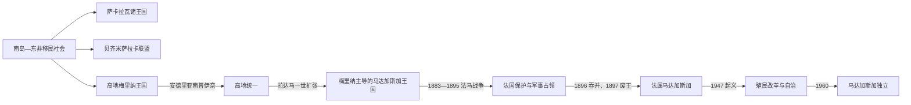

# 马达加斯加的前殖民社会与殖民统治

## 时间

约公元1千纪—1960年

## 概括

马达加斯加居民由来自东南亚的南岛语族航海者与东非人群共同形成，语言属南岛语系而文化和遗传具有双重来源。岛上各地发展萨卡拉瓦、贝齐米萨拉卡、贝齐略和梅里纳等王国，19世纪梅里纳王权试图统一全岛。

## 历史演进

## 王国形成与统治机制

早期移民把南岛稻作、语言和独木舟技术与东非牛牧、作物及社会网络结合。17—18世纪萨卡拉瓦王室以牛群、火器和西部港贸扩张，东海岸贝齐米萨拉卡联盟则由拉齐米拉霍通过婚姻与港口政治整合。高地梅里纳王权依靠梯田、村社、贵族—平民—奴隶等级、军役和“法诺姆波阿纳”劳役集中资源；安德里亚南普伊奈统一伊梅里纳，拉达马一世凭军队、英国武器与传教学校向外扩张，但全岛许多地区始终保持抵抗或间接臣属。

## 主要社会与政权

| 社会或政权 | 大致时期 | 特征 |
|---|---|---|
| 早期沿海与高地聚落 | 约公元1千纪 | 稻作、牛牧、航海与东非—印度洋联系 |
| 萨卡拉瓦王国 | 17—18世纪 | 西部王朝、牛群与奴隶贸易 |
| 贝齐米萨拉卡联盟 | 18世纪 | 东海岸港口和拉齐米拉霍联盟 |
| 梅里纳王国 | 约1787—1896年 | 安德里亚南普伊奈与拉达马一世推进高原统一 |

## 殖民统治或外来占领

梅里纳宫廷19世纪接受英国传教教育、文字和军事技术，也经历拉纳瓦洛娜一世时期的排外与强制劳役。法国以沿海保护权和债务为由发动战争，1896年吞并全岛、废黜女王，镇压“红披巾”抵抗并发展咖啡、香草和矿产。

## 王国改革、法国征服与殖民统治过程

拉达马一世与英国签约限制奴隶出口，伦敦传教会建立学校并用拉丁字母书写马达加斯加语。拉纳瓦洛娜一世强调主权、限制欧洲影响并以劳役和军队维持统治，造成严重人口与政治代价；1860年代王室接受基督教，首相赖尼莱亚里沃尼先后与三位女王合作，掌握政府、军队和外交，推进法律与行政改革。法国以萨卡拉瓦沿海主张、侨民财产和债务为由发动1883—1885年战争，迫使王国接受含混保护条款；1894—1895年再次入侵，法军付出疾病损失后占领首都。

法国1896年宣布吞并，1897年放逐拉纳瓦洛娜三世，终结君主制。总督加列尼以军事“绥靖”、受任地方官、劳役和人头税压制“红披巾”抵抗，并发展铁路、咖啡、香草与矿业。1947年民族主义起义遭严厉镇压，大量人员死亡；战后法国逐步扩大公民权和地方自治，1958年马达加斯加共和国成为法兰西共同体内自治国家，1960年独立。

## 重要事件

- 约公元第一千纪南岛与东非移民逐步定居。
- 1810—1828年拉达马一世扩张梅里纳国家并与英国合作。
- 1860年代后基督教成为宫廷政治重要力量。
- 1895年法军攻占塔那那利佛，1896年宣布殖民地。
- 1947—1948年马达加斯加民族起义遭法国严厉镇压。

## 王朝兴衰与殖民体系终结原因

| 层次 | 主要因素 |
|---|---|
| 梅里纳崛起 | 高地农业密度、劳役征发、常备军、英国技术与宫廷改革推动扩张，但沿海服从始终不完全 |
| 王国压力 | 强制劳役、地区反抗、宫廷派系与对欧洲武器贸易依赖限制全岛整合 |
| 外部压力 | 英法竞争先帮助改革又使外交受制；法国以工业军力、沿海据点和条约解释优势完成征服 |
| 直接终结 | 1895年首都失守、1896年吞并和1897年废王依次终止主权；1947年镇压成本、法国战后改革和民族政党谈判促成殖民退出 |

## 王朝世系与殖民行政首脑

萨卡拉瓦分支、贝齐米萨拉卡联盟和梅里纳完整公认统治顺序，以及女王—首相实际权力关系见[东非王国与苏丹国统治者世系表](/%E4%BA%BA%E6%96%87%E7%A7%91%E5%AD%A6/%E5%8E%86%E5%8F%B2/%E9%9D%9E%E6%B4%B2/%E4%B8%9C%E9%9D%9E/%E4%B8%9C%E9%9D%9E%E7%8E%8B%E5%9B%BD%E4%B8%8E%E8%8B%8F%E4%B8%B9%E5%9B%BD%E7%BB%9F%E6%B2%BB%E8%80%85%E4%B8%96%E7%B3%BB%E8%A1%A8.md)。1896年后法国总督掌握军政最高权，受任省区官员与地方首领执行税役；1958年自治共和国总统和内阁逐步接管内政，但法国在1960年前仍控制主权层事务。

## 演变关系

这一阶段的边界、行政与政治冲突直接影响[马达加斯加的独立建国与现代发展](/%E4%BA%BA%E6%96%87%E7%A7%91%E5%AD%A6/%E5%8E%86%E5%8F%B2/%E9%9D%9E%E6%B4%B2/%E4%B8%9C%E9%9D%9E/%E9%A9%AC%E8%BE%BE%E5%8A%A0%E6%96%AF%E5%8A%A0/%E7%8B%AC%E7%AB%8B%E5%BB%BA%E5%9B%BD%E4%B8%8E%E7%8E%B0%E4%BB%A3%E5%8F%91%E5%B1%95.md)。
