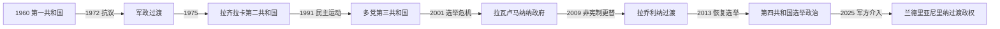

# 马达加斯加的独立建国与现代发展

## 时间

1960年至今

## 概括

1960年独立后第一共和国与法国保持密切关系。1972年群众抗议终结齐拉纳纳政权，1975年迪迪埃·拉齐拉卡建立社会主义第二共和国；1990年代实行多党化，但选举争议和2009年非宪制权力更替反复影响制度。

## 政治演进

## 共和国与军政权力结构

第一共和国总统齐拉纳纳依靠社会民主党、沿海精英和法国合作体系，议会与地方行政受执政党主导。1972年抗议后，军方接管并先后由拉马南楚阿、拉齐曼德拉瓦及军事委员会领导；拉齐拉卡1975年建立最高革命委员会和先锋党联盟。1992年后宪法在总统、总理和议会之间分权，但总统与议会多数分属不同阵营时易发生权力冲突；军队在2009和2025年危机中再次成为政权仲裁者。

## 主要政治阶段

| 阶段 | 时间 | 权力结构与特征 |
|---|---|---|
| 第一共和国 | 1960—1972年 | 亲法发展和社会民主党主导 |
| 社会主义第二共和国 | 1975—1992年 | 拉齐拉卡、国有化和非结盟外交 |
| 多党共和国与危机 | 1992年至今 | 竞争性选举、政权轮替与2002、2009年危机 |

## 群众运动、选举危机与过渡过程

1972年学生反对法式教育和依附经济的示威扩展为全国罢工，齐拉纳纳交权。1975年拉齐曼德拉瓦上台数日即遇刺，军委最终推举拉齐拉卡；国有化、价格冲击和债务使1980年代转向调整。1991年反对运动向总统府游行遭射击，促成过渡和1992年宪法。2001年总统选举计票争议形成两个政府、道路封锁和武装对峙，拉瓦卢马纳纳最终掌权；2009年其与首都市长拉乔利纳冲突，军方把权力交给后者，国际社会暂停承认。

2013年选举结束过渡，拉乔利纳2018年当选并在2023年争议选举中连任。2025年围绕停电、供水、生活成本和治理的抗议扩大，部分军人转向示威者一方；总统权力崩解后，米卡埃尔·兰德里亚尼里纳于10月成为过渡总统。过渡当局在2026年调整政府，截至7月14日由马米蒂亚纳·拉乔纳里松任总理，制宪、选举时序与文官监督仍待落实。

## 重要转折

- 1960年6月26日独立。
- 1972年学生和工人抗议迫使齐拉纳纳交权。
- 1975年《社会主义革命宪章》确立第二共和国。
- 1991年大规模民主运动推动新宪法。
- 2009年安德里·拉乔利纳在军方支持下取代拉瓦卢马纳纳，引发国际孤立，后恢复选举秩序。

## 政权兴衰与反复危机原因

- **第一共和国衰落**：对法国依赖、地区与教育不平等、经济停滞使学生抗议获得工人和军队响应，1972年成为直接转折。
- **社会主义路线退却**：国企效率、外汇短缺、外部价格和债务压力迫使1980年代调整；镇压又削弱第二共和国合法性。
- **多党危机结构**：总统—总理双重行政、个人化政党、选举机构争议和军队政治角色使竞争者容易诉诸街头或非宪制力量。
- **持续约束**：贫困、基础设施脆弱、气候灾害、矿产与土地争议限制任何政府；国际承认和援助则推动恢复选举秩序。

## 国家元首、政府首脑与实际权力

独立以来总统、军委、过渡首脑和总理完整序列见[东非独立国家元首与权力结构表](/%E4%BA%BA%E6%96%87%E7%A7%91%E5%AD%A6/%E5%8E%86%E5%8F%B2/%E9%9D%9E%E6%B4%B2/%E4%B8%9C%E9%9D%9E/%E4%B8%9C%E9%9D%9E%E7%8B%AC%E7%AB%8B%E5%9B%BD%E5%AE%B6%E5%85%83%E9%A6%96%E4%B8%8E%E6%9D%83%E5%8A%9B%E7%BB%93%E6%9E%84%E8%A1%A8.md)。截至2026年7月14日，米卡埃尔·兰德里亚尼里纳任过渡总统，是国家元首及安全转型核心；马米蒂亚纳·拉乔纳里松任总理，领导政府日常行政。过渡机构、军方、议会性安排与未来选举机关之间的权限仍在重塑，不能把现状当作稳定的常规总统制。

## 演变关系

前接[马达加斯加的前殖民社会与殖民统治](/%E4%BA%BA%E6%96%87%E7%A7%91%E5%AD%A6/%E5%8E%86%E5%8F%B2/%E9%9D%9E%E6%B4%B2/%E4%B8%9C%E9%9D%9E/%E9%A9%AC%E8%BE%BE%E5%8A%A0%E6%96%AF%E5%8A%A0/%E5%89%8D%E6%AE%96%E6%B0%91%E7%A4%BE%E4%BC%9A%E4%B8%8E%E6%AE%96%E6%B0%91%E7%BB%9F%E6%B2%BB.md)。现代国家同时受到大湖区、非洲之角或印度洋跨境网络影响。
