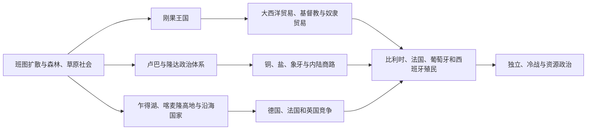

# 中非历史

中非历史以刚果盆地雨林、南北草原走廊、乍得湖和大西洋河口为主要空间。刚果、卢巴、隆达、巴米累克、巴蒙和加涅姆—博尔努等国家通过河流、铜矿、盐、象牙和贡赋网络兴起。大西洋奴隶贸易、象牙与橡胶经济，以及比利时、法国、德国、西班牙和葡萄牙殖民统治深刻改变区域。

## 区域专题

- [刚果王国与大西洋中非](/%E4%BA%BA%E6%96%87%E7%A7%91%E5%AD%A6/%E5%8E%86%E5%8F%B2/%E9%9D%9E%E6%B4%B2/%E4%B8%AD%E9%9D%9E/%E5%88%9A%E6%9E%9C%E7%8E%8B%E5%9B%BD%E4%B8%8E%E5%A4%A7%E8%A5%BF%E6%B4%8B%E4%B8%AD%E9%9D%9E.md)
- [卢巴、隆达与刚果盆地网络](/%E4%BA%BA%E6%96%87%E7%A7%91%E5%AD%A6/%E5%8E%86%E5%8F%B2/%E9%9D%9E%E6%B4%B2/%E4%B8%AD%E9%9D%9E/%E5%8D%A2%E5%B7%B4%E3%80%81%E9%9A%86%E8%BE%BE%E4%B8%8E%E5%88%9A%E6%9E%9C%E7%9B%86%E5%9C%B0%E7%BD%91%E7%BB%9C.md)
- [殖民资源体系、独立与中非冲突](/%E4%BA%BA%E6%96%87%E7%A7%91%E5%AD%A6/%E5%8E%86%E5%8F%B2/%E9%9D%9E%E6%B4%B2/%E4%B8%AD%E9%9D%9E/%E6%AE%96%E6%B0%91%E8%B5%84%E6%BA%90%E4%BD%93%E7%B3%BB%E3%80%81%E7%8B%AC%E7%AB%8B%E4%B8%8E%E4%B8%AD%E9%9D%9E%E5%86%B2%E7%AA%81.md)

## 国家入口

| 国家 | 入口 | 核心线索 |
|---|---|---|
| 乍得 | [乍得历史](/%E4%BA%BA%E6%96%87%E7%A7%91%E5%AD%A6/%E5%8E%86%E5%8F%B2/%E9%9D%9E%E6%B4%B2/%E4%B8%AD%E9%9D%9E/%E4%B9%8D%E5%BE%97/README.md) | 乍得湖帝国、法国殖民与南北政治 |
| 喀麦隆 | [喀麦隆历史](/%E4%BA%BA%E6%96%87%E7%A7%91%E5%AD%A6/%E5%8E%86%E5%8F%B2/%E9%9D%9E%E6%B4%B2/%E4%B8%AD%E9%9D%9E/%E5%96%80%E9%BA%A6%E9%9A%86/README.md) | 草原王国、德属殖民、英法托管与联邦问题 |
| 中非共和国 | [中非共和国历史](/%E4%BA%BA%E6%96%87%E7%A7%91%E5%AD%A6/%E5%8E%86%E5%8F%B2/%E9%9D%9E%E6%B4%B2/%E4%B8%AD%E9%9D%9E/%E4%B8%AD%E9%9D%9E%E5%85%B1%E5%92%8C%E5%9B%BD/README.md) | 乌班吉社会、法属赤道非洲与国家危机 |
| 赤道几内亚 | [赤道几内亚历史](/%E4%BA%BA%E6%96%87%E7%A7%91%E5%AD%A6/%E5%8E%86%E5%8F%B2/%E9%9D%9E%E6%B4%B2/%E4%B8%AD%E9%9D%9E/%E8%B5%A4%E9%81%93%E5%87%A0%E5%86%85%E4%BA%9A/README.md) | 布比与芳人社会、西班牙殖民和石油国家 |
| 加蓬 | [加蓬历史](/%E4%BA%BA%E6%96%87%E7%A7%91%E5%AD%A6/%E5%8E%86%E5%8F%B2/%E9%9D%9E%E6%B4%B2/%E4%B8%AD%E9%9D%9E/%E5%8A%A0%E8%93%AC/README.md) | 河口贸易、法国殖民与资源经济 |
| 刚果共和国 | [刚果共和国历史](/%E4%BA%BA%E6%96%87%E7%A7%91%E5%AD%A6/%E5%8E%86%E5%8F%B2/%E9%9D%9E%E6%B4%B2/%E4%B8%AD%E9%9D%9E/%E5%88%9A%E6%9E%9C%E5%85%B1%E5%92%8C%E5%9B%BD/README.md) | 刚果—特克政权、法属刚果与社会主义共和国 |
| 刚果民主共和国 | [刚果民主共和国历史](/%E4%BA%BA%E6%96%87%E7%A7%91%E5%AD%A6/%E5%8E%86%E5%8F%B2/%E9%9D%9E%E6%B4%B2/%E4%B8%AD%E9%9D%9E/%E5%88%9A%E6%9E%9C%E6%B0%91%E4%B8%BB%E5%85%B1%E5%92%8C%E5%9B%BD/README.md) | 刚果自由邦、比属刚果、独立危机与区域战争 |
| 圣多美和普林西比 | [圣多美和普林西比历史](/%E4%BA%BA%E6%96%87%E7%A7%91%E5%AD%A6/%E5%8E%86%E5%8F%B2/%E9%9D%9E%E6%B4%B2/%E4%B8%AD%E9%9D%9E/%E5%9C%A3%E5%A4%9A%E7%BE%8E%E5%92%8C%E6%99%AE%E6%9E%97%E8%A5%BF%E6%AF%94/README.md) | 葡萄牙种植园、奴隶社会与岛国独立 |
| 安哥拉 | [安哥拉历史](/%E4%BA%BA%E6%96%87%E7%A7%91%E5%AD%A6/%E5%8E%86%E5%8F%B2/%E9%9D%9E%E6%B4%B2/%E4%B8%AD%E9%9D%9E/%E5%AE%89%E5%93%A5%E6%8B%89/README.md) | 刚果与恩东戈、葡萄牙殖民、解放战争和内战 |

## 组织说明

安哥拉在政治地理上常列入中非，其历史也与南部非洲解放战争紧密相连，本目录通过互链处理。

## 直接上级

- [撒哈拉以南非洲历史](/%E4%BA%BA%E6%96%87%E7%A7%91%E5%AD%A6/%E5%8E%86%E5%8F%B2/%E9%9D%9E%E6%B4%B2/README.md)
