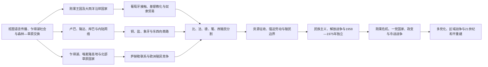

# 中非历史

中非以刚果盆地、其南北草原走廊、乍得湖流域和几内亚湾岛屿为主要历史空间。河流与跨生态商路孕育刚果、卢巴、隆达、库巴、加涅姆—博尔努、巴吉尔米、巴蒙等多种政治体系；大西洋奴隶贸易、十九世纪象牙贸易、欧洲殖民资源制度和独立后的区域战争又把这些空间重新连接和切割。

## 历史主线

## 历史主线概括

中非古代与中世纪政治并非由单一“帝国链”构成。刚果河及其支流连接森林、湿地和草原；铜、盐、鱼、铁器、拉菲亚布和粮食在本地网络中流通。国家通常以神圣王权、地方首领、联姻、贡赋、商路和仪式知识整合不同共同体，对核心与边缘的控制程度并不相同。

十五世纪末以后，刚果宫廷主动把基督教和文字外交纳入王权；葡萄牙在安哥拉和圣多美建立的殖民—种植园体系却使奴隶贸易、战争和人口掠夺扩大。内陆的卢巴、隆达和库巴体系在十七、十八世纪繁荣，十九世纪又面对东西两向象牙—奴隶商路、火器竞争、乔克韦扩张和新兴商贸军事政权。

十九世纪末，国际主权声索通过军事远征、特许公司、强迫劳动和交通基础设施逐步变成殖民控制。独立国家继承了以出口矿产、石油、木材和种植园作物为中心的经济地理，也继承了地区发展不均、殖民军队和分割历史网络的边界。1960年代的刚果危机、安哥拉内战、1990年代以来的刚果区域战争及中非共和国危机，需要从国内政治、殖民遗产、邻国安全和全球资源市场共同解释。

## 区域专题导航

| 顺序 | 专题 | 大致时段 | 简要概括 |
|---|---|---|---|
| 1 | [刚果王国与大西洋中非](/%E4%BA%BA%E6%96%87%E7%A7%91%E5%AD%A6/%E5%8E%86%E5%8F%B2/%E9%9D%9E%E6%B4%B2/%E4%B8%AD%E9%9D%9E/%E5%88%9A%E6%9E%9C%E7%8E%8B%E5%9B%BD%E4%B8%8E%E5%A4%A7%E8%A5%BF%E6%B4%8B%E4%B8%AD%E9%9D%9E.md) | 约14世纪末—20世纪初 | 刚果、恩东戈、马坦巴及沿海王国的形成，基督教化、奴隶贸易、内战和殖民侵蚀 |
| 2 | [卢巴、隆达与刚果盆地网络](/%E4%BA%BA%E6%96%87%E7%A7%91%E5%AD%A6/%E5%8E%86%E5%8F%B2/%E9%9D%9E%E6%B4%B2/%E4%B8%AD%E9%9D%9E/%E5%8D%A2%E5%B7%B4%E3%80%81%E9%9A%86%E8%BE%BE%E4%B8%8E%E5%88%9A%E6%9E%9C%E7%9B%86%E5%9C%B0%E7%BD%91%E7%BB%9C.md) | 约公元一千纪—19世纪末 | 乌彭巴长期发展、神圣王权、记忆制度、跨生态贸易及内陆国家的兴衰 |
| 3 | [殖民资源体系、独立与中非冲突](/%E4%BA%BA%E6%96%87%E7%A7%91%E5%AD%A6/%E5%8E%86%E5%8F%B2/%E9%9D%9E%E6%B4%B2/%E4%B8%AD%E9%9D%9E/%E6%AE%96%E6%B0%91%E8%B5%84%E6%BA%90%E4%BD%93%E7%B3%BB%E3%80%81%E7%8B%AC%E7%AB%8B%E4%B8%8E%E4%B8%AD%E9%9D%9E%E5%86%B2%E7%AA%81.md) | 约1870年代—2026年 | 欧洲实际征服、橡胶与矿业制度、非殖民化、冷战和当代跨境安全危机 |

## 世系与权力结构专表

- [中非王国、酋长国与殖民统治者表](/%E4%BA%BA%E6%96%87%E7%A7%91%E5%AD%A6/%E5%8E%86%E5%8F%B2/%E9%9D%9E%E6%B4%B2/%E4%B8%AD%E9%9D%9E/%E4%B8%AD%E9%9D%9E%E7%8E%8B%E5%9B%BD%E3%80%81%E9%85%8B%E9%95%BF%E5%9B%BD%E4%B8%8E%E6%AE%96%E6%B0%91%E7%BB%9F%E6%B2%BB%E8%80%85%E8%A1%A8.md)：集中列刚果、恩东戈—马坦巴、卢巴、巴蒙等王权的完整可证序列、并立支系和殖民行政层级。
- [中非独立国家元首与权力结构表](/%E4%BA%BA%E6%96%87%E7%A7%91%E5%AD%A6/%E5%8E%86%E5%8F%B2/%E9%9D%9E%E6%B4%B2/%E4%B8%AD%E9%9D%9E/%E4%B8%AD%E9%9D%9E%E7%8B%AC%E7%AB%8B%E5%9B%BD%E5%AE%B6%E5%85%83%E9%A6%96%E4%B8%8E%E6%9D%83%E5%8A%9B%E7%BB%93%E6%9E%84%E8%A1%A8.md)：逐一列复位、军委、代理元首及截至2026年7月14日的总统—总理分工。

## 重要转折与时间节点

| 时间 | 转折 | 历史意义 |
|---|---|---|
| 约14—17世纪 | 刚果、卢巴、隆达、库巴等政治体系形成 | 森林—草原交换、神圣王权与地方网络发展为多中心国家 |
| 1483—1491年 | 葡萄牙抵达刚果、刚果宫廷受洗 | 开启王室外交与基督教化，也把下刚果接入大西洋帝国经济 |
| 1575年 | 葡萄牙建立罗安达 | 殖民据点由贸易伙伴转为安哥拉领土扩张与奴隶贸易中心 |
| 1665年 | 安布伊拉战役 | 刚果中央权力遭重创并陷入内战，但王国并未当日终结 |
| 17—18世纪 | 卢巴—隆达政治模式与库巴国家繁荣 | 内陆商路、艺术和多层统治体系达到重要发展阶段 |
| 19世纪 | 象牙、奴隶、枪支和橡胶贸易深入内陆 | 乔克韦、姆西里及东西向商贸军事网络重组旧权力 |
| 1884—1908年 | 欧洲瓜分、刚果自由邦及国际反暴行运动 | 条约声索转为实际征服，强迫劳动和资源征收造成深重灾难 |
| 1910—1934年 | 法属赤道非洲合组及刚果—海洋铁路修建 | 联邦殖民框架和高死亡率劳工制度塑造交通—出口格局 |
| 1958—1961年 | 法属中非解体、两刚果与喀麦隆独立 | 现代国家继承殖民边界、军队和联邦争议 |
| 1960—1965年 | 刚果危机 | 分离主义、联合国行动、冷战干预和蒙博托崛起交织 |
| 1961—2002年 | 安哥拉解放战争与内战 | 反殖民斗争转为高度国际化战争，影响整个南部—中非 |
| 1996—2003年 | 两次刚果战争 | 多国参战使地方冲突区域化，正式和平未消除东部武装网络 |
| 2012年以后 | 中非共和国危机及跨境干预 | 国家控制、商路、宗教标签和外部安全伙伴共同塑造冲突 |
| 2025—2026年 | 多边和平进程与持续位移 | 制度改革和谈判有进展，但刚果东部、乍得湖及苏丹外溢危机仍在延续 |

## 国家入口

| 国家 | 入口 | 核心线索 |
|---|---|---|
| 乍得 | [乍得历史](/%E4%BA%BA%E6%96%87%E7%A7%91%E5%AD%A6/%E5%8E%86%E5%8F%B2/%E9%9D%9E%E6%B4%B2/%E4%B8%AD%E9%9D%9E/%E4%B9%8D%E5%BE%97/README.md) | 乍得湖帝国、法国殖民与南北政治 |
| 喀麦隆 | [喀麦隆历史](/%E4%BA%BA%E6%96%87%E7%A7%91%E5%AD%A6/%E5%8E%86%E5%8F%B2/%E9%9D%9E%E6%B4%B2/%E4%B8%AD%E9%9D%9E/%E5%96%80%E9%BA%A6%E9%9A%86/README.md) | 草原王国、德属殖民、英法托管与联邦问题 |
| 中非共和国 | [中非共和国历史](/%E4%BA%BA%E6%96%87%E7%A7%91%E5%AD%A6/%E5%8E%86%E5%8F%B2/%E9%9D%9E%E6%B4%B2/%E4%B8%AD%E9%9D%9E/%E4%B8%AD%E9%9D%9E%E5%85%B1%E5%92%8C%E5%9B%BD/README.md) | 乌班吉社会、法属赤道非洲与国家危机 |
| 赤道几内亚 | [赤道几内亚历史](/%E4%BA%BA%E6%96%87%E7%A7%91%E5%AD%A6/%E5%8E%86%E5%8F%B2/%E9%9D%9E%E6%B4%B2/%E4%B8%AD%E9%9D%9E/%E8%B5%A4%E9%81%93%E5%87%A0%E5%86%85%E4%BA%9A/README.md) | 布比与芳人社会、西班牙殖民和石油国家 |
| 加蓬 | [加蓬历史](/%E4%BA%BA%E6%96%87%E7%A7%91%E5%AD%A6/%E5%8E%86%E5%8F%B2/%E9%9D%9E%E6%B4%B2/%E4%B8%AD%E9%9D%9E/%E5%8A%A0%E8%93%AC/README.md) | 河口贸易、法国殖民、石油政治与政权转型 |
| 刚果共和国 | [刚果共和国历史](/%E4%BA%BA%E6%96%87%E7%A7%91%E5%AD%A6/%E5%8E%86%E5%8F%B2/%E9%9D%9E%E6%B4%B2/%E4%B8%AD%E9%9D%9E/%E5%88%9A%E6%9E%9C%E5%85%B1%E5%92%8C%E5%9B%BD/README.md) | 刚果—特克政权、法属刚果与社会主义共和国 |
| 刚果民主共和国 | [刚果民主共和国历史](/%E4%BA%BA%E6%96%87%E7%A7%91%E5%AD%A6/%E5%8E%86%E5%8F%B2/%E9%9D%9E%E6%B4%B2/%E4%B8%AD%E9%9D%9E/%E5%88%9A%E6%9E%9C%E6%B0%91%E4%B8%BB%E5%85%B1%E5%92%8C%E5%9B%BD/README.md) | 前殖民网络、刚果自由邦、独立危机与区域战争 |
| 圣多美和普林西比 | [圣多美和普林西比历史](/%E4%BA%BA%E6%96%87%E7%A7%91%E5%AD%A6/%E5%8E%86%E5%8F%B2/%E9%9D%9E%E6%B4%B2/%E4%B8%AD%E9%9D%9E/%E5%9C%A3%E5%A4%9A%E7%BE%8E%E5%92%8C%E6%99%AE%E6%9E%97%E8%A5%BF%E6%AF%94/README.md) | 葡萄牙种植园、奴隶社会与岛国独立 |
| 安哥拉 | [安哥拉历史](/%E4%BA%BA%E6%96%87%E7%A7%91%E5%AD%A6/%E5%8E%86%E5%8F%B2/%E9%9D%9E%E6%B4%B2/%E4%B8%AD%E9%9D%9E/%E5%AE%89%E5%93%A5%E6%8B%89/README.md) | 刚果与恩东戈、葡萄牙殖民、解放战争和内战 |

## 阅读提示

- 区域专题解释跨国王国、商路和殖民机制；国家目录展开具体统治者、行政阶段、独立政治和现代国家元首，避免同一世系在多处重复。
- “帝国”常是后世概括。卢巴、隆达等政治体系对核心与远方属地的控制强度不同，文化影响不能直接等同于领土统治。
- 大西洋和印度洋贸易均包含非洲行动者，但全球需求、海运、枪支和殖民武力造成极不平等的权力结构。
- 资源与冲突之间没有单一因果。应同时考察产权、税制、公司、军队、地方土地权、国际价格和跨境安全。
- 现代内容核验截至2026年7月。选举、停火、撤军承诺和和平框架均需同实际执行分开记录。

## 组织说明

安哥拉在政治地理上常列入中非，其解放战争和内战又与南部非洲反殖民、纳米比亚独立及南非地区战略密切相连，本目录通过国家与区域专题互链处理。乍得湖帝国同时属于中非与萨赫勒历史，其更广泛网络可与[西非历史](/%E4%BA%BA%E6%96%87%E7%A7%91%E5%AD%A6/%E5%8E%86%E5%8F%B2/%E9%9D%9E%E6%B4%B2/%E8%A5%BF%E9%9D%9E/README.md)对读。

## 直接上级

- [撒哈拉以南非洲历史](/%E4%BA%BA%E6%96%87%E7%A7%91%E5%AD%A6/%E5%8E%86%E5%8F%B2/%E9%9D%9E%E6%B4%B2/README.md)
