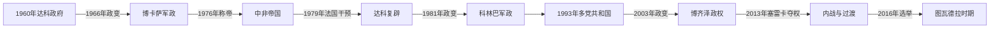

# 中非共和国的独立建国与现代发展

## 时间

1960年至今

## 概括

博冈达1959年意外身亡后，戴维·达科成为首任总统。1966年让-贝德尔·博卡萨政变，1976年称帝；法国1979年干预恢复达科。此后多次政变、叛乱与外部军事介入削弱国家，2013年塞雷卡联盟夺权引发新一轮宗派化暴力。

## 演进图

## 建国过程与权力结构

- 博冈达去世使自治期的跨地区联盟失去核心。总理达科借执政党和法国支持压倒阿贝尔·贡巴，独立后把多党制度收缩为一党总统制；财政薄弱、军队政治化和对外援助依赖，使政变成为权力更替的主要途径。
- 博卡萨通过军队掌权，既扩大行政和学校，也以个人崇拜、任意拘押与奢侈加冕消耗国家。1979年学生抗议遭镇压后，法国发动“梭鱼行动”，在博卡萨出国时恢复达科；这是中非帝国的直接灭亡过程，而非合法世袭终结。
- 科林巴1981年政变后建立军事委员会，1986年文官宪法仍保留一党优势。国际财政压力和国内抗议迫使1993年选举，帕塔塞胜选；但军队派系、首都兵变和对法国、利比亚及邻国部队的依赖持续削弱民选政府。
- 博齐泽2003年夺权后未能吸纳东北武装，塞雷卡2013年攻占班吉。米歇尔·乔托迪亚无法约束联盟成员，反巴拉卡报复使政治冲突宗派化；区域组织迫其辞职后，桑巴-潘扎主持过渡，联合国中非稳定团承担安全与选举支持。
- 图瓦德拉2016年就任后借俄罗斯教官、卢旺达部队和本国军队收复部分城市，同时与武装集团反复谈判。2023年新宪法取消任期限制并延长总统任期；他在争议中的2025年选举获确认，并于2026年3月宣誓开始第三任期。

## 现行机构（核验至2026年7月14日）

| 角色 | 人物 | 权力说明 |
|---|---|---|
| 总统、国家元首 | 福斯坦-阿尔尚热·图瓦德拉 | 掌国防、外交与政府任命，是实际权力中心 |
| 总理、政府首脑 | 费利克斯·莫卢瓦 | 2026年5月获续任，负责内阁日常协调 |
| 安全实际结构 | 总统府、国防军、俄罗斯人员及卢旺达部队 | 国家安全能力依赖多层外部支援，地方控制仍不均衡 |

历任国家元首、复辟、过渡机构和现行分工见[中非独立国家元首与权力结构表](/%E4%BA%BA%E6%96%87%E7%A7%91%E5%AD%A6/%E5%8E%86%E5%8F%B2/%E9%9D%9E%E6%B4%B2/%E4%B8%AD%E9%9D%9E/%E4%B8%AD%E9%9D%9E%E7%8B%AC%E7%AB%8B%E5%9B%BD%E5%AE%B6%E5%85%83%E9%A6%96%E4%B8%8E%E6%9D%83%E5%8A%9B%E7%BB%93%E6%9E%84%E8%A1%A8.md)。

## 兴衰与冲突因果

- **结构因素：** 殖民期道路和行政集中于班吉，边疆缺少公共服务；钻石、木材等资源收益难以转化为稳定税基，军队与公务体系长期欠饷。
- **外部压力：** 乍得、苏丹、刚果盆地冲突造成武器和武装人员跨境流动，法国、区域组织、联合国与俄罗斯先后介入，既阻止政权崩溃，也改变国内权力均衡。
- **直接触发：** 2012年政府未履行先前和平协议，促使塞雷卡结盟南下；2013年夺权后的失控掠夺又触发反巴拉卡动员。冲突延续不是单一宗教仇恨，而是安全真空、地方报复与资源竞争叠加。

## 主要政治阶段

| 阶段 | 时间 | 权力结构与特征 |
|---|---|---|
| 达科与博卡萨时期 | 1960—1979年 | 一党制、军事政变和中非帝国 |
| 军政与有限民主 | 1979—2003年 | 法国干预、科林巴军政及1993年选举 |
| 政变、叛乱与国际维和 | 2003年至今 | 北部武装、塞雷卡与反巴拉卡冲突，中央权力薄弱 |

## 重要转折

- 1960年8月13日独立。
- 1966年博卡萨政变，1976年建立中非帝国。
- 1979年法国“梭鱼行动”推翻博卡萨。
- 1993年昂热-费利克斯·帕塔塞当选，首次选举政权更替。
- 2013年塞雷卡夺取班吉，反巴拉卡武装兴起，联合国维和介入。

## 演变关系

前接[中非共和国的前殖民社会与殖民统治](/%E4%BA%BA%E6%96%87%E7%A7%91%E5%AD%A6/%E5%8E%86%E5%8F%B2/%E9%9D%9E%E6%B4%B2/%E4%B8%AD%E9%9D%9E/%E4%B8%AD%E9%9D%9E%E5%85%B1%E5%92%8C%E5%9B%BD/%E5%89%8D%E6%AE%96%E6%B0%91%E7%A4%BE%E4%BC%9A%E4%B8%8E%E6%AE%96%E6%B0%91%E7%BB%9F%E6%B2%BB.md)。现代政治还需结合刚果盆地跨境经济、冷战介入和区域难民流动理解。
