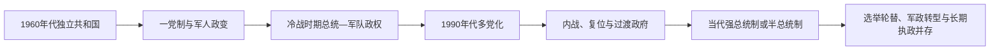

# 中非独立国家元首与权力结构表

## 范围与口径

本表汇总中非九国独立后的国家元首完整顺序，并标出复位、代理、军事委员会和政体改称。日期以实际掌权或宣誓节点为主；极短期夺权若未获得稳定宪制承认，作为“临时实际权力”单列。政府首脑不与国家元首混列，现任部分核验至2026年7月14日。

## 区域政体演进

## 中非共和国

### 国家元首

| 顺序 | 人物或机构 | 身份 | 在位 | 与前任关系及关键事件 |
|---|---|---|---|---|
| 1 | 戴维·达科 | 总统 | 1960—1966年 | 自治政府总理继任建国；1966年元旦政变被推翻 |
| 2 | 让-贝德尔·博卡萨 | 总统 | 1966—1976年 | 军事政变夺权；1976年改称皇帝 |
| 3 | 博卡萨一世 | 皇帝 | 1976—1979年 | 同一统治者改制；1979年法国“梭鱼行动”推翻 |
| 4 | 戴维·达科 | 总统（复位） | 1979—1981年 | 法国扶持复位；1981年被军方推翻 |
| 5 | 安德烈·科林巴 | 军委主席、总统 | 1981—1993年 | 政变夺权；后在多党选举中交权 |
| 6 | 昂热-费利克斯·帕塔塞 | 总统 | 1993—2003年 | 首次竞争性选举胜出；出访时被政变推翻 |
| 7 | 弗朗索瓦·博齐泽 | 过渡元首、总统 | 2003—2013年 | 武装夺取班吉；2013年塞雷卡攻势中流亡 |
| 8 | 米歇尔·乔托迪亚 | 过渡元首 | 2013—2014年 | 塞雷卡领袖夺权；因无法控制暴力受区域压力辞职 |
| 9 | 亚历山大-费迪南·恩根代 | 临时国家元首 | 2014年1月 | 过渡议会负责人短暂代理 |
| 10 | 卡特琳·桑巴-潘扎 | 过渡国家元首 | 2014—2016年 | 过渡议会选出；主持选举和宪制恢复 |
| 11 | 福斯坦-阿尔尚热·图瓦德拉 | 总统 | 2016年至今 | 民选就任；2026年开始第三任、七年任期 |

### 现行权力

| 角色 | 人物 | 制度与实际位置 |
|---|---|---|
| 国家元首 | 图瓦德拉 | 强总统制中心，统率国防并任命总理 |
| 政府首脑 | 总理费利克斯·莫卢瓦 | 2026年5月续任，执行总统纲领 |
| 重要外部安全参与者 | 联合国中非稳定团、俄罗斯人员、卢旺达部队 | 对首都外国家控制和军队能力具有实质影响 |

## 乍得

### 国家元首

| 顺序 | 人物或机构 | 身份 | 在位 | 与前任关系及关键事件 |
|---|---|---|---|---|
| 1 | 弗朗索瓦·托姆巴巴耶 | 总统 | 1960—1975年 | 建国总统；1975年政变中被杀 |
| 2 | 诺埃尔·米拉鲁·奥丁加 | 临时军事首脑 | 1975年4月 | 政变后主持数日，向最高军事委员会移交 |
| 3 | 费利克斯·马卢姆 | 军委主席、总统 | 1975—1979年 | 军方推举；首都内战后辞职 |
| 4 | 古库尼·韦戴 | 临时国家委员会主席 | 1979年3—4月 | 北方派系妥协产生，任期极短 |
| 5 | 洛尔·穆罕默德·舒瓦 | 过渡民族团结政府主席 | 1979年4—9月 | 卡诺协议推举；拉各斯协议后交权 |
| 6 | 古库尼·韦戴 | 过渡民族团结政府主席 | 1979—1982年 | 第二次掌权；被哈布雷攻占首都推翻 |
| 7 | 侯赛因·哈布雷 | 国家元首、总统 | 1982—1990年 | 武装夺取首都；被代比军队推翻 |
| 8 | 伊德里斯·代比·伊特诺 | 国家元首、总统 | 1990—2021年 | 从苏丹边境进军夺权；在前线负伤死亡 |
| 9 | 马哈马特·伊德里斯·代比·伊特诺 | 过渡军委主席、总统 | 2021年至今 | 军方越过宪法继承推举；2024年选举后转为民选总统 |

### 现行权力

| 角色 | 人物 | 制度与实际位置 |
|---|---|---|
| 国家元首 | 马哈马特·代比 | 总统兼武装力量最高统帅 |
| 政府首脑 | 总理阿拉马耶·哈利纳 | 领导内阁，政治上依赖总统多数 |
| 实际安全核心 | 总统卫队、军队高层与执政联盟 | 继承自过渡军委的军政网络仍居中心 |

## 刚果共和国

### 国家元首

| 顺序 | 人物或机构 | 身份 | 在位 | 与前任关系及关键事件 |
|---|---|---|---|---|
| 1 | 富尔贝·尤卢 | 总统 | 1960—1963年 | 建国总统；“三个光荣日”后辞职 |
| 2 | 阿方斯·马桑巴-代巴 | 临时政府首脑、总统 | 1963—1968年 | 工会和军队支持上台；军方政变中失权 |
| 3 | 阿尔弗雷德·拉乌尔 | 临时国家元首 | 1968—1969年 | 革命委员会过渡期代理 |
| 4 | 马里安·恩古瓦比 | 总统 | 1969—1977年 | 建立人民共和国；遇刺身亡 |
| 5 | 党军事委员会 | 集体国家元首 | 1977年3—4月 | 恩古瓦比遇刺后军方集体执政 |
| 6 | 若阿基姆·雍比-奥潘戈 | 总统 | 1977—1979年 | 军事委员会推举；党内斗争中辞职 |
| 7 | 德尼·萨苏-恩格索 | 总统 | 1979—1992年 | 党内接班；1992年多党选举落败 |
| 8 | 帕斯卡尔·利苏巴 | 总统 | 1992—1997年 | 竞争性选举胜出；内战中被推翻 |
| 9 | 德尼·萨苏-恩格索 | 总统（复位） | 1997年至今 | 安哥拉支持下赢得内战；2026年再任五年 |

### 现行权力

| 角色 | 人物 | 制度与实际位置 |
|---|---|---|
| 国家元首 | 萨苏-恩格索 | 主导国防、外交和高级任命 |
| 政府首脑 | 总理阿纳托尔·科利内·马科索 | 2026年4月再次获任命 |
| 执政基础 | 刚果劳动党、总统府和安全机构 | 议会优势与石油财政支撑长期统治 |

## 刚果民主共和国

### 国家元首

| 顺序 | 人物或机构 | 身份 | 在位 | 与前任关系及关键事件 |
|---|---|---|---|---|
| 1 | 约瑟夫·卡萨武布 | 总统 | 1960—1965年 | 首任总统；刚果危机中与卢蒙巴冲突，被蒙博托罢免 |
| 2 | 蒙博托·塞塞·塞科 | 总统 | 1965—1997年 | 第二次军事政变夺权；1971年改国名扎伊尔，战争中流亡 |
| 3 | 洛朗-德西雷·卡比拉 | 总统 | 1997—2001年 | 反蒙博托联盟夺取首都；在总统府遇刺 |
| 4 | 约瑟夫·卡比拉 | 总统 | 2001—2019年 | 父亲遇刺后由政府和军方推举；完成战争过渡及两次选举 |
| 5 | 费利克斯·齐塞克迪 | 总统 | 2019年至今 | 争议选举后和平接任；2023年连任 |

说明：蒙博托1960—1961年以“总专员学院”掌握实际行政，但卡萨武布仍为法定总统；2003—2006年“1+4”过渡中的四名副总统是共治伙伴，不另列为国家元首。

### 现行权力

| 角色 | 人物 | 制度与实际位置 |
|---|---|---|
| 国家元首 | 齐塞克迪 | 强势总统，主导安全、外交与总理任命 |
| 政府首脑 | 总理朱迪特·苏米努瓦·图卢卡 | 领导内阁并向国民议会负责 |
| 东部实际结构 | 国军、地方武装、M23及多国安全力量 | 法定中央权力在部分地区无法形成完整垄断 |

## 加蓬

### 国家元首

| 顺序 | 人物或机构 | 身份 | 在位 | 与前任关系及关键事件 |
|---|---|---|---|---|
| 1 | 莱昂·姆巴 | 总统 | 1960—1967年 | 建国总统；1964年短暂被扣押后由法军复位 |
| 临时 | 革命委员会 | 政变实际权力 | 1964年2月 | 控制首都不足两日，未建立稳定国家元首职位 |
| 2 | 奥马尔·邦戈·翁丁巴 | 总统 | 1967—2009年 | 依宪继任；建立长期一党后优势党统治 |
| 3 | 罗丝·弗朗西娜·罗贡贝 | 代理总统 | 2009年6—10月 | 参议院议长依法代理并组织选举 |
| 4 | 阿里·邦戈·翁丁巴 | 总统 | 2009—2023年 | 父子继承；争议选举后被军方推翻 |
| 5 | 布里斯·克洛泰尔·奥利吉·恩圭马 | 过渡主席、总统 | 2023年至今 | 军事过渡领袖；2025年选举后转任宪制总统 |

### 现行权力

| 角色 | 人物 | 制度与实际位置 |
|---|---|---|
| 国家元首兼政府首脑 | 奥利吉·恩圭马 | 2024年宪法下总统直接领导政府 |
| 总理 | 无 | 2025年过渡结束后职位取消 |
| 实际基础 | 总统府、军队高层与新执政联盟 | 军事过渡网络经选举制度化 |

## 喀麦隆

### 国家元首

| 顺序 | 人物 | 身份 | 在位 | 与前任关系及关键事件 |
|---|---|---|---|---|
| 1 | 艾哈迈杜·阿希乔 | 总统 | 1960—1982年 | 法属区建国总统；主持1961年联邦及1972年单一制化，后辞职 |
| 2 | 保罗·比亚 | 总统 | 1982年至今 | 依宪由总理继任；1984年政变未遂后巩固权力，2025年开始第八任期 |

说明：1961—1972年西喀麦隆总理与议会是联邦单位机构，不是与联邦总统并列的国家元首；英属北喀麦隆1961年并入尼日利亚。

### 现行权力

| 角色 | 人物 | 制度与实际位置 |
|---|---|---|
| 国家元首 | 保罗·比亚 | 掌行政、军队与高级任命 |
| 政府首脑 | 总理约瑟夫·迪翁·恩古特 | 协调内阁，服从总统政策方向 |
| 英语区实际结构 | 中央行政与军队、多个分离主义组织 | 法定单一制与局部武装竞争并存 |

## 圣多美和普林西比

### 国家元首

| 顺序 | 人物或机构 | 身份 | 在位 | 与前任关系及关键事件 |
|---|---|---|---|---|
| 1 | 曼努埃尔·平托·达科斯塔 | 总统 | 1975—1991年 | 建国总统；多党化后交权 |
| 2 | 莱昂内尔·马里奥·达尔瓦 | 代理总统 | 1991年3—4月 | 国民议会议长在交接期代理 |
| 3 | 米格尔·特罗瓦达 | 总统 | 1991—1995年 | 首位竞争选举总统；军人政变中短暂被扣 |
| 临时 | 曼努埃尔·金塔斯·德阿尔梅达领导的军政府 | 实际权力 | 1995年8月 | 控制约一周，经谈判还政 |
| 4 | 米格尔·特罗瓦达 | 总统（复位） | 1995—2001年 | 恢复职务并完成任期 |
| 5 | 弗拉迪克·德梅内塞斯 | 总统 | 2001—2003年 | 出国时被军人扣权 |
| 临时 | 费尔南多·佩雷拉领导的军政机构 | 实际权力 | 2003年7月 | 控制约一周，经国际斡旋还政 |
| 6 | 弗拉迪克·德梅内塞斯 | 总统（复位） | 2003—2011年 | 恢复职务并完成第二任期 |
| 7 | 曼努埃尔·平托·达科斯塔 | 总统（复任） | 2011—2016年 | 多党选举后再次任职 |
| 8 | 埃瓦里斯托·卡瓦略 | 总统 | 2016—2021年 | 选举轮替 |
| 9 | 卡洛斯·曼努埃尔·维拉·诺瓦 | 总统 | 2021年至今 | 选举就任 |

### 现行权力

| 角色 | 人物 | 制度与实际位置 |
|---|---|---|
| 国家元首 | 维拉·诺瓦 | 半总统制总统，拥有任命总理和国防职权 |
| 政府首脑 | 总理阿梅里科·德奥利韦拉·拉莫斯 | 2025年1月就任，须取得议会政治支持 |
| 普林西比自治 | 地区政府和地区议会 | 处理岛内自治事务，不是主权国家机构 |

## 安哥拉

### 国家元首

| 顺序 | 人物或机构 | 身份 | 在位 | 与前任关系及关键事件 |
|---|---|---|---|---|
| 1 | 阿戈什蒂纽·内图 | 总统 | 1975—1979年 | 安人运建国总统；病逝 |
| 过渡 | 卢西奥·拉腊及安人运政治局 | 集体过渡 | 1979年9月 | 内图去世后短暂主持党国，推举多斯桑托斯 |
| 2 | 若泽·爱德华多·多斯桑托斯 | 总统 | 1979—2017年 | 党内继任；领导内战后期与战后重建 |
| 3 | 若昂·洛伦索 | 总统 | 2017年至今 | 安人运领衔议会选举后依宪继任 |

### 现行权力

| 角色 | 人物 | 制度与实际位置 |
|---|---|---|
| 国家元首兼政府首脑 | 若昂·洛伦索 | 2010年宪法下总统统领行政，不设总理 |
| 副总统 | 埃斯佩兰萨·达科斯塔 | 与总统同一选举名单产生，协助行政 |
| 执政基础 | 安人运议会多数、总统府和安全机构 | 由战争时期党国体系转为选举型优势党结构 |

## 赤道几内亚

### 国家元首

| 顺序 | 人物或机构 | 身份 | 在位 | 与前任关系及关键事件 |
|---|---|---|---|---|
| 1 | 弗朗西斯科·马西亚斯·恩圭马 | 总统 | 1968—1979年 | 首任总统；一党恐怖统治，政变后被处决 |
| 2 | 最高军事委员会（主席特奥多罗·奥比昂） | 集体军政元首 | 1979—1982年 | “自由政变”后接管，制定新宪法 |
| 3 | 特奥多罗·奥比昂·恩圭马·姆巴索戈 | 总统 | 1982年至今 | 由军委主席转为宪制总统，长期掌权 |

### 现行权力

| 角色 | 人物 | 制度与实际位置 |
|---|---|---|
| 国家元首 | 特奥多罗·奥比昂 | 统率军队并主导全部高级任命 |
| 副总统 | 特奥多罗·恩圭马·奥比昂·曼格 | 分管国防安全，是核心继承人物 |
| 政府首脑 | 总理曼努埃尔·奥萨·恩苏埃·恩苏阿 | 2026年6月获重新任命，执行总统决策 |

## 读表提示

- “复位”表示同一国家元首在被推翻或短暂失权后重新任职；表中不把两段任期合并。
- 军事委员会若集体掌权，单列机构；只有主席同时明确担任国家元首时才按个人序列计算。
- 总统制国家的总理可能负责行政协调而非掌握最高政治权力；加蓬、安哥拉现行制度不设总理。
- 各国历史过程分别见[中非总览](/%E4%BA%BA%E6%96%87%E7%A7%91%E5%AD%A6/%E5%8E%86%E5%8F%B2/%E9%9D%9E%E6%B4%B2/%E4%B8%AD%E9%9D%9E/README.md)及各国“独立建国与现代发展”页。
