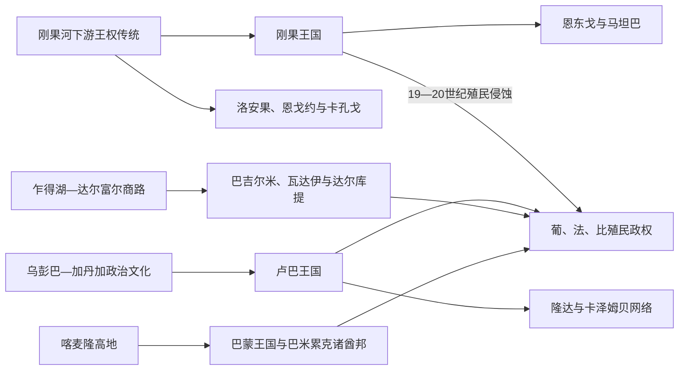

# 中非王国、酋长国与殖民统治者表

## 口径与年代可靠性

中非许多王号来自口述谱系、宫廷传统和外来文献的交叉重建。表中把能够辨认的统治者逐一列出；记录中断处明确写“姓名不详”或“次序有争议”，不使用模糊的合并称呼。葡语、法语与本地语转写常造成同一人物多个姓名和王号，年份前的“约”表示不能精确到公历年。

本表集中处理被多国历史页共同引用的主要王权。地方村社首领并不天然构成一个统一王朝；“芳人”“茨瓦纳”“巴米累克”等多中心社会不能伪造单一国王表。

## 主要谱系关系

## 刚果王国的马尼刚果

### 接触葡萄牙以前与统一王国

| 顺序 | 统治者 | 在位 | 继承与关键事件 |
|---|---|---|---|
| 1 | 卢克尼·卢阿·尼米 | 传统约14世纪末 | 传统建国者；建国年代和前后谱系存在争议 |
| — | 早期继承者姓名与次序不详 | 约15世纪前半叶 | 口述表版本不一，不强行补齐公历年 |
| 2 | 恩津加·恩库武／若昂一世 | 约1470—1509年 | 葡萄牙初至时在位；1491年受洗 |
| 3 | 姆本巴·恩津加／阿方索一世 | 1509—1542或1543年 | 若昂一世之子，经继承战争即位 |
| 4 | 佩德罗一世 | 1543—1544年 | 阿方索之子，短期在位后被废 |
| 5 | 弗朗西斯科一世 | 1544年 | 阿方索之子，短期在位 |
| 6 | 迪奥戈一世 | 1545—1561年 | 经宫廷竞争即位 |
| 7 | 阿方索二世 | 1561年 | 仅短期获承认；部分王表略去 |
| 8 | 贝尔纳多一世 | 1561—1566或1567年 | 在边境战争中死亡 |
| 9 | 恩里克一世 | 1567—1568年 | 在东部战事中死亡 |
| 10 | 阿尔瓦罗一世 | 1568—1587年 | 借葡萄牙援军恢复首都，开启新王系 |
| 11 | 阿尔瓦罗二世 | 1587—1614年 | 阿尔瓦罗一世之子 |
| 12 | 贝尔纳多二世 | 1614—1615年 | 短期在位，被推翻 |
| 13 | 阿尔瓦罗三世 | 1615—1622年 | 宫廷支系继承 |
| 14 | 佩德罗二世 | 1622—1624年 | 建立金坎加王系 |
| 15 | 加西亚一世 | 1624—1626年 | 佩德罗二世之子 |
| 16 | 安布罗西奥一世 | 1626—1631年 | 王位斗争中被杀 |
| 17 | 阿尔瓦罗四世 | 1631—1636年 | 幼年即位，受贵族辅政 |
| 18 | 阿尔瓦罗五世 | 1636年 | 在位数月，内战中被杀 |
| 19 | 阿尔瓦罗六世 | 1636—1641年 | 金拉扎支系 |
| 20 | 加西亚二世 | 1641—1661年 | 荷葡战争时期寻求扩大自主 |
| 21 | 安东尼奥一世 | 1661—1665年 | 安布伊拉战役战死，统一中央秩序崩解 |

### 1665—1709年内战与并立王系

| 顺序 | 统治者 | 核心地或在位 | 说明 |
|---|---|---|---|
| 22 | 阿方索二世（恩孔多） | 1665年 | 安东尼奥死后短期竞争者 |
| 23 | 阿尔瓦罗七世 | 1665—1666年，圣萨尔瓦多 | 被对手杀死 |
| 24 | 阿尔瓦罗八世 | 1666—1669年，圣萨尔瓦多 | 金潘祖支系，后被废 |
| 25 | 佩德罗三世 | 1669年圣萨尔瓦多；后在伦巴并立至1680年 | 金拉扎支系，失都后仍称王 |
| 26 | 阿尔瓦罗九世 | 1669—1670年 | 金潘祖支系 |
| 27 | 拉斐尔一世 | 1670—1673年；1674年复位 | 两段任期，曾受葡萄牙支持 |
| 28 | 阿方索三世 | 1673—1674年 | 金潘祖支系 |
| 29 | 丹尼尔一世 | 1674—1678年 | 圣萨尔瓦多被毁时遇害 |
| 并立 | 加西亚三世 | 约1669—1685年，基班古 | 基班古王系，未控制全部王国 |
| 并立 | 安德烈一世 | 1685—1686年，基班古 | 短期在位 |
| 并立 | 曼努埃尔·阿方索 | 1686—1687年，基班古 | 短期在位 |
| 并立 | 阿尔瓦罗十世 | 1687—1695年，基班古 | 后被佩德罗四世取代 |
| 并立 | 若昂二世 | 约1680—1716年，伦巴／姆布拉 | 长期拒绝佩德罗四世统一主张 |
| 30 | 佩德罗四世 | 1695年起在基班古；1709—1718年统一王国 | 阿瓜罗萨达支系，1709年恢复首都 |

### 轮换继承与殖民侵蚀

| 顺序 | 统治者 | 在位 | 说明 |
|---|---|---|---|
| 31 | 曼努埃尔二世 | 1718—1743年 | 金潘祖支系；依佩德罗四世和解安排继位 |
| 32 | 加西亚四世 | 1743—1752年 | 金拉扎支系 |
| 33 | 尼古劳一世 | 1752—1758年 | 阿瓜罗萨达支系 |
| 34 | 阿方索四世 | 1758—1760年 | 次序在不同王表中略有差异 |
| 35 | 安东尼奥二世 | 1760—1762年 | 短期在位 |
| 36 | 塞巴斯蒂昂一世 | 1762—1763年 | 短期在位 |
| 37 | 佩德罗五世 | 1763—1764年 | 此处编号与19世纪同名者常混淆 |
| 38 | 阿尔瓦罗十一世 | 1764—1778年 | 经王位战争确立 |
| 39 | 若泽一世 | 1778—1785年 | 轮换王系阶段 |
| 40 | 阿方索五世 | 1785—1794年 | 据记载可能遭毒杀 |
| 41 | 恩里克二世 | 1794—1802年 | 继承阿方索五世 |
| 42 | 加西亚五世 | 1802—1830年 | 19世纪初长期在位 |
| 43 | 安德烈二世 | 1830—1842年 | 地方权力继续增强 |
| 44 | 恩里克三世 | 1842—1857年 | 在位后期葡萄牙介入加深 |
| 45 | 阿尔瓦罗十三世 | 1857—1859年 | 王位竞争中败于佩德罗 |
| 46 | 佩德罗六世（部分王表称佩德罗五世） | 1859—1891年 | 借葡萄牙支持即位，1860年起承认附庸关系 |
| 47 | 阿尔瓦罗十四世 | 1891—1896年 | 葡萄牙保护下受限王权 |
| 48 | 恩里克四世 | 1896—1901年 | 受限王权 |
| 49 | 佩德罗七世（部分王表称佩德罗六世） | 1901—1910年 | 编号因前代争议而不同 |
| 50 | 曼努埃尔·恩孔巴 | 1910—1911年 | 短期在位 |
| 51 | 曼努埃尔三世·阿方索 | 1911—1914年 | 最后一位具殖民承认的马尼刚果；1914年葡萄牙废除王国 |

1914年后的传统王位主张不再代表主权国家，且多个支系并立，不接续为国家君主表。

## 恩东戈、葡萄牙扶植支系与马坦巴

### 恩东戈的恩戈拉

| 顺序 | 统治者 | 在位 | 说明 |
|---|---|---|---|
| 1 | 恩戈拉·基卢安吉·基亚·桑巴 | 约1515—1556年 | 有书面记录的早期统治者 |
| 2 | 恩丹比·阿·恩戈拉 | 约1556—1561年 | 继任关系存在不同口述版本 |
| 3 | 恩戈拉·基卢安吉·基亚·恩丹比 | 约1561—1575年 | 葡萄牙在罗安达建点前在位 |
| 4 | 恩戈拉·基隆博·基亚·卡森达 | 1575—1592年 | 与葡萄牙扩张交战 |
| 5 | 姆班迪·阿·恩戈拉 | 1592—1617年 | 又见姆班迪·基卢安吉 |
| 6 | 恩戈拉·姆班迪 | 1617—1624年 | 金加之兄，危机中自杀或死亡 |
| 7 | 恩津加／安娜·德索萨 | 1624—1626年 | 作为恩东戈女王获支持，后被葡萄牙扶植者排挤 |
| 对立 | 哈里·阿·基卢安吉 | 1626年 | 葡萄牙扶植，短期 |
| 对立 | 恩戈拉·哈里／费利佩一世 | 1626—1657年 | 葡萄牙附庸支系 |
| 8 | 恩津加 | 1657—1663年 | 和约承认其恩东戈—马坦巴地位 |
| 9 | 芭芭拉／穆坎布·姆班迪 | 1663—1666年（马坦巴） | 恩津加之妹，继承联合王权 |
| 恩东戈残部 | 若昂二世·恩戈拉·哈里 | 1657—1671年 | 蓬戈-安东戈附庸王；1671年堡垒被毁，恩东戈国家直接终结 |

### 马坦巴古特雷斯王系

| 顺序 | 统治者 | 在位 | 说明 |
|---|---|---|---|
| 1 | 恩津加 | 1631—1663年 | 征服并以马坦巴为核心 |
| 2 | 芭芭拉／穆坎布·姆班迪 | 1663—1666年 | 恩津加之妹 |
| 3 | 若昂·古特雷斯·恩戈拉·卡尼尼 | 1666—1670年 | 芭芭拉之夫；内战中死亡 |
| 4 | 弗朗西斯科一世·古特雷斯 | 1670—1681年 | 巩固古特雷斯王系 |
| 5 | 韦罗妮卡一世 | 1681—1721年 | 与葡萄牙订立关系并保持自主 |
| 6 | 阿方索一世 | 1721—1741年 | 韦罗妮卡之子 |
| 7 | 安娜二世 | 1741—1756年 | 王位继承后被政变推翻 |
| 8 | 韦罗妮卡二世 | 1756—1758年 | 短期在位 |
| 9 | 安娜三世 | 1758—1767年 | 被侄辈政变杀害 |
| 10 | 弗朗西斯科二世 | 1767—约1810年 | 资料稀少，晚期年限约数 |
| 并立支系 | 卡马纳及金丹加后继支系 | 1767年后 | 安娜三世女儿出逃后形成并立主张，姓名和次序不能统一 |
| — | 19世纪多位地方统治者姓名记录不连续 | 约1810—1909年 | 王权碎片化并逐步受葡萄牙控制；不伪造连续名表 |
| 末段 | 葡萄牙废除传统政治自主 | 1909年 | 殖民军事行政取代残余王权 |

## 卢巴、隆达与库巴的证据边界

### 卢巴核心王系

| 顺序 | 穆洛普韦 | 约在位 | 说明 |
|---|---|---|---|
| 1 | 孔戈洛 | 约1585—1620年 | 建国传说与历史重建交叠 |
| 2 | 伊隆加·卡拉拉 | 约1620—1640年 | 推翻孔戈洛，建立新王系 |
| 3 | 伊隆加·瓦卢武 | 约17世纪中叶 | 年代主要据口述世代推算 |
| 4 | 卡松戈·姆维内·基班扎 | 约17世纪后期 | 王系扩张阶段 |
| 5 | 恩达伊·穆安巴 | 约18世纪初 | 次序在地区王表中有差异 |
| 6 | 卡松戈·穆安巴 | 约18世纪 | 在位年代不详 |
| 7 | 恩达伊·穆辛加 | 约18世纪 | 在位年代不详 |
| 8 | 伊隆加·松古 | 约18世纪后期 | 与扩张记忆相连 |
| 9 | 库蒙维姆贝·恩戈姆贝 | 约1810—1840年 | 常视为后期鼎盛统治者 |
| 10 | 伊隆加·卡邦加 | 约1840—1870年 | 继承冲突加剧 |
| 并立 | 卡松戈·卡隆博与基通巴支系 | 19世纪后期 | 王国分裂，多支系同时称穆洛普韦 |
| 11 | 卡松戈瓦·尼恩博 | 1889—1917年 | 殖民征服后保留传统王号 |

19世纪后的卢巴王号分属卡松戈、卡邦戈等支系，不再代表统一主权帝国，必须按支系维护，不能把并立者强排成单线。

### 隆达、库巴与洛安果

| 政权 | 可确认的统治线索 | 无法写成精确全表的原因 |
|---|---|---|
| 隆达核心王国 | 康贡德、奇宾达·伊隆加、亚沃一世等建国传统；后世最高王号为“姆万特·亚沃” | 王号反复沿用，口述世代与19世纪书面记录的对应存在多套方案 |
| 卡泽姆贝卢恩达 | 姆瓦塔·卡泽姆贝一世至十九世纪多位同号统治者 | “卡泽姆贝”是重复王号，个人名、编号与在位年在不同传统中冲突 |
| 库巴 | 绍姆·阿·姆布尔·恩贡戈常被视为17世纪制度重建者；后继“尼姆”王号延续 | 早期王表长且年代不能可靠换算，殖民期记录又把并立或被废者处理不同 |
| 洛安果 | “马洛安果”由贵族选举，17—19世纪有多位统治者见于欧洲记录 | 王位空缺可持续多年，候选者未必完成加冕；名字转写高度不一 |
| 特克 | 最高王号“马克科”，1880年签约者通常记作伊卢一世 | 多个地方支系共享王号，殖民文献常把礼仪宗主误作领土君主 |

上述资料缺口是历史事实。相关国家兴衰机制见[卢巴、隆达与刚果盆地网络](/%E4%BA%BA%E6%96%87%E7%A7%91%E5%AD%A6/%E5%8E%86%E5%8F%B2/%E9%9D%9E%E6%B4%B2/%E4%B8%AD%E9%9D%9E/%E5%8D%A2%E5%B7%B4%E3%80%81%E9%9A%86%E8%BE%BE%E4%B8%8E%E5%88%9A%E6%9E%9C%E7%9B%86%E5%9C%B0%E7%BD%91%E7%BB%9C.md)。

## 巴蒙与喀麦隆北部王权

### 巴蒙王系

| 顺序 | 姆丰 | 约在位或世代 | 说明 |
|---|---|---|---|
| 1 | 恩查雷·延 | 约14世纪末—15世纪初 | 建国传统核心人物 |
| 2 | 恩古普 | 年代不详 | 口述次序 |
| 3 | 蒙朱 | 年代不详 | 口述次序 |
| 4 | 门加普 | 年代不详 | 口述次序 |
| 5 | 恩古霍 | 年代不详 | 口述次序 |
| 6 | 菲芬 | 年代不详 | 口述次序 |
| 7 | 恩贡古雷 | 年代不详 | 口述次序 |
| 8 | 库奥图 | 年代不详 | 口述次序 |
| 9 | 姆布翁布沃 | 约18世纪末—19世纪初 | 扩大王国疆域 |
| 10 | 恩古奥 | 19世纪 | 继任顺序见宫廷传统 |
| 11 | 恩古普二世 | 19世纪 | 口述次序 |
| 12 | 恩古卢雷 | 19世纪 | 口述次序 |
| 13 | 恩丰富 | 约1865—1889年 | 恩乔亚之父 |
| 14 | 易卜拉欣·恩乔亚 | 约1889—1933年 | 幼年即位，先有摄政；创制文字，后被法国放逐 |
| 15 | 塞杜·恩吉莫卢·恩乔亚 | 1933—1992年 | 殖民及独立后传统苏丹 |
| 16 | 易卜拉欣·姆博姆博·恩乔亚 | 1992年至今 | 传统苏丹，不是喀麦隆国家元首 |

巴米累克是多个独立“丰”领地，阿达马瓦也由约拉拉米多与众多半自主酋长组成，不合并成一条虚构世系。阿达马瓦建国者莫迪博·阿达马约1809—1847年在位，继任约拉拉米多的次序属于跨尼日利亚—喀麦隆专题。

## 乍得与中非东北部苏丹国

| 政权 | 已确认主线 | 殖民终结与争议 |
|---|---|---|
| 卡涅姆—博尔努 | 早期杜古瓦后为塞法瓦王朝；胡迈约11世纪接受伊斯兰，杜纳马·达巴莱米、伊德里斯·阿卢马为关键君主；19世纪穆罕默德·卡涅米家族取代塞法瓦 | 核心多位于今乍得境外；长达千年的不同中心与王朝应在乍得湖跨国专页维护，不能只作为现代乍得“国王表” |
| 巴吉尔米 | 传统建国者常记作比尔尼·贝塞；阿卜杜勒·卡迪尔、布尔科曼达等姆邦见于书面记录 | 多次向博尔努、瓦达伊纳贡，拉比赫和法国先后征服；早期次序与年代冲突 |
| 瓦达伊 | 阿卜杜勒-卡里姆约17世纪建立穆斯林王朝；穆罕默德·谢里夫、阿里和杜杜·穆拉等后期苏丹见于记录 | 1909—1912年法国征服；杜杜·穆拉被俘，苏丹王号后以受限形式恢复 |
| 达尔库提 | 科布尔约1830年代建立；穆罕默德·塞努西约1890—1911年统治 | 先与拉比赫、瓦达伊周旋，后受法国保护；1911年塞努西被法军击杀，主权终结 |
| 拉比赫国家 | 拉比赫·祖拜尔，约1893—1900年 | 非世袭稳定王朝；库塞里战死后其子法德-阿拉短暂续战，1901年被杀 |

## 殖民行政权力的区分

| 殖民体系 | 法定最高层级 | 地方实际层级 | 终结方式 |
|---|---|---|---|
| 法属赤道非洲 | 法国总督／总督长驻布拉柴维尔 | 各殖民地总督、行政长官、特许公司和被任命首领 | 1958年自治后逐国在1960年独立 |
| 刚果自由邦 | 利奥波德二世为私人主权者，驻地总督执行 | 公安军与特许公司掌配额、司法和劳工 | 国际调查与比利时压力使1908年由国家吞并 |
| 比属刚果 | 比利时国王为殖民君主，殖民部长和总督治理 | 省长、矿业公司与天主教会共同构成行政三角 | 1959年危机后仓促谈判，1960年移交主权 |
| 葡属安哥拉、圣多美 | 葡萄牙王室后共和国政府，殖民总督执行 | 区行政官、庄园与公司、地方“摄政”中介 | 1974年葡萄牙革命后谈判或战争移交，1975年独立 |
| 西属几内亚 | 西班牙国家元首与殖民总督／高级专员 | 比奥科种植园、传教会和大陆行政区 | 1963年自治、1968年选举与独立 |
| 德属喀麦隆及英法托管 | 德国总督；一战后英法专员 | 种植园、地方酋长与托管行政 | 德国1916年战败；法属区1960年、英属南区1961年完成政治归属转换 |

殖民总督人数众多，职责随行政区合并和改名而变化。本表列机构连续性而不把所有短任代理官误作“本地王朝”；国家元首与政府首脑见[中非独立国家元首与权力结构表](/%E4%BA%BA%E6%96%87%E7%A7%91%E5%AD%A6/%E5%8E%86%E5%8F%B2/%E9%9D%9E%E6%B4%B2/%E4%B8%AD%E9%9D%9E/%E4%B8%AD%E9%9D%9E%E7%8B%AC%E7%AB%8B%E5%9B%BD%E5%AE%B6%E5%85%83%E9%A6%96%E4%B8%8E%E6%9D%83%E5%8A%9B%E7%BB%93%E6%9E%84%E8%A1%A8.md)。
