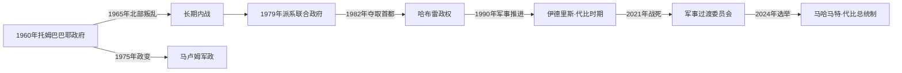

# 乍得的独立建国与现代发展

## 时间

1960年至今

## 概括

1960年独立后，南方出身的弗朗索瓦·托姆巴巴耶建立一党政权，北部不满于1965年演变为长期叛乱。利比亚介入奥祖地带争端，多个武装集团和军人领袖争夺首都；侯赛因·哈布雷和伊德里斯·代比先后建立高度军事化政权。

## 演进图

## 内战过程与国家权力

- 独立初期南方官僚和乍得进步党控制中央，托姆巴巴耶废除竞争政治、提高税负，并以行政同化政策冲击北方穆斯林和游牧社群。1965年曼加尔梅反税事件遭镇压，直接促成乍得民族解放阵线扩大。
- 1975年军方杀死托姆巴巴耶，马卢姆试图与北方指挥官哈布雷联合；双方1979年在恩贾梅纳交战，国家分裂成受利比亚、苏丹和法国不同支持的派系。拉各斯协议建立古库尼·韦戴领导的过渡民族团结政府，但没有统一军队。
- 哈布雷1982年夺取首都，以国家安全文献局建立高压统治；他借法国、美国支持抗衡利比亚。1987年“丰田战争”收复除奥祖外大部领土，国际法院1994年把奥祖判归乍得；军事胜利未消除大规模拘押和处决的政权基础。
- 伊德里斯·代比1990年从苏丹边境进军夺权，开放多党选举却以爱国拯救运动、总统卫队和宗族联盟集中实权。2003年石油管道投产增加财政，也加剧围绕军费、地方分配和继承的竞争。
- 代比2021年在反政府武装前线受伤死亡后，宪法规定的议长继任未执行，军方直接成立由其子马哈马特主持的过渡委员会。2024年总统选举结束名义过渡，马哈马特就任总统；这构成军事权力家族化延续，而非完全制度断裂。

## 现行机构（核验至2026年7月14日）

| 角色 | 人物 | 权力说明 |
|---|---|---|
| 总统、国家元首 | 马哈马特·伊德里斯·代比·伊特诺 | 掌军队和高级任命，为实际权力中心 |
| 总理、政府首脑 | 阿拉马耶·哈利纳 | 2024年起组阁，2026年继续领导政府 |
| 关键安全结构 | 总统卫队、国民军与执政联盟 | 边境反叛、萨赫勒安全和苏丹战争难民压力使军政系统居核心 |

完整国家元首、竞争过渡政府及复位情况见[中非独立国家元首与权力结构表](/%E4%BA%BA%E6%96%87%E7%A7%91%E5%AD%A6/%E5%8E%86%E5%8F%B2/%E9%9D%9E%E6%B4%B2/%E4%B8%AD%E9%9D%9E/%E4%B8%AD%E9%9D%9E%E7%8B%AC%E7%AB%8B%E5%9B%BD%E5%AE%B6%E5%85%83%E9%A6%96%E4%B8%8E%E6%9D%83%E5%8A%9B%E7%BB%93%E6%9E%84%E8%A1%A8.md)。

## 政权兴衰的多重原因

- **结构因素：** 殖民资源和学校偏向南部，国界却囊括北方游牧与苏丹商路社会；低财政能力使中央更依靠军队和外援而非常规行政。
- **外部压力：** 利比亚争夺奥祖、法国多次出兵、苏丹与达尔富尔冲突以及萨赫勒武装流动，使国内派系能在境外获得基地。
- **直接触发：** 反税镇压引发1965年叛乱；1979年首都冲突摧毁联合政府；哈布雷和代比分别依靠军事攻势取代前政权。2021年的直接转折则是总统战死与军方越过宪法继承。

## 主要政治阶段

| 阶段 | 时间 | 权力结构与特征 |
|---|---|---|
| 托姆巴巴耶第一共和国 | 1960—1975年 | 一党统治、北部叛乱与法国军事介入 |
| 内战、利比亚干预与哈布雷 | 1975—1990年 | 派系战争、奥祖地带冲突和大规模国家镇压 |
| 代比时期及其后 | 1990年至今 | 军政主导、多党形式、石油收入与地区安全行动 |

## 重要转折

- 1960年8月11日独立。
- 1965年北部曼加尔梅税收反抗推动乍得民族解放阵线战争。
- 1979年首都战争导致中央国家解体。
- 1982年哈布雷夺权，1987年乍得军队迫使利比亚撤出大部领土。
- 1990年伊德里斯·代比掌权；2021年其在前线死亡后军方建立过渡政权。

## 演变关系

前接[乍得的前殖民社会与殖民统治](/%E4%BA%BA%E6%96%87%E7%A7%91%E5%AD%A6/%E5%8E%86%E5%8F%B2/%E9%9D%9E%E6%B4%B2/%E4%B8%AD%E9%9D%9E/%E4%B9%8D%E5%BE%97/%E5%89%8D%E6%AE%96%E6%B0%91%E7%A4%BE%E4%BC%9A%E4%B8%8E%E6%AE%96%E6%B0%91%E7%BB%9F%E6%B2%BB.md)。现代政治还需结合刚果盆地跨境经济、冷战介入和区域难民流动理解。
