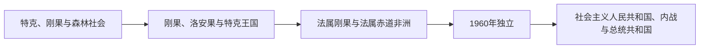

# 刚果共和国历史

今刚果共和国西南部属于刚果和洛安果文化圈，内陆高原由特克王国及众多森林社会控制。大西洋贸易使沿岸奴隶、象牙和棕榈产品流通；法国19世纪通过与特克首领签约进入刚果河北岸。

## 历史坐标

- 地理范围：刚果河下游北岸、法属刚果旧地与大西洋海岸。
- 国家形成：现代边界主要继承法、比、葡、德、西等殖民体系，不等同于任何单一旧王国。
- 阅读方法：区分森林与草原社会、内陆贸易与殖民资源飞地，再理解独立后的国家危机。

## 阶段导航

| 顺序 | 阶段 | 时间 | 核心内容 |
|---|---|---|---|
| 1 | [前殖民社会与殖民统治](/%E4%BA%BA%E6%96%87%E7%A7%91%E5%AD%A6/%E5%8E%86%E5%8F%B2/%E9%9D%9E%E6%B4%B2/%E4%B8%AD%E9%9D%9E/%E5%88%9A%E6%9E%9C%E5%85%B1%E5%92%8C%E5%9B%BD/%E5%89%8D%E6%AE%96%E6%B0%91%E7%A4%BE%E4%BC%9A%E4%B8%8E%E6%AE%96%E6%B0%91%E7%BB%9F%E6%B2%BB.md) | 古代—1960年 | 王国、地方社会、贸易与殖民资源制度 |
| 2 | [独立建国与现代发展](/%E4%BA%BA%E6%96%87%E7%A7%91%E5%AD%A6/%E5%8E%86%E5%8F%B2/%E9%9D%9E%E6%B4%B2/%E4%B8%AD%E9%9D%9E/%E5%88%9A%E6%9E%9C%E5%85%B1%E5%92%8C%E5%9B%BD/%E7%8B%AC%E7%AB%8B%E5%BB%BA%E5%9B%BD%E4%B8%8E%E7%8E%B0%E4%BB%A3%E5%8F%91%E5%B1%95.md) | 1960年至今 | 独立、冷战、国家制度和现代转型 |

## 关键节点

| 时间 | 事件 | 意义 |
|---|---|---|
| 1880年 | 布拉柴维尔建立 | 法国殖民中心形成 |
| 1921—1934年 | 刚果—海洋铁路 | 殖民强制劳工象征 |
| 1960年 | 独立 | 共和国成立 |
| 1969年 | 人民共和国建立 | 社会主义一党国家形成 |
| 1991—1997年 | 多党化与内战 | 政治制度重大转折 |

## 区域联系

- 上级：[中非历史](/%E4%BA%BA%E6%96%87%E7%A7%91%E5%AD%A6/%E5%8E%86%E5%8F%B2/%E9%9D%9E%E6%B4%B2/%E4%B8%AD%E9%9D%9E/README.md)
- 跨区域背景：[刚果王国与大西洋中非](/%E4%BA%BA%E6%96%87%E7%A7%91%E5%AD%A6/%E5%8E%86%E5%8F%B2/%E9%9D%9E%E6%B4%B2/%E4%B8%AD%E9%9D%9E/%E5%88%9A%E6%9E%9C%E7%8E%8B%E5%9B%BD%E4%B8%8E%E5%A4%A7%E8%A5%BF%E6%B4%8B%E4%B8%AD%E9%9D%9E.md)、[殖民资源体系、独立与中非冲突](/%E4%BA%BA%E6%96%87%E7%A7%91%E5%AD%A6/%E5%8E%86%E5%8F%B2/%E9%9D%9E%E6%B4%B2/%E4%B8%AD%E9%9D%9E/%E6%AE%96%E6%B0%91%E8%B5%84%E6%BA%90%E4%BD%93%E7%B3%BB%E3%80%81%E7%8B%AC%E7%AB%8B%E4%B8%8E%E4%B8%AD%E9%9D%9E%E5%86%B2%E7%AA%81.md)
