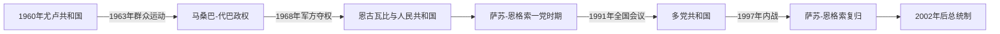

# 刚果共和国的独立建国与现代发展

## 时间

1960年至今

## 概括

刚果共和国1960年独立，富尔贝·尤卢1963年被群众抗议推翻。军官和左翼政党逐步建立非洲首个马克思列宁主义“人民共和国”之一；1991年全国会议恢复多党制，1997年内战使德尼·萨苏-恩格索重返权力。

## 演进图

## 政权更替与统治机制

- 尤卢以刚果民主联盟、教会网络和南部支持建立总统制，但财政紧缩、工会反对与一党化计划引发1963年“三个光荣日”。军队拒绝大规模镇压，迫使他辞职，阿方斯·马桑巴-代巴在工会与军官支持下上台。
- 1968年马里安·恩古瓦比发动政变，1969年建立刚果劳动党和人民共和国。党、军队、工会与国有企业构成权力体系；石油收入扩大国家部门，也使精英竞争围绕党军职位和产油收益展开。
- 恩古瓦比1977年遇刺后，军事委员会处决前总统马桑巴-代巴；约阿希姆·雍比-奥潘戈短暂掌权，1979年萨苏-恩格索成为总统。冷战结束、债务危机和社会动员迫使其接受1991年全国主权会议。
- 帕斯卡尔·利苏巴1992年胜选，但议会联盟破裂后各党建立民兵。1997年政府试图解除萨苏阵营武装，直接触发布拉柴维尔内战；安哥拉军队介入帮助萨苏获胜，利苏巴政府灭亡。
- 2002年宪法重建强总统制，2015年新宪法调整年龄和任期限制，萨苏继续参选。普尔地区“忍者”武装冲突与和解反复，石油仍是财政主柱。2026年3月萨苏再次当选，4月宣誓开启新任期。

## 现行机构（核验至2026年7月14日）

| 角色 | 人物 | 权力说明 |
|---|---|---|
| 总统、国家元首 | 德尼·萨苏-恩格索 | 主导国防、外交和政府任命，是实际权力中心 |
| 总理、政府首脑 | 阿纳托尔·科利内·马科索 | 2026年4月获续任，负责政府行动计划 |
| 执政基础 | 刚果劳动党、总统府与安全机构 | 议会优势与石油财政支持长期执政 |

完整国家元首、军事委员会和两段萨苏任期见[中非独立国家元首与权力结构表](/%E4%BA%BA%E6%96%87%E7%A7%91%E5%AD%A6/%E5%8E%86%E5%8F%B2/%E9%9D%9E%E6%B4%B2/%E4%B8%AD%E9%9D%9E/%E4%B8%AD%E9%9D%9E%E7%8B%AC%E7%AB%8B%E5%9B%BD%E5%AE%B6%E5%85%83%E9%A6%96%E4%B8%8E%E6%9D%83%E5%8A%9B%E7%BB%93%E6%9E%84%E8%A1%A8.md)。

## 兴衰原因

- **结构因素：** 南北地区政治网络、法国殖民形成的首都—港口轴线和石油租金分配，使国家职位成为主要资源入口。
- **外部压力：** 冷战阵营、法国石油利益和安哥拉安全关切影响政权选择；1997年安哥拉军队是战争胜负的关键变量。
- **直接触发：** 1963年紧缩与一党化引发工会起义，1968年军内冲突结束马桑巴政权；1997年解除民兵武装行动使长期制度危机转为全面内战。

## 主要政治阶段

| 阶段 | 时间 | 权力结构与特征 |
|---|---|---|
| 尤卢与革命转型 | 1960—1968年 | 首任总统被推翻，军政和工会力量上升 |
| 刚果人民共和国 | 1969—1991年 | 刚果劳动党一党社会主义，石油经济扩大 |
| 多党化与内战后政权 | 1991年至今 | 1992年选举、1997年内战及总统权力重新集中 |

## 重要转折

- 1960年8月15日独立。
- 1963年“三个光荣日”抗议迫使尤卢辞职。
- 1969年宣布刚果人民共和国。
- 1991年全国主权会议终结一党制。
- 1997年萨苏-恩格索与利苏巴阵营内战，前者在安哥拉支持下获胜。

## 演变关系

前接[刚果共和国的前殖民社会与殖民统治](/%E4%BA%BA%E6%96%87%E7%A7%91%E5%AD%A6/%E5%8E%86%E5%8F%B2/%E9%9D%9E%E6%B4%B2/%E4%B8%AD%E9%9D%9E/%E5%88%9A%E6%9E%9C%E5%85%B1%E5%92%8C%E5%9B%BD/%E5%89%8D%E6%AE%96%E6%B0%91%E7%A4%BE%E4%BC%9A%E4%B8%8E%E6%AE%96%E6%B0%91%E7%BB%9F%E6%B2%BB.md)。现代政治还需结合刚果盆地跨境经济、冷战介入和区域难民流动理解。
