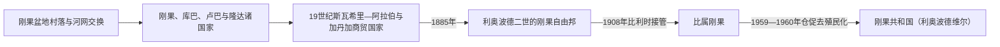

# 刚果民主共和国的前殖民社会与殖民统治

## 时间

古代—1960年

## 概括

刚果民主共和国覆盖庞大刚果盆地，历史上没有单一统一前身。西部连于刚果王国，南部有卢巴、隆达和加丹加贸易国家，中部库巴形成联邦王权，东部则与斯瓦希里—阿拉伯商队和大湖区相连。

## 演进图

## 国家网络、资源体系与殖民征服

- 广阔刚果盆地依靠河道而非单一陆上首都连接。刚果王国控制西部入海口，库巴王权以布尚王族、议事机构与贡赋联邦维持中部秩序，卢巴以“神圣王权—地方世袭首领—班布迪耶记忆社团”组合传播政治文化，隆达则通过联姻和派出统治者形成松散帝国。
- 这些国家的崛起来自铜、盐、拉菲草、铁器与象牙贸易，以及把外来群体纳入王号和礼仪的能力；衰落并非单一“欧洲征服”所致。继承争议、长途贸易军事化、奴隶捕掠、乔奎扩张和斯瓦希里商人进入先改变权力平衡，殖民军再利用旧有竞争逐区推进。
- 姆西里19世纪在加丹加建立加朗甘泽国家，以火器控制铜和象牙通道。1891年其在与比利时远征队冲突中被杀，国家被刚果自由邦和英属势力瓜分；东部蒂普·蒂普网络也先与自由邦合作、后在1892—1894年战争中败亡。
- 刚果自由邦名义上是“国际自由贸易与人道事业”，实际由国王私人政府、公安军、公司特许地与配额制构成。砍手、人质和村庄惩罚服务于橡胶征收；国际调查与比利时国内压力迫使1908年吞并，但劳工控制和资源外运在比属刚果延续。
- 比利时殖民国家以行政、教会和公司三角治理，矿区工人城镇化，却几乎不培养全国政治精英。1959年利奥波德维尔骚乱后，比利时把多年渐进方案骤缩为数月，殖民军、中央政府和矿业省份间没有完成权力整合，直接埋下1960年危机。

完整王权分支与直接终结节点见[中非王国、酋长国与殖民统治者表](/%E4%BA%BA%E6%96%87%E7%A7%91%E5%AD%A6/%E5%8E%86%E5%8F%B2/%E9%9D%9E%E6%B4%B2/%E4%B8%AD%E9%9D%9E/%E4%B8%AD%E9%9D%9E%E7%8E%8B%E5%9B%BD%E3%80%81%E9%85%8B%E9%95%BF%E5%9B%BD%E4%B8%8E%E6%AE%96%E6%B0%91%E7%BB%9F%E6%B2%BB%E8%80%85%E8%A1%A8.md)。

## 主要社会与政权

| 社会或政权 | 大致时期 | 特征 |
|---|---|---|
| 刚果王国 | 约14—19世纪 | 刚果河下游基督教王权和大西洋贸易 |
| 卢巴王国 | 约16—19世纪 | 神圣王权、记忆社团与铜盐网络 |
| 隆达帝国 | 17—19世纪 | 联姻、贡赋与跨今国界扩张 |
| 库巴王国 | 17世纪以后 | 多族群联邦、纺织雕刻与宫廷制度 |
| 加朗甘泽国家 | 19世纪 | 姆西里控制加丹加铜和远程贸易 |

## 殖民统治

比利时国王利奥波德二世借国际探险和条约在1885年取得刚果自由邦私人统治。橡胶配额、武装征收和人质制度造成大规模暴力，国际抗议迫使比利时1908年接管。比属刚果发展铜、钻石、铀和种植园，但严格种族隔离并限制高等教育和政治组织。

## 重要事件

- 1480年代刚果王国与葡萄牙建立外交。
- 19世纪蒂普·蒂普等商人从东非进入刚果东部经营象牙与奴隶贸易。
- 1885年柏林会议背景下刚果自由邦获国际承认。
- 1890年代橡胶恐怖达到高峰，引发传教士和改革者调查。
- 1908年比利时吞并自由邦，建立比属刚果。
- 1959年利奥波德维尔骚乱加速仓促去殖民化。

## 演变关系

殖民边界和资源制度直接塑造[刚果民主共和国的独立建国与现代发展](/%E4%BA%BA%E6%96%87%E7%A7%91%E5%AD%A6/%E5%8E%86%E5%8F%B2/%E9%9D%9E%E6%B4%B2/%E4%B8%AD%E9%9D%9E/%E5%88%9A%E6%9E%9C%E6%B0%91%E4%B8%BB%E5%85%B1%E5%92%8C%E5%9B%BD/%E7%8B%AC%E7%AB%8B%E5%BB%BA%E5%9B%BD%E4%B8%8E%E7%8E%B0%E4%BB%A3%E5%8F%91%E5%B1%95.md)。
