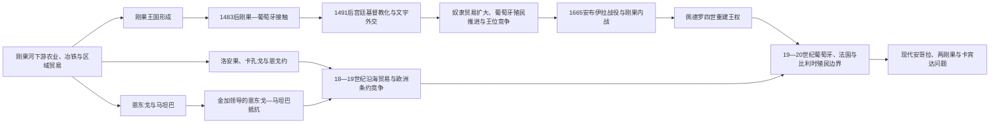

# 刚果王国与大西洋中非

## 时间

约14世纪末—20世纪初；其政治与文化遗产延续至今。

## 概括

刚果河下游、大西洋沿岸和今日安哥拉北部在欧洲人到来前已形成密集的农业、渔业、冶铁和区域贸易网络。约14世纪末，位于姆班扎刚果的统治集团通过联盟、征服、贡赋和地方贵族合作建立刚果王国；其南侧的恩东戈、马坦巴和东侧、北侧的洛安果、卡孔戈、恩戈约等政治体既受刚果影响，也保持各自王权与贸易体系。

1483年以后，刚果与葡萄牙建立直接关系。刚果宫廷并非被动接受外来制度，而是主动采用基督教、拉丁字母外交、学校和新的权力象征，希望借此强化王权并取得技术与贸易资源。然而，大西洋奴隶贸易、葡萄牙在罗安达建立的殖民据点、王位争夺和区域军事化逐渐破坏双方合作。1665年安布伊拉战役使刚果中央王权遭到重创，却没有让王国当日“灭亡”；其后经历数十年内战、重新统一和十九世纪殖民侵蚀，直到1914年葡萄牙废除残余王国政治权力。

## 空间与政治格局

| 政治体 | 核心区域 | 统治结构 | 与大西洋联系 |
|---|---|---|---|
| 刚果王国 | 刚果河下游、姆班扎刚果及周边诸省 | 马尼刚果为最高统治者，省级首领、王族与贵族会议参与权力分配和继承 | 最早与葡萄牙建立正式王室、教会和外交关系，后深受奴隶贸易冲击 |
| 恩东戈 | 宽扎河以北、安哥拉内陆 | 统治者称“恩戈拉”，依赖地方首领与军政追随者 | 与葡萄牙罗安达殖民地长期战争、贸易和外交并行 |
| 马坦巴 | 安哥拉内陆、恩东戈以东 | 王权吸收流亡集团、佣兵和地方网络 | 金加时期成为反葡联盟和内陆贸易中心 |
| 洛安果 | 刚果河口以北、大西洋沿岸 | 王权与地方贵族、港口商人相互制约 | 铜、象牙、木材、盐和被奴役人口贸易的重要节点 |
| 卡孔戈、恩戈约 | 刚果河口及卡宾达沿岸 | 较小的沿海王国，继承与贵族协商关系突出 | 欧洲商站竞争、奴隶贸易和十九世纪条约政治的前沿 |
| 圣多美种植园殖民地 | 几内亚湾岛屿 | 葡萄牙殖民行政、庄园主与奴隶劳动体系 | 早期蔗糖种植园既吸收中非被奴役人口，也成为安哥拉贸易的中转站 |

## 演进图

## 刚果王国的建立与崛起

### 建立基础

刚果王国的早期年代主要依赖口述传统、语言学、考古和十六世纪以后书面记录，具体建国时间与首批君主顺序存在争议。传统常把卢克尼·卢阿·尼米视为奠基者，并把王国形成置于约14世纪末。较稳妥的理解是：姆班扎刚果所在高地控制了通向海岸、刚果河和安哥拉内陆的交通，统治集团又通过婚姻、征服和授予地方职位整合多个原有共同体。

王国并非近代意义上的统一官僚国家。核心省份受王室更直接控制，边缘地区则可能以贡赋、军事援助和仪式承认为联系。马尼刚果依靠王族成员、地方贵族和被任命的省级统治者治理；王位通常在具资格的王族和政治集团之间竞争，而不是严格按照父子长子继承。这一制度有利于吸收不同支系，却也在外贸财富和火器改变力量平衡后放大继承冲突。

### 崛起机制

- **地理枢纽**：首都连接内陆农业区、大西洋港口和刚果河交通，能够征集粮食、贝币、布匹、铜和劳役。
- **分层整合**：中央王权保留地方共同体和贵族的一部分权力，以册封、贡赋和人质关系维持多中心国家。
- **军事与人口动员**：王室通过省级网络召集军队，并把迁徙人口、俘虏和依附者纳入生产与政治结构。
- **象征合法性**：统治者兼具司法、仪式和政治权威；1491年以后，基督教王号、教会和书信又成为新的正统资源。
- **对外资源**：早期葡萄牙关系带来工匠、教士、书写技术和国际外交机会，短期强化了宫廷。

## 刚果与葡萄牙：合作、改造与矛盾

1483年，迪奥戈·康的航行使葡萄牙与刚果建立直接接触。双方最初互派使节。1491年，国王恩津加·恩库武受洗，采用若昂一世之名；部分贵族随后反对新宗教和宫廷重组。其子姆本巴·恩津加在继承战争中取胜，以阿方索一世身份统治，并把基督教、学校和葡萄牙语书信纳入国家建设。

阿方索一世并非简单的“欧洲化君主”。他试图由王室控制对外贸易、教士和被奴役人口的输出，并利用基督教塑造跨地域精英。他的儿子恩里克成为主教，显示刚果王室希望进入天主教制度的最高层级。然而，葡萄牙商人、圣多美庄园主和地方中介绕过王权，大量绑架自由民或把政治冲突转化为人口买卖。阿方索在1520年代的书信中反复抗议失控奴役，但他并未否定奴隶制本身；王国精英也参与战争俘虏和奴隶贸易，矛盾在于谁有权定义合法奴役并掌握收益。

十六世纪后半叶，刚果内部权力斗争与外部军事压力加剧。传统所谓“雅加入侵”的参与者身份和性质仍有争论，不能简单写成单一外族突然摧毁王国。葡萄牙援军帮助刚果恢复首都，却获得更深的军事和商业介入。与此同时，葡萄牙在更南方把罗安达建设为独立殖民扩张基地，刚果—葡萄牙关系从王室伙伴逐渐转为边界和贸易竞争。

## 关键统治者与政治阶段

本专题只保留塑造跨区域主线的关键统治者；早期谱系、短暂废立、内战时期对立国王和1914年前完整可证顺序统一维护在[中非王国、酋长国与殖民统治者表](/%E4%BA%BA%E6%96%87%E7%A7%91%E5%AD%A6/%E5%8E%86%E5%8F%B2/%E9%9D%9E%E6%B4%B2/%E4%B8%AD%E9%9D%9E/%E4%B8%AD%E9%9D%9E%E7%8E%8B%E5%9B%BD%E3%80%81%E9%85%8B%E9%95%BF%E5%9B%BD%E4%B8%8E%E6%AE%96%E6%B0%91%E7%BB%9F%E6%B2%BB%E8%80%85%E8%A1%A8.md)。

| 统治者或阶段 | 在位或活动时间 | 继承与地位 | 主要作用 |
|---|---|---|---|
| 卢克尼·卢阿·尼米 | 传统置于约14世纪末 | 传统建国者；史实年代不确定 | 代表姆班扎刚果统治集团整合周边政治体的建国记忆 |
| 恩津加·恩库武（若昂一世） | 约1470—1509年 | 葡萄牙初至时的马尼刚果 | 1491年受洗，开启正式基督教王权与葡萄牙外交 |
| 阿方索一世 | 1509—1542/1543年 | 若昂一世之子，经继承战争即位 | 推动教会、学校和文字外交；抗议失控奴隶贸易 |
| 迪奥戈一世 | 1545—1561年 | 经宫廷斗争即位 | 重整王权并面对教会、葡萄牙商人与国内贵族矛盾 |
| 阿尔瓦罗一世 | 1568—1587年 | 新王系的重要君主 | 在入侵与内乱后借葡萄牙军事援助复国，外部依赖加深 |
| 阿尔瓦罗二世 | 1587—1614年 | 阿尔瓦罗一世之子 | 宫廷基督教与对欧外交发展，省级权力竞争持续 |
| 加西亚二世 | 1641—1661年 | 金拉扎王系君主 | 在荷兰—葡萄牙战争背景下谋求自主，反对葡萄牙扩张 |
| 安东尼奥一世 | 1661—1665年 | 加西亚二世之子 | 在安布伊拉与葡军决战并战死，中央秩序崩解 |
| 内战与对立王系 | 1665—1709年 | 金拉扎、金潘祖等集团争夺王位 | 首都荒废、地方化加剧，安东尼主义运动试图恢复统一 |
| 佩德罗四世 | 1695—1718年 | 金拉扎支系，逐步获各方承认 | 1709年恢复首都和一定中央秩序，但旧式强王权未完全重建 |
| 残余王国与殖民侵蚀 | 18世纪—1914年 | 多支系、地方贵族与葡萄牙势力并存 | 1888年后主权进一步受限；1914年葡萄牙废除政治王权 |

## 恩东戈、马坦巴与金加

葡萄牙自十六世纪中叶试图控制安哥拉沿海和宽扎河通道。1575年，保罗·迪亚士·德·诺瓦伊斯率殖民者建立罗安达；殖民军依赖盟军、非洲佣兵集团和奴隶贸易融资，不断向恩东戈推进。恩东戈也利用外交、战争和对手之间的竞争维持自主。

金加·姆班迪在1620年代先以使节身份与葡萄牙谈判，1624年成为恩东戈统治者。她的统治资格曾遭对手质疑，葡萄牙又扶植竞争者。失去部分核心领地后，金加转向马坦巴，吸收流亡者和军事集团，灵活使用战争、外交、皈依基督教以及同荷兰结盟。1641年荷兰占领罗安达后，她与荷兰共同对葡作战；1648年葡萄牙从巴西方向夺回罗安达，改变力量对比。1656年和平安排承认她对马坦巴的统治，她于1663年去世。

金加的成功并非单靠个人军事才能。马坦巴处于内陆商路和人口流动节点，她能够重新组织政治追随者，利用葡萄牙、荷兰、刚果及地方集团的竞争，并把王权、亲属关系和军事依附结合起来。与此同时，她的国家也参与奴隶贸易；把她仅写成现代民族解放领袖，会遮蔽十七世纪政治经济的复杂性。

## 安布伊拉、内战与重新统一

1665年，刚果与葡属安哥拉围绕边界、矿产传闻、属地和权威发生战争。安布伊拉战役中，安东尼奥一世及大批贵族阵亡，王室权力和继承秩序遭受灾难性打击。此后金拉扎、金潘祖等王系在不同基地拥立国王，圣萨尔瓦多即姆班扎刚果一度废弃，各省、沿海商人和军事首领更独立地经营贸易。

内战延续并不等于社会完全瓦解。地方市场、宗教网络、村落和王族仪式继续运作。十八世纪初，金帕·维塔领导的安东尼主义运动借圣安东尼信仰呼吁重建首都和王国统一，吸引大量追随者；她在1706年被佩德罗四世处死。1709年佩德罗四世重新占领并恢复首都，结束最激烈的分裂阶段，但王国此后更像由多个强大省份和王族网络构成的松散政治体。

## 洛安果海岸与奴隶贸易转型

洛安果、卡孔戈和恩戈约位于刚果河口以北及卡宾达沿岸，掌握盐、铜、象牙、木材和港口贸易。十七、十八世纪，荷兰、英国、法国和葡萄牙商人竞争，使这些王国不再只面向刚果王权。沿海统治者和商人通过税收、中介和航运积累财富，但人口掠夺、内陆战争和外贸价格也加剧政治不稳定。

大西洋奴隶贸易不是欧洲人单向进入内陆“购买现成奴隶”的简单过程。欧洲船只、信贷、枪支和美洲需求，同非洲国家的战争、司法奴役、债务、绑架和商路竞争结合，形成跨区域暴力体系。被掳者从安哥拉、刚果河口和内陆长距离押往海岸，死亡和社会破裂发生在登船之前。十九世纪大西洋奴隶贸易逐步受禁后，棕榈油、花生、象牙、橡胶、咖啡等所谓“合法贸易”扩大，但强迫劳动、债务依附和地方军事化并未随之消失。

## 衰落与殖民吞并

### 结构因素

- 王位并非固定父子继承，原本可促进政治协商；当外贸财富、火器和外国支持集中到某些省份后，竞争更容易转为长期战争。
- 奴隶贸易把人口和军事掠夺变成重要财富来源，削弱农业共同体并强化能够控制商路的地方势力。
- 王国的多中心结构难以用统一财政和常备军抵御十九世纪拥有工业武器、条约网络和海军的殖民国家。
- 大西洋贸易重心南移至罗安达等殖民港口，削弱刚果王室对对外关系的中介地位。

### 外部压力

葡萄牙从安哥拉向内陆推进；法国在刚果河北岸建立保护关系；比利时国王的刚果自由邦从东、北方向扩张。欧洲列强以“条约”“保护”和有效占领原则切割原有政治空间。1885年西姆兰布科条约使卡宾达成为葡萄牙保护地，其解释与代表性此后成为卡宾达分离主义争论的一部分。刚果残余王权在1888年进一步接受葡萄牙保护，1914年反殖民起事被镇压后，葡萄牙废除其政治地位。

### 直接结果

现代[安哥拉](/%E4%BA%BA%E6%96%87%E7%A7%91%E5%AD%A6/%E5%8E%86%E5%8F%B2/%E9%9D%9E%E6%B4%B2/%E4%B8%AD%E9%9D%9E/%E5%AE%89%E5%93%A5%E6%8B%89/README.md)、[刚果民主共和国](/%E4%BA%BA%E6%96%87%E7%A7%91%E5%AD%A6/%E5%8E%86%E5%8F%B2/%E9%9D%9E%E6%B4%B2/%E4%B8%AD%E9%9D%9E/%E5%88%9A%E6%9E%9C%E6%B0%91%E4%B8%BB%E5%85%B1%E5%92%8C%E5%9B%BD/README.md)和[刚果共和国](/%E4%BA%BA%E6%96%87%E7%A7%91%E5%AD%A6/%E5%8E%86%E5%8F%B2/%E9%9D%9E%E6%B4%B2/%E4%B8%AD%E9%9D%9E/%E5%88%9A%E6%9E%9C%E5%85%B1%E5%92%8C%E5%9B%BD/README.md)的边界把刚果王国历史空间分割开来，卡宾达则成为与安哥拉主体分离的飞地。王国的终结不是一次战役造成，而是1665年后的内部重组、十八至十九世纪贸易变化以及殖民军事—条约体系逐层侵蚀的结果。

## 重要事件

| 时间 | 事件 | 过程与影响 |
|---|---|---|
| 约14世纪末 | 刚果王国形成 | 姆班扎刚果统治集团通过联盟、征服和贡赋整合下刚果地区 |
| 1483年 | 葡萄牙抵达刚果河口 | 开启王室使节、贸易和宗教交流，也把区域接入大西洋帝国体系 |
| 1491年 | 刚果国王受洗 | 基督教成为宫廷权力资源，但本地政治与宗教并未因此消失 |
| 1509—1540年代 | 阿方索一世改革与外交 | 建立学校、教会和文字外交，同时抗议非法奴役及商人越权 |
| 1575年 | 葡萄牙建立罗安达 | 葡萄牙由贸易伙伴转为在安哥拉拥有独立殖民军事基地的领土竞争者 |
| 1620—1650年代 | 金加的战争与外交 | 恩东戈失地、马坦巴重组、荷葡竞争和1656年和约构成连续过程 |
| 1641—1648年 | 荷兰占领罗安达 | 暂时打破葡萄牙海岸控制；葡萄牙从巴西方向反攻恢复殖民地 |
| 1665年 | 安布伊拉战役 | 安东尼奥一世及贵族集团阵亡，触发长期王位内战而非王国立即灭亡 |
| 1704—1709年 | 安东尼主义与首都恢复 | 金帕·维塔运动动员统一诉求，佩德罗四世最终重建首都秩序 |
| 19世纪后期 | 欧洲瓜分与保护条约 | 法、比、葡殖民边界分割刚果历史空间并压缩残余王权 |
| 1914年 | 葡萄牙废除残余刚果王权 | 反殖民起事遭镇压后，传统王国丧失正式政治地位 |

## 历史辨析

- **刚果王国不等于刚果民主共和国。** 王国核心跨越今安哥拉、刚果共和国和刚果民主共和国边界，而现代国家来自不同殖民体系。
- **1665年不是刚果王国的简单灭亡年。** 安布伊拉造成中央权力崩解，王国后来重新统一并以受限形式延续到二十世纪。
- **基督教化不是单向文化替代。** 刚果精英主动选择、翻译和改造基督教，用于本地王权、亲属与外交实践。
- **早期王表不宜伪造精确性。** 口述谱系、不同拼写和后世编年之间存在冲突，无法核实者应标“约”或“存在争议”。
- **反殖民抵抗不等于拒绝一切大西洋贸易。** 刚果、恩东戈与马坦巴统治者既反对外国控制，也会在特定条件下参与奴隶、武器和商品交易。

## 前后关系与延伸阅读

- 上级导航：[中非历史](/%E4%BA%BA%E6%96%87%E7%A7%91%E5%AD%A6/%E5%8E%86%E5%8F%B2/%E9%9D%9E%E6%B4%B2/%E4%B8%AD%E9%9D%9E/README.md)
- 内陆政治网络：[卢巴、隆达与刚果盆地网络](/%E4%BA%BA%E6%96%87%E7%A7%91%E5%AD%A6/%E5%8E%86%E5%8F%B2/%E9%9D%9E%E6%B4%B2/%E4%B8%AD%E9%9D%9E/%E5%8D%A2%E5%B7%B4%E3%80%81%E9%9A%86%E8%BE%BE%E4%B8%8E%E5%88%9A%E6%9E%9C%E7%9B%86%E5%9C%B0%E7%BD%91%E7%BB%9C.md)
- 殖民与现代阶段：[殖民资源体系、独立与中非冲突](/%E4%BA%BA%E6%96%87%E7%A7%91%E5%AD%A6/%E5%8E%86%E5%8F%B2/%E9%9D%9E%E6%B4%B2/%E4%B8%AD%E9%9D%9E/%E6%AE%96%E6%B0%91%E8%B5%84%E6%BA%90%E4%BD%93%E7%B3%BB%E3%80%81%E7%8B%AC%E7%AB%8B%E4%B8%8E%E4%B8%AD%E9%9D%9E%E5%86%B2%E7%AA%81.md)
- 岛屿种植园节点：[圣多美和普林西比历史](/%E4%BA%BA%E6%96%87%E7%A7%91%E5%AD%A6/%E5%8E%86%E5%8F%B2/%E9%9D%9E%E6%B4%B2/%E4%B8%AD%E9%9D%9E/%E5%9C%A3%E5%A4%9A%E7%BE%8E%E5%92%8C%E6%99%AE%E6%9E%97%E8%A5%BF%E6%AF%94/README.md)
