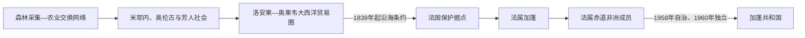

# 加蓬的前殖民社会与殖民统治

## 时间

古代—1960年

## 概括

加蓬森林和河流长期由巴卡等采集狩猎者及米耶内、芳、普努等班图语族社会共同居住。沿岸奥伦古王国和洛安果贸易网络参与象牙、奴隶与欧洲商品交换，奥果韦河是进入内陆的主要通道。

## 演进图

## 地方权力、贸易转型与殖民形成

- 加蓬的政治史由河口王权、内陆宗族村落和森林交换共同构成，不宜倒推一个覆盖现代国界的“古加蓬王国”。沿海米耶内语群中的奥伦古与蓬圭首领以港口税、婚姻和欧洲商馆关系建立威望，内陆芳人则在18—19世纪迁徙中形成灵活的宗族联盟。
- 洛安果王国在今加蓬南部和刚果沿岸具有商业与礼仪影响，但地方港口首领保有相当自主。奴隶贸易衰退后，象牙、乌木和棕榈产品成为主要出口，商人中介的权力往往超过名义宗主。
- 1839年丹尼斯·拉蓬琼布首领与法国签订条约，1842年路易·多韦等首领再授予据点。法国把一系列局部贸易和保护协定累积解释为领土主权，1849年建立利伯维尔，随后沿奥果韦河向内陆布站。
- 1886年殖民地建制后，法国用特许公司、征税和强制劳役开发橡胶与木材；1910年并入法属赤道非洲。人口分散、交通依赖河流和公司控制，使殖民国家在沿海之外长期薄弱。
- 二战后加蓬获得海外领地议席和地方政府，莱昂·姆巴、让-伊莱尔·奥巴姆等围绕对法关系与国内联盟竞争。1958年公投选择留在法兰西共同体并取得自治，1960年谈判独立；原有首领并未作为王朝继承国家主权。

地方王号和殖民行政层级见[中非王国、酋长国与殖民统治者表](/%E4%BA%BA%E6%96%87%E7%A7%91%E5%AD%A6/%E5%8E%86%E5%8F%B2/%E9%9D%9E%E6%B4%B2/%E4%B8%AD%E9%9D%9E/%E4%B8%AD%E9%9D%9E%E7%8E%8B%E5%9B%BD%E3%80%81%E9%85%8B%E9%95%BF%E5%9B%BD%E4%B8%8E%E6%AE%96%E6%B0%91%E7%BB%9F%E6%B2%BB%E8%80%85%E8%A1%A8.md)。

## 主要社会与政权

| 社会或政权 | 大致时期 | 特征 |
|---|---|---|
| 巴卡等森林社会 | 长期存在 | 狩猎采集、森林知识与邻近农民交换 |
| 米耶内与奥伦古政治体 | 17—19世纪 | 河口贸易和地方王权 |
| 洛安果影响区 | 近代早期 | 刚果沿岸贸易与贡赋网络 |
| 芳人迁徙社会 | 18—19世纪 | 从内陆向海岸扩展的宗族村落 |

## 殖民统治

法国1839年起与沿海首领签订条约，1849年为获释奴隶建立利伯维尔。皮埃尔·萨沃尼昂·德·布拉柴勘察奥果韦河，法国逐步控制内陆；1886年加蓬成为殖民地，1910年纳入法属赤道非洲，以木材、橡胶和矿产出口为主。

## 重要事件

- 17—18世纪奥伦古与米耶内商人控制河口贸易。
- 1839年法国与丹尼斯国王签订保护条约。
- 1849年利伯维尔建立，名称意为“自由城”。
- 1886年法属加蓬正式建制。
- 1946年成为法国海外领地，莱昂·姆巴等本地政治家进入代议机构。

## 演变关系

殖民边界和资源制度直接塑造[加蓬的独立建国与现代发展](/%E4%BA%BA%E6%96%87%E7%A7%91%E5%AD%A6/%E5%8E%86%E5%8F%B2/%E9%9D%9E%E6%B4%B2/%E4%B8%AD%E9%9D%9E/%E5%8A%A0%E8%93%AC/%E7%8B%AC%E7%AB%8B%E5%BB%BA%E5%9B%BD%E4%B8%8E%E7%8E%B0%E4%BB%A3%E5%8F%91%E5%B1%95.md)。
