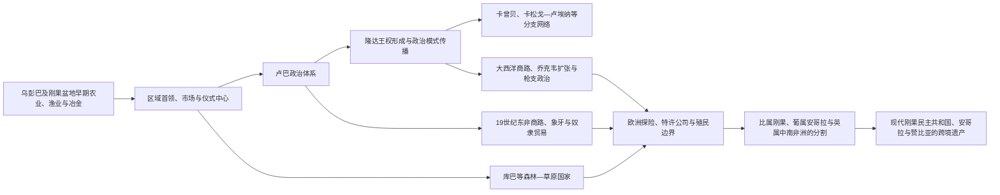

# 卢巴、隆达与刚果盆地网络

## 时间

约公元一千纪—19世纪末；传统权威、文化记忆和跨境网络延续至今。

## 概括

刚果盆地与其南缘草原并非与外界隔绝的“黑暗腹地”。刚果河及其支流、坦噶尼喀湖—卢阿拉巴河通道、加丹加铜带和安哥拉高原之间，长期流通鱼干、盐、铁器、铜、拉菲亚布、粮食、象牙和人口。农业、渔业、冶金与区域市场为卢巴、隆达、库巴等政治体系提供基础；这些国家又通过神圣王权、首领会议、联姻、册封、贡赋和仪式知识，把差异很大的地方社会连接起来。

“卢巴帝国”或“隆达帝国”容易让人联想到边界固定、官僚统一的领土国家。实际上，它们更接近以王室核心、仪式中心、属地首领和贸易节点组成的多层网络。中心对近地控制较强，对远方往往只要求承认头衔、交换贡礼、提供军事协助或沿用政治礼仪。十九世纪远程象牙与奴隶贸易、枪支输入、继承斗争、乔克韦扩张和欧洲殖民征服共同瓦解这些网络，但并未抹去其政治语言、艺术和历史记忆。

## 空间基础与早期发展

乌彭巴洼地的湖泊、湿地与草原适合渔业、农业和季节性人口流动，其考古序列跨越两千年以上。第一千纪后半叶以后，铁器、陶器、墓葬品和远距离材料显示社会分层与交换网络日益复杂。到第二千纪前半叶，铜制品、盐、铁和农业剩余支持更稳定的区域中心。不能把后来的卢巴王朝直接投射到所有早期遗址，但这些长期积累解释了十六、十七世纪国家形成并非突然由“外来征服者”创造。

刚果盆地内部河网适合独木舟交通，却也受瀑布、季节水位、森林和疾病环境限制。政治权力因而常围绕可通航河段、渔场、盐源、铜矿、市场和旱地走廊分布。森林与草原不是相互隔绝的两种世界；猎人、农民、渔民、工匠和商旅在二者之间持续交换。

## 演进图

## 主要政治体系

| 政治体系 | 大致兴盛期 | 核心区域 | 统治与整合方式 |
|---|---|---|---|
| 卢巴 | 约16—19世纪 | 乌彭巴洼地、卢阿拉巴河与加丹加北部 | 穆洛普韦神圣王权、王族和地方首领、姆布迪耶记忆协会、贡赋与册封 |
| 隆达 | 约17—19世纪 | 今刚果民主共和国南部、安哥拉东北部和赞比亚西北部 | 姆万塔·亚沃王权、联姻、属地统治者、政治头衔传播和较松散的贡赋关系 |
| 卡曾贝隆达 | 约18—19世纪 | 卢阿普拉河—姆韦鲁湖区域 | 由隆达政治传统衍生，在铜、盐、鱼和东非贸易间充当枢纽 |
| 库巴 | 约17世纪以后 | 开赛河—桑库鲁河之间 | 尼姆王权、多族群首领会议、宫廷职位和高水平拉菲亚纺织与艺术生产 |
| 乔克韦诸首领网络 | 18—19世纪扩张 | 安哥拉东部、刚果南部与赞比亚西北部 | 狩猎、商队、枪支、亲属与地方首领网络；十九世纪挑战隆达中心 |
| 加朗甘泽／耶凯王国 | 约1860—1891年 | 加丹加南部 | 姆西里整合商旅、火器和婚姻联盟，控制铜、象牙及东西向贸易 |
| 东部商贸军事据点 | 19世纪中后期 | 坦噶尼喀湖至卢阿拉巴河上游 | 斯瓦希里—阿拉伯商人与非洲伙伴建立商站、武装追随和象牙—奴隶贸易网络 |

## 卢巴国家的形成

### 建国传统与史料边界

卢巴口述传统以孔戈洛和卡拉拉·伊伦加的冲突解释正当王权的起源：孔戈洛被描述为暴虐旧统治者，外来的猎人英雄伊伦加·姆比迪及其子卡拉拉·伊伦加带来更有节制、神圣而文明的政治秩序。这一叙事既保存王朝记忆，也是在说明“何为正当统治”，不能直接当作逐年准确的建国纪事。

考古学显示乌彭巴区域在王朝传统之前已有长期社会复杂化。较稳妥的结论是，十六至十七世纪的卢巴王权建立在既有市场、冶金、农业和地方首领之上，并通过政治神话把多种来源的统治集团整合为共同谱系。早期君主姓名、顺序和年代因不同传统而异，因此跨国专题不编造完整、精确到年的王表。

### 统治结构

卢巴最高统治者称穆洛普韦，其身体、血统与土地繁荣具有神圣联系。王权不是君主个人无限支配：王族女性、地方首领、宫廷官员和姆布迪耶协会共同保存权力秩序。姆布迪耶成员被称为“记忆之人”，通过仪式、地景、谱系、口述表演和卢卡萨记忆板解释先例。历史知识本身因而是一种政治制度，而非单纯记录。

中心可任命或承认地方统治者，要求贡赋和军事支持，并以王室器物、称号及仪式把外围纳入。远方首领可能承认卢巴文化威望，却在日常治理上高度自主。因此“扩张”既包括战争，也包括自愿采用有用的政治技术和身份象征。

### 崛起机制与鼎盛条件

- 乌彭巴湿地的渔业、农业和多样生态降低了单一生计风险。
- 加丹加铜、盐、铁、鱼和拉菲亚制品形成区域交换，王权可从商路和贡赋取得资源。
- 神圣王权与首领协商相结合，使政治体系既能维持核心正统，也能吸纳不同地方集团。
- 王室仪式、记忆制度和艺术符号提供跨语言、跨地域的共同政治语汇。
- 通过分封王族、联姻和承认地方首领，卢巴影响可以扩展而不必建立密集官僚机构。

## 隆达的形成与扩展

隆达建国传统讲述卢巴猎人奇宾达·伊伦加与当地女性统治者卢埃吉结合，象征外来王权技术与本地土地合法性的联姻。约17世纪，姆万塔·亚沃成为隆达中心统治者的称号。与把这一故事读成一次“卢巴人征服隆达人”相比，将其理解为两个政治传统合成的正统叙事更为稳妥。

隆达扩展的特点不是把各地改造成完全一致的省份，而是建立层级化关系。王室亲属、代表和被承认的地方统治者使用共享头衔，贡礼和婚姻维系中心；各属地保留许多本地制度。王后或重要女性职位、继承仲裁者和地方领袖在权力平衡中占有关键地位。由于制度可复制，隆达模式沿商路扩展到安哥拉东北部、加丹加和卢阿普拉河流域。

十八世纪，卡曾贝统治集团在卢阿普拉河—姆韦鲁湖建立强国，既继承隆达政治称号，又形成自身王系。它控制鱼、盐、铜和象牙贸易，后来同时接触来自大西洋安哥拉和印度洋东非的商人。另一些隆达关联政治体向西南扩展，形成跨越今日国界的网络。“隆达帝国”因此更像一组承认不同程度共同政治传统的中心，而非单一首都持续直接统治全部疆域。

## 库巴：森林边缘的联邦王权

库巴王国位于开赛—桑库鲁河地区，由多个具有不同历史和身份的群体组成。传统把十七世纪的沙姆·阿·姆布尔·阿·恩贡视为重要重建者：他被说成引入新作物、工艺、行政和宫廷规范。具体传说包含理想君主叙事，但库巴在十七世纪后确实发展出以尼姆为最高统治者、地方首领与宫廷会议共同参与的联邦结构。

库巴财富来自农业、拉菲亚纺织、渔业、铁器和区域贸易，并以面具、雕刻、织物及王室肖像记录身份。相对远离早期大西洋奴隶贸易核心，使其在一段时间内避免最强烈的外部冲击；十九世纪商路和殖民扩张最终仍改变其政治自主。库巴案例说明，中非国家发展不必由海岸贸易或外来刺激启动。

## 商路、商品与权力

### 区域交换

铜在加丹加及周边既是生产材料，也是身份和交换媒介；盐、铁器、鱼干、棕榈制品和拉菲亚布连接不同生态区。王室通过控制矿源、市场、商旅保护和贡赋积累财富，却通常不能垄断所有交易。女性生产者、工匠、猎人、船工和地方中介是网络运行的主体，不能只从国王和远程商人角度理解经济。

### 大西洋方向

来自安哥拉的葡萄牙与非洲商队逐步向内陆推进，以布匹、枪支、火药、酒和其他商品交换象牙、蜂蜡、橡胶及被奴役人口。隆达网络一度从中获得贸易税和武器，但外贸也鼓励掠夺、债务奴役和地方军事首领坐大。大西洋奴隶贸易受禁后，人口买卖并未立即结束，而是与“合法商品”并存或转向内部市场。

### 印度洋方向

十九世纪，来自桑给巴尔和东非海岸的商人与非洲伙伴越过坦噶尼喀湖进入刚果东部。商站既是市场，也是武装、债务和政治联盟中心。哈米德·本·穆罕默德即“蒂普·蒂普”等商人建立跨地域势力，利用象牙贸易、奴隶劳动和地方战争。其控制从来不覆盖整个刚果东部，地方首领、商队竞争者和社会抵抗始终存在。

东西两向商路在加丹加和刚果盆地交汇，使地方统治者能够在多个伙伴间选择，也使枪支竞争和人口掠夺加剧。欧洲殖民者后来把这些网络描述成需要其“终止奴隶制”的无政府状态，却同时接管商路、强迫劳工并把资源征收扩大到前所未有的规模。

## 十九世纪的重组与新政权

### 乔克韦扩张

乔克韦群体原与隆达体系保持贸易、贡赋或属地关系。十九世纪象牙与橡胶需求、枪支输入和商队组织改变力量平衡。乔克韦猎人和首领网络向东、北扩展，击败部分隆达中心并控制商路。其扩张不是一个统一“乔克韦帝国”从单一首都征服四方，而是多个相互关联但可独立行动的政治—商业集团。

### 姆西里与加朗甘泽

来自坦桑尼亚方向商旅网络的姆西里约在十九世纪中叶进入加丹加，利用火器、婚姻联盟和对铜、象牙贸易的控制建立加朗甘泽王国。他在东西商路之间周旋，同葡萄牙、桑给巴尔商人和欧洲探险者接触。1891年，比利时国王利奥波德二世支持的斯泰尔斯远征队要求其接受刚果自由邦主权；对峙中姆西里被杀。其死亡使刚果自由邦得以控制加丹加，但当地抵抗、边界争议和公司统治随后才逐步展开。

## 衰落、征服与殖民分割

### 结构因素

- 网络型国家依赖中心与属地持续交换。当王位争夺、贸易路线变化或中心无法分配资源时，远方首领可迅速减少贡赋或转投其他网络。
- 王权的神圣性并未消除继承竞争；多个具资格支系和地方拥立者可能形成并立中心。
- 十九世纪枪支和远程商品使控制商路的军事集团获得超过旧宫廷职位的独立资源。
- 奴隶与象牙贸易造成迁徙、人口损失和报复循环，削弱农业与地方安全。

### 外部与区域压力

乔克韦等新兴商贸军事网络冲击隆达中心，东非商站和安哥拉商队加剧竞争。随后，刚果自由邦、葡属安哥拉和英国控制的中南非洲分别从不同方向推进。殖民远征队以条约、武力和特许公司占领交通与矿区，利用既有地方矛盾，又在遇到抵抗时实施惩罚战争。

### 直接征服过程

1880年代以后，欧洲列强在地图上划定边界，却需通过多次远征才取得实际控制。1891年姆西里被杀是加丹加转折；1892—1894年刚果自由邦与东部商贸军事势力发生所谓“刚果阿拉伯战争”，自由邦借“反奴隶制”名义扩张军队和领土。卢巴、隆达、库巴及其他社会此后面对征税、征兵、强迫劳动和首领改造。殖民政权把流动的属地关系固定为行政“部族”和酋长辖区，并把铜、橡胶、棕榈油等资源纳入出口飞地。

现代[刚果民主共和国](/%E4%BA%BA%E6%96%87%E7%A7%91%E5%AD%A6/%E5%8E%86%E5%8F%B2/%E9%9D%9E%E6%B4%B2/%E4%B8%AD%E9%9D%9E/%E5%88%9A%E6%9E%9C%E6%B0%91%E4%B8%BB%E5%85%B1%E5%92%8C%E5%9B%BD/README.md)、[安哥拉](/%E4%BA%BA%E6%96%87%E7%A7%91%E5%AD%A6/%E5%8E%86%E5%8F%B2/%E9%9D%9E%E6%B4%B2/%E4%B8%AD%E9%9D%9E/%E5%AE%89%E5%93%A5%E6%8B%89/README.md)与[赞比亚](/%E4%BA%BA%E6%96%87%E7%A7%91%E5%AD%A6/%E5%8E%86%E5%8F%B2/%E9%9D%9E%E6%B4%B2/%E5%8D%97%E9%83%A8%E9%9D%9E%E6%B4%B2/%E8%B5%9E%E6%AF%94%E4%BA%9A/README.md)边界切开了卢巴—隆达文化与亲属网络。殖民国界并没有让跨境联系消失，但决定了不同地区此后分别进入比利时、葡萄牙和英国制度。

## 重要事件与转折

| 时间 | 事件 | 过程与影响 |
|---|---|---|
| 公元一千纪后半叶—第二千纪初 | 乌彭巴区域复杂化 | 农业、渔业、冶金、墓葬分层和远距材料为后来的国家形成提供基础 |
| 约16—17世纪 | 卢巴王权形成 | 神圣王权、地方首领和记忆制度整合乌彭巴及卢阿拉巴网络 |
| 约17世纪 | 隆达中心形成 | 联姻与共享政治头衔把卢巴影响、本地土地权和属地关系结合 |
| 17—18世纪 | 隆达与库巴体系扩展 | 多中心国家控制或影响跨生态贸易，并形成高度发展的宫廷文化 |
| 18世纪 | 卡曾贝国家兴起 | 隆达政治传统向卢阿普拉河扩展，连接铜带与东非商路 |
| 19世纪中叶 | 东西向象牙—奴隶贸易深入 | 火器、商站和人口掠夺改变地方权力，旧王室对商路控制减弱 |
| 约1860—1891年 | 姆西里建立加朗甘泽 | 以跨区域贸易和火器整合加丹加，成为殖民列强争夺对象 |
| 19世纪后半叶 | 乔克韦扩张冲击隆达 | 商贸军事网络取代部分旧贡赋关系，隆达中央权威衰退 |
| 1891年 | 斯泰尔斯远征队杀死姆西里 | 刚果自由邦打开控制加丹加的道路 |
| 1892—1894年 | 刚果东部战争 | 自由邦击败主要斯瓦希里—阿拉伯商贸军事势力，殖民军权扩张 |
| 19世纪末—20世纪初 | 殖民边界落实 | 卢巴、隆达等网络被比、葡、英殖民地切分，资源与劳工制度重组 |

## 历史辨析

- **“班图扩散”不是一次统一民族大迁徙。** 它概括许多世纪的语言传播、人口移动、通婚、技术与生计变化，不能画成单一路线上的征服。
- **口述传统同时保存历史和规范。** 卡拉拉·伊伦加、奇宾达·伊伦加等故事说明王权正当性、亲属与性别秩序；人物及年代需结合考古和不同版本判断。
- **文化影响不等于直接统治。** 使用卢巴或隆达头衔、艺术和仪式的地方，不一定长期向同一君主纳税。
- **所谓“阿拉伯人入侵”过度简化。** 刚果东部网络包括斯瓦希里、阿拉伯、尼亚姆韦齐及多种本地伙伴与对手，其关系兼有贸易、奴役、战争和结盟。
- **殖民“反奴隶制”话语不能遮蔽强迫劳动。** 刚果自由邦击败商贸军事对手后，建立了更集中、暴力的橡胶与资源征收体系。
- **世系必须区分支系与证据等级。** 卢巴、隆达和卡曾贝存在并立支系、口述差异与称号重复；[中非王国、酋长国与殖民统治者表](/%E4%BA%BA%E6%96%87%E7%A7%91%E5%AD%A6/%E5%8E%86%E5%8F%B2/%E9%9D%9E%E6%B4%B2/%E4%B8%AD%E9%9D%9E/%E4%B8%AD%E9%9D%9E%E7%8E%8B%E5%9B%BD%E3%80%81%E9%85%8B%E9%95%BF%E5%9B%BD%E4%B8%8E%E6%AE%96%E6%B0%91%E7%BB%9F%E6%B2%BB%E8%80%85%E8%A1%A8.md)逐一列可证人名并把资料中断明标为“不详”，不以虚假精确的单线覆盖争议。

## 前后关系与延伸阅读

- 上级导航：[中非历史](/%E4%BA%BA%E6%96%87%E7%A7%91%E5%AD%A6/%E5%8E%86%E5%8F%B2/%E9%9D%9E%E6%B4%B2/%E4%B8%AD%E9%9D%9E/README.md)
- 大西洋方向：[刚果王国与大西洋中非](/%E4%BA%BA%E6%96%87%E7%A7%91%E5%AD%A6/%E5%8E%86%E5%8F%B2/%E9%9D%9E%E6%B4%B2/%E4%B8%AD%E9%9D%9E/%E5%88%9A%E6%9E%9C%E7%8E%8B%E5%9B%BD%E4%B8%8E%E5%A4%A7%E8%A5%BF%E6%B4%8B%E4%B8%AD%E9%9D%9E.md)
- 殖民与现代阶段：[殖民资源体系、独立与中非冲突](/%E4%BA%BA%E6%96%87%E7%A7%91%E5%AD%A6/%E5%8E%86%E5%8F%B2/%E9%9D%9E%E6%B4%B2/%E4%B8%AD%E9%9D%9E/%E6%AE%96%E6%B0%91%E8%B5%84%E6%BA%90%E4%BD%93%E7%B3%BB%E3%80%81%E7%8B%AC%E7%AB%8B%E4%B8%8E%E4%B8%AD%E9%9D%9E%E5%86%B2%E7%AA%81.md)
